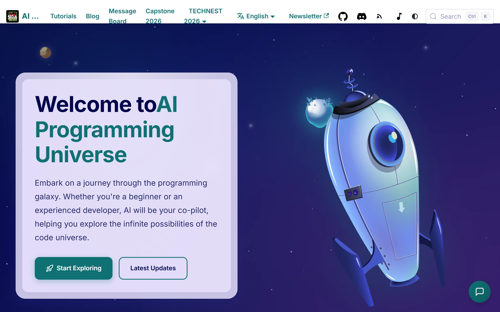
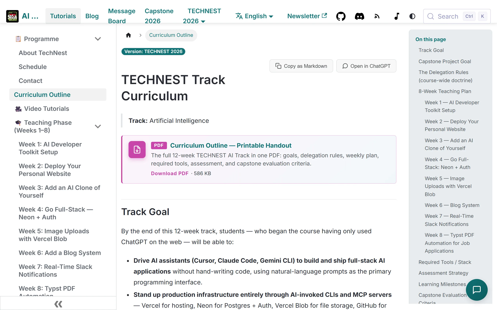
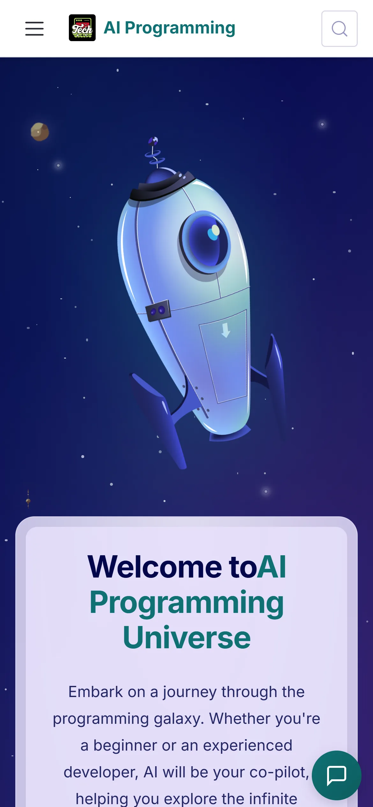
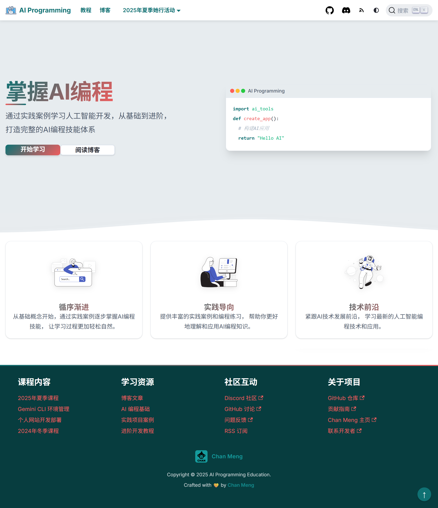
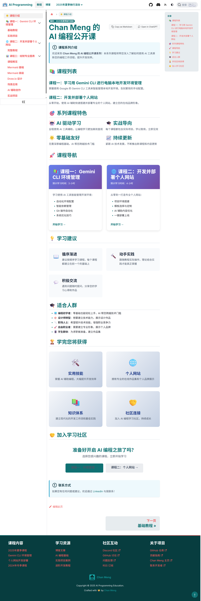
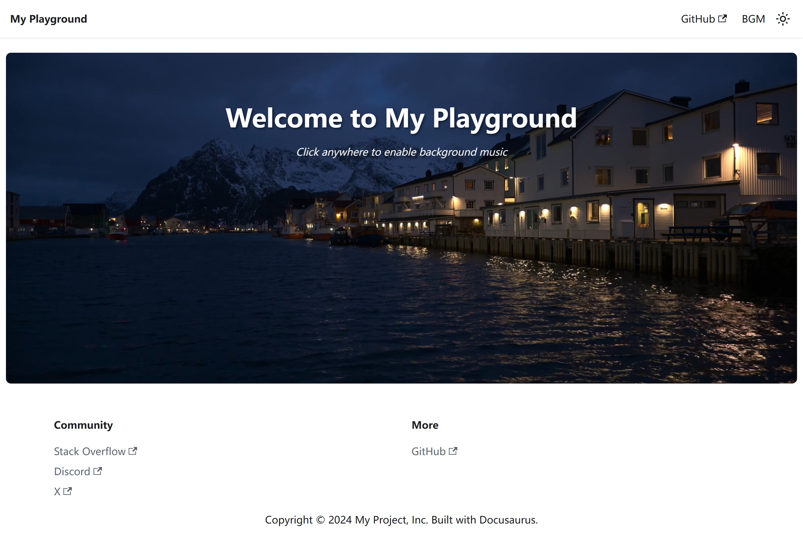
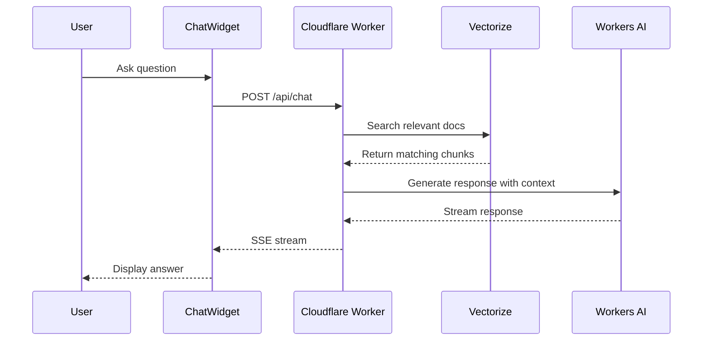
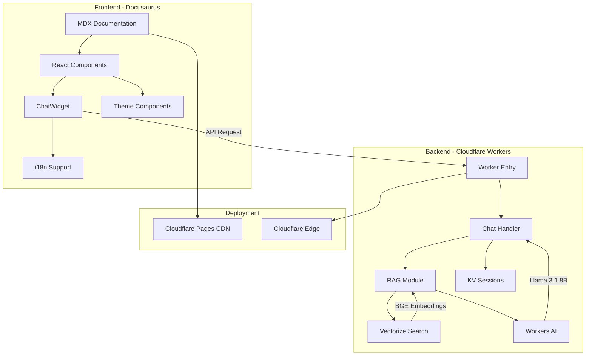
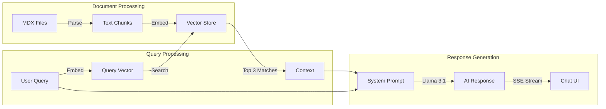
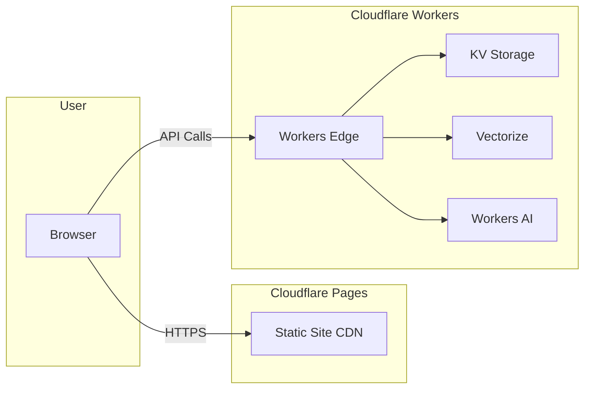

<div align="center"><a name="readme-top"></a>

[](#)

# 🚀 AI Programming Education Platform<br/><h3>Master AI-Assisted Development Through Interactive Learning</h3>

A comprehensive educational platform that teaches AI-assisted programming through hands-on tutorials, practical projects, and best practices.<br/>
Features interactive learning modules, modern development workflows, and real-world project implementations.<br/>
Fork it and host your own learning environment **FREE** on Cloudflare.

[Live Demo][demo-link] · [Documentation][docs-link] · [Blog][blog-link] · [Issues][github-issues-link]

<br/>

[][demo-link]

<br/>

<!-- SHIELD GROUP -->

[![][github-release-shield]][github-release-link]
[![][pages-shield]][pages-link]
[![][cloudflare-shield]][cloudflare-link]
[![][docusaurus-shield]][docusaurus-link]<br/>
[![][github-contributors-shield]][github-contributors-link]
[![][github-forks-shield]][github-forks-link]
[![][github-stars-shield]][github-stars-link]
[![][github-issues-shield]][github-issues-link]
[![][github-license-shield]][github-license-link]<br>

**Share This Project**

[![][share-x-shield]][share-x-link]
[![][share-linkedin-shield]][share-linkedin-link]
[![][share-reddit-shield]][share-reddit-link]

<sup>🌟 Pioneering the future of AI-assisted programming education. Built for the next generation of developers.</sup>

<!-- SHOWCASE:START — generated by readme-showcase; edit docs/showcase/showcase.scenario.json and re-run instead of hand-editing -->
## ✨ See it live

<a href="https://programming.chanmeng.org/">
  
</a>


<details>
<summary>📚 Curriculum outline — 12-week TECHNEST AI track with sidebar nav</summary>



</details>

<details>
<summary>📱 Mobile view</summary>



</details>

<!-- docs/showcase/demo.mp4 holds a higher-quality version of the demo — drag it into a GitHub release or comment for crisp playback. -->
<!-- SHOWCASE:END -->

## 📸 Project Screenshots

> [!TIP]
> Explore our interactive learning platform designed for modern developers. See the evolution from Version 1 to the latest Version 2 with enhanced UI/UX.

### 🌟 Latest Version (Version 2) - Enhanced UI/UX

<div align="center">
  
  <p><em><strong>Version 2 Main Dashboard</strong> - Redesigned with modern aesthetics and improved navigation</em></p>
</div>

<div align="center">
  
  <p><em><strong>Version 2 Documentation</strong> - Enhanced reading experience with better typography</em></p>
</div>

<div align="center">
  
  
  
  <p><em><strong>Version 2 Interface Showcase</strong> - Mobile responsive and feature highlights</em></p>
</div>

<details>
<summary><kbd>📱 Previous Version (Version 1) & Version Comparison</kbd></summary>

### 📱 Previous Version (Version 1) - Original Design

<div align="center">
  
  <p><em><strong>Version 1 Main Dashboard</strong> - Original comprehensive learning modules and navigation</em></p>
</div>

<div align="center">
  
  
  <p><em><strong>Version 1 Tutorials & Blog</strong> - Original interactive content sections</em></p>
</div>

<div align="center">
  
  <p><em><strong>Version 1 Mobile View</strong> - Original responsive design foundation</em></p>
</div>

#### 🔄 Version Evolution Highlights:
- ✨ **Enhanced Visual Design**: Modern color scheme and typography
- 🎨 **Improved UI Components**: Better buttons, cards, and interactive elements
- 📱 **Mobile Optimization**: Superior responsive design across all devices
- 🚀 **Performance Improvements**: Faster loading and smoother interactions

</details>

## 🎬 Demo Video

> [!NOTE]
> Watch our platform in action with this comprehensive demo.

<div align="center">

https://github.com/user-attachments/assets/7f452170-ee23-44ad-ac87-7ad41161cd3b

*Complete platform walkthrough showing all major features*

</div>

**Tech Stack Badges:**

<div align="center">

 
 
 
 
 
 
 

</div>

</div>

> [!IMPORTANT]
> This platform demonstrates modern educational technology with interactive learning modules. It combines comprehensive documentation with hands-on tutorials to provide a complete AI programming education experience. Features include step-by-step tutorials, practical projects, and modern development tool integration.

<details>
<summary><kbd>📑 Table of Contents</kbd></summary>

#### TOC

- [🚀 AI Programming Education Platform](#-ai-programming-education-platform)
      - [TOC](#toc)
  - [🌟 Introduction](#-introduction)
  - [✨ Key Features](#-key-features)
    - [`1` Interactive Learning Modules](#1-interactive-learning-modules)
    - [`2` Comprehensive Tutorial System](#2-comprehensive-tutorial-system)
    - [`3` AI Chat Assistant with RAG](#3-ai-chat-assistant-with-rag)
    - [`*` Additional Features](#-additional-features)
  - [🛠️ Tech Stack](#️-tech-stack)
  - [🏗️ Architecture](#️-architecture)
    - [System Architecture](#system-architecture)
    - [AI Chat Architecture](#ai-chat-architecture)
    - [Project Structure](#project-structure)
  - [🚀 Getting Started](#-getting-started)
    - [Prerequisites](#prerequisites)
    - [Quick Installation](#quick-installation)
    - [Development Mode](#development-mode)
  - [🛳 Deployment](#-deployment)
    - [`A` Frontend Deployment (Cloudflare Pages)](#a-frontend-deployment-cloudflare-pages)
    - [`B` Backend Deployment (Cloudflare Workers)](#b-backend-deployment-cloudflare-workers)
  - [📡 API Reference](#-api-reference)
    - [Endpoints](#endpoints)
    - [Rate Limits](#rate-limits)
    - [CORS](#cors)
  - [📖 Learning Path](#-learning-path)
    - [Beginner Level](#beginner-level)
    - [Intermediate Level](#intermediate-level)
    - [Advanced Level](#advanced-level)
  - [🔌 Integrations](#-integrations)
    - [Cloudflare Services Pricing](#cloudflare-services-pricing)
  - [⌨️ Development](#️-development)
    - [Local Development](#local-development)
    - [Adding Content](#adding-content)
  - [🤝 Contributing](#-contributing)
  - [📄 License](#-license)
  - [👥 Team](#-team)

####

<br/>

</details>

## 🌟 Introduction

We are passionate educators and developers creating the next generation of AI programming education. By adopting modern educational technologies and comprehensive learning methodologies, we aim to provide learners with powerful, accessible, and engaging AI programming education.

Whether you're a beginner looking to enter the world of AI programming or an experienced developer seeking to enhance your skills with AI tools, this platform will be your comprehensive learning companion. The platform is actively maintained and we welcome feedback for any [issues][github-issues-link] encountered.

> [!NOTE]
> - Node.js >= 18.0 required for development
> - Modern web browser for optimal experience
> - GitHub account recommended for accessing additional resources
> - No prior AI experience required - we start from the basics!

| [![][demo-badge]][demo-link]   | No installation required! Visit our live demo to start learning immediately. |
| :------------------------------------ | :--------------------------------------------------------------------------------------------- |
| [](https://deepwiki.com/ChanMeng666/ai-programming-teaching-project) | Get intelligent answers about the project using AI |

> [!TIP]
> **⭐ Star us** to receive all updates and new learning content from GitHub!

[![][image-star]][github-stars-link]

## ✨ Key Features

### `1` Interactive Learning Modules

Experience next-generation educational content through our comprehensive module system. Our innovative approach provides structured learning paths through carefully designed tutorials covering everything from AI communication basics to advanced development workflows.

<div align="center">
  
  <p><em>Interactive learning modules with step-by-step guidance</em></p>
</div>

Key capabilities include:
- 🎯 **Progressive Learning**: Structured curriculum from basics to advanced
- 🛠️ **Hands-on Practice**: Real-world projects and exercises
- 📱 **Responsive Design**: Learn on any device, anywhere
- 🌐 **Bilingual Support**: Content available in multiple languages

### `2` Comprehensive Tutorial System

Revolutionary tutorial system that transforms how learners interact with AI programming concepts. With our structured approach and practical examples, students can master AI-assisted development while building real projects.

**Available Learning Tracks:**
- **Environment Setup**: Development environment configuration
- **Basic Concepts**: AI communication and prompt engineering
- **Tool Mastery**: Cursor, v0, and modern development tools
- **Project Implementation**: Complete project walkthroughs
- **Advanced Topics**: AI drawing, chat systems, and Coze integration

### `3` AI Chat Assistant with RAG

An intelligent AI chat assistant powered by Cloudflare Workers AI, providing real-time Q&A support based on the course content. The assistant uses Retrieval-Augmented Generation (RAG) to provide accurate, context-aware answers.


```mermaid
sequenceDiagram
    participant User
    participant ChatWidget
    participant Worker as Cloudflare Worker
    participant Vectorize
    participant AI as Workers AI

    User->>ChatWidget: Ask question
    ChatWidget->>Worker: POST /api/chat
    Worker->>Vectorize: Search relevant docs
    Vectorize-->>Worker: Return matching chunks
    Worker->>AI: Generate response with context
    AI-->>Worker: Stream response
    Worker-->>ChatWidget: SSE stream
    ChatWidget-->>User: Display answer
```

**Key Capabilities:**
- 🤖 **Intelligent Q&A**: Answers questions based on course documentation
- 📚 **RAG-Powered**: Uses vector search to find relevant content
- 🌊 **Streaming Responses**: Real-time typing effect for better UX
- 🌐 **Bilingual Support**: Supports both Chinese and English
- 🎨 **Theme Aware**: Adapts to light/dark mode automatically

### `*` Additional Features

Beyond the core learning modules, this platform includes:

- [x] 🤖 **AI Chat Assistant**: Intelligent Q&A powered by Cloudflare Workers AI
- [x] 📚 **Rich Documentation**: Comprehensive guides and references
- [x] 🎨 **Modern UI/UX**: Beautiful design with dark/light themes
- [x] 📝 **Blog System**: Regular updates and insights
- [x] 🔍 **Search Functionality**: Find content quickly and easily (Algolia)
- [x] 📊 **Progress Tracking**: Monitor your learning journey
- [x] 💻 **Code Examples**: Interactive code snippets and demos
- [x] 🚀 **Push-to-Deploy**: Cloudflare Pages builds and publishes every push to `main`
- [x] 📱 **Mobile Optimized**: Perfect experience on all devices
- [x] 🌐 **i18n Support**: Full internationalization (Chinese & English)

> ✨ New content and features are continuously added as the field evolves.

<div align="right">

[![][back-to-top]](#readme-top)

</div>

## 🛠️ Tech Stack

<div align="center">
  <table>
    <tr>
      <td align="center" width="96">
        
        <br>Docusaurus 3.8
      </td>
      <td align="center" width="96">
        
        <br>React 18
      </td>
      <td align="center" width="96">
        
        <br>TypeScript
      </td>
      <td align="center" width="96">
        
        <br>Workers AI
      </td>
      <td align="center" width="96">
        
        <br>MDX
      </td>
      <td align="center" width="96">
        
        <br>Pages
      </td>
    </tr>
  </table>
</div>

**Frontend Stack:**
- **Framework**: Docusaurus 3.8.1 with React 18
- **Styling**: CSS3 + Custom Design System
- **Content**: MDX for rich interactive documentation
- **Search**: Algolia DocSearch integration
- **i18n**: Chinese (zh-Hans) and English support
- **Components**: Custom React components (ChatWidget, BackToTop, etc.)

**Backend Stack (AI Chat):**
- **Runtime**: Cloudflare Workers (Edge Computing)
- **Public URL**: `https://programming-api.chanmeng.org`
- **AI Model**: `@cf/meta/llama-3.1-8b-instruct-fp8` via Workers AI
- **Embeddings**: `@cf/baai/bge-base-en-v1.5` (768 dimensions)
- **Vector Database**: Cloudflare Vectorize (~4,800 document chunks)
- **Storage**: Cloudflare KV (sessions, message board cache, capstone votes)
- **Content DB**: Notion (message board & capstone showcase)
- **API**: RESTful with SSE streaming

**Development Tools:**
- **Build System**: Rspack-based Docusaurus build (@docusaurus/faster)
- **Development Server**: Hot reload development environment
- **Content Management**: File-based content system with versioning
- **Deployment**: Cloudflare Pages (Frontend) + Cloudflare Workers (Backend)
- **Version Control**: Git-based workflow

> [!TIP]
> Each technology was selected for educational effectiveness, ease of maintenance, and optimal learning experience.

## 🏗️ Architecture

### System Architecture

> [!TIP]
> This architecture supports easy content management and scalable educational delivery, making it perfect for educational institutions and self-learners.


```mermaid
graph TB
    subgraph "Frontend - Docusaurus"
        A[MDX Documentation] --> B[React Components]
        B --> C[ChatWidget]
        B --> D[Theme Components]
        C --> E[i18n Support]
    end

    subgraph "Backend - Cloudflare Workers"
        F[Worker Entry] --> G[Chat Handler]
        G --> H[RAG Module]
        H --> I[Vectorize Search]
        H --> J[Workers AI]
        G --> K[KV Sessions]
    end

    subgraph "Deployment"
        L[Cloudflare Pages CDN]
        M[Cloudflare Edge]
    end

    C -->|API Request| F
    J -->|Llama 3.1 8B| G
    I -->|BGE Embeddings| H
    A --> L
    F --> M
```

### AI Chat Architecture

The AI Chat system uses a RAG (Retrieval-Augmented Generation) architecture to provide accurate, context-aware responses:


```mermaid
flowchart LR
    subgraph "Document Processing"
        A[MDX Files] -->|Parse| B[Text Chunks]
        B -->|Embed| C[Vector Store]
    end

    subgraph "Query Processing"
        D[User Query] -->|Embed| E[Query Vector]
        E -->|Search| C
        C -->|Top 3 Matches| F[Context]
    end

    subgraph "Response Generation"
        F --> G[System Prompt]
        D --> G
        G -->|Llama 3.1| H[AI Response]
        H -->|SSE Stream| I[Chat UI]
    end
```

| Component | Technology | Purpose |
|-----------|------------|---------|
| Vector DB | Cloudflare Vectorize (`docs-index`) | Store 4,800+ document embeddings |
| Embeddings | `@cf/baai/bge-base-en-v1.5` | Convert text to 768-dim vectors |
| LLM | `@cf/meta/llama-3.1-8b-instruct-fp8` | Generate conversational responses |
| Sessions | Cloudflare KV | Maintain conversation history |
| Streaming | Server-Sent Events | Real-time response delivery |

### Project Structure

```
ai-programming-teaching-project/
├── docs/                        # Current version documentation
│   ├── basics/                  # Fundamental concepts
│   ├── practice/                # Project implementations
│   └── website/                 # Website development tutorials
├── versioned_docs/              # Versioned documentation
│   ├── version-2024-winter/     # Winter 2024 curriculum
│   └── version-2025-summer/     # Summer 2025 curriculum
├── blog/                        # Blog posts
├── i18n/                        # Internationalization
│   ├── en/                      # English translations
│   └── zh-Hans/                 # Chinese translations
├── src/
│   ├── components/              # React components
│   │   ├── ChatWidget/          # AI Chat assistant
│   │   ├── BackToTop/           # Back to top button
│   │   ├── HomepageFeatures/    # Homepage features
│   │   └── WaveAnimation/       # Wave animation
│   ├── pages/                   # Custom pages
│   ├── theme/                   # Theme customizations
│   └── css/                     # Global styles
├── worker/                      # Cloudflare Worker backend
│   ├── src/
│   │   ├── index.ts             # Worker entry point & routing
│   │   ├── chat.ts              # Chat logic & streaming
│   │   ├── rag.ts               # RAG & vector search
│   │   ├── messages.ts          # Message board (Notion-backed)
│   │   ├── capstones.ts         # Capstone showcase & voting
│   │   └── types.ts             # TypeScript types
│   ├── scripts/
│   │   ├── seed-vectors.ts      # Document vectorization
│   │   ├── smoke-test.mjs       # End-to-end RAG check
│   │   └── namespace-test.mjs   # Namespace-scoped retrieval check
│   ├── wrangler.toml            # Cloudflare configuration
│   └── package.json             # Worker dependencies
├── static/                      # Static assets
├── docusaurus.config.js         # Docusaurus configuration
├── sidebars.js                  # Sidebar configuration
└── package.json                 # Project dependencies
```

## 🚀 Getting Started

### Prerequisites

> [!IMPORTANT]
> Ensure you have the following installed:

- Node.js 18.0+ ([Download](https://nodejs.org/))
- npm/yarn/pnpm package manager
- Git ([Download](https://git-scm.com/))
- Modern web browser

### Quick Installation

**1. Clone Repository**

```bash
git clone https://github.com/ChanMeng666/ai-programming-teaching-project.git
cd ai-programming-teaching-project
```

**2. Install Dependencies**

```bash
# Using npm
npm install

# Using yarn
yarn install

# Using pnpm (recommended)
pnpm install
```

**3. Start Development Server**

```bash
npm start
```

🎉 **Success!** Open [http://localhost:3000](http://localhost:3000) to access the learning platform.

### Development Mode

```bash
# Start with hot reload
npm start

# Build for production
npm run build

# Serve production build
npm run serve

# Clear cache
npm run clear
```

## 🛳 Deployment

> [!IMPORTANT]
> The frontend and the backend ship **independently**. The site auto-deploys from `main`; the Worker only deploys when you run `wrangler deploy` by hand. Pushing a change to `worker/` ships nothing on its own.

### `A` Frontend Deployment (Cloudflare Pages)

The site is a Cloudflare Pages project connected to the GitHub repository. **Pushing to `main` is the deploy.**

```bash
git push origin main   # Cloudflare Pages builds and publishes automatically
```

**Pages project settings:**

| Setting | Value |
|---------|-------|
| Production branch | `main` |
| Build command | `npm run build` |
| Build output directory | `build` |
| Domains | `programming.chanmeng.org`, `ai-programming-teaching-project.pages.dev` |

To host your own copy, fork the repo, create a Pages project in the Cloudflare dashboard, connect it to your fork, and enter the settings above.

> [!WARNING]
> Ignore the `deploy` script in the root `package.json` — it is Docusaurus' built-in `gh-pages` command and is **not** how this site ships.

### `B` Backend Deployment (Cloudflare Workers)

**Prerequisites:**
- Cloudflare account with Workers AI, KV and Vectorize enabled
- Wrangler CLI (`npx wrangler` — no global install needed)

**Step 1: Configure Cloudflare Resources**

```bash
cd worker

# Login to Cloudflare
npx wrangler login

# Create the KV namespaces
npx wrangler kv namespace create CHAT_SESSIONS
npx wrangler kv namespace create MESSAGE_BOARD
npx wrangler kv namespace create CAPSTONE_VOTES

# Create Vectorize index for RAG
npx wrangler vectorize create docs-index --dimensions=768 --metric=cosine
```

**Step 2: Update wrangler.toml**

Paste the namespace IDs printed by the commands above, and point the route at your own domain.

```toml
name = "ai-chat-worker"
main = "src/index.ts"
compatibility_date = "2024-12-01"
compatibility_flags = ["nodejs_compat"]

# WAF rate limiting rules only apply to custom domains, never to *.workers.dev,
# so the workers.dev entrypoint stays off: leaving it on would let any client
# reach /api/chat while bypassing every rate limiting rule on the zone.
workers_dev = false

[[routes]]
pattern = "programming-api.chanmeng.org"
custom_domain = true

[ai]
binding = "AI"

[[kv_namespaces]]
binding = "CHAT_SESSIONS"
id = "<YOUR_CHAT_SESSIONS_KV_ID>"

[[vectorize]]
binding = "VECTORIZE"
index_name = "docs-index"

[[kv_namespaces]]
binding = "MESSAGE_BOARD"
id = "<YOUR_MESSAGE_BOARD_KV_ID>"

[[kv_namespaces]]
binding = "CAPSTONE_VOTES"
id = "<YOUR_CAPSTONE_VOTES_KV_ID>"

[vars]
# Comma-separated allow-list. Any https://<hash>.ai-programming-teaching-project.pages.dev
# preview origin is additionally matched by suffix in src/index.ts.
CORS_ORIGIN = "https://programming.chanmeng.org,https://ai-programming-teaching-project.pages.dev,http://localhost:3000"
```

**Step 3: Set Secrets**

Six secrets live outside the repo. Set each one once; `wrangler deploy` does not clobber them.

```bash
npx wrangler secret put NOTION_TOKEN                  # Message board + capstone Notion integration
npx wrangler secret put NOTION_DATABASE_ID            # Message board database
npx wrangler secret put NOTION_CAPSTONE_DATABASE_ID   # Capstone showcase database
npx wrangler secret put CAPSTONE_ADMIN_TOKEN          # Guards POST /api/capstones/admin
npx wrangler secret put SEED_TOKEN                    # Guards POST /api/seed
npx wrangler secret put SETUP_SECRET                  # Guards the one-time /setup routes
```

**Step 4: Deploy Worker**

> [!IMPORTANT]
> Always `cd worker` first. Running `wrangler deploy` from the repository root makes wrangler infer the Worker name from the directory and publish an empty stub called `ai-programming-teaching-project`.

```bash
cd worker

# Install dependencies
npm install

# Deploy to Cloudflare — this is a manual step, not part of git push
npx wrangler deploy
```

**Step 5: Seed Vector Database**

```bash
# Index the docs into Vectorize
npm run seed
```

**Step 6: Verify**

```bash
# Sends 6 real RAG questions to /api/chat and prints latency + citations
node scripts/smoke-test.mjs

# Namespace-scoped retrieval check
node scripts/namespace-test.mjs
```

**Point the frontend at your Worker.** The API base URL is hardcoded — there is no environment variable. Update all three:

- `src/components/ChatWidget/index.js` (`API_URL`)
- `src/pages/message-board.js` (`API_BASE`)
- `src/pages/capstone-showcase.js` (`API_BASE`)

### Deployment Architecture


```mermaid
graph LR
    subgraph "User"
        A[Browser]
    end

    subgraph "Cloudflare Pages"
        B[Static Site CDN]
    end

    subgraph "Cloudflare Workers"
        C[Workers Edge]
        D[KV Storage]
        E[Vectorize]
        F[Workers AI]
    end

    A -->|HTTPS| B
    A -->|API Calls| C
    C --> D
    C --> E
    C --> F
```

## 📡 API Reference

The backend is served from a single origin: **`https://programming-api.chanmeng.org`**

### Endpoints

| Method | Path | Auth | Description |
|--------|------|------|-------------|
| `POST` | `/api/chat` | — | Streaming SSE chat with RAG over the course docs |
| `GET` | `/api/messages` | — | List message board entries (Notion-backed, 300s KV cache) |
| `POST` | `/api/messages` | — | Post a message to the board |
| `GET` | `/api/capstones` | — | List published capstone projects |
| `POST` | `/api/capstones/vote` | — | Vote for a capstone project |
| `POST` | `/api/capstones/admin` | `CAPSTONE_ADMIN_TOKEN` | Publish a capstone project |
| `POST` | `/api/seed` | `SEED_TOKEN` | Index documents into Vectorize |
| `POST` | `/api/seed/delete` | `SEED_TOKEN` | Remove documents from Vectorize |
| `POST` | `/api/messages/setup` | `SETUP_SECRET` | One-time Notion database setup |
| `POST` | `/api/capstones/setup` | `SETUP_SECRET` | One-time Notion database setup |
| `GET` | `/api/health`, `/` | — | Health check |

**Example — chat:**

```bash
curl -N https://programming-api.chanmeng.org/api/chat \
  -H 'Content-Type: application/json' \
  -d '{"message": "What is prompt engineering?"}'
```

`message` is required. Optional `sessionId` continues a conversation, and optional `contextNamespace` scopes retrieval to one course version. The response is a `text/event-stream`; the session id comes back in the `X-Session-Id` header.

### Rate Limits

Two independent layers guard the API. Both are per-IP.

| Layer | Scope | Limit | Response when exceeded |
|-------|-------|-------|------------------------|
| Cloudflare WAF (edge) | `POST /api/chat` | **20 requests / 10 seconds** | `error code: 1015`, plain text, **no CORS headers** |
| Worker | `POST /api/chat` | **30 requests / hour** | `429` + JSON `{"error": "..."}` |
| Worker | `POST /api/messages` | **5 requests / hour** | `429` + JSON `{"error": "..."}` |
| Worker | `POST /api/capstones/vote` | **30 requests / hour** | `429` + JSON `{"error": "..."}` |

The WAF layer blocks at the edge, so the request never reaches the Worker and the browser sees an opaque failure rather than a JSON error. `/api/chat` charges its hourly quota *before* invoking the model — a request that times out has still consumed Workers AI, so it still counts.

> [!NOTE]
> The Worker's `workers.dev` subdomain is disabled (`workers_dev = false`) and returns `404 / error code 1042`. WAF rules are never evaluated on `*.workers.dev`, so leaving it enabled would let anyone bypass the edge rate limit.

### CORS

`CORS_ORIGIN` is a comma-separated allow-list of exact origins. In addition, any `https://<hash>.ai-programming-teaching-project.pages.dev` preview origin is matched by suffix, because Pages mints a new immutable origin on every production build. Responses carry `Vary: Origin`; a disallowed origin simply gets no `Access-Control-Allow-Origin` header.

> [!WARNING]
> CORS is a **browser** control. It stops other websites from reading the API from a page, but it does nothing against `curl` or scripts — that is what the rate limits are for.

## 📖 Learning Path

### Beginner Level

**Getting Started (Week 1-2):**
1. **Environment Setup** - Configure your development environment
2. **AI Communication** - Learn effective AI interaction
3. **Markdown Basics** - Master documentation formatting

### Intermediate Level

**Tool Mastery (Week 3-5):**
1. **Cursor Editor** - Advanced code editing with AI
2. **v0 Platform** - Rapid prototyping and development
3. **Workflow Integration** - Streamlined development processes

### Advanced Level

**Project Implementation (Week 6-8):**
1. **Complete Projects** - Build real-world applications
2. **AI Drawing** - Creative AI applications
3. **Chat Systems** - Conversational AI development

> [!NOTE]
> Each module includes hands-on exercises, practical examples, and assessment opportunities.

## 🔌 Integrations

We support integration with leading development and AI platforms:

| Category | Platform | Status | Description |
|----------|----------|--------|-------------|
| **AI Chat** | Cloudflare Workers AI | ✅ Active | Llama 3.1 8B for intelligent Q&A |
| **Vector Search** | Cloudflare Vectorize | ✅ Active | RAG-powered document retrieval |
| **Session Storage** | Cloudflare KV | ✅ Active | Conversation history management |
| **Code Editors** | Cursor | ✅ Active | AI-assisted code editing tutorials |
| **Development** | v0 Platform | ✅ Active | Rapid prototyping guides |
| **Deployment** | Cloudflare Pages | ✅ Active | Frontend hosting & CDN |
| **Content DB** | Notion | ✅ Active | Message board & capstone showcase |
| **Search** | Algolia DocSearch | ✅ Active | Full-text documentation search |
| **AI Tools** | Coze | ✅ Active | Chatbot development tutorials |

### Cloudflare Services Pricing

| Service | Free Tier | Paid Pricing |
|---------|-----------|--------------|
| Workers AI | 10,000 Neurons/day | $0.011/1,000 Neurons |
| KV Storage | 100K reads/day, 1GB | $0.50/million reads |
| Vectorize | 30M queried dims/month | $0.01/million dims |

> [!NOTE]
> For typical educational usage (~50 daily conversations), the platform operates within free tier limits.

## ⌨️ Development

### Local Development

**Setup Development Environment:**

```bash
# Clone repository
git clone https://github.com/ChanMeng666/ai-programming-teaching-project.git
cd ai-programming-teaching-project

# Install dependencies
npm install

# Start development server
npm start
```

### Adding Content

**Creating New Documentation:**

```bash
# Create new doc file
touch docs/new-topic/index.mdx
```

**Adding Blog Posts:**

```bash
# Create new blog post
touch blog/YYYY-MM-DD-post-title.mdx
```

**Content Structure:**

```markdown
---
title: Your Title
sidebar_position: 1
---

# Your Content

Your educational content here...
```

## 🤝 Contributing

We welcome contributions! Here's how you can help improve this educational platform:

**Content Contributions:**
- 📚 Add new tutorials and learning modules
- 🐛 Fix typos and improve existing content
- 💡 Suggest new topics and learning paths
- 🌐 Help with translations and localization

**Technical Contributions:**
- 🔧 Improve platform functionality
- 🎨 Enhance UI/UX design
- 📱 Optimize mobile experience
- ⚡ Performance improvements

**Pull Request Process:**
1. Fork the repository
2. Create your feature branch (`git checkout -b feature/amazing-feature`)
3. Commit your changes (`git commit -m 'Add some amazing feature'`)
4. Push to the branch (`git push origin feature/amazing-feature`)
5. Open a Pull Request

## 📄 License

This project is licensed under the MIT License - see the [LICENSE](LICENSE) file for details.

**Open Source Benefits:**
- ✅ Free for educational use
- ✅ Modification allowed
- ✅ Distribution permitted
- ✅ Commercial use allowed

## 👥 Team

<div align="center">
  <table>
    <tr>
      <td align="center">
        <a href="https://github.com/ChanMeng666">
          
          <br />
          <sub><b>Chan Meng</b></sub>
        </a>
        <br />
        <small>Creator & Lead Developer</small>
        <br />
        <small>UI/UX Designer & Full Stack Developer</small>
      </td>
    </tr>
  </table>
</div>

## 🙋‍♀️ Author

**Chan Meng**
-  LinkedIn: [chanmeng666](https://www.linkedin.com/in/chanmeng666/)
-  GitHub: [ChanMeng666](https://github.com/ChanMeng666)
-  Email: [chanmeng.dev@gmail.com](mailto:chanmeng.dev@gmail.com)
-  Website: [chanmeng.org](https://chanmeng.org/)

---

<div align="center">
<strong>🚀 Building the Future of AI Programming Education 🌟</strong>
<br/>
<em>Empowering developers and learners worldwide</em>
<br/><br/>

⭐ **Star us on GitHub** • 📖 **Read the Documentation** • 🐛 **Report Issues** • 💡 **Request Features** • 🤝 **Contribute**

<br/><br/>

**Made with ❤️ by the AI Programming Education team**


</div>

---

<!-- LINK DEFINITIONS -->

[back-to-top]: https://img.shields.io/badge/-BACK_TO_TOP-151515?style=flat-square

<!-- Project Links -->
[demo-link]: https://programming.chanmeng.org/
[docs-link]: https://programming.chanmeng.org/docs/2025-summer/intro
[blog-link]: https://programming.chanmeng.org/blog

<!-- GitHub Links -->
[github-issues-link]: https://github.com/ChanMeng666/ai-programming-teaching-project/issues
[github-stars-link]: https://github.com/ChanMeng666/ai-programming-teaching-project/stargazers
[github-forks-link]: https://github.com/ChanMeng666/ai-programming-teaching-project/forks
[github-contributors-link]: https://github.com/ChanMeng666/ai-programming-teaching-project/contributors
[github-release-link]: https://github.com/ChanMeng666/ai-programming-teaching-project/releases
[github-license-link]: https://github.com/ChanMeng666/ai-programming-teaching-project/blob/main/LICENSE

<!-- External Links -->
[pages-link]: https://pages.cloudflare.com
[cloudflare-link]: https://workers.cloudflare.com
[docusaurus-link]: https://docusaurus.io

<!-- Shield Badges -->
[github-release-shield]: https://img.shields.io/github/v/release/ChanMeng666/ai-programming-teaching-project?color=369eff&labelColor=black&logo=github&style=flat-square
[pages-shield]: https://img.shields.io/badge/cloudflare%20pages-online-55b467?labelColor=black&logo=cloudflare&style=flat-square
[cloudflare-shield]: https://img.shields.io/badge/cloudflare-workers%20AI-f38020?labelColor=black&logo=cloudflare&style=flat-square
[docusaurus-shield]: https://img.shields.io/badge/docusaurus-3.8.1-blue?labelColor=black&logo=docusaurus&style=flat-square
[github-contributors-shield]: https://img.shields.io/github/contributors/ChanMeng666/ai-programming-teaching-project?color=c4f042&labelColor=black&style=flat-square
[github-forks-shield]: https://img.shields.io/github/forks/ChanMeng666/ai-programming-teaching-project?color=8ae8ff&labelColor=black&style=flat-square
[github-stars-shield]: https://img.shields.io/github/stars/ChanMeng666/ai-programming-teaching-project?color=ffcb47&labelColor=black&style=flat-square
[github-issues-shield]: https://img.shields.io/github/issues/ChanMeng666/ai-programming-teaching-project?color=ff80eb&labelColor=black&style=flat-square
[github-license-shield]: https://img.shields.io/badge/license-MIT-white?labelColor=black&style=flat-square

<!-- Badge Variants -->
[demo-badge]: https://img.shields.io/badge/TRY%20DEMO-ONLINE-55b467?labelColor=black&logo=cloudflare&style=for-the-badge

<!-- Social Share Links -->
[share-x-link]: https://x.com/intent/tweet?hashtags=AI,Programming,Education&text=Check%20out%20this%20amazing%20AI%20Programming%20Education%20Platform&url=https%3A%2F%2Fgithub.com%2FChanMeng666%2Fai-programming-teaching-project
[share-linkedin-link]: https://linkedin.com/sharing/share-offsite/?url=https://github.com/ChanMeng666/ai-programming-teaching-project
[share-reddit-link]: https://www.reddit.com/submit?title=AI%20Programming%20Education%20Platform&url=https%3A%2F%2Fgithub.com%2FChanMeng666%2Fai-programming-teaching-project

[share-x-shield]: https://img.shields.io/badge/-share%20on%20x-black?labelColor=black&logo=x&logoColor=white&style=flat-square
[share-linkedin-shield]: https://img.shields.io/badge/-share%20on%20linkedin-black?labelColor=black&logo=linkedin&logoColor=white&style=flat-square
[share-reddit-shield]: https://img.shields.io/badge/-share%20on%20reddit-black?labelColor=black&logo=reddit&logoColor=white&style=flat-square

<!-- Images -->
[image-star]: https://img.shields.io/github/stars/ChanMeng666/ai-programming-teaching-project?style=social

---

<!-- CHAN MENG PERSONAL BRAND -->
<div align="center">
  <a href="https://github.com/ChanMeng666" target="_blank">
    
  </a>

  <p><strong>Chan Meng</strong><br/>Need a custom app like this one? I build them — let's talk.</p>

  <a href="mailto:chanmeng.dev@gmail.com"></a>
  <a href="https://github.com/ChanMeng666"></a>
</div>
<!-- /CHAN MENG PERSONAL BRAND -->
