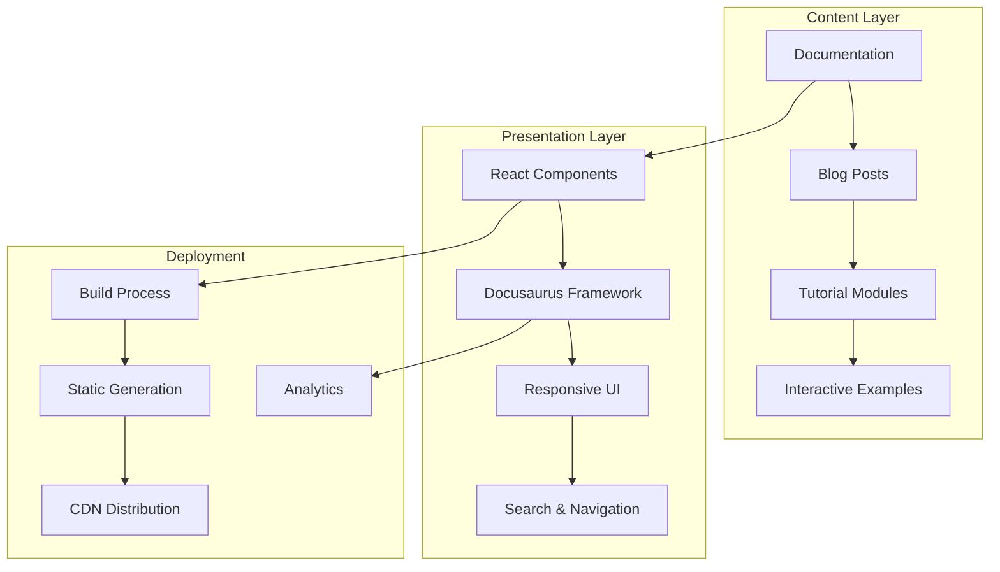

<div align="center"><a name="readme-top"></a>

[](#)

# 🚀 AI Programming Education Platform<br/><h3>Master AI-Assisted Development Through Interactive Learning</h3>

A comprehensive educational platform that teaches AI-assisted programming through hands-on tutorials, practical projects, and best practices.<br/>
Features interactive learning modules, modern development workflows, and real-world project implementations.<br/>
One-click **FREE** deployment of your personalized learning environment.

[Live Demo][demo-link] · [Documentation][docs-link] · [Blog][blog-link] · [Issues][github-issues-link]

<br/>

[][demo-link]

<br/>

<!-- SHIELD GROUP -->

[![][github-release-shield]][github-release-link]
[![][vercel-shield]][vercel-link]
[![][docusaurus-shield]][docusaurus-link]<br/>
[![][github-contributors-shield]][github-contributors-link]
[![][github-forks-shield]][github-forks-link]
[![][github-stars-shield]][github-stars-link]
[![][github-issues-shield]][github-issues-link]
[![][github-license-shield]][github-license-link]<br>

**Share This Project**

[![][share-x-shield]][share-x-link]
[![][share-linkedin-shield]][share-linkedin-link]
[![][share-reddit-shield]][share-reddit-link]

<sup>🌟 Pioneering the future of AI-assisted programming education. Built for the next generation of developers.</sup>

## 📸 Project Screenshots

> [!TIP]
> Explore our interactive learning platform designed for modern developers. See the evolution from Version 1 to the latest Version 2 with enhanced UI/UX.

### 🌟 Latest Version (Version 2) - Enhanced UI/UX

<div align="center">
  
  <p><em><strong>Version 2 Main Dashboard</strong> - Redesigned with modern aesthetics and improved navigation</em></p>
</div>

<div align="center">
  
  <p><em><strong>Version 2 Documentation</strong> - Enhanced reading experience with better typography</em></p>
</div>

<div align="center">
  
  
  
  <p><em><strong>Version 2 Interface Showcase</strong> - Mobile responsive and feature highlights</em></p>
</div>

### 📱 Previous Version (Version 1) - Original Design

<div align="center">
  
  <p><em><strong>Version 1 Main Dashboard</strong> - Original comprehensive learning modules and navigation</em></p>
</div>

<div align="center">
  
  
  <p><em><strong>Version 1 Tutorials & Blog</strong> - Original interactive content sections</em></p>
</div>

<details>
<summary><kbd>🔄 Version Comparison & More Screenshots</kbd></summary>

#### Version Evolution Highlights:
- ✨ **Enhanced Visual Design**: Modern color scheme and typography
- 🎨 **Improved UI Components**: Better buttons, cards, and interactive elements
- 📱 **Mobile Optimization**: Superior responsive design across all devices
- 🚀 **Performance Improvements**: Faster loading and smoother interactions

<div align="center">
  
  <p><em><strong>Version 1 Mobile View</strong> - Original responsive design foundation</em></p>
</div>

</details>

## 🎬 Demo Video

> [!NOTE]
> Watch our platform in action with this comprehensive demo.

<div align="center">

https://github.com/user-attachments/assets/7f452170-ee23-44ad-ac87-7ad41161cd3b

*Complete platform walkthrough showing all major features*

</div>

**Tech Stack Badges:**

<div align="center">

 
 
 
 
 

</div>

</div>

> [!IMPORTANT]
> This platform demonstrates modern educational technology with interactive learning modules. It combines comprehensive documentation with hands-on tutorials to provide a complete AI programming education experience. Features include step-by-step tutorials, practical projects, and modern development tool integration.

<details>
<summary><kbd>📑 Table of Contents</kbd></summary>

#### TOC

- [🚀 AI Programming Education Platform](#-ai-programming-education-platform)
      - [TOC](#toc)
  - [🌟 Introduction](#-introduction)
  - [✨ Key Features](#-key-features)
    - [`1` Interactive Learning Modules](#1-interactive-learning-modules)
    - [`2` Comprehensive Tutorial System](#2-comprehensive-tutorial-system)
    - [`*` Additional Features](#-additional-features)
  - [🛠️ Tech Stack](#️-tech-stack)
  - [🏗️ Architecture](#️-architecture)
    - [System Architecture](#system-architecture)
    - [Content Structure](#content-structure)
  - [🚀 Getting Started](#-getting-started)
    - [Prerequisites](#prerequisites)
    - [Quick Installation](#quick-installation)
    - [Development Mode](#development-mode)
  - [🛳 Deployment](#-deployment)
    - [`A` Vercel Deployment](#a-vercel-deployment)
    - [`B` Docker Deployment](#b-docker-deployment)
  - [📖 Learning Path](#-learning-path)
    - [Beginner Level](#beginner-level)
    - [Intermediate Level](#intermediate-level)
    - [Advanced Level](#advanced-level)
  - [🔌 Integrations](#-integrations)
  - [⌨️ Development](#️-development)
    - [Local Development](#local-development)
    - [Adding Content](#adding-content)
  - [🤝 Contributing](#-contributing)
  - [📄 License](#-license)
  - [👥 Team](#-team)

####

<br/>

</details>

## 🌟 Introduction

We are passionate educators and developers creating the next generation of AI programming education. By adopting modern educational technologies and comprehensive learning methodologies, we aim to provide learners with powerful, accessible, and engaging AI programming education.

Whether you're a beginner looking to enter the world of AI programming or an experienced developer seeking to enhance your skills with AI tools, this platform will be your comprehensive learning companion. The platform is actively maintained and we welcome feedback for any [issues][github-issues-link] encountered.

> [!NOTE]
> - Node.js >= 18.0 required for development
> - Modern web browser for optimal experience
> - GitHub account recommended for accessing additional resources
> - No prior AI experience required - we start from the basics!

| [![][demo-badge]][demo-link]   | No installation required! Visit our live demo to start learning immediately. |
| :------------------------------------ | :--------------------------------------------------------------------------------------------- |
| [](https://deepwiki.com/ChanMeng666/ai-programming-teaching-project) | Get intelligent answers about the project using AI |

> [!TIP]
> **⭐ Star us** to receive all updates and new learning content from GitHub!

[![][image-star]][github-stars-link]

## ✨ Key Features

### `1` Interactive Learning Modules

Experience next-generation educational content through our comprehensive module system. Our innovative approach provides structured learning paths through carefully designed tutorials covering everything from AI communication basics to advanced development workflows.

<div align="center">
  
  <p><em>Interactive learning modules with step-by-step guidance</em></p>
</div>

Key capabilities include:
- 🎯 **Progressive Learning**: Structured curriculum from basics to advanced
- 🛠️ **Hands-on Practice**: Real-world projects and exercises
- 📱 **Responsive Design**: Learn on any device, anywhere
- 🌐 **Bilingual Support**: Content available in multiple languages

### `2` Comprehensive Tutorial System

Revolutionary tutorial system that transforms how learners interact with AI programming concepts. With our structured approach and practical examples, students can master AI-assisted development while building real projects.

**Available Learning Tracks:**
- **Environment Setup**: Development environment configuration
- **Basic Concepts**: AI communication and prompt engineering
- **Tool Mastery**: Cursor, v0, and modern development tools
- **Project Implementation**: Complete project walkthroughs
- **Advanced Topics**: AI drawing, chat systems, and Coze integration

### `*` Additional Features

Beyond the core learning modules, this platform includes:

- [x] 📚 **Rich Documentation**: Comprehensive guides and references
- [x] 🎨 **Modern UI/UX**: Beautiful design with dark/light themes
- [x] 📝 **Blog System**: Regular updates and insights
- [x] 🔍 **Search Functionality**: Find content quickly and easily
- [x] 📊 **Progress Tracking**: Monitor your learning journey
- [x] 💻 **Code Examples**: Interactive code snippets and demos
- [x] 🚀 **One-Click Deploy**: Easy deployment to your own instance
- [x] 📱 **Mobile Optimized**: Perfect experience on all devices

> ✨ New content and features are continuously added as the field evolves.

<div align="right">

[![][back-to-top]](#readme-top)

</div>

## 🛠️ Tech Stack

<div align="center">
  <table>
    <tr>
      <td align="center" width="96">
        
        <br>Docusaurus 3.6
      </td>
      <td align="center" width="96">
        
        <br>React 18
      </td>
      <td align="center" width="96">
        
        <br>JavaScript ES6+
      </td>
      <td align="center" width="96">
        
        <br>CSS3
      </td>
      <td align="center" width="96">
        
        <br>MDX
      </td>
      <td align="center" width="96">
        
        <br>Vercel
      </td>
    </tr>
  </table>
</div>

**Frontend Stack:**
- **Framework**: Docusaurus 3.6.1 with React 18
- **Styling**: CSS3 + Custom Design System
- **Content**: MDX for rich interactive documentation
- **Analytics**: Vercel Analytics integration
- **Icons**: SVG-based icon system

**Development Tools:**
- **Build System**: Webpack-based Docusaurus build
- **Development Server**: Hot reload development environment
- **Content Management**: File-based content system
- **Deployment**: Vercel for seamless deployments
- **Version Control**: Git-based workflow

> [!TIP]
> Each technology was selected for educational effectiveness, ease of maintenance, and optimal learning experience.

## 🏗️ Architecture

### System Architecture

> [!TIP]
> This architecture supports easy content management and scalable educational delivery, making it perfect for educational institutions and self-learners.



### Content Structure

```
docs/
├── basics/               # Fundamental concepts
│   ├── ai-communication  # AI interaction principles
│   ├── markdown-syntax   # Documentation basics
│   └── prompt-engineering # Effective prompting
├── setup/               # Environment configuration
├── tools/               # Development tools
├── tutorials/           # Hands-on tutorials
├── practice/            # Project implementations
├── ai-chat/             # Chat system development
├── ai-drawing/          # AI art and design
└── coze/                # Coze platform integration
```

## 🚀 Getting Started

### Prerequisites

> [!IMPORTANT]
> Ensure you have the following installed:

- Node.js 18.0+ ([Download](https://nodejs.org/))
- npm/yarn/pnpm package manager
- Git ([Download](https://git-scm.com/))
- Modern web browser

### Quick Installation

**1. Clone Repository**

```bash
git clone https://github.com/ChanMeng666/ai-programming-teaching-project.git
cd ai-programming-teaching-project
```

**2. Install Dependencies**

```bash
# Using npm
npm install

# Using yarn
yarn install

# Using pnpm (recommended)
pnpm install
```

**3. Start Development Server**

```bash
npm start
```

🎉 **Success!** Open [http://localhost:3000](http://localhost:3000) to access the learning platform.

### Development Mode

```bash
# Start with hot reload
npm start

# Build for production
npm run build

# Serve production build
npm run serve

# Clear cache
npm run clear
```

## 🛳 Deployment

> [!IMPORTANT]
> Choose the deployment strategy that best fits your educational needs. Vercel is recommended for its simplicity and performance.

### `A` Vercel Deployment

**One-Click Deploy:**

[](https://vercel.com/new/clone?repository-url=https%3A%2F%2Fgithub.com%2FChanMeng666%2Fai-programming-teaching-project)

**Manual Deployment:**

```bash
# Install Vercel CLI
npm i -g vercel

# Deploy
vercel --prod
```

### `B` Docker Deployment

```bash
# Build Docker image
docker build -t ai-programming-platform .

# Run container
docker run -p 3000:3000 ai-programming-platform
```

## 📖 Learning Path

### Beginner Level

**Getting Started (Week 1-2):**
1. **Environment Setup** - Configure your development environment
2. **AI Communication** - Learn effective AI interaction
3. **Markdown Basics** - Master documentation formatting

### Intermediate Level

**Tool Mastery (Week 3-5):**
1. **Cursor Editor** - Advanced code editing with AI
2. **v0 Platform** - Rapid prototyping and development
3. **Workflow Integration** - Streamlined development processes

### Advanced Level

**Project Implementation (Week 6-8):**
1. **Complete Projects** - Build real-world applications
2. **AI Drawing** - Creative AI applications
3. **Chat Systems** - Conversational AI development

> [!NOTE]
> Each module includes hands-on exercises, practical examples, and assessment opportunities.

## 🔌 Integrations

We support integration with leading development and AI platforms:

| Category | Platform | Status | Documentation |
|----------|----------|--------|---------------|
| **Code Editors** | Cursor | ✅ Active | [Setup Guide](docs/tools/cursor-guide.mdx) |
| **Development** | v0 Platform | ✅ Active | [Setup Guide](docs/tools/v0-platform.mdx) |
| **Deployment** | Vercel | ✅ Active | [Setup Guide](docs/tools/vercel-deploy.mdx) |
| **AI Tools** | Coze | ✅ Active | [Setup Guide](docs/coze/index.mdx) |
| **Analytics** | Vercel Analytics | ✅ Active | Built-in Integration |

## ⌨️ Development

### Local Development

**Setup Development Environment:**

```bash
# Clone repository
git clone https://github.com/ChanMeng666/ai-programming-teaching-project.git
cd ai-programming-teaching-project

# Install dependencies
npm install

# Start development server
npm start
```

### Adding Content

**Creating New Documentation:**

```bash
# Create new doc file
touch docs/new-topic/index.mdx
```

**Adding Blog Posts:**

```bash
# Create new blog post
touch blog/YYYY-MM-DD-post-title.mdx
```

**Content Structure:**

```markdown
---
title: Your Title
sidebar_position: 1
---

# Your Content

Your educational content here...
```

## 🤝 Contributing

We welcome contributions! Here's how you can help improve this educational platform:

**Content Contributions:**
- 📚 Add new tutorials and learning modules
- 🐛 Fix typos and improve existing content
- 💡 Suggest new topics and learning paths
- 🌐 Help with translations and localization

**Technical Contributions:**
- 🔧 Improve platform functionality
- 🎨 Enhance UI/UX design
- 📱 Optimize mobile experience
- ⚡ Performance improvements

**Pull Request Process:**
1. Fork the repository
2. Create your feature branch (`git checkout -b feature/amazing-feature`)
3. Commit your changes (`git commit -m 'Add some amazing feature'`)
4. Push to the branch (`git push origin feature/amazing-feature`)
5. Open a Pull Request

## 📄 License

This project is licensed under the MIT License - see the [LICENSE](LICENSE) file for details.

**Open Source Benefits:**
- ✅ Free for educational use
- ✅ Modification allowed
- ✅ Distribution permitted
- ✅ Commercial use allowed

## 👥 Team

<div align="center">
  <table>
    <tr>
      <td align="center">
        <a href="https://github.com/ChanMeng666">
          
          <br />
          <sub><b>Chan Meng</b></sub>
        </a>
        <br />
        <small>Creator & Lead Developer</small>
        <br />
        <small>UI/UX Designer & Full Stack Developer</small>
      </td>
    </tr>
  </table>
</div>

## 🙋‍♀️ Author

**Chan Meng**
-  LinkedIn: [chanmeng666](https://www.linkedin.com/in/chanmeng666/)
-  GitHub: [ChanMeng666](https://github.com/ChanMeng666)
-  Email: [chanmeng.dev@gmail.com](mailto:chanmeng.dev@gmail.com)
-  Website: [chanmeng.live](https://2d-portfolio-eta.vercel.app/)

---

<div align="center">
<strong>🚀 Building the Future of AI Programming Education 🌟</strong>
<br/>
<em>Empowering developers and learners worldwide</em>
<br/><br/>

⭐ **Star us on GitHub** • 📖 **Read the Documentation** • 🐛 **Report Issues** • 💡 **Request Features** • 🤝 **Contribute**

<br/><br/>

**Made with ❤️ by the AI Programming Education team**


</div>

---

<!-- LINK DEFINITIONS -->

[back-to-top]: https://img.shields.io/badge/-BACK_TO_TOP-151515?style=flat-square

<!-- Project Links -->
[demo-link]: https://ai-programming-teaching-project.vercel.app/
[docs-link]: https://ai-programming-teaching-project.vercel.app/docs/intro
[blog-link]: https://ai-programming-teaching-project.vercel.app/blog

<!-- GitHub Links -->
[github-issues-link]: https://github.com/ChanMeng666/ai-programming-teaching-project/issues
[github-stars-link]: https://github.com/ChanMeng666/ai-programming-teaching-project/stargazers
[github-forks-link]: https://github.com/ChanMeng666/ai-programming-teaching-project/forks
[github-contributors-link]: https://github.com/ChanMeng666/ai-programming-teaching-project/contributors
[github-release-link]: https://github.com/ChanMeng666/ai-programming-teaching-project/releases
[github-license-link]: https://github.com/ChanMeng666/ai-programming-teaching-project/blob/main/LICENSE

<!-- External Links -->
[vercel-link]: https://vercel.com
[docusaurus-link]: https://docusaurus.io

<!-- Shield Badges -->
[github-release-shield]: https://img.shields.io/github/v/release/ChanMeng666/ai-programming-teaching-project?color=369eff&labelColor=black&logo=github&style=flat-square
[vercel-shield]: https://img.shields.io/badge/vercel-online-55b467?labelColor=black&logo=vercel&style=flat-square
[docusaurus-shield]: https://img.shields.io/badge/docusaurus-3.6.1-blue?labelColor=black&logo=docusaurus&style=flat-square
[github-contributors-shield]: https://img.shields.io/github/contributors/ChanMeng666/ai-programming-teaching-project?color=c4f042&labelColor=black&style=flat-square
[github-forks-shield]: https://img.shields.io/github/forks/ChanMeng666/ai-programming-teaching-project?color=8ae8ff&labelColor=black&style=flat-square
[github-stars-shield]: https://img.shields.io/github/stars/ChanMeng666/ai-programming-teaching-project?color=ffcb47&labelColor=black&style=flat-square
[github-issues-shield]: https://img.shields.io/github/issues/ChanMeng666/ai-programming-teaching-project?color=ff80eb&labelColor=black&style=flat-square
[github-license-shield]: https://img.shields.io/badge/license-MIT-white?labelColor=black&style=flat-square

<!-- Badge Variants -->
[demo-badge]: https://img.shields.io/badge/TRY%20DEMO-ONLINE-55b467?labelColor=black&logo=vercel&style=for-the-badge

<!-- Social Share Links -->
[share-x-link]: https://x.com/intent/tweet?hashtags=AI,Programming,Education&text=Check%20out%20this%20amazing%20AI%20Programming%20Education%20Platform&url=https%3A%2F%2Fgithub.com%2FChanMeng666%2Fai-programming-teaching-project
[share-linkedin-link]: https://linkedin.com/sharing/share-offsite/?url=https://github.com/ChanMeng666/ai-programming-teaching-project
[share-reddit-link]: https://www.reddit.com/submit?title=AI%20Programming%20Education%20Platform&url=https%3A%2F%2Fgithub.com%2FChanMeng666%2Fai-programming-teaching-project

[share-x-shield]: https://img.shields.io/badge/-share%20on%20x-black?labelColor=black&logo=x&logoColor=white&style=flat-square
[share-linkedin-shield]: https://img.shields.io/badge/-share%20on%20linkedin-black?labelColor=black&logo=linkedin&logoColor=white&style=flat-square
[share-reddit-shield]: https://img.shields.io/badge/-share%20on%20reddit-black?labelColor=black&logo=reddit&logoColor=white&style=flat-square

<!-- Images -->
[image-star]: https://img.shields.io/github/stars/ChanMeng666/ai-programming-teaching-project?style=social
