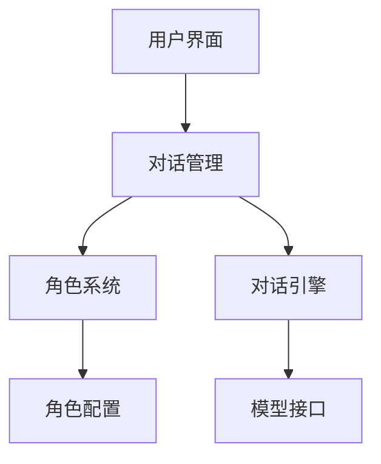

import Tabs from '@theme/Tabs';
import TabItem from '@theme/TabItem';
import ReactPlayer from 'react-player';

# AI对话系统开发

在这个章节中，你将学习如何开发中国艺人AI对话系统。

## 🎥 教程视频

<div className="video-container">
  <div className="video-wrapper">
    <ReactPlayer
      url="https://www.youtube.com/embed/sJdptJj9pAw"
      controls={true}
      width="100%"
      height="100%"
      style={{ aspectRatio: '16/9' }}
    />
  </div>
</div>

## 📋 学习内容

### 1. 环境准备

#### Hugging Face配置
1. 访问 [Hugging Face](https://huggingface.co/join) 注册账号
2. 生成访问令牌：
   - 访问 [Token设置页面](https://huggingface.co/settings/tokens)
   - 点击 "New token"
   - 选择 "Write" 权限
   - 生成令牌并保存

:::caution 重要提示
令牌非常重要，请妥善保存，关闭页面后将无法再次查看完整令牌
:::

#### 开发环境配置
<Tabs>
  <TabItem value="required" label="必需软件" default>
    1. Python 3.8+
    2. Git
    3. Cursor编辑器
  </TabItem>
  <TabItem value="dependencies" label="依赖安装">
    ```bash
    # 创建虚拟环境
    python -m venv venv
    
    # 激活虚拟环境
    # Windows:
    venv\Scripts\activate
    # Linux/Mac:
    source venv/bin/activate
    
    # 安装依赖
    pip install gradio huggingface_hub
    ```
  </TabItem>
</Tabs>

### 2. 项目创建

#### Hugging Face Space设置
1. 登录Hugging Face
2. 点击 "New Space"
3. 填写基本信息：
   - Owner: 你的用户名
   - Space name: role-play-chat
   - SDK: Gradio
   - Hardware: CPU basic
   - Visibility: Public

#### 本地项目配置
```bash
# 克隆Space仓库
git clone https://huggingface.co/spaces/你的用户名/role-play-chat
cd role-play-chat

# 创建项目结构
mkdir -p {assets,utils,tests}
touch main.py character_profiles.py dialogue_system.py
```

### 3. 系统架构设计



### 4. 核心功能实现

#### 对话系统
```python
class DialogueSystem:
    def __init__(self):
        self.history = []
        self.current_character = None
        
    async def process_message(self, message: str) -> str:
        """处理用户消息并生成回复"""
        if not self.current_character:
            return "请先选择对话角色"
            
        # 添加到历史记录
        self.history.append({"role": "user", "content": message})
        
        # 生成回复
        response = await self._generate_response(message)
        self.history.append({"role": "assistant", "content": response})
        
        return response
        
    def manage_context(self, max_length: int = 2048):
        """管理对话上下文长度"""
        context_length = sum(len(msg["content"]) for msg in self.history)
        
        while context_length > max_length and len(self.history) > 1:
            removed = self.history.pop(0)
            context_length -= len(removed["content"])
```

#### 角色系统
```python
class Character:
    def __init__(self, name: str, profile: dict):
        self.name = name
        self.background = profile.get("background", "")
        self.personality = profile.get("personality", [])
        self.speaking_style = profile.get("speaking_style", {})
        
    def get_prompt(self) -> str:
        """生成角色提示词"""
        return f"""
        你现在扮演{self.name}。
        背景：{self.background}
        性格：{', '.join(self.personality)}
        说话风格：{self.speaking_style}
        """
```

### 5. 测试与部署

#### 测试规范
```python
# tests/test_dialogue.py
import pytest
from dialogue_system import DialogueSystem

def test_dialogue_initialization():
    system = DialogueSystem()
    assert system.history == []
    assert system.current_character is None

@pytest.mark.asyncio
async def test_message_processing():
    system = DialogueSystem()
    system.current_character = Character("测试角色", {})
    
    response = await system.process_message("你好")
    assert isinstance(response, str)
    assert len(system.history) == 2
```

#### 部署流程
1. 提交代码到GitHub
2. 检查部署状态
3. 监控系统性能

### 6. 最佳实践

#### 代码规范
```python
# 良好的命名和注释示例
class DialogueManager:
    """对话管理器，负责处理用户输入和生成回复
    
    Attributes:
        history (List[Dict]): 对话历史记录
        character (Character): 当前选择的角色
        max_history_length (int): 最大历史记录长度
    """
    
    def __init__(self, max_history_length: int = 100):
        self.history = []
        self.character = None
        self.max_history_length = max_history_length
```

#### 性能优化
```python
from functools import lru_cache

@lru_cache(maxsize=1000)
def get_character_profile(character_id: str) -> dict:
    """获取角色配置信息（使用缓存）"""
    return load_character_profile(character_id)

# 异步处理
async def process_messages(messages: list) -> list:
    """并行处理多条消息"""
    tasks = [process_single(msg) for msg in messages]
    return await asyncio.gather(*tasks)
```

#### 安全实践
```python
from pydantic import BaseModel, validator

class UserInput(BaseModel):
    message: str
    character_id: str = None
    
    @validator('message')
    def validate_message(cls, v):
        if len(v) > 1000:
            raise ValueError('消息长度不能超过1000字符')
        if not v.strip():
            raise ValueError('消息不能为空')
        return v.strip()
```

:::info 项目特点
- 支持多角色对话
- 智能上下文管理
- 实时响应处理
- 完整的错误处理机制
:::

这个AI对话系统项目展示了如何构建一个完整的AI应用，从环境配置到部署维护的全流程。 