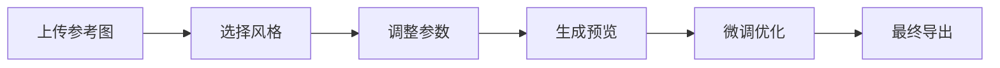
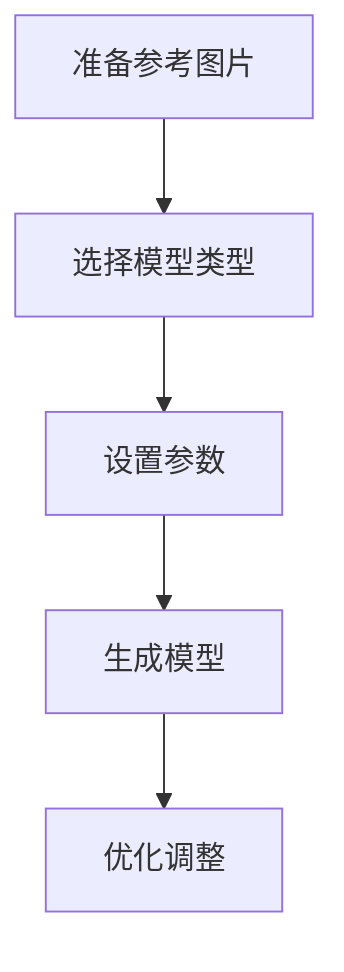
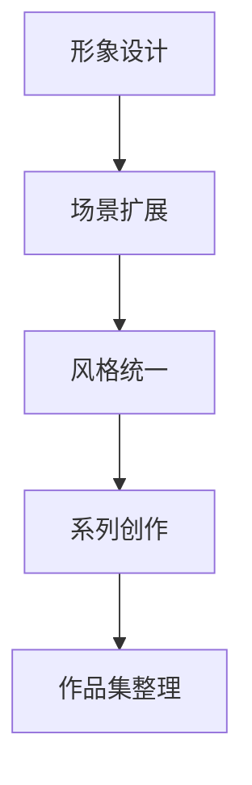
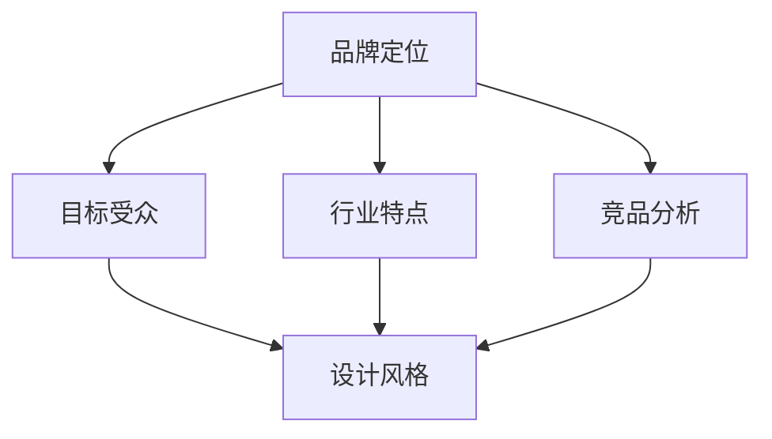

import Tabs from '@theme/Tabs';
import TabItem from '@theme/TabItem';
import ReactPlayer from 'react-player';

# AI绘图应用开发

在这个章节中，你将学习如何使用各种AI工具进行图像设计和3D模型制作。

## 🎨 LOGO设计基础

### 教程视频

<div className="video-grid">
  <div className="video-card">
    <h4>🎥 LOGO设计教程 1</h4>
    <div className="video-wrapper">
      <ReactPlayer
        url="https://www.youtube.com/embed/JKTXXC1qt5o"
        controls={true}
        width="100%"
        height="100%"
        style={{ aspectRatio: '16/9' }}
      />
    </div>
  </div>

  <div className="video-card">
    <h4>🎥 LOGO设计教程 2</h4>
    <div className="video-wrapper">
      <ReactPlayer
        url="https://www.youtube.com/embed/n8JVcE5YEi4"
        controls={true}
        width="100%"
        height="100%"
        style={{ aspectRatio: '16/9' }}
      />
    </div>
  </div>
</div>

### AI LOGO设计平台

#### ailogomaker.io使用指南
1. 访问 [ailogomaker.io](https://ailogomaker.io/zh-CN)
2. 输入品牌名称和关键词
3. 选择喜欢的风格
4. 生成LOGO设计

:::tip 设计建议
- 使用简洁明了的关键词
- 尝试不同的风格组合
- 注意色彩搭配
- 考虑品牌调性
:::

#### Figma优化流程
1. 导出SVG文件
2. 在Figma中打开
3. 调整细节：
   - 修改颜色
   - 调整比例
   - 优化字体
   - 微调形状

## 🖼️ 图像生成技巧

### Recraft平台使用

#### 基础功能
1. 访问 [Recraft](https://www.recraft.ai/projects)
2. 创建新项目
3. 选择生成类型：
   - 文生图
   - 图生图
   - 批量生成
   - LOGO贴图

#### 扩图技巧
```typescript
interface ImagePrompt {
  baseImage: string;
  style: string;
  ratio: '1:1' | '16:9' | '4:3';
  variations: number;
}

// 示例提示词
const promptExample = {
  baseImage: '个人IP形象',
  style: '赛博朋克',
  ratio: '1:1',
  variations: 4
};
```

### Hugging Face Spaces

#### Flux模型使用
1. 访问 [Hugging Face Spaces](https://huggingface.co/spaces)
2. 搜索"flux"关键词
3. 使用 Kolors-Character-With-Flux：
   - 上传参考图片
   - 调整参数
   - 生成新图像

#### Lora模型探索
- 搜索"lora"关键词
- 尝试不同模型
- 比较效果差异
- 记录最佳实践

### 哩布哩布AI平台

#### 3D潮流形象生成
1. 访问 [哩布哩布AI](https://www.liblib.art/)
2. 选择3D形象生成模型
3. 设置参数：
   - 风格选择
   - 姿势调整
   - 服装搭配
   - 场景设置

#### 工作流程


## 📐 3D模型制作

### Tripo3D平台

#### 基础使用
1. 访问 [Tripo3D](https://www.tripo3d.ai/app/home)
2. 创建账号
3. 开始新项目

#### 功能特点
- 图片转3D模型
- 材质自动生成
- 姿态调整
- 实时预览

### 工作流程

#### 准备工作


#### 模型生成
1. 上传参考图片
2. 选择模型类型
3. 调整参数：
   - 细节程度
   - 材质质量
   - 姿态设置
   - 比例调整

### 优化技巧

#### 模型优化
```typescript
interface ModelSettings {
  detail: number;  // 1-10
  texture: {
    quality: 'low' | 'medium' | 'high';
    resolution: number;
  };
  pose: {
    rotation: number[];
    position: number[];
  };
}

// 推荐设置
const recommendedSettings: ModelSettings = {
  detail: 8,
  texture: {
    quality: 'high',
    resolution: 2048
  },
  pose: {
    rotation: [0, 0, 0],
    position: [0, 0, 0]
  }
};
```

#### 常见问题解决
- **模型变形**: 检查参考图片质量，调整生成参数
- **材质问题**: 优化贴图分辨率，调整材质参数
- **细节缺失**: 提高细节程度设置，使用多角度参考

## 🎯 实用技巧

### 提示词优化

#### 基础结构
```
主体 + 风格 + 场景 + 光效 + 构图
```

#### 示例
```
赛博朋克风格的年轻女性，霓虹街道背景，侧光打射，低角度拍摄
```

### 参数调优

<Tabs>
  <TabItem value="sampling" label="采样设置" default>
    - 采样方法选择
    - 步数设置 (20-50)
    - CFG Scale (7-15)
    - 种子值固定
  </TabItem>
  <TabItem value="prompts" label="提示词权重">
    - 使用括号增强: (keyword:1.2)
    - 使用方括号减弱: [keyword:0.8]
    - 负面提示词设置
    - 关键词顺序调整
  </TabItem>
</Tabs>

### 后期处理

1. **图像优化**
   - 色彩调整
   - 对比度增强
   - 锐化处理

2. **细节修复**
   - 瑕疵修复
   - 边缘优化
   - 背景处理

3. **风格统一**
   - 色调一致
   - 风格匹配
   - 系列化处理

## 💼 实战项目

### 个人IP形象设计

#### 工作流程
1. 使用哩布哩布AI生成基础形象
2. Recraft扩展场景
3. 添加文字和标识
4. 生成系列作品

#### 实践步骤


### 品牌视觉设计

#### LOGO设计
1. 使用ailogomaker生成基础LOGO
2. Figma优化调整
3. 生成品牌规范

#### 应用场景
- 社交媒体封面
- 产品包装
- 宣传材料
- 网站设计

### 3D角色建模

#### 模型制作
1. 准备参考图片
2. 使用Tripo3D生成模型
3. 调整优化
4. 导出使用

#### 应用示例
```typescript
interface ProjectWorkflow {
  stage: string;
  tools: string[];
  output: string;
  timeEstimate: string;
}

const workflow: ProjectWorkflow[] = [
  {
    stage: '概念设计',
    tools: ['哩布哩布AI', 'Recraft'],
    output: '角色概念图',
    timeEstimate: '2-3小时'
  },
  {
    stage: '3D建模',
    tools: ['Tripo3D'],
    output: '3D模型文件',
    timeEstimate: '4-6小时'
  },
  {
    stage: '后期优化',
    tools: ['Blender', 'Substance Painter'],
    output: '最终模型',
    timeEstimate: '3-4小时'
  }
];
```

## 📚 设计原则

### 品牌定位


### 设计理念
- **简单性**: 易识别、好记忆
- **独特性**: 区别于竞品
- **适应性**: 各种场景使用
- **永恒性**: 避免过时元素

:::info 学习建议
AI绘图需要大量实践和尝试，建议从简单的LOGO设计开始，逐步深入到复杂的3D建模。
:::

这个AI绘图应用展示了如何使用各种AI工具进行创意设计，从基础的图像生成到复杂的3D建模都有涉及。 