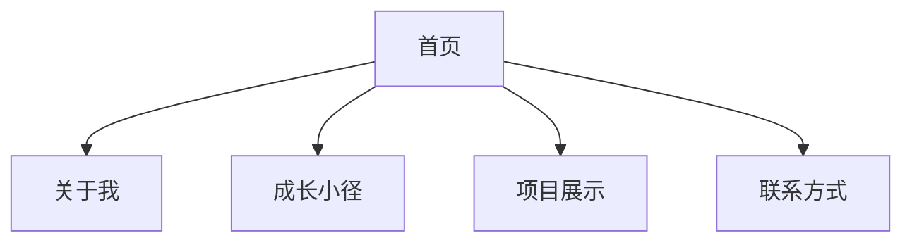

import ThemedImage from '@theme/ThemedImage';

# 洒洒的个人博客

## 👩‍💻 作者介绍

**作者**: 洒洒

**作品网址**: [皮卡之家](https://pika-s-home.vercel.app/)

## 🎨 作品展示

### 首页展示

  

### 成长小径页面

  

## ✨ 特色功能

- **清新设计**: 采用简约优雅的视觉风格
- **响应式布局**: 完美适配手机、平板、桌面设备
- **个性化内容**: 展示个人成长历程和经验分享
- **流畅动画**: 精心设计的交互动效提升用户体验

## 🛠️ 技术实现

### 核心技术栈
- **框架**: Docusaurus v2
- **样式**: 自定义CSS + 主题定制
- **部署**: Vercel 自动部署
- **性能**: 静态生成，快速加载

### 创新亮点
- 自定义主题配色方案
- 个性化导航设计
- 优化的移动端体验
- 完善的SEO设置

## 🎯 学习价值

这个项目展示了如何：
- 创建个人品牌形象
- 设计清新的用户界面
- 实现响应式网页设计
- 部署和维护个人网站

:::tip 设计灵感
洒洒的作品体现了"简约而不简单"的设计理念，值得初学者学习其布局规划和色彩搭配技巧。
:::

## 🚀 项目特点

### 内容架构

### 设计特色
- **色彩**: 温暖的暖色调为主
- **布局**: 卡片式布局，信息层次清晰
- **字体**: 易读性强的字体选择
- **图标**: 一致性的图标设计系统

这个项目是学习个人网站开发的优秀范例，展示了如何将技术实现与设计美学完美结合。

export const styles = `
.screenshot-container {
  margin: 2rem 0;
  border-radius: 12px;
  overflow: hidden;
  box-shadow: 0 8px 32px rgba(0, 0, 0, 0.1);
  transition: transform 0.3s ease;
}

.screenshot-container:hover {
  transform: translateY(-5px);
}

.screenshot {
  width: 100%;
  height: auto;
  display: block;
}
`; 