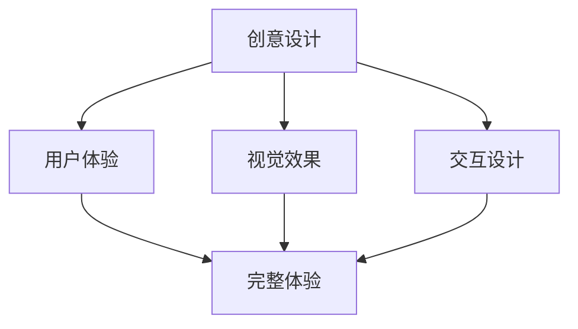

import ThemedImage from '@theme/ThemedImage';

# Stella的个人主页

## 👩‍💻 作者介绍

**作者**: Stella

**作品网址**: [My Playground](https://my-website-iota-coral.vercel.app/)

## 🎨 作品展示

<div className="screenshot-container">
  
</div>

## ✨ 特色功能

- **创意交互**: 独特的用户交互设计
- **背景音乐**: 集成音频播放功能
- **视觉效果**: 精美的动画和过渡效果
- **简洁导航**: 直观的用户体验设计

## 🛠️ 技术实现

### 核心技术栈
- **框架**: Docusaurus 框架
- **音频**: 自定义音频播放器
- **动画**: CSS 动画 + JavaScript 交互
- **响应式**: 完美的移动端适配

### 创新功能
- 背景音乐播放控制
- 个性化页面加载动画
- 创意性的内容展示方式
- 优化的用户体验流程

## 🎯 学习价值

这个项目展示了如何：
- 整合多媒体元素（音频、视频）
- 创建引人注目的交互效果
- 实现个性化的用户体验
- 平衡功能性与美观性

:::tip 创意启发
Stella的作品展现了如何通过创意设计让个人网站脱颖而出，特别是在音效和视觉效果的结合上。
:::

## 🚀 项目特点

### 设计理念


### 技术亮点
- **音频集成**: 无缝的背景音乐播放
- **动画效果**: 流畅的页面过渡
- **响应式设计**: 多设备完美展示
- **性能优化**: 快速加载与流畅交互

## 🎵 音频功能实现

### 音乐播放器
```javascript
// 音频播放控制示例
const audioPlayer = {
  play: () => {
    const audio = document.getElementById('bgMusic');
    audio.play();
  },
  pause: () => {
    const audio = document.getElementById('bgMusic');
    audio.pause();
  },
  toggle: () => {
    const audio = document.getElementById('bgMusic');
    audio.paused ? audio.play() : audio.pause();
  }
};
```

### 用户体验优化
- 自动播放控制
- 音量调节功能
- 播放状态显示
- 用户偏好记忆

这个项目是学习如何在网站中集成多媒体元素的绝佳范例，展示了技术与艺术的完美融合。

export const styles = `
.screenshot-container {
  margin: 2rem 0;
  border-radius: 12px;
  overflow: hidden;
  box-shadow: 0 8px 32px rgba(0, 0, 0, 0.1);
  transition: transform 0.3s ease;
}

.screenshot-container:hover {
  transform: translateY(-5px);
}

.screenshot {
  width: 100%;
  height: auto;
  display: block;
}
`; 