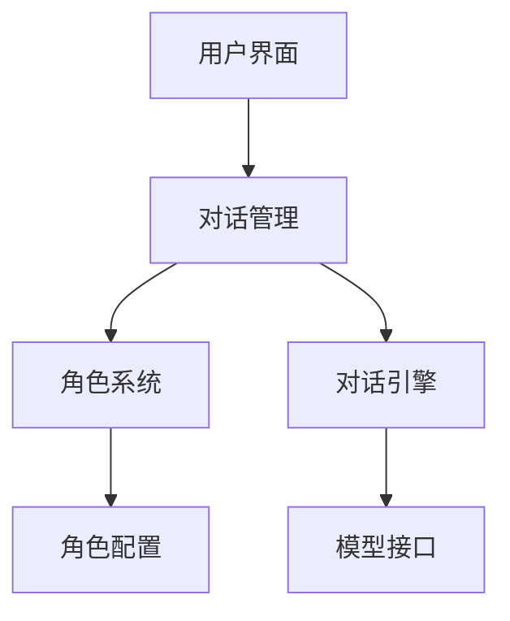

import Tabs from '@theme/Tabs';
import TabItem from '@theme/TabItem';

# 开发流程

## 基础框架开发

<div className="framework-dev">

### 系统架构



### 核心组件
1. 用户界面 (UI)
2. 对话管理系统
3. 角色配置系统
4. 对话引擎
5. 模型接口

</div>

## 功能实现

### 对话系统

<div className="dialogue-system">

#### 基础对话流程
```python
class DialogueSystem:
    def __init__(self):
        self.history = []
        self.current_character = None
        
    async def process_message(self, message: str) -> str:
        """处理用户消息并生成回复"""
        if not self.current_character:
            return "请先选择对话角色"
            
        # 添加到历史记录
        self.history.append({"role": "user", "content": message})
        
        # 生成回复
        response = await self._generate_response(message)
        self.history.append({"role": "assistant", "content": response})
        
        return response
```

#### 上下文管理
```python
def manage_context(self, max_length: int = 2048):
    """管理对话上下文长度"""
    context_length = sum(len(msg["content"]) for msg in self.history)
    
    while context_length > max_length and len(self.history) > 1:
        removed = self.history.pop(0)
        context_length -= len(removed["content"])
```

</div>

### 角色系统

<div className="character-system">

#### 角色配置
```python
class Character:
    def __init__(self, name: str, profile: dict):
        self.name = name
        self.background = profile.get("background", "")
        self.personality = profile.get("personality", [])
        self.speaking_style = profile.get("speaking_style", {})
        
    def get_prompt(self) -> str:
        """生成角色提示词"""
        return f"""
        你现在扮演{self.name}。
        背景：{self.background}
        性格：{', '.join(self.personality)}
        说话风格：{self.speaking_style}
        """
```

#### 方言处理
```python
class DialectProcessor:
    def __init__(self, dialect_type: str):
        self.dialect_type = dialect_type
        self.patterns = self._load_patterns()
        
    def process(self, text: str) -> str:
        """处理文本，添加方言特色"""
        for pattern, replacement in self.patterns.items():
            text = text.replace(pattern, replacement)
        return text
```

</div>

## 优化与增强

### 性能优化

<div className="performance">

<Tabs>
  <TabItem value="memory" label="内存优化" default>
    ```python
    def optimize_memory():
        # 清理不需要的缓存
        torch.cuda.empty_cache()
        # 使用生成器处理大量数据
        def process_large_data():
            for chunk in iter(lambda: f.read(8192), ''):
                yield process_chunk(chunk)
    ```
  </TabItem>
  <TabItem value="speed" label="速度优化">
    ```python
    # 使用异步处理
    async def process_batch(messages):
        tasks = [process_message(msg) for msg in messages]
        return await asyncio.gather(*tasks)
        
    # 使用缓存
    @lru_cache(maxsize=1000)
    def get_response(prompt: str) -> str:
        return generate_response(prompt)
    ```
  </TabItem>
</Tabs>

</div>

### 用户体验优化

<div className="ux-optimization">

#### 响应式设计
```python
def update_ui(ctx):
    """更新UI状态"""
    return {
        "visible": True,
        "value": response,
        "loading": False,
        "error": None
    }
```

#### 错误处理
```python
def handle_error(func):
    @wraps(func)
    async def wrapper(*args, **kwargs):
        try:
            return await func(*args, **kwargs)
        except Exception as e:
            logger.error(f"Error: {str(e)}")
            return {
                "error": "很抱歉，系统遇到了问题，请稍后再试。",
                "details": str(e) if DEBUG else None
            }
    return wrapper
```

</div>

export const styles = {
  frameworkDev: {
    backgroundColor: '#f6f8fa',
    padding: '1rem',
    borderRadius: '8px'
  },
  dialogueSystem: {
    borderLeft: '3px solid #1a73e8',
    paddingLeft: '1rem'
  },
  performance: {
    backgroundColor: '#f0f7ff',
    padding: '1rem',
    borderRadius: '8px'
  }
}; 