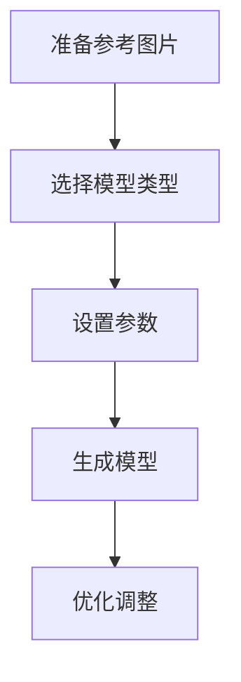

# 3D模型制作

## Tripo3D平台

### 基础使用

1. 访问 [Tripo3D](https://www.tripo3d.ai/app/home)
2. 创建账号
3. 开始新项目

### 功能特点

- 图片转3D模型
- 材质自动生成
- 姿态调整
- 实时预览

## 工作流程

### 准备工作



### 模型生成

1. 上传参考图片
2. 选择模型类型
3. 调整参数：
   - 细节程度
   - 材质质量
   - 姿态设置
   - 比例调整

## 优化技巧

### 模型优化

```typescript
interface ModelSettings {
  detail: number;  // 1-10
  texture: {
    quality: 'low' | 'medium' | 'high';
    resolution: number;
  };
  pose: {
    rotation: number[];
    position: number[];
  };
}

// 推荐设置
const recommendedSettings: ModelSettings = {
  detail: 8,
  texture: {
    quality: 'high',
    resolution: 2048
  },
  pose: {
    rotation: [0, 0, 0],
    position: [0, 0, 0]
  }
};
```

### 常见问题解决

#### 模型变形
- 检查参考图片质量
- 调整生成参数
- 使用多角度参考

#### 材质问题
- 优化贴图分辨率
- 调整材质参数
- 手动修复瑕疵

## 实践项目

### 角色模型

1. 准备工作：
   - 收集参考图片
   - 确定风格定位
   - 规划制作流程

2. 制作步骤：
   - 生成基础模型
   - 调整姿态
   - 优化材质
   - 导出成品

### 场景道具

- 家具模型
- 道具制作
- 场景元素
- 配件设计

export const styles = {
  workflow: {
    backgroundColor: '#f6f8fa',
    padding: '1rem',
    borderRadius: '8px'
  }
}; 