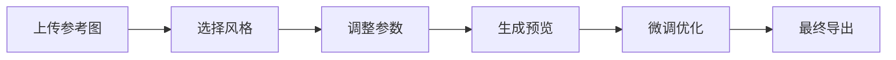

# 图像生成技巧

## Recraft平台使用

### 基础功能

1. 访问 [Recraft](https://www.recraft.ai/projects)
2. 创建新项目
3. 选择生成类型：
   - 文生图
   - 图生图
   - 批量生成
   - LOGO贴图

### 扩图技巧

```typescript
interface ImagePrompt {
  baseImage: string;
  style: string;
  ratio: '1:1' | '16:9' | '4:3';
  variations: number;
}

// 示例提示词
const promptExample = {
  baseImage: '个人IP形象',
  style: '赛博朋克',
  ratio: '1:1',
  variations: 4
};
```

## Hugging Face Spaces

### Flux模型使用

1. 访问 [Hugging Face Spaces](https://huggingface.co/spaces)
2. 搜索"flux"关键词
3. 使用 Kolors-Character-With-Flux：
   - 上传参考图片
   - 调整参数
   - 生成新图像

### Lora模型探索

- 搜索"lora"关键词
- 尝试不同模型
- 比较效果差异
- 记录最佳实践

## 哩布哩布AI平台

### 3D潮流形象生成

1. 访问 [哩布哩布AI](https://www.liblib.art/)
2. 选择3D形象生成模型
3. 设置参数：
   - 风格选择
   - 姿势调整
   - 服装搭配
   - 场景设置

### 工作流程



## 实用技巧

### 提示词优化

<div className="prompt-tips">

#### 基础结构
```
主体 + 风格 + 场景 + 光效 + 构图
```

#### 示例
```
赛博朋克风格的年轻女性，霓虹街道背景，侧光打射，低角度拍摄
```

</div>

### 参数调优

- 采样方法选择
- 步数设置
- 种子值调整
- 提示词权重

### 后期处理

1. 图像优化
2. 色彩调整
3. 细节修复
4. 风格统一

export const styles = {
  promptTips: {
    backgroundColor: '#f6f8fa',
    padding: '1rem',
    borderRadius: '8px'
  }
}; 