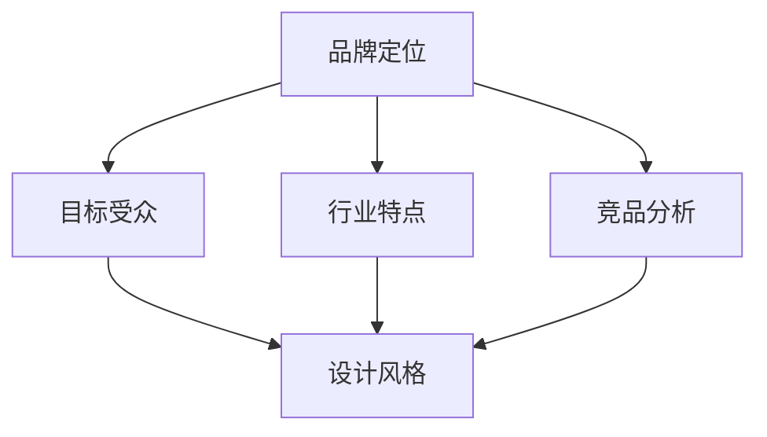

import ReactPlayer from 'react-player';

  <h3>🎥 教程视频 1</h3>

  

    <ReactPlayer
      url="https://www.youtube.com/embed/JKTXXC1qt5o"
      controls={true}
      width="100%"
      height="100%"
      style={{ aspectRatio: '16/9' }}
    />
  

  <h3>🎥 教程视频 2</h3>

  

    <ReactPlayer
      url="https://www.youtube.com/embed/n8JVcE5YEi4"
      controls={true}
      width="100%"
      height="100%"
      style={{ aspectRatio: '16/9' }}
    />
  

# LOGO设计基础

## AI LOGO设计平台

### ailogomaker.io使用指南

1. 访问 [ailogomaker.io](https://ailogomaker.io/zh-CN)
2. 输入品牌名称和关键词
3. 选择喜欢的风格
4. 生成LOGO设计

:::tip 设计建议
- 使用简洁明了的关键词
- 尝试不同的风格组合
- 注意色彩搭配
- 考虑品牌调性
:::

### Figma优化流程

1. 导出SVG文件
2. 在Figma中打开
3. 调整细节：
   - 修改颜色
   - 调整比例
   - 优化字体
   - 微调形状

## 设计技巧

### 品牌定位

### 设计原则

- 简单性：易识别、好记忆
- 独特性：区别于竞品
- 适应性：各种场景使用
- 永恒性：避免过时元素

## 实践练习

### 基础练习
1. 创建个人品牌LOGO
2. 设计公司标志
3. 制作产品LOGO

### 进阶技巧
- 多风格尝试
- 配色方案
- 字体选择
- 构图优化

export const styles = {
  tip: {
    backgroundColor: '#f6f8fa',
    padding: '1rem',
    borderRadius: '8px'
  }
}; 