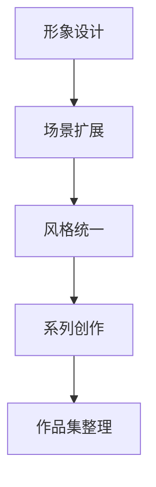

# 实战练习

## 个人IP形象设计

### 工作流程

1. 使用哩布哩布AI生成基础形象
2. Recraft扩展场景
3. 添加文字和标识
4. 生成系列作品

### 实践步骤



## 品牌视觉设计

### LOGO设计

1. 使用ailogomaker生成基础LOGO
2. Figma优化调整
3. 生成品牌规范

### 应用场景

- 社交媒体封面
- 产品包装
- 宣传材料
- 网站设计

## 3D角色建模

### 模型制作

1. 准备参考图片
2. 使用Tripo3D生成模型
3. 调整优化
4. 导出使用

### 应用示例

```typescript
interface ProjectWorkflow {
  stage: string;
  tools: string[];
  output: string;
  timeEstimate: string;
}

const workflow: ProjectWorkflow[] = [
  {
    stage: '概念设计',
    tools: ['哩布哩布AI', 'Recraft'],
    output: '角色概念图',
    timeEstimate: '2-3小时'
  },
  {
    stage: '3D建模',
    tools: ['Tripo3D'],
    output: '3D模型文件',
    timeEstimate: '4-6小时'
  },
  {
    stage: '后期优化',
    tools: ['Blender', 'Substance Painter'],
    output: '最终模型',
    timeEstimate: '3-4小时'
  }
];
```

## 作品集整理

### 项目展示

1. 选择代表作品
2. 整理制作过程
3. 编写项目说明
4. 展示最终成果

### 经验总结

- 工具使用心得
- 常见问题解决
- 效率提升技巧
- 创意发展方向

export const styles = {
  workflow: {
    backgroundColor: '#f6f8fa',
    padding: '1rem',
    borderRadius: '8px'
  }
}; 