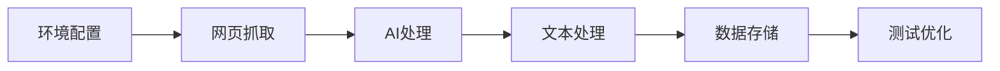

import Tabs from '@theme/Tabs';
import TabItem from '@theme/TabItem';
import ReactPlayer from 'react-player';

# Coze工作流开发

## 🚀 平台介绍

Coze是一个强大的AI工作流开发平台，通过本教程，你将学会如何构建一个完整的AI驱动工作流。

### 教程视频

<div className="video-grid">
  <div className="video-card">
    <h4>🎥 环境配置教程 1</h4>
    <div className="video-wrapper">
      <ReactPlayer
        url="https://www.youtube.com/embed/ANmv1dMY7fY"
        controls={true}
        width="100%"
        height="100%"
        style={{ aspectRatio: '16/9' }}
      />
    </div>
  </div>

  <div className="video-card">
    <h4>🎥 环境配置教程 2</h4>
    <div className="video-wrapper">
      <ReactPlayer
        url="https://www.youtube.com/embed/85Z324xsD-w"
        controls={true}
        width="100%"
        height="100%"
        style={{ aspectRatio: '16/9' }}
      />
    </div>
  </div>

  <div className="video-card">
    <h4>🎥 环境配置教程 3</h4>
    <div className="video-wrapper">
      <ReactPlayer
        url="https://www.youtube.com/embed/4VVJv9SfJqc"
        controls={true}
        width="100%"
        height="100%"
        style={{ aspectRatio: '16/9' }}
      />
    </div>
  </div>
</div>

## 🎯 学习目标

通过本教程，你将掌握：
- ✅ 创建完整的Coze工作流
- ✅ 实现网页内容的自动获取
- ✅ 使用AI生成高质量摘要
- ✅ 将数据保存到Notion

## 🛠️ 环境准备

### Notion配置

#### 1. 创建集成

<Tabs>
  <TabItem value="integration" label="创建集成" default>
    1. 访问 [Notion Developers](https://developers.notion.com/)
    2. 点击 "Create new integration"
    3. 填写集成信息：
       - Name: Article Summary
       - Associated workspace: 选择你的工作区
    4. 保存生成的Integration Token
  </TabItem>
  <TabItem value="auth" label="页面授权">
    1. 创建新的Notion页面
    2. 点击右上角Share按钮
    3. 选择并添加你的集成
  </TabItem>
</Tabs>

#### 2. 获取页面ID
```typescript
// Notion页面URL格式
https://notion.so/workspace/page-title-32-character-string

// 提取32位字符串作为page_id
const pageId = url.match(/[a-f\d]{32}/)[0];
```

### Coze配置

#### 1. 创建项目
- 访问Coze官网并登录
- 创建新的工作流项目
- 配置项目基本信息

#### 2. 必要节点
- 🌐 Browse节点 - 网页抓取
- 🤖 LLM节点 - 生成摘要
- 📝 Text Processing节点 - 文本处理
- 💾 Write Page节点 - Notion集成

## 🔧 工作流构建

### 1. Browse节点配置

#### 节点功能
- 访问指定URL
- 提取网页内容
- 处理不同类型网页

#### 参数设置
```typescript
// url参数配置
{
  "url": "{{input}}",
  "enforce_crawl": true
}
```

#### 输出结构
```json
{
  "code": 200,
  "message": "success",
  "plugin_observation": {
    "observation": "网页实际内容",
    "natural_language_desc": "内容描述信息"
  }
}
```

### 2. LLM节点配置

#### 系统提示词
```text
You are a professional article summarizer. Your task is to read the provided article and create a CONCISE summary that:
- Captures only the most essential points (max 2-3 key points)
- Uses very concise language
- Keeps the total output under 1500 characters
- Maintains clarity while being brief
- Includes a short title

Format your response as:
Title: [Short Article Title]
Summary: [Your concise summary in 1-2 paragraphs]
Key Points:
- [Point 1]
- [Point 2]
- [Point 3]
```

#### 用户提示词
```text
Please provide a summary of the following article:
{{browse.plugin_observation.observation}}
```

### 3. Text Processing节点配置

#### 输入参数
```typescript
{
  "String1": "{{llm.output.output}}"
}
```

#### 文本模板
```text
=========================================
                文章摘要
=========================================

{{String1}}
=========================================
```

### 4. Write Page节点配置

#### Notion参数
```typescript
{
  "page_id": "你的Notion页面ID",
  "text": "{{Text Processing.output}}"
}
```

## 🎨 优化策略

### 提示词优化

<Tabs>
  <TabItem value="prompts" label="提示词技巧" default>
    - 使用清晰的角色定义
    - 设置具体的输出要求
    - 保持提示词的一致性
    - 定期更新优化提示词
  </TabItem>
  <TabItem value="quality" label="质量保证">
    - 建立质量评估标准
    - 进行A/B测试比较
    - 收集用户反馈
    - 持续优化改进
  </TabItem>
</Tabs>

### 性能监控

#### 响应时间监控
```typescript
const metrics = {
  browse_time: '抓取耗时',
  llm_time: 'AI处理耗时',
  storage_time: '存储耗时',
  total_time: '总体耗时'
};
```

#### 优化目标
- 网页抓取 < 3秒
- AI处理 < 5秒
- 数据存储 < 2秒

## 🚫 常见问题

### 网络问题
- **URL无法访问**: 检查URL格式和网络连接
- **内容获取不完整**: 调整enforce_crawl设置
- **权限验证失败**: 检查Token有效性

### 处理问题
- **格式解析错误**: 优化提示词设置
- **字符编码问题**: 调整文本处理参数
- **内容截断异常**: 增加文本长度限制

## 🎯 测试与优化

### 功能测试

#### 输入验证
- 测试不同URL格式
- 验证特殊字符处理
- 检查错误处理机制
- 测试边界条件

#### 流程验证
- 节点连接正确性
- 数据传递完整性
- 异常处理有效性
- 输出格式规范性

### 性能测试

#### 并发测试
- 多URL同时处理
- 批量任务执行
- 高频请求处理

#### 资源监控
- 内存占用情况
- CPU使用率
- API调用频率

## 🌟 最佳实践

### 日常维护
1. 定期检查功能完整性
2. 监控错误日志
3. 更新优化提示词
4. 调整处理策略

### 持续优化
1. 收集用户反馈
2. 分析使用数据
3. 优化处理流程
4. 扩展功能特性

## 🔄 开发流程



:::info 工作流特点
- 自动化的文章摘要生成
- 结构化的数据存储方案
- 可扩展的系统架构
- 高效的处理流程
:::

通过这个Coze工作流项目，你将掌握如何构建一个完整的AI驱动工作流，从网页抓取到智能摘要生成，再到数据存储的全流程开发。

export const styles = `
.video-grid {
  display: grid;
  grid-template-columns: repeat(auto-fit, minmax(300px, 1fr));
  gap: 2rem;
  margin: 2rem 0;
}

.video-card {
  background: #ffffff;
  border-radius: 12px;
  padding: 1.5rem;
  box-shadow: 0 4px 6px rgba(0, 0, 0, 0.1);
  transition: transform 0.2s ease;
}

.video-card:hover {
  transform: translateY(-5px);
}

.video-card h4 {
  margin: 0 0 1rem 0;
  color: #2e8555;
  font-size: 1.1rem;
}

.video-wrapper {
  position: relative;
  border-radius: 8px;
  overflow: hidden;
  box-shadow: 0 2px 4px rgba(0, 0, 0, 0.1);
}

@media (max-width: 768px) {
  .video-grid {
    grid-template-columns: 1fr;
  }
}
`; 