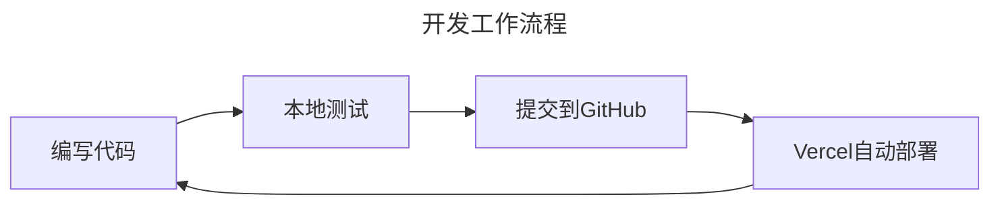

import Tabs from '@theme/Tabs';
import TabItem from '@theme/TabItem';
import ThemedImage from '@theme/ThemedImage';
import ReactPlayer from 'react-player';

:::tip 🎯 教程目标
通过这份教程，你将学会：
- 使用Cursor IDE搭建Docusaurus项目
- 利用AI助手进行开发
- 将项目部署到Vercel平台
:::

## 📺 教学视频系列

<div className="video-description">
  <h3>🎥 观看完整教程视频</h3>
  <p>这个系列视频将分步骤指导你完成从项目创建到部署的整个过程。建议按顺序观看。</p>
</div>

<div className="video-grid">
  <div className="video-card">
    <h4>第一部分：项目初始化</h4>
    <div className="video-wrapper">
      <ReactPlayer
        url="https://www.youtube.com/watch?v=1Lz0AcHg-YA"
        controls={true}
        width="100%"
        height="100%"
        style={{ aspectRatio: '16/9' }}
      />
    </div>
    <p className="video-caption">创建项目并进行基础配置</p>
  </div>

  <div className="video-card">
    <h4>第二部分：内容编写</h4>
    <div className="video-wrapper">
      <ReactPlayer
        url="https://www.youtube.com/watch?v=2qignfsG6hQ"
        controls={true}
        width="100%"
        height="100%"
        style={{ aspectRatio: '16/9' }}
      />
    </div>
    <p className="video-caption">学习如何编写和组织文档内容</p>
  </div>

  <div className="video-card">
    <h4>第三部分：主题定制</h4>
    <div className="video-wrapper">
      <ReactPlayer
        url="https://www.youtube.com/watch?v=Ul961yMmsU0"
        controls={true}
        width="100%"
        height="100%"
        style={{ aspectRatio: '16/9' }}
      />
    </div>
    <p className="video-caption">自定义网站主题和样式</p>
  </div>

  <div className="video-card">
    <h4>第四部分（上）：部署准备</h4>
    <div className="video-wrapper">
      <ReactPlayer
        url="https://www.youtube.com/watch?v=NlEeWesK3Jw"
        controls={true}
        width="100%"
        height="100%"
        style={{ aspectRatio: '16/9' }}
      />
    </div>
    <p className="video-caption">部署前的准备工作和配置</p>
  </div>

  <div className="video-card">
    <h4>第四部分（下）：Vercel部署</h4>
    <div className="video-wrapper">
      <ReactPlayer
        url="https://www.youtube.com/watch?v=eRA6Z67rAeQ"
        controls={true}
        width="100%"
        height="100%"
        style={{ aspectRatio: '16/9' }}
      />
    </div>
    <p className="video-caption">在 Vercel 平台上完成部署</p>
  </div>
</div>

## 🎬 准备工作

在开始之前，请确保你已经安装好以下工具：

<div className="tool-grid">

- [x] [Cursor IDE](https://cursor.sh)
- [x] [GitHub Desktop](https://desktop.github.com)
- [x] [Node.js](https://nodejs.org) (版本 >= 14)
- [x] 一个 [GitHub](https://github.com) 账号
- [x] 一个 [Vercel](https://vercel.com) 账号

</div>

## 🌟 第一步：创建Docusaurus项目

<Tabs>
  <TabItem value="step1" label="打开Cursor" default>
    ```bash
    # 1. 打开你想要创建项目的母级目录
    # 2. 使用快捷键打开终端
    Ctrl + Shift + ~
    ```
  </TabItem>
  <TabItem value="step2" label="创建项目">
    ```bash
    # 执行创建命令
    npx create-docusaurus@latest my-website classic
    ```
  </TabItem>
  <TabItem value="step3" label="打开项目">
    ```bash
    # 进入项目目录
    cd my-website
    
    # 启动开发服务器
    npm start
    ```
  </TabItem>
</Tabs>

:::info 💡 小贴士
创建过程中，如果遇到选项询问，可以直接按回车选择默认值。
:::

## 🔗 第二步：GitHub仓库配置

1. 打开 GitHub Desktop
2. 点击 `File -> Add local repository`
3. 点击 "Create Repository"
4. 填写仓库信息：
   ```yaml
   Name: my-website
   Description: My Docusaurus Documentation Site
   Local Path: [选择你的项目目录]
   ```
5. 完成首次提交：
   ```markdown
   Commit Title: Initial commit
   Description: Initialize Docusaurus project
   ```

## 🚀 第三步：部署到Vercel

1. 登录 [Vercel](https://vercel.com)
2. 点击 "New Project"
3. 导入你刚创建的GitHub仓库
4. 保持默认配置，点击 "Deploy"

:::success 🎉 部署成功
现在你的网站已经上线了！Vercel会自动为你生成一个域名，格式如：
`https://my-website-xxx.vercel.app`
:::

## 🤖 第四步：使用Cursor的AI助手

<div className="command-box">

### 打开AI助手
按 `Ctrl + I` 呼出Composer面板

### 常用提示语
```markdown
- "帮我优化这段代码"
- "如何实现XXX功能"
- "解释这段代码的作用"
```

</div>

## 📝 开发工作流



## 🎯 最佳实践

1. **频繁提交代码**
   ```bash
   # 每完成一个功能就提交
   git add .
   git commit -m "feature: add new functionality"
   git push
   ```

2. **实时检查部署状态**
   - 在Vercel面板中监控部署进度
   - 检查部署日志排查问题

3. **善用AI助手**
   ```javascript
   // 示例：让AI助手帮你优化代码
   // 原代码
   function hello() {
     console.log("Hello");
   }
   
   // AI优化后
   const hello = () => {
     console.log("Hello, World! 👋");
   };
   ```

## 🛠️ 常见问题解决

<details>
<summary>❓ 部署失败怎么办？</summary>

1. 检查 `package.json` 中的脚本配置
2. 查看Vercel的构建日志
3. 确保所有依赖都已正确安装

</details>

<details>
<summary>❓ 如何自定义域名？</summary>

1. 在Vercel项目设置中添加域名
2. 配置DNS记录
3. 等待DNS生效

</details>

:::warning ⚠️ 注意事项
- 确保 Node.js 版本兼容
- 定期更新依赖包
- 保持代码规范统一
:::

## 🎉 结语

恭喜你！现在你已经掌握了使用Cursor开发Docusaurus网站并部署到Vercel的完整流程。希望这个教程对你有帮助！

<div className="ending-message">

### 🌈 接下来可以...

- 自定义网站主题
- 添加更多内容
- 优化SEO设置
- 分享你的作品！

</div>

export const styles = `
.tool-grid {
  display: grid;
  grid-template-columns: repeat(auto-fit, minmax(200px, 1fr));
  gap: 1rem;
  margin: 2rem 0;
}

.command-box {
  background: #f6f8fa;
  border-radius: 8px;
  padding: 1.5rem;
  margin: 2rem 0;
}

.ending-message {
  background: linear-gradient(to right, #00b4db, #0083b0);
  color: white;
  padding: 2rem;
  border-radius: 8px;
  margin-top: 3rem;
}

.video-grid {
  display: grid;
  grid-template-columns: repeat(auto-fit, minmax(300px, 1fr));
  gap: 2rem;
  margin: 2rem 0;
}

.video-card {
  background: #ffffff;
  border-radius: 12px;
  padding: 1.5rem;
  box-shadow: 0 4px 6px rgba(0, 0, 0, 0.1);
  transition: transform 0.2s ease;
}

.video-card:hover {
  transform: translateY(-5px);
}

.video-card h4 {
  margin: 0 0 1rem 0;
  color: #2e8555;
  font-size: 1.2rem;
}

.video-wrapper {
  position: relative;
  border-radius: 8px;
  overflow: hidden;
  margin-bottom: 1rem;
  box-shadow: 0 2px 4px rgba(0, 0, 0, 0.1);
}

.video-caption {
  margin: 0.5rem 0 0 0;
  color: #666;
  font-size: 0.9rem;
  text-align: center;
}

.video-description {
  background: #f8f9fa;
  border-radius: 8px;
  padding: 1.5rem;
  margin-bottom: 2rem;
  border-left: 4px solid #2e8555;
}

.video-description h3 {
  margin: 0 0 0.5rem 0;
  color: #2e8555;
}

.video-description p {
  margin: 0;
  color: #666;
}

@media (max-width: 768px) {
  .video-grid {
    grid-template-columns: 1fr;
  }
}
`; 