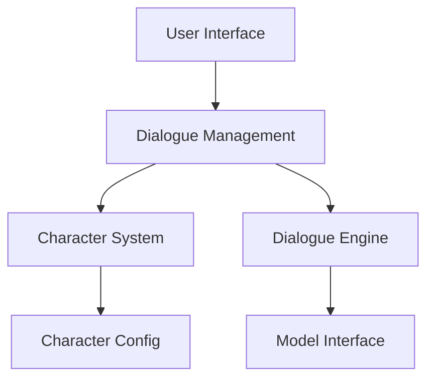

import Tabs from '@theme/Tabs';
import TabItem from '@theme/TabItem';
import ReactPlayer from 'react-player';

# AI Conversational System Development

In this chapter, you will learn how to develop a Chinese celebrity AI conversational system.

## 🎥 Tutorial Video

<div className="video-container">
  <div className="video-wrapper">
    <ReactPlayer
      url="https://www.youtube.com/embed/sJdptJj9pAw"
      controls={true}
      width="100%"
      height="100%"
      style={{ aspectRatio: '16/9' }}
    />
  </div>
</div>

## 📋 Learning Content

### 1. Environment Preparation

#### Hugging Face Configuration
1. Visit [Hugging Face](https://huggingface.co/join) to register an account
2. Generate access token:
   - Visit [Token Settings Page](https://huggingface.co/settings/tokens)
   - Click "New token"
   - Select "Write" permission
   - Generate token and save it

:::caution Important Note
The token is very important, please save it carefully. You will not be able to view the complete token again after closing the page.
:::

#### Development Environment Configuration
<Tabs>
  <TabItem value="required" label="Required Software" default>
    1. Python 3.8+
    2. Git
    3. Cursor editor
  </TabItem>
  <TabItem value="dependencies" label="Dependency Installation">
    ```bash
    # Create virtual environment
    python -m venv venv

    # Activate virtual environment
    # Windows:
    venv\Scripts\activate
    # Linux/Mac:
    source venv/bin/activate

    # Install dependencies
    pip install gradio huggingface_hub
    ```
  </TabItem>
</Tabs>

### 2. Project Creation

#### Hugging Face Space Setup
1. Log in to Hugging Face
2. Click "New Space"
3. Fill in basic information:
   - Owner: Your username
   - Space name: role-play-chat
   - SDK: Gradio
   - Hardware: CPU basic
   - Visibility: Public

#### Local Project Configuration
```bash
# Clone Space repository
git clone https://huggingface.co/spaces/your-username/role-play-chat
cd role-play-chat

# Create project structure
mkdir -p {assets,utils,tests}
touch main.py character_profiles.py dialogue_system.py
```

### 3. System Architecture Design



### 4. Core Functionality Implementation

#### Dialogue System
```python
class DialogueSystem:
    def __init__(self):
        self.history = []
        self.current_character = None

    async def process_message(self, message: str) -> str:
        """Process user message and generate response"""
        if not self.current_character:
            return "Please select a conversation character first"

        # Add to history
        self.history.append({"role": "user", "content": message})

        # Generate response
        response = await self._generate_response(message)
        self.history.append({"role": "assistant", "content": response})

        return response

    def manage_context(self, max_length: int = 2048):
        """Manage dialogue context length"""
        context_length = sum(len(msg["content"]) for msg in self.history)

        while context_length > max_length and len(self.history) > 1:
            removed = self.history.pop(0)
            context_length -= len(removed["content"])
```

#### Character System
```python
class Character:
    def __init__(self, name: str, profile: dict):
        self.name = name
        self.background = profile.get("background", "")
        self.personality = profile.get("personality", [])
        self.speaking_style = profile.get("speaking_style", {})

    def get_prompt(self) -> str:
        """Generate character prompt"""
        return f"""
        You are now playing {self.name}.
        Background: {self.background}
        Personality: {', '.join(self.personality)}
        Speaking style: {self.speaking_style}
        """
```

### 5. Testing and Deployment

#### Testing Specifications
```python
# tests/test_dialogue.py
import pytest
from dialogue_system import DialogueSystem

def test_dialogue_initialization():
    system = DialogueSystem()
    assert system.history == []
    assert system.current_character is None

@pytest.mark.asyncio
async def test_message_processing():
    system = DialogueSystem()
    system.current_character = Character("Test Character", {})

    response = await system.process_message("Hello")
    assert isinstance(response, str)
    assert len(system.history) == 2
```

#### Deployment Process
1. Submit code to GitHub
2. Check deployment status
3. Monitor system performance

### 6. Best Practices

#### Code Standards
```python
# Good naming and commenting example
class DialogueManager:
    """Dialogue manager responsible for processing user input and generating responses

    Attributes:
        history (List[Dict]): Dialogue history
        character (Character): Currently selected character
        max_history_length (int): Maximum history length
    """

    def __init__(self, max_history_length: int = 100):
        self.history = []
        self.character = None
        self.max_history_length = max_history_length
```

#### Performance Optimization
```python
from functools import lru_cache

@lru_cache(maxsize=1000)
def get_character_profile(character_id: str) -> dict:
    """Get character profile information (with caching)"""
    return load_character_profile(character_id)

# Asynchronous processing
async def process_messages(messages: list) -> list:
    """Process multiple messages in parallel"""
    tasks = [process_single(msg) for msg in messages]
    return await asyncio.gather(*tasks)
```

#### Security Practices
```python
from pydantic import BaseModel, validator

class UserInput(BaseModel):
    message: str
    character_id: str = None

    @validator('message')
    def validate_message(cls, v):
        if len(v) > 1000:
            raise ValueError('Message length cannot exceed 1000 characters')
        if not v.strip():
            raise ValueError('Message cannot be empty')
        return v.strip()
```

:::info Project Features
- Support for multi-character dialogue
- Intelligent context management
- Real-time response processing
- Complete error handling mechanism
:::

This AI conversational system project demonstrates how to build a complete AI application, covering the entire process from environment configuration to deployment and maintenance.
