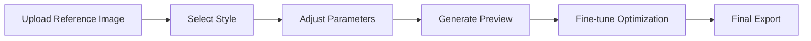
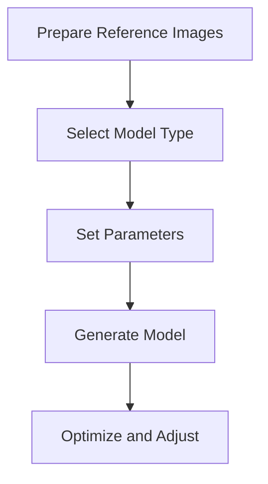
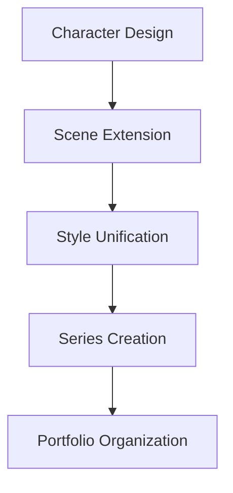
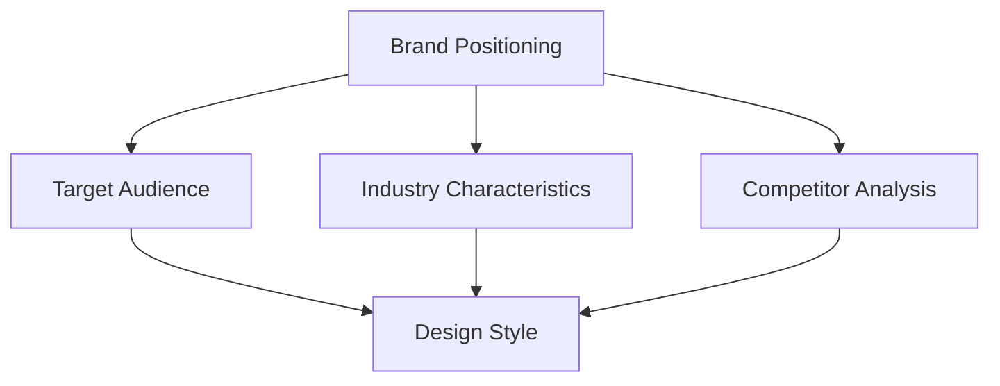

import Tabs from '@theme/Tabs';
import TabItem from '@theme/TabItem';
import ReactPlayer from 'react-player';

# AI Drawing Application Development

In this chapter, you will learn how to use various AI tools for image design and 3D model creation.

## 🎨 LOGO Design Basics

### Tutorial Videos

<div className="video-grid">
  <div className="video-card">
    <h4>🎥 LOGO Design Tutorial 1</h4>
    <div className="video-wrapper">
      <ReactPlayer
        url="https://www.youtube.com/embed/JKTXXC1qt5o"
        controls={true}
        width="100%"
        height="100%"
        style={{ aspectRatio: '16/9' }}
      />
    </div>
  </div>

  <div className="video-card">
    <h4>🎥 LOGO Design Tutorial 2</h4>
    <div className="video-wrapper">
      <ReactPlayer
        url="https://www.youtube.com/embed/n8JVcE5YEi4"
        controls={true}
        width="100%"
        height="100%"
        style={{ aspectRatio: '16/9' }}
      />
    </div>
  </div>
</div>

### AI LOGO Design Platform

#### ailogomaker.io Usage Guide
1. Visit [ailogomaker.io](https://ailogomaker.io/zh-CN)
2. Enter brand name and keywords
3. Select preferred style
4. Generate LOGO design

:::tip Design Suggestions
- Use simple and clear keywords
- Try different style combinations
- Pay attention to color matching
- Consider brand tone
:::

#### Figma Optimization Process
1. Export SVG file
2. Open in Figma
3. Adjust details:
   - Modify colors
   - Adjust proportions
   - Optimize fonts
   - Fine-tune shapes

## 🖼️ Image Generation Techniques

### Using Recraft Platform

#### Basic Features
1. Visit [Recraft](https://www.recraft.ai/projects)
2. Create new project
3. Select generation type:
   - Text-to-image
   - Image-to-image
   - Batch generation
   - LOGO overlay

#### Image Extension Techniques
```typescript
interface ImagePrompt {
  baseImage: string;
  style: string;
  ratio: '1:1' | '16:9' | '4:3';
  variations: number;
}

// Example prompt
const promptExample = {
  baseImage: 'Personal IP character',
  style: 'Cyberpunk',
  ratio: '1:1',
  variations: 4
};
```

### Hugging Face Spaces

#### Using Flux Model
1. Visit [Hugging Face Spaces](https://huggingface.co/spaces)
2. Search for "flux" keyword
3. Use Kolors-Character-With-Flux:
   - Upload reference image
   - Adjust parameters
   - Generate new image

#### Lora Model Exploration
- Search for "lora" keyword
- Try different models
- Compare effect differences
- Record best practices

### LiblibAI Platform

#### 3D Trendy Character Generation
1. Visit [LiblibAI](https://www.liblib.art/)
2. Select 3D character generation model
3. Set parameters:
   - Style selection
   - Pose adjustment
   - Outfit matching
   - Scene settings

#### Workflow


## 📐 3D Model Creation

### Tripo3D Platform

#### Basic Usage
1. Visit [Tripo3D](https://www.tripo3d.ai/app/home)
2. Create account
3. Start new project

#### Features
- Image to 3D model conversion
- Automatic material generation
- Pose adjustment
- Real-time preview

### Workflow

#### Preparation


#### Model Generation
1. Upload reference images
2. Select model type
3. Adjust parameters:
   - Detail level
   - Material quality
   - Pose settings
   - Scale adjustment

### Optimization Techniques

#### Model Optimization
```typescript
interface ModelSettings {
  detail: number;  // 1-10
  texture: {
    quality: 'low' | 'medium' | 'high';
    resolution: number;
  };
  pose: {
    rotation: number[];
    position: number[];
  };
}

// Recommended settings
const recommendedSettings: ModelSettings = {
  detail: 8,
  texture: {
    quality: 'high',
    resolution: 2048
  },
  pose: {
    rotation: [0, 0, 0],
    position: [0, 0, 0]
  }
};
```

#### Common Issues and Solutions
- **Model Deformation**: Check reference image quality, adjust generation parameters
- **Material Issues**: Optimize texture resolution, adjust material parameters
- **Missing Details**: Increase detail level settings, use multi-angle references

## 🎯 Practical Tips

### Prompt Optimization

#### Basic Structure
```
Subject + Style + Scene + Lighting + Composition
```

#### Example
```
Young woman in cyberpunk style, neon street background, side lighting, low angle shot
```

### Parameter Tuning

<Tabs>
  <TabItem value="sampling" label="Sampling Settings" default>
    - Sampling method selection
    - Step count (20-50)
    - CFG Scale (7-15)
    - Fixed seed value
  </TabItem>
  <TabItem value="prompts" label="Prompt Weights">
    - Use parentheses to enhance: (keyword:1.2)
    - Use brackets to weaken: [keyword:0.8]
    - Negative prompt settings
    - Keyword order adjustment
  </TabItem>
</Tabs>

### Post-Processing

1. **Image Optimization**
   - Color adjustment
   - Contrast enhancement
   - Sharpening

2. **Detail Fixes**
   - Flaw correction
   - Edge optimization
   - Background processing

3. **Style Unification**
   - Consistent tones
   - Style matching
   - Series processing

## 💼 Practical Projects

### Personal IP Character Design

#### Workflow
1. Use LiblibAI to generate base character
2. Extend scenes with Recraft
3. Add text and branding
4. Generate series works

#### Practice Steps


### Brand Visual Design

#### LOGO Design
1. Generate basic LOGO with ailogomaker
2. Optimize and adjust in Figma
3. Create brand guidelines

#### Application Scenarios
- Social media covers
- Product packaging
- Promotional materials
- Website design

### 3D Character Modeling

#### Model Creation
1. Prepare reference images
2. Generate model using Tripo3D
3. Adjust and optimize
4. Export and use

#### Application Examples
```typescript
interface ProjectWorkflow {
  stage: string;
  tools: string[];
  output: string;
  timeEstimate: string;
}

const workflow: ProjectWorkflow[] = [
  {
    stage: 'Concept Design',
    tools: ['LiblibAI', 'Recraft'],
    output: 'Character concept art',
    timeEstimate: '2-3 hours'
  },
  {
    stage: '3D Modeling',
    tools: ['Tripo3D'],
    output: '3D model files',
    timeEstimate: '4-6 hours'
  },
  {
    stage: 'Post-production Optimization',
    tools: ['Blender', 'Substance Painter'],
    output: 'Final model',
    timeEstimate: '3-4 hours'
  }
];
```

## 📚 Design Principles

### Brand Positioning


### Design Philosophy
- **Simplicity**: Easy to recognize and remember
- **Uniqueness**: Distinct from competitors
- **Adaptability**: Usable in various scenarios
- **Timelessness**: Avoid outdated elements

:::info Learning Suggestions
AI drawing requires extensive practice and experimentation. It's recommended to start with simple LOGO design and gradually progress to complex 3D modeling.
:::

This AI drawing application demonstrates how to use various AI tools for creative design, covering everything from basic image generation to complex 3D modeling. 