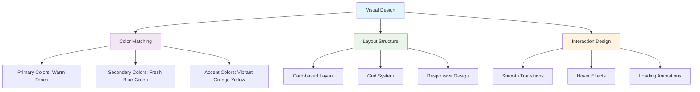
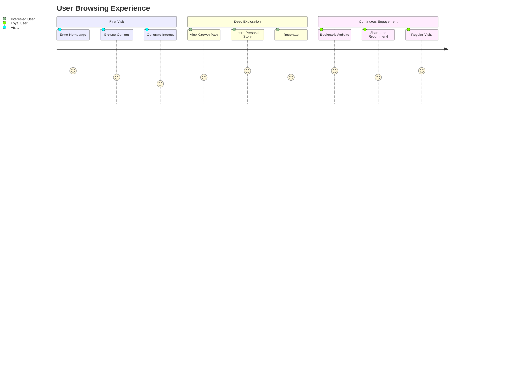
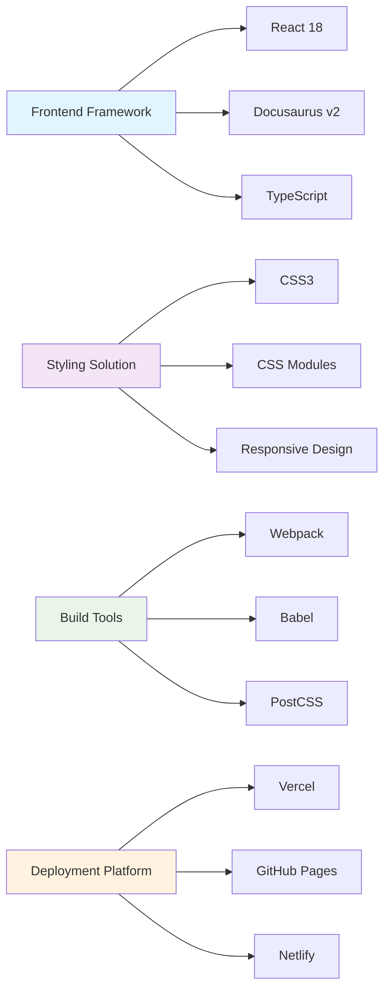
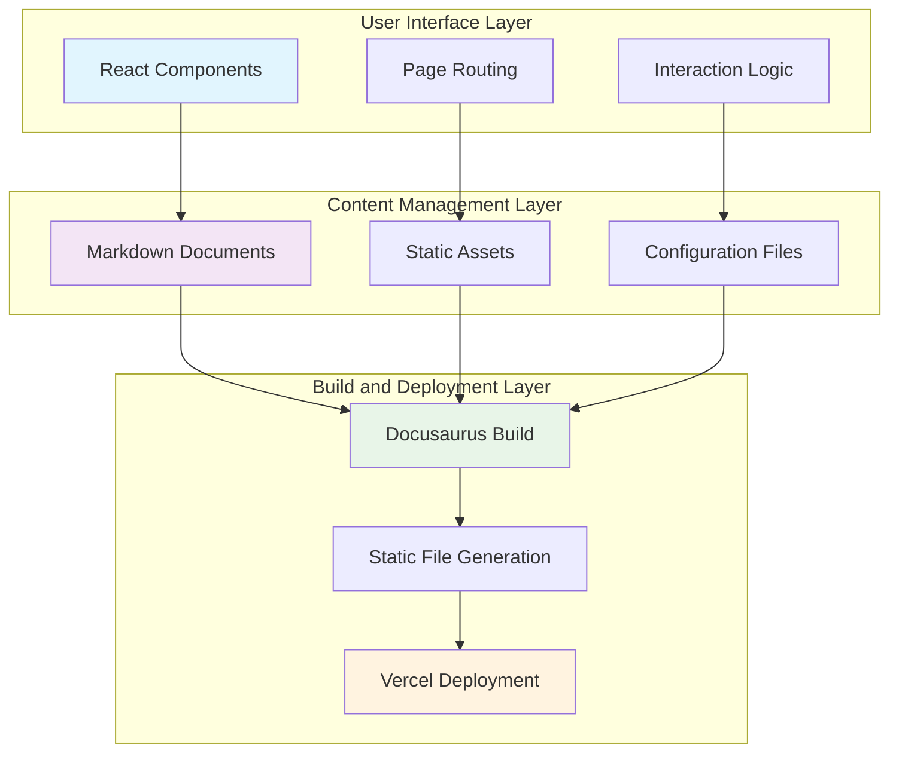
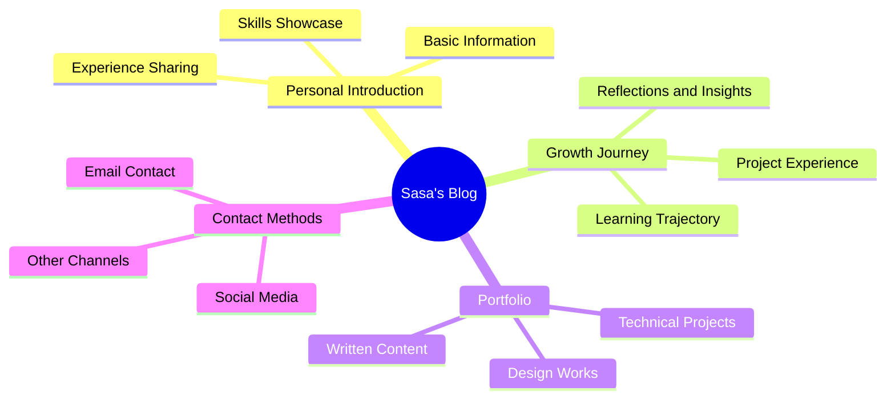
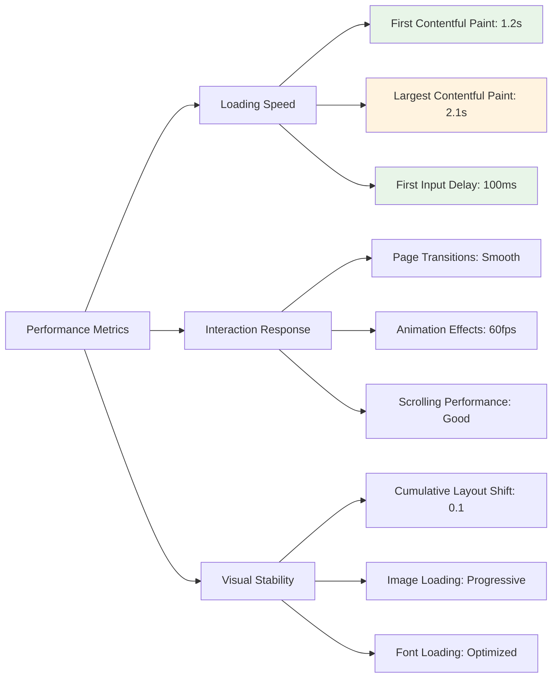

import useBaseUrl from '@docusaurus/useBaseUrl';

# Sasa's Personal Blog

## 👩‍💻 Author Introduction

**Author**: Sasa

**Website**: [Pika's Home](https://pika-s-home.vercel.app/)

**Project Type**: Personal Blog Website

**Tech Stack**: Docusaurus v2, React, CSS3

## 🎨 Project Showcase

### Homepage Display

<div className="screenshot-container">
  
  <div className="screenshot-caption">
    <strong>Homepage Design</strong>: Features a fresh color scheme and clean layout design, highlighting personal brand characteristics
  </div>
</div>

### Growth Path Page

<div className="screenshot-container">
  
  <div className="screenshot-caption">
    <strong>Growth Path</strong>: Showcases personal growth journey and learning trajectory with well-organized content
  </div>
</div>

### Design Highlights Analysis

#### Visual Hierarchy



#### User Experience Flow



## ✨ Key Features

### 🎯 Core Characteristics

- **Fresh Design**: Adopts a minimalist and elegant visual style with focus on user experience
- **Responsive Layout**: Perfectly adapts to mobile, tablet, and desktop devices
- **Personalized Content**: Showcases personal growth journey and experience sharing
- **Smooth Animations**: Carefully designed interactive effects enhance user experience

### 🌟 Innovation Highlights

1. **Personalized Navigation Design**
   - Unique navigation bar style
   - Smooth page transition effects
   - Mobile-friendly interactive experience

2. **Content Presentation**
   - Card-based information display
   - Progressive content loading
   - Clear information hierarchy

3. **Visual Effects Optimization**
   - Carefully selected color schemes
   - Appropriate whitespace design
   - Unified design language

## 🛠️ Technical Implementation

### Core Tech Stack



### Performance Optimization Measures

#### Image Optimization

```javascript title="docusaurus.config.js"
const config = {
  plugins: [
    [
      '@docusaurus/plugin-ideal-image',
      {
        quality: 70,
        max: 1030,
        min: 640,
        steps: 2,
        disableInDev: false,
      },
    ],
  ],
  
  themeConfig: {
    image: '/screenshot/screencapture-pika-s-home-vercel-app-2024-11-24-23_08_34.png',
  },
};
```

#### Code Splitting

```javascript title="src/components/LazyImage.js"
import { lazy, Suspense } from 'react';
import useBaseUrl from '@docusaurus/useBaseUrl';

const LazyImage = lazy(() => import('./OptimizedImage'));

export default function ImageWithFallback({ src, alt, ...props }) {
  return (
    <Suspense fallback={<div className="image-loading">Loading...</div>}>
      <LazyImage
        src={useBaseUrl(src)}
        alt={alt}
        loading="lazy"
        {...props}
      />
    </Suspense>
  );
}
```

#### Caching Strategy

```javascript title="vercel.json"
{
  "headers": [
    {
      "source": "/screenshot/(.*)",
      "headers": [
        {
          "key": "Cache-Control",
          "value": "public, max-age=31536000, immutable"
        }
      ]
    }
  ]
}
```

### Architecture Design



## 🎯 Learning Value

### Design Thinking

This project demonstrates how to:

1. **Build Personal Brand Identity**
   - Consistent visual style
   - Personalized content presentation
   - Professional technical implementation

2. **Optimize User Experience**
   - Clear information architecture
   - Smooth interaction design
   - Responsive layout adaptation

3. **Technical Implementation Details**
   - Modern frontend tech stack
   - Performance optimization strategies
   - Deployment and maintenance solutions

### Key Learning Points

:::tip[Design Inspiration]

Sasa's work embodies the design philosophy of "simple yet sophisticated," worthy of beginners learning:

- **Layout Planning Skills**: Rational grid system and space allocation
- **Color Matching Methods**: Warm yet professional color schemes
- **Interaction Design Concepts**: User-friendly operation experience
- **Content Organization Strategy**: Clear information hierarchy and navigation structure

:::

### Practice Recommendations

1. **Start with Imitation**
   - Analyze design elements of excellent works
   - Understand the thought process behind the design
   - Gradually develop your own design style

2. **Focus on User Experience**
   - Always think from the user's perspective
   - Simplify operational processes
   - Provide clear visual feedback

3. **Continuous Improvement**
   - Collect user feedback
   - Regularly update content
   - Optimize performance

## 🚀 Project Characteristics

### Content Architecture



### Design System

#### Color Specifications

```css title="src/css/design-tokens.css"
:root {
  /* Primary Colors */
  --primary-color: #ff6b6b;
  --primary-light: #ff8e8e;
  --primary-dark: #ff4757;

  /* Secondary Colors */
  --secondary-color: #4ecdc4;
  --secondary-light: #6bccc4;
  --secondary-dark: #26a69a;

  /* Neutral Colors */
  --gray-100: #f8f9fa;
  --gray-200: #e9ecef;
  --gray-300: #dee2e6;
  --gray-400: #ced4da;
  --gray-500: #adb5bd;

  /* Semantic Colors */
  --success-color: #2ed573;
  --warning-color: #ffa726;
  --error-color: #ff6b6b;
  --info-color: #54a0ff;
}
```

#### Typography System

```css title="src/css/typography.css"
/* Font Families */
--font-primary: 'Inter', -apple-system, BlinkMacSystemFont, sans-serif;
--font-mono: 'Fira Code', 'SF Mono', Monaco, monospace;

/* Font Sizes */
--text-xs: 0.75rem;    /* 12px */
--text-sm: 0.875rem;   /* 14px */
--text-base: 1rem;     /* 16px */
--text-lg: 1.125rem;   /* 18px */
--text-xl: 1.25rem;    /* 20px */
--text-2xl: 1.5rem;    /* 24px */
--text-3xl: 1.875rem;  /* 30px */
--text-4xl: 2.25rem;   /* 36px */
```

### Responsive Design

```css title="src/css/responsive.css"
/* Breakpoint Definitions */
@media (min-width: 640px) {
  .container {
    max-width: 640px;
  }
}

@media (min-width: 768px) {
  .container {
    max-width: 768px;
  }
}

@media (min-width: 1024px) {
  .container {
    max-width: 1024px;
  }
}

@media (min-width: 1280px) {
  .container {
    max-width: 1280px;
  }
}
```

## 📊 Performance Metrics

### Performance Indicators



### Optimization Recommendations

1. **Image Compression**
   - Use modern image formats (WebP, AVIF)
   - Implement lazy loading strategy
   - Provide different resolution versions

2. **Code Optimization**
   - Remove unused CSS
   - JavaScript code splitting
   - Enable Gzip compression

3. **Caching Strategy**
   - Set appropriate cache headers
   - Leverage CDN acceleration
   - Implement server-side caching

This project is an excellent example for learning personal website development, demonstrating how to perfectly combine technical implementation with design aesthetics to provide users with an excellent browsing experience.

export const styles = `
.screenshot-container {
  margin: 2rem 0;
  border-radius: 12px;
  overflow: hidden;
  box-shadow: 0 8px 32px rgba(0, 0, 0, 0.1);
  transition: transform 0.3s ease;
  background: #f8f9fa;
  padding: 1rem;
}

.screenshot-container:hover {
  transform: translateY(-5px);
}

.screenshot {
  width: 100%;
  height: auto;
  display: block;
  border-radius: 8px;
}

.screenshot-caption {
  margin-top: 1rem;
  padding: 0.5rem 1rem;
  background: rgba(26, 115, 232, 0.1);
  border-radius: 6px;
  font-size: 0.875rem;
  color: #1a73e8;
  text-align: center;
}

.image-loading {
  display: flex;
  align-items: center;
  justify-content: center;
  height: 200px;
  background: #f8f9fa;
  border-radius: 8px;
  color: #6c757d;
  font-size: 0.875rem;
}

/* 响应式优化 */
@media (max-width: 768px) {
  .screenshot-container {
    margin: 1rem 0;
    padding: 0.5rem;
  }
  
  .screenshot-caption {
    font-size: 0.75rem;
    padding: 0.25rem 0.5rem;
  }
}
`; 