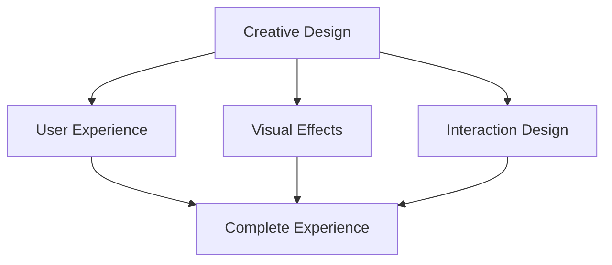

import ThemedImage from '@theme/ThemedImage';

# Stella's Personal Homepage

## 👩‍💻 Author Introduction

**Author**: Stella

**Project URL**: [My Playground](https://my-website-iota-coral.vercel.app/)

## 🎨 Project Showcase

<div className="screenshot-container">
  
</div>

## ✨ Featured Functionality

- **Creative Interaction**: Unique user interaction design
- **Background Music**: Integrated audio playback functionality
- **Visual Effects**: Beautiful animations and transition effects
- **Simple Navigation**: Intuitive user experience design

## 🛠️ Technical Implementation

### Core Technology Stack
- **Framework**: Docusaurus framework
- **Audio**: Custom audio player
- **Animation**: CSS animations + JavaScript interaction
- **Responsive**: Perfect mobile adaptation

### Innovative Features
- Background music playback control
- Personalized page loading animations
- Creative content presentation
- Optimized user experience flow

## 🎯 Learning Value

This project demonstrates how to:
- Integrate multimedia elements (audio, video)
- Create eye-catching interactive effects
- Implement personalized user experiences
- Balance functionality with aesthetics

:::tip Creative Inspiration
Stella's work shows how to make a personal website stand out through creative design, especially in combining sound effects and visual effects.
:::

## 🚀 Project Features

### Design Philosophy


### Technical Highlights
- **Audio Integration**: Seamless background music playback
- **Animation Effects**: Smooth page transitions
- **Responsive Design**: Perfect display across devices
- **Performance Optimization**: Fast loading and smooth interaction

## 🎵 Audio Function Implementation

### Music Player
```javascript
// Audio playback control example
const audioPlayer = {
  play: () => {
    const audio = document.getElementById('bgMusic');
    audio.play();
  },
  pause: () => {
    const audio = document.getElementById('bgMusic');
    audio.pause();
  },
  toggle: () => {
    const audio = document.getElementById('bgMusic');
    audio.paused ? audio.play() : audio.pause();
  }
};
```

### User Experience Optimization
- Auto-play control
- Volume adjustment functionality
- Playback status display
- User preference memory

This project is an excellent example of learning how to integrate multimedia elements into websites, showcasing the perfect fusion of technology and art.

export const styles = `
.screenshot-container {
  margin: 2rem 0;
  border-radius: 12px;
  overflow: hidden;
  box-shadow: 0 8px 32px rgba(0, 0, 0, 0.1);
  transition: transform 0.3s ease;
}

.screenshot-container:hover {
  transform: translateY(-5px);
}

.screenshot {
  width: 100%;
  height: auto;
  display: block;
}
`;
