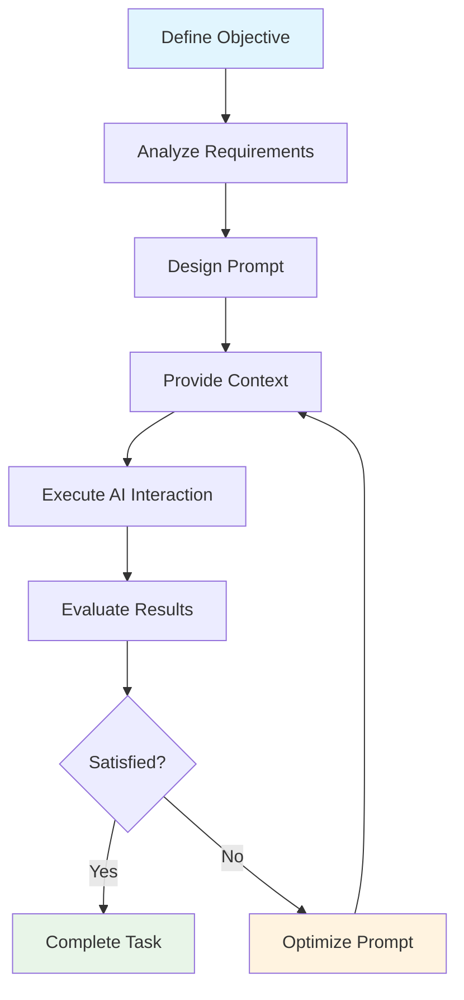
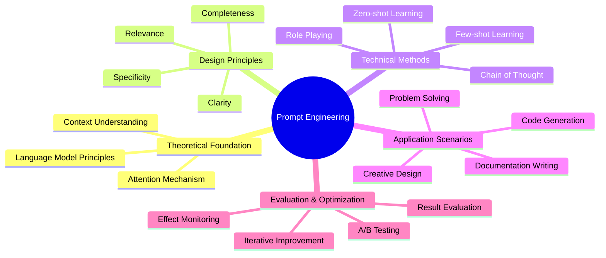
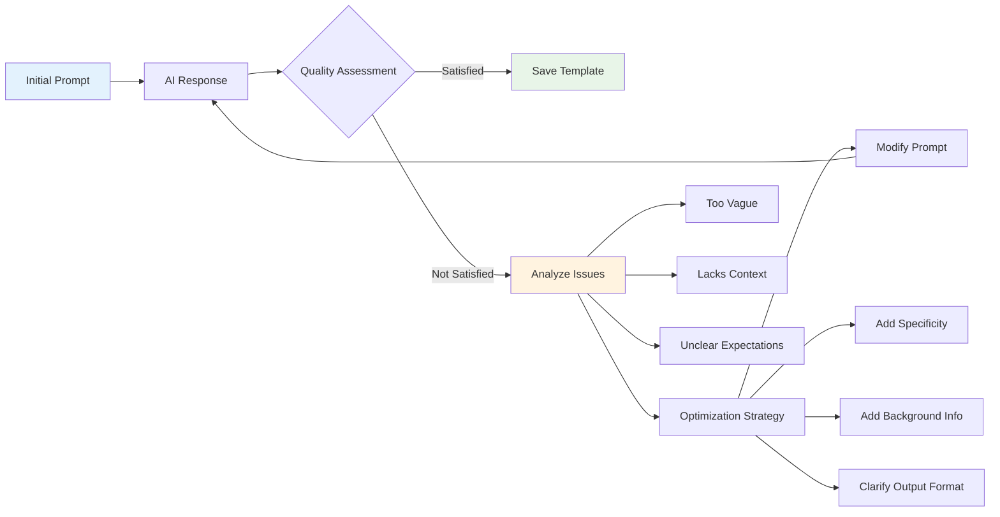
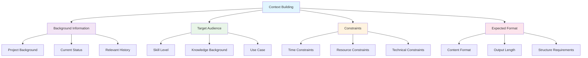
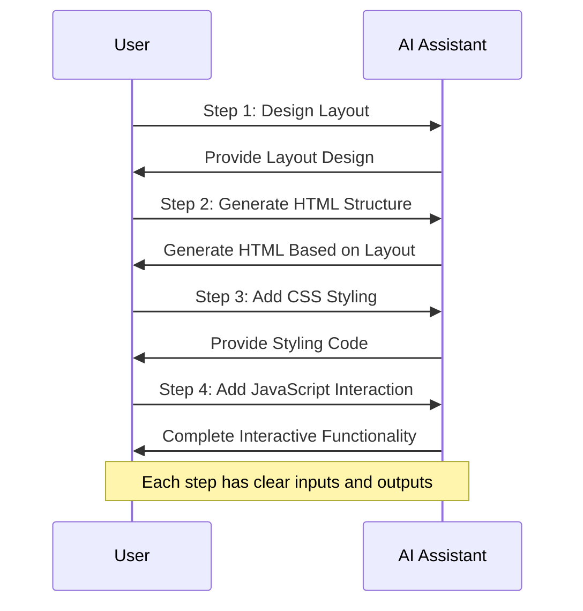
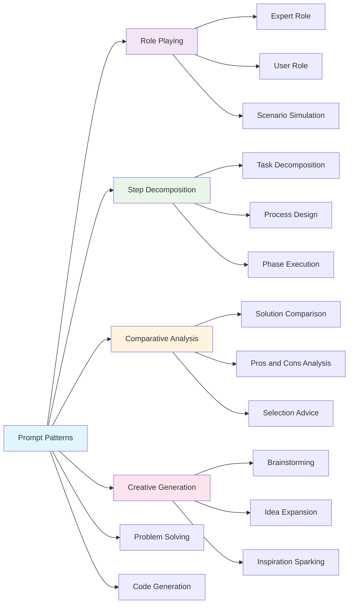
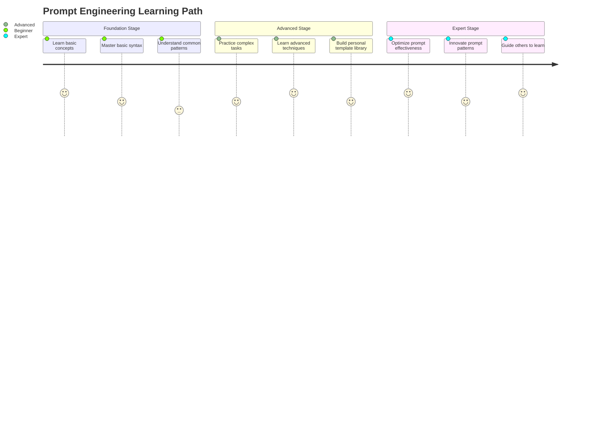

import Tabs from '@theme/Tabs';
import TabItem from '@theme/TabItem';
import { useState } from 'react';

export const PromptBuilder = () => {
  const [task, setTask] = useState('');
  const [context, setContext] = useState('');
  const [format, setFormat] = useState('');
  const [examples, setExamples] = useState('');
  const [generatedPrompt, setGeneratedPrompt] = useState('');

  const generatePrompt = () => {
    let prompt = '';

    if (context) {
      prompt += `Background: ${context}\n\n`;
    }

    if (task) {
      prompt += `Task: ${task}\n\n`;
    }

    if (format) {
      prompt += `Output Format: ${format}\n\n`;
    }

    if (examples) {
      prompt += `Examples: ${examples}\n\n`;
    }

    prompt += 'Please provide a detailed answer based on the above requirements.';

    setGeneratedPrompt(prompt);
  };

  const clearAll = () => {
    setTask('');
    setContext('');
    setFormat('');
    setExamples('');
    setGeneratedPrompt('');
  };

  return (
    <div style={{
      border: '1px solid #e1e4e8',
      borderRadius: '8px',
      padding: '20px',
      margin: '20px 0',
      backgroundColor: '#f8f9fa'
    }}>
      <h4 style={{ marginBottom: '16px', color: '#1a73e8' }}>🛠️ Interactive Prompt Generator</h4>

      <div style={{ marginBottom: '16px' }}>
        <label style={{ display: 'block', marginBottom: '8px', fontWeight: '600' }}>
          Background Information:
        </label>
        <textarea
          value={context}
          onChange={(e) => setContext(e.target.value)}
          placeholder="Describe project background, target audience, and other information..."
          style={{
            width: '100%',
            padding: '8px',
            borderRadius: '4px',
            border: '1px solid #d1d5db',
            minHeight: '60px',
            fontSize: '14px'
          }}
        />
      </div>

      <div style={{ marginBottom: '16px' }}>
        <label style={{ display: 'block', marginBottom: '8px', fontWeight: '600' }}>
          Specific Task:
        </label>
        <input
          type="text"
          value={task}
          onChange={(e) => setTask(e.target.value)}
          placeholder="Clearly describe the specific task you need AI to complete..."
          style={{
            width: '100%',
            padding: '8px',
            borderRadius: '4px',
            border: '1px solid #d1d5db',
            fontSize: '14px'
          }}
        />
      </div>

      <div style={{ marginBottom: '16px' }}>
        <label style={{ display: 'block', marginBottom: '8px', fontWeight: '600' }}>
          Output Format:
        </label>
        <input
          type="text"
          value={format}
          onChange={(e) => setFormat(e.target.value)}
          placeholder="Specify the expected output format, such as: JSON, HTML, step list, etc..."
          style={{
            width: '100%',
            padding: '8px',
            borderRadius: '4px',
            border: '1px solid #d1d5db',
            fontSize: '14px'
          }}
        />
      </div>

      <div style={{ marginBottom: '16px' }}>
        <label style={{ display: 'block', marginBottom: '8px', fontWeight: '600' }}>
          Example Description:
        </label>
        <textarea
          value={examples}
          onChange={(e) => setExamples(e.target.value)}
          placeholder="Provide relevant examples or references..."
          style={{
            width: '100%',
            padding: '8px',
            borderRadius: '4px',
            border: '1px solid #d1d5db',
            minHeight: '60px',
            fontSize: '14px'
          }}
        />
      </div>

      <div style={{ marginBottom: '16px' }}>
        <button
          onClick={generatePrompt}
          style={{
            backgroundColor: '#1a73e8',
            color: 'white',
            padding: '8px 16px',
            border: 'none',
            borderRadius: '4px',
            cursor: 'pointer',
            marginRight: '8px',
            fontSize: '14px'
          }}
        >
          Generate Prompt
        </button>
        <button
          onClick={clearAll}
          style={{
            backgroundColor: '#6c757d',
            color: 'white',
            padding: '8px 16px',
            border: 'none',
            borderRadius: '4px',
            cursor: 'pointer',
            fontSize: '14px'
          }}
        >
          Clear All
        </button>
      </div>

      {generatedPrompt && (
        <div style={{
          backgroundColor: '#fff',
          border: '1px solid #e1e4e8',
          borderRadius: '4px',
          padding: '16px',
          marginTop: '16px'
        }}>
          <h5 style={{ marginBottom: '8px', color: '#28a745' }}>✅ Generated Prompt:</h5>
          <pre style={{
            backgroundColor: '#f6f8fa',
            padding: '12px',
            borderRadius: '4px',
            fontSize: '14px',
            lineHeight: '1.5',
            whiteSpace: 'pre-wrap',
            wordBreak: 'break-word'
          }}>
            {generatedPrompt}
          </pre>
          <button
            onClick={() => navigator.clipboard.writeText(generatedPrompt)}
            style={{
              backgroundColor: '#28a745',
              color: 'white',
              padding: '6px 12px',
              border: 'none',
              borderRadius: '4px',
              cursor: 'pointer',
              fontSize: '12px',
              marginTop: '8px'
            }}
          >
            📋 Copy to Clipboard
          </button>
        </div>
      )}
    </div>
  );
};

export const PromptExamples = () => {
  const [selectedCategory, setSelectedCategory] = useState('code');
  const [selectedExample, setSelectedExample] = useState(0);

  const categories = {
    code: {
      name: 'Code Generation',
      examples: [
        {
          title: 'React Component Development',
          prompt: 'Please create a React function component named UserCard with the following features:\n1. Receive user information props (name, avatar, position)\n2. Display user avatar (circular)\n3. Display user name and position\n4. Add hover effect\n5. Use TypeScript type definitions\n\nPlease provide complete component code and styling.',
          category: 'Frontend Development'
        },
        {
          title: 'API Interface Design',
          prompt: 'Design a RESTful API for a user management system with the following features:\n1. User registration/login\n2. User information CRUD operations\n3. User permission management\n\nPlease provide:\n- Complete API endpoint list\n- Request/response format\n- Error handling mechanism\n- Authentication method description',
          category: 'Backend Development'
        },
        {
          title: 'Database Design',
          prompt: 'Design database table structure for a blog system that needs to support:\n1. User management (registration, login, permissions)\n2. Article management (publishing, editing, categories, tags)\n3. Comment system (comments, replies)\n4. Statistics (views, likes)\n\nPlease provide SQL table creation statements and table relationship diagrams.',
          category: 'Database'
        }
      ]
    },
    writing: {
      name: 'Documentation Writing',
      examples: [
        {
          title: 'Technical Documentation',
          prompt: 'Write a README document for a new open source project, which is a Vue.js component library, including:\n1. Project introduction and features\n2. Installation and quick start\n3. Component usage examples\n4. API documentation\n5. Contribution guidelines\n\nPlease use Markdown format, ensuring professionalism and readability.',
          category: 'Open Source Project'
        },
        {
          title: 'Blog Article',
          prompt: 'Write a technical blog article about "Frontend Performance Optimization" for intermediate-level frontend developers:\n1. Article length around 2000 words\n2. Include actual code examples\n3. Clear structure with subheadings\n4. Provide actionable optimization suggestions\n5. Add personal insights and experience sharing',
          category: 'Technical Writing'
        }
      ]
    },
    design: {
      name: 'Design Thinking',
      examples: [
        {
          title: 'UI Design Proposal',
          prompt: 'Design a homepage interface for an online learning platform, considering:\n1. User groups: students and working professionals\n2. Core features: course browsing, search, personal center\n3. Design style: modern, simple, professional\n4. Responsive design requirements\n\nPlease provide design ideas, layout scheme, and color scheme suggestions.',
          category: 'UI Design'
        },
        {
          title: 'User Experience Optimization',
          prompt: 'Analyze and optimize the shopping process for an e-commerce website, from product browsing to payment completion:\n1. Identify user pain points\n2. Propose improvement suggestions\n3. Design new interaction flow\n4. Consider mobile experience\n\nPlease provide a detailed UX improvement plan.',
          category: 'UX Design'
        }
      ]
    }
  };

  const currentExamples = categories[selectedCategory].examples;

  return (
    <div style={{
      border: '1px solid #e1e4e8',
      borderRadius: '8px',
      padding: '20px',
      margin: '20px 0',
      backgroundColor: '#f8f9fa'
    }}>
      <h4 style={{ marginBottom: '16px', color: '#1a73e8' }}>📚 Prompt Example Library</h4>

      <div style={{ marginBottom: '16px' }}>
        <div style={{ display: 'flex', gap: '8px', marginBottom: '12px' }}>
          {Object.entries(categories).map(([key, category]) => (
            <button
              key={key}
              onClick={() => {
                setSelectedCategory(key);
                setSelectedExample(0);
              }}
              style={{
                padding: '8px 12px',
                border: 'none',
                borderRadius: '4px',
                cursor: 'pointer',
                backgroundColor: selectedCategory === key ? '#1a73e8' : '#e9ecef',
                color: selectedCategory === key ? 'white' : '#495057',
                fontSize: '14px'
              }}
            >
              {category.name}
            </button>
          ))}
        </div>

        <div style={{ display: 'flex', gap: '8px', flexWrap: 'wrap' }}>
          {currentExamples.map((example, index) => (
            <button
              key={index}
              onClick={() => setSelectedExample(index)}
              style={{
                padding: '6px 10px',
                border: '1px solid #d1d5db',
                borderRadius: '4px',
                cursor: 'pointer',
                backgroundColor: selectedExample === index ? '#e3f2fd' : '#fff',
                color: selectedExample === index ? '#1a73e8' : '#495057',
                fontSize: '12px'
              }}
            >
              {example.title}
            </button>
          ))}
        </div>
      </div>

      <div style={{
        backgroundColor: '#fff',
        border: '1px solid #e1e4e8',
        borderRadius: '4px',
        padding: '16px'
      }}>
        <div style={{ marginBottom: '8px', fontSize: '14px', color: '#6c757d' }}>
          Category: {currentExamples[selectedExample].category}
        </div>
        <h5 style={{ marginBottom: '12px', color: '#1a73e8' }}>
          {currentExamples[selectedExample].title}
        </h5>
        <pre style={{
          backgroundColor: '#f6f8fa',
          padding: '12px',
          borderRadius: '4px',
          fontSize: '14px',
          lineHeight: '1.5',
          whiteSpace: 'pre-wrap',
          wordBreak: 'break-word'
        }}>
          {currentExamples[selectedExample].prompt}
        </pre>
        <button
          onClick={() => navigator.clipboard.writeText(currentExamples[selectedExample].prompt)}
          style={{
            backgroundColor: '#28a745',
            color: 'white',
            padding: '6px 12px',
            border: 'none',
            borderRadius: '4px',
            cursor: 'pointer',
            fontSize: '12px',
            marginTop: '8px'
          }}
        >
          📋 Copy Prompt
        </button>
      </div>
    </div>
  );
};

export const PromptTester = () => {
  const [userPrompt, setUserPrompt] = useState('');
  const [analysis, setAnalysis] = useState(null);

  const analyzePrompt = () => {
    const wordCount = userPrompt.trim().split(/\s+/).length;
    const hasContext = userPrompt.includes('background') || userPrompt.includes('I am') || userPrompt.includes('project') || userPrompt.includes('背景') || userPrompt.includes('我正在') || userPrompt.includes('项目');
    const hasSpecificTask = userPrompt.includes('please') || userPrompt.includes('help') || userPrompt.includes('generate') || userPrompt.includes('请') || userPrompt.includes('帮助') || userPrompt.includes('生成');
    const hasFormat = userPrompt.includes('format') || userPrompt.includes('output') || userPrompt.includes('structure') || userPrompt.includes('格式') || userPrompt.includes('输出') || userPrompt.includes('结构');
    const hasExamples = userPrompt.includes('example') || userPrompt.includes('such as') || userPrompt.includes('like') || userPrompt.includes('示例') || userPrompt.includes('例如') || userPrompt.includes('比如');

    const score = [hasContext, hasSpecificTask, hasFormat, hasExamples].filter(Boolean).length;

    const suggestions = [];
    if (!hasContext) suggestions.push('Add background information and context');
    if (!hasSpecificTask) suggestions.push('Clarify specific task description');
    if (!hasFormat) suggestions.push('Specify expected output format');
    if (!hasExamples) suggestions.push('Provide relevant examples or references');

    setAnalysis({
      wordCount,
      score,
      maxScore: 4,
      suggestions,
      quality: score >= 3 ? 'Excellent' : score >= 2 ? 'Good' : score >= 1 ? 'Fair' : 'Needs Improvement'
    });
  };

  return (
    <div style={{
      border: '1px solid #e1e4e8',
      borderRadius: '8px',
      padding: '20px',
      margin: '20px 0',
      backgroundColor: '#f8f9fa'
    }}>
      <h4 style={{ marginBottom: '16px', color: '#1a73e8' }}>🔍 Prompt Quality Analyzer</h4>

      <div style={{ marginBottom: '16px' }}>
        <label style={{ display: 'block', marginBottom: '8px', fontWeight: '600' }}>
          Enter your prompt:
        </label>
        <textarea
          value={userPrompt}
          onChange={(e) => setUserPrompt(e.target.value)}
          placeholder="Enter your prompt here, we will analyze its quality and provide improvement suggestions..."
          style={{
            width: '100%',
            padding: '12px',
            borderRadius: '4px',
            border: '1px solid #d1d5db',
            minHeight: '120px',
            fontSize: '14px',
            lineHeight: '1.5'
          }}
        />
      </div>

      <button
        onClick={analyzePrompt}
        disabled={!userPrompt.trim()}
        style={{
          backgroundColor: userPrompt.trim() ? '#1a73e8' : '#6c757d',
          color: 'white',
          padding: '8px 16px',
          border: 'none',
          borderRadius: '4px',
          cursor: userPrompt.trim() ? 'pointer' : 'not-allowed',
          fontSize: '14px',
          marginBottom: '16px'
        }}
      >
        Analyze Prompt Quality
      </button>

      {analysis && (
        <div style={{
          backgroundColor: '#fff',
          border: '1px solid #e1e4e8',
          borderRadius: '4px',
          padding: '16px'
        }}>
          <h5 style={{ marginBottom: '12px', color: '#1a73e8' }}>📊 Analysis Results</h5>

          <div style={{ marginBottom: '12px' }}>
            <div style={{ display: 'flex', alignItems: 'center', gap: '8px', marginBottom: '4px' }}>
              <span style={{ fontWeight: '600' }}>Quality Score:</span>
              <span style={{
                color: analysis.score >= 3 ? '#28a745' : analysis.score >= 2 ? '#ffc107' : '#dc3545',
                fontWeight: 'bold'
              }}>
                {analysis.score}/{analysis.maxScore} ({analysis.quality})
              </span>
            </div>
            <div style={{ fontSize: '14px', color: '#6c757d' }}>
              Word count: {analysis.wordCount} words
            </div>
          </div>

          <div style={{
            width: '100%',
            height: '8px',
            backgroundColor: '#e9ecef',
            borderRadius: '4px',
            marginBottom: '16px'
          }}>
            <div style={{
              width: `${(analysis.score / analysis.maxScore) * 100}%`,
              height: '100%',
              backgroundColor: analysis.score >= 3 ? '#28a745' : analysis.score >= 2 ? '#ffc107' : '#dc3545',
              borderRadius: '4px',
              transition: 'width 0.3s ease'
            }} />
          </div>

          {analysis.suggestions.length > 0 && (
            <div>
              <h6 style={{ marginBottom: '8px', color: '#dc3545' }}>💡 Improvement Suggestions:</h6>
              <ul style={{ marginLeft: '20px', fontSize: '14px', color: '#495057' }}>
                {analysis.suggestions.map((suggestion, index) => (
                  <li key={index} style={{ marginBottom: '4px' }}>{suggestion}</li>
                ))}
              </ul>
            </div>
          )}
        </div>
      )}
    </div>
  );
};

# Basics of Prompt Engineering

## What is Prompt Engineering

Prompt engineering is a technique for optimizing interactions with AI systems, aimed at obtaining more accurate, relevant, and useful outputs through carefully designed inputs (i.e., "prompts"). In AI-assisted development, mastering prompt engineering techniques can significantly improve work efficiency and output quality.

### Core Prompt Engineering Process



:::tip[Importance of Prompt Engineering]

Mastering prompt engineering can bring the following benefits:

- **Improve accuracy**: AI understands your needs more accurately
- **Enhance relevance**: Get more relevant and useful outputs
- **Reduce communication costs**: Reduce back-and-forth communications
- **Boost efficiency**: Significantly improve development efficiency

:::

:::info[Application Scenarios]

Prompt engineering is particularly suitable for:
- Code generation and debugging
- Document writing and translation
- Creative design and brainstorming
- Problem solving and solution analysis

:::

## Practical Tools

### Interactive Prompt Generator

<PromptBuilder />

### Prompt Example Library

<PromptExamples />

### Prompt Quality Analysis

<PromptTester />

## Prompt Engineering Knowledge System



## Techniques for Writing Effective Prompts

### Clarity and Specificity

:::note[Core Principle]

Effective prompts should follow the principle of "specific, clear, and complete".

:::

<Tabs>
  <TabItem value="good" label="✅ Good Example" default>
    ```
    Give me 5 blog article topics about AI applications in daily life, each topic should include a brief description
    ```
  </TabItem>
  <TabItem value="bad" label="❌ Poor Example">
    ```
    Give me some blog ideas
    ```
  </TabItem>
</Tabs>

### Prompt Optimization Process



:::warning[Common Mistakes]

Avoid the following common mistakes:

:::danger[Vague Expressions]
- Using vague quantifiers like "some", "a few"
- Lacking specific context information
- No clear expected output format
:::

:::caution[Ambiguity Issues]
- Using words that could have multiple interpretations
- Missing necessary constraints
- Not providing examples or references
:::

:::

**Best Practices:**
- Use clear, concise language
- Clearly state your requirements and expectations
- Avoid vague or ambiguous expressions

### Provide Context

:::info[Importance of Context]

Good context can help AI understand your needs and goals more accurately.

:::

```
I am writing articles for a programming blog aimed at beginners. Please provide me with an article outline explaining the concept of 'variables', the content should be simple and easy to understand, suitable for readers with no programming experience.
```

#### Context Building Framework



:::note[Context Elements]

Effective context should include:

1. **Background Information**: Explain the current situation or project
2. **Target Audience**: Describe the target readers of the content
3. **Constraints**: Describe relevant constraints or requirements
4. **Expected Format**: Clarify output format requirements

:::

### Step-by-Step Guidance

:::tip[Step-by-Step Strategy]

Breaking complex tasks into multiple simple steps can significantly improve AI's understanding and execution effectiveness.

:::

#### Step-by-Step Execution Process



<div className="step-list">

1. **First Step**: "Please design a simple homepage layout for my personal tech blog"
2. **Second Step**: "Based on the layout you provided, please give me the HTML structure code"
3. **Third Step**: "Now, please add basic CSS styling to this HTML structure"

</div>

:::success[Step-by-Step Advantages]

- Each step has a clear goal
- Can adjust subsequent steps based on AI's responses
- Reduces the complexity of individual tasks
- Improves the quality of final results

:::

### Use Examples and Templates

:::info[Template Thinking]

Using templates can help AI better understand your expected output format.

:::

:::note[Example Template]

Please generate 3 titles for my blog article in the following format:

1. **[Attractive Adjective]** + **[Topic]** + **[Valuable Promise]**
2. **[Number]** + **[Methods/Techniques]** + **[Achieve Goal]**
3. **[How/Ways]** + **[Achieve Goal]** + **[Without Doing Something/Using a Method]**

**Examples:**
1. Amazing Time Management Techniques: The Secret Weapon for Boosting Productivity
2. 7 Simple Methods to Double Your Blog Traffic
3. How to Learn Programming Without Losing Your Mind

:::

## Common Prompt Patterns

### Prompt Pattern Classification



### Role-Playing Prompts

:::tip[Power of Role Playing]

Having AI play a specific role can yield more professional and targeted responses.

:::

```
Please act as an experienced frontend development engineer. I am a beginner just starting to learn HTML and CSS. Please explain in simple terms what responsive design is, why it's important, and how to start implementing responsive web pages.
```

### Step Decomposition Prompts

:::info[Structured Approach]

Breaking complex tasks into clear steps can yield more systematic solutions.

:::

```
I want to create a personal blog website. Please list the main steps to achieve this goal, including:
1. Planning content and functionality
2. Choosing technology stack
3. Designing user interface
4. Developing frontend
5. Implementing backend functionality
6. Testing and debugging
7. Deploying website

For each step, please provide a brief description and possible tools or resources needed.
```

### Comparative Analysis Prompts

:::note[Comparison Analysis]

When requesting AI to perform comparative analysis, provide clear comparison dimensions and criteria.

:::

```
Please compare WordPress, Ghost, and Hugo, these three blogging platforms, analyzing their pros and cons in the following aspects:
1. Ease of use
2. Customization flexibility
3. Performance
4. SEO friendliness
5. Community support

Provide a summary paragraph for each platform and give recommendations for different types of bloggers.
```

### Creative Generation Prompts

:::tip[Creative Stimulation]

When requesting AI to generate creative ideas, providing specific constraints can yield more practical suggestions.

:::

```
I want to create a unique interactive element for my tech blog to increase reader engagement. Please provide 5 innovative ideas, each idea should:
1. Be related to technical topics
2. Be easy to implement (no complex backend needed)
3. Be able to attract reader interaction
4. Help increase page dwell time

For each idea, briefly explain how it works and its potential benefits.
```

## Prompt Engineering Learning Path



:::success[Learning Outcomes]

After completing this section, you will be able to:

- Write clear, specific prompts
- Use various prompt patterns
- Improve AI understanding through context
- Break complex tasks into simple steps

:::

export const styles = {
  stepList: {
    marginLeft: '20px',
    borderLeft: '2px solid #1a73e8',
    paddingLeft: '20px'
  }
};
