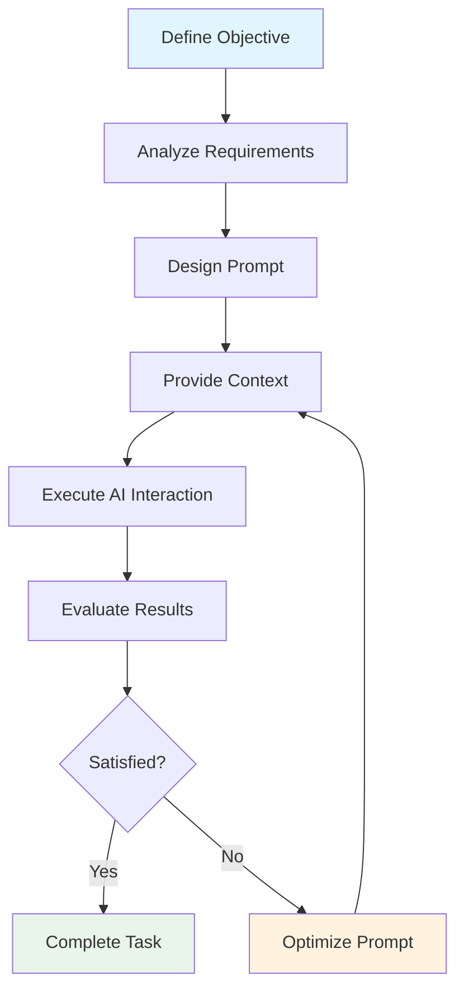
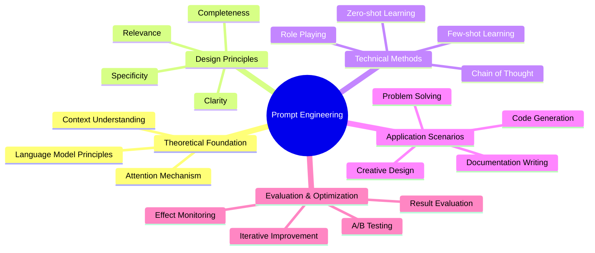
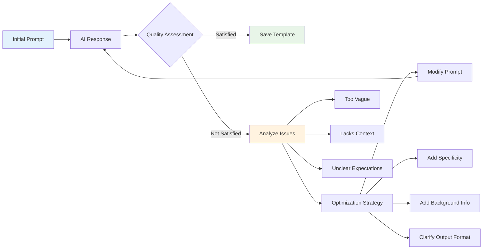
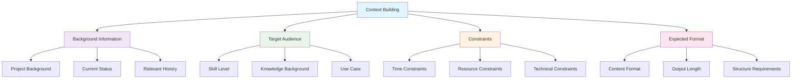
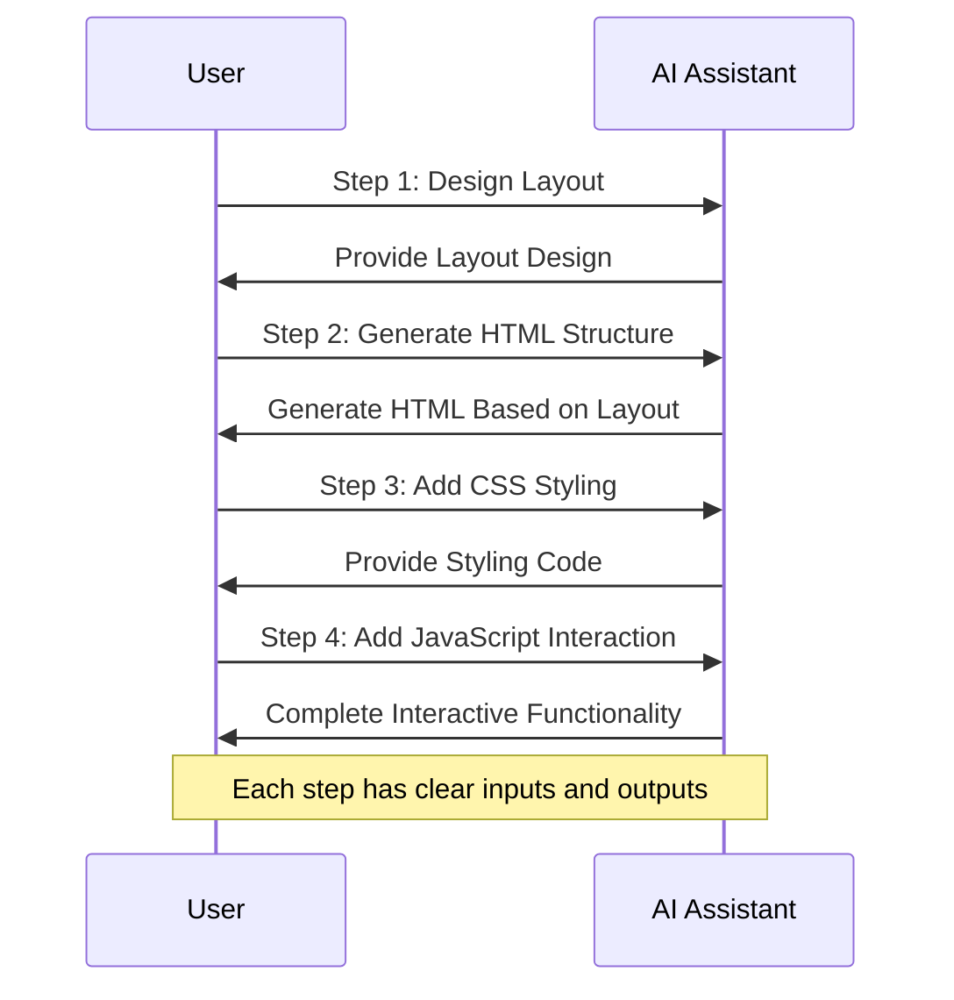
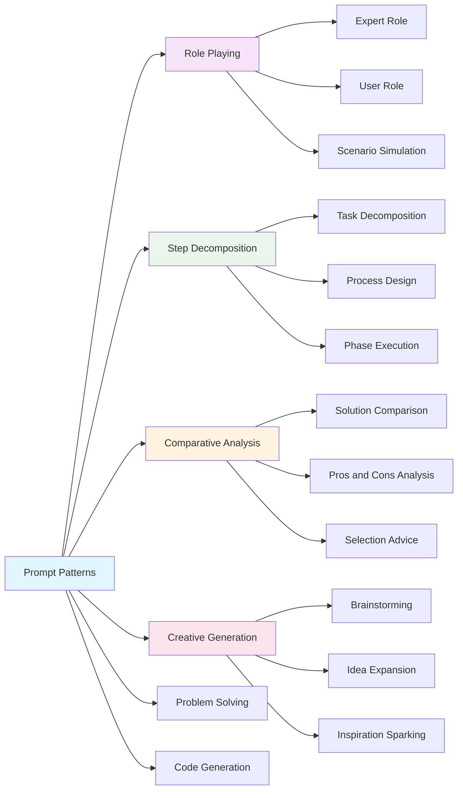
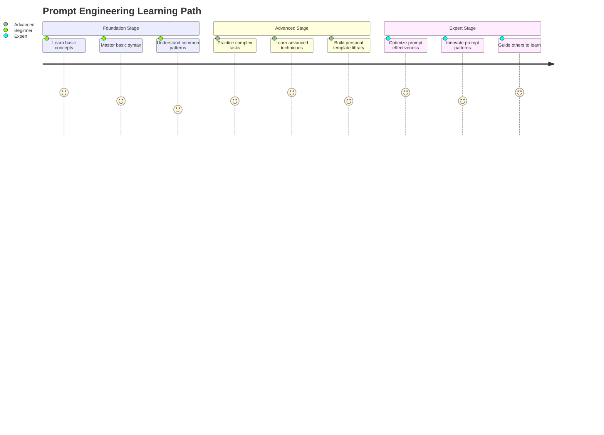

import Tabs from '@theme/Tabs';
import TabItem from '@theme/TabItem';

# Basics of Prompt Engineering

## What is Prompt Engineering

Prompt engineering is a technique for optimizing interactions with AI systems, aimed at obtaining more accurate, relevant, and useful outputs through carefully designed inputs (i.e., "prompts"). In AI-assisted development, mastering prompt engineering techniques can significantly improve work efficiency and output quality.

### Core Prompt Engineering Process


```mermaid
graph TD
    A[Define Objective] --> B[Analyze Requirements]
    B --> C[Design Prompt]
    C --> D[Provide Context]
    D --> E[Execute AI Interaction]
    E --> F[Evaluate Results]
    F --> G{Satisfied?}
    G -->|Yes| H[Complete Task]
    G -->|No| I[Optimize Prompt]
    I --> D

    style A fill:#e1f5fe
    style H fill:#e8f5e8
    style I fill:#fff3e0
```

:::tip[Importance of Prompt Engineering]

Mastering prompt engineering can bring the following benefits:

- **Improve accuracy**: AI understands your needs more accurately
- **Enhance relevance**: Get more relevant and useful outputs
- **Reduce communication costs**: Reduce back-and-forth communications
- **Boost efficiency**: Significantly improve development efficiency

:::

:::info[Application Scenarios]

Prompt engineering is particularly suitable for:
- Code generation and debugging
- Document writing and translation
- Creative design and brainstorming
- Problem solving and solution analysis

:::

## Prompt Engineering Knowledge System


```mermaid
mindmap
  root((Prompt Engineering))
    Theoretical Foundation
      Language Model Principles
      Attention Mechanism
      Context Understanding
    Design Principles
      Clarity
      Specificity
      Completeness
      Relevance
    Technical Methods
      Zero-shot Learning
      Few-shot Learning
      Chain of Thought
      Role Playing
    Application Scenarios
      Code Generation
      Documentation Writing
      Creative Design
      Problem Solving
    Evaluation & Optimization
      Result Evaluation
      Iterative Improvement
      A/B Testing
      Effect Monitoring
```

## Techniques for Writing Effective Prompts

### Clarity and Specificity

:::note[Core Principle]

Effective prompts should follow the principle of "specific, clear, and complete".

:::

<Tabs>
<TabItem value="good" label="Good Example" default>
    ```
    Give me 5 blog article topics about AI applications in daily life, each topic should include a brief description
    ```
</TabItem>
<TabItem value="bad" label="Poor Example">
    ```
    Give me some blog ideas
    ```
</TabItem>
</Tabs>

### Prompt Optimization Process


```mermaid
flowchart LR
    A[Initial Prompt] --> B[AI Response]
    B --> C{Quality Assessment}
    C -->|Satisfied| D[Save Template]
    C -->|Not Satisfied| E[Analyze Issues]
    E --> F[Optimization Strategy]
    F --> G[Modify Prompt]
    G --> B

    E --> E1[Too Vague]
    E --> E2[Lacks Context]
    E --> E3[Unclear Expectations]

    F --> F1[Add Specificity]
    F --> F2[Add Background Info]
    F --> F3[Clarify Output Format]

    style A fill:#e3f2fd
    style D fill:#e8f5e8
    style E fill:#fff3e0
```

:::warning[Common Mistakes]

Avoid the following common mistakes:

:::danger[Vague Expressions]
- Using vague quantifiers like "some", "a few"
- Lacking specific context information
- No clear expected output format
:::

:::caution[Ambiguity Issues]
- Using words that could have multiple interpretations
- Missing necessary constraints
- Not providing examples or references
:::

:::

**Best Practices:**
- Use clear, concise language
- Clearly state your requirements and expectations
- Avoid vague or ambiguous expressions

### Provide Context

:::info[Importance of Context]

Good context can help AI understand your needs and goals more accurately.

:::

```
I am writing articles for a programming blog aimed at beginners. Please provide me with an article outline explaining the concept of 'variables', the content should be simple and easy to understand, suitable for readers with no programming experience.
```

#### Context Building Framework


```mermaid
graph TB
    A[Context Building] --> B[Background Information]
    A --> C[Target Audience]
    A --> D[Constraints]
    A --> E[Expected Format]

    B --> B1[Project Background]
    B --> B2[Current Status]
    B --> B3[Relevant History]

    C --> C1[Skill Level]
    C --> C2[Knowledge Background]
    C --> C3[Use Case]

    D --> D1[Time Constraints]
    D --> D2[Resource Constraints]
    D --> D3[Technical Constraints]

    E --> E1[Content Format]
    E --> E2[Output Length]
    E --> E3[Structure Requirements]

    style A fill:#e1f5fe
    style B fill:#f3e5f5
    style C fill:#e8f5e8
    style D fill:#fff3e0
    style E fill:#fce4ec
```

:::note[Context Elements]

Effective context should include:

1. **Background Information**: Explain the current situation or project
2. **Target Audience**: Describe the target readers of the content
3. **Constraints**: Describe relevant constraints or requirements
4. **Expected Format**: Clarify output format requirements

:::

### Step-by-Step Guidance

:::tip[Step-by-Step Strategy]

Breaking complex tasks into multiple simple steps can significantly improve AI's understanding and execution effectiveness.

:::

#### Step-by-Step Execution Process


```mermaid
sequenceDiagram
    participant U as User
    participant AI as AI Assistant

    U->>AI: Step 1: Design Layout
    AI->>U: Provide Layout Design

    U->>AI: Step 2: Generate HTML Structure
    AI->>U: Generate HTML Based on Layout

    U->>AI: Step 3: Add CSS Styling
    AI->>U: Provide Styling Code

    U->>AI: Step 4: Add JavaScript Interaction
    AI->>U: Complete Interactive Functionality

    Note over U,AI: Each step has clear inputs and outputs
```

1. **First Step**: "Please design a simple homepage layout for my personal tech blog"
2. **Second Step**: "Based on the layout you provided, please give me the HTML structure code"
3. **Third Step**: "Now, please add basic CSS styling to this HTML structure"

:::success[Step-by-Step Advantages]

- Each step has a clear goal
- Can adjust subsequent steps based on AI's responses
- Reduces the complexity of individual tasks
- Improves the quality of final results

:::

### Use Examples and Templates

:::info[Template Thinking]

Using templates can help AI better understand your expected output format.

:::

:::note[Example Template]

Please generate 3 titles for my blog article in the following format:

1. **[Attractive Adjective]** + **[Topic]** + **[Valuable Promise]**
2. **[Number]** + **[Methods/Techniques]** + **[Achieve Goal]**
3. **[How/Ways]** + **[Achieve Goal]** + **[Without Doing Something/Using a Method]**

**Examples:**
1. Amazing Time Management Techniques: The Secret Weapon for Boosting Productivity
2. 7 Simple Methods to Double Your Blog Traffic
3. How to Learn Programming Without Losing Your Mind

:::

## Common Prompt Patterns

### Prompt Pattern Classification


```mermaid
graph LR
    A[Prompt Patterns] --> B[Role Playing]
    A --> C[Step Decomposition]
    A --> D[Comparative Analysis]
    A --> E[Creative Generation]
    A --> F[Problem Solving]
    A --> G[Code Generation]

    B --> B1[Expert Role]
    B --> B2[User Role]
    B --> B3[Scenario Simulation]

    C --> C1[Task Decomposition]
    C --> C2[Process Design]
    C --> C3[Phase Execution]

    D --> D1[Solution Comparison]
    D --> D2[Pros and Cons Analysis]
    D --> D3[Selection Advice]

    E --> E1[Brainstorming]
    E --> E2[Idea Expansion]
    E --> E3[Inspiration Sparking]

    style A fill:#e1f5fe
    style B fill:#f3e5f5
    style C fill:#e8f5e8
    style D fill:#fff3e0
    style E fill:#fce4ec
```

### Role-Playing Prompts

:::tip[Power of Role Playing]

Having AI play a specific role can yield more professional and targeted responses.

:::

```
Please act as an experienced frontend development engineer. I am a beginner just starting to learn HTML and CSS. Please explain in simple terms what responsive design is, why it's important, and how to start implementing responsive web pages.
```

### Step Decomposition Prompts

:::info[Structured Approach]

Breaking complex tasks into clear steps can yield more systematic solutions.

:::

```
I want to create a personal blog website. Please list the main steps to achieve this goal, including:
1. Planning content and functionality
2. Choosing technology stack
3. Designing user interface
4. Developing frontend
5. Implementing backend functionality
6. Testing and debugging
7. Deploying website

For each step, please provide a brief description and possible tools or resources needed.
```

### Comparative Analysis Prompts

:::note[Comparison Analysis]

When requesting AI to perform comparative analysis, provide clear comparison dimensions and criteria.

:::

```
Please compare WordPress, Ghost, and Hugo, these three blogging platforms, analyzing their pros and cons in the following aspects:
1. Ease of use
2. Customization flexibility
3. Performance
4. SEO friendliness
5. Community support

Provide a summary paragraph for each platform and give recommendations for different types of bloggers.
```

### Creative Generation Prompts

:::tip[Creative Stimulation]

When requesting AI to generate creative ideas, providing specific constraints can yield more practical suggestions.

:::

```
I want to create a unique interactive element for my tech blog to increase reader engagement. Please provide 5 innovative ideas, each idea should:
1. Be related to technical topics
2. Be easy to implement (no complex backend needed)
3. Be able to attract reader interaction
4. Help increase page dwell time

For each idea, briefly explain how it works and its potential benefits.
```

## Prompt Engineering Learning Path


```mermaid
journey
    title Prompt Engineering Learning Path
    section Foundation Stage
      Learn basic concepts: 5: Beginner
      Master basic syntax: 4: Beginner
      Understand common patterns: 3: Beginner
    section Advanced Stage
      Practice complex tasks: 4: Advanced
      Learn advanced techniques: 5: Advanced
      Build personal template library: 4: Advanced
    section Expert Stage
      Optimize prompt effectiveness: 5: Expert
      Innovate prompt patterns: 4: Expert
      Guide others to learn: 5: Expert
```

:::success[Learning Outcomes]

After completing this section, you will be able to:

- Write clear, specific prompts
- Use various prompt patterns
- Improve AI understanding through context
- Break complex tasks into simple steps

:::

