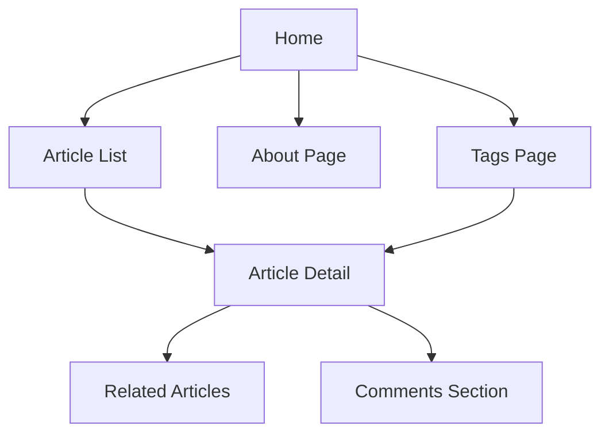

import Tabs from '@theme/Tabs';
import TabItem from '@theme/TabItem';

# Blog Project Planning

## Define Project Requirements

### Core Feature Planning

<div className="feature-grid">

#### 📝 Content Management
- Article list display
- Article detail page
- Category and tag system
- Search functionality

#### 💬 Interactive Features
- Comment system
- Like functionality
- Share buttons
- Subscription feature

#### 👤 User Experience
- Responsive design
- Dark mode
- Reading progress bar
- Back to top button

#### ⚙️ Management Features
- Article management
- Comment moderation
- Data analytics
- SEO optimization

</div>

### Technology Stack Selection

<div className="tech-stack">

<Tabs>
  <TabItem value="frontend" label="Frontend" default>
    - **Framework**: Next.js
    - **Styling**: Tailwind CSS
    - **State Management**: React Context/Redux
    - **UI Components**: Headless UI
  </TabItem>
  <TabItem value="backend" label="Backend">
    - **API**: Next.js API Routes
    - **Database**: MongoDB
    - **Authentication**: NextAuth.js
    - **Storage**: Vercel Blob Storage
  </TabItem>
  <TabItem value="tools" label="Development Tools">
    - **Editor**: Cursor
    - **Collaboration**: v0
    - **Deployment**: Vercel
    - **Analytics**: Vercel Analytics
  </TabItem>
</Tabs>

</div>

## Design Planning

### Page Structure



### Data Models

<div className="data-models">

#### Post Model
```typescript
interface Post {
  id: string;
  title: string;
  slug: string;
  content: string;
  excerpt: string;
  coverImage: string;
  author: Author;
  tags: string[];
  publishedAt: Date;
  updatedAt: Date;
}
```

#### Comment Model
```typescript
interface Comment {
  id: string;
  postId: string;
  author: string;
  content: string;
  createdAt: Date;
  replies?: Comment[];
}
```

#### User Model
```typescript
interface User {
  id: string;
  name: string;
  email: string;
  avatar: string;
  role: 'admin' | 'user';
  createdAt: Date;
}
```

</div>

## Development Plan

### Project Milestones

<div className="timeline">

#### Phase 1: Foundation Setup
1. Project initialization
2. Basic page structure
3. Styling system setup
4. Deployment workflow configuration

#### Phase 2: Core Features
1. Article display system
2. Markdown rendering
3. Tag system
4. Search functionality

#### Phase 3: Interactive Features
1. Comment system
2. User authentication
3. Like functionality
4. Share functionality

#### Phase 4: Optimization and Polish
1. SEO optimization
2. Performance optimization
3. Error handling
4. Unit testing

</div>

### Development Standards

<div className="guidelines">

#### Code Standards
```json
{
  "extends": [
    "next/core-web-vitals",
    "prettier"
  ],
  "rules": {
    "react/no-unescaped-entities": "off",
    "import/no-anonymous-default-export": "off"
  }
}
```

#### Git Commit Standards
```bash
# Commit message format
<type>(<scope>): <subject>

# Examples
feat(blog): add comment system
fix(auth): resolve login issues
docs(readme): update installation guide
```

#### File Naming Standards
```
pages/
  index.tsx
  posts/
    [slug].tsx
  tags/
    [tag].tsx
components/
  layout/
    Header.tsx
    Footer.tsx
  posts/
    PostCard.tsx
    PostList.tsx
```

</div>

## Performance and SEO Considerations

### Performance Optimization Plan

<div className="performance-plan">

#### Image Optimization
```typescript
import Image from 'next/image';

export function OptimizedImage({ src, alt }) {
  return (
    <Image
      src={src}
      alt={alt}
      width={800}
      height={400}
      placeholder="blur"
      blurDataURL={`data:image/svg+xml;base64,...`}
    />
  );
}
```

#### Code Splitting
```typescript
// Dynamic component import
const CommentSection = dynamic(() => import('@/components/CommentSection'), {
  loading: () => <CommentSkeleton />,
  ssr: false
});
```

</div>

### SEO Strategy

<div className="seo-strategy">

#### Meta Tag Configuration
```typescript
// pages/_app.tsx
import { DefaultSeo } from 'next-seo';

const DEFAULT_SEO = {
  title: 'My Tech Blog',
  description: 'Sharing Web development, AI, and technology insights',
  openGraph: {
    type: 'website',
    locale: 'en_US',
    url: 'https://myblog.com',
    site_name: 'My Tech Blog'
  }
};

function MyApp({ Component, pageProps }) {
  return (
    <>
      <DefaultSeo {...DEFAULT_SEO} />
      <Component {...pageProps} />
    </>
  );
}
```

#### Sitemap Generation
```javascript
// scripts/generate-sitemap.js
const { generateSitemap } = require('next-sitemap');

generateSitemap({
  baseUrl: 'https://myblog.com',
  sitemapSize: 7000,
  exclude: ['/api/*', '/admin/*'],
  generateRobotsTxt: true
});
```

</div>

export const styles = {
  featureGrid: {
    display: 'grid',
    gridTemplateColumns: 'repeat(auto-fit, minmax(250px, 1fr))',
    gap: '1rem',
    marginBottom: '2rem'
  },
  timeline: {
    borderLeft: '3px solid #1a73e8',
    paddingLeft: '1rem'
  },
  guidelines: {
    backgroundColor: '#f6f8fa',
    padding: '1rem',
    borderRadius: '8px'
  }
};
