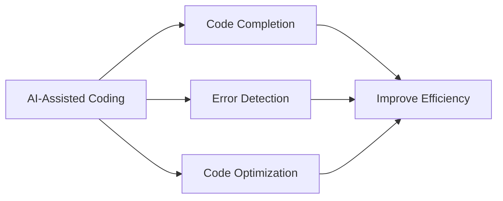

import Tabs from '@theme/Tabs';
import TabItem from '@theme/TabItem';

# Summary and Advanced Recommendations

## Knowledge Review

### Fundamental Knowledge

<div className="knowledge-review">

#### 1. Prompt Engineering
- Understand the importance of prompt engineering
- Master techniques for writing effective prompts
- Familiarize with common prompt patterns
- Practice AI interaction optimization

#### 2. Markdown Format
- Master basic syntax
- Apply advanced features
- Organize document structure
- Best practices for formatting

#### 3. AI Communication Skills
- Express requirements clearly
- Iterative dialogue
- Leverage AI advantages
- Optimize interaction efficiency

</div>

### Tool Usage

<div className="tools-review">

#### 1. Cursor


#### 2. v0 Platform
- Project management
- Team collaboration
- Version control
- AI-assisted development

#### 3. Vercel
- Automatic deployment
- Performance optimization
- Monitoring and alerts
- Domain management

</div>

## Project Practice Summary

### Development Process

<div className="process-summary">

#### 1. Planning Phase
```typescript
interface ProjectPlan {
  requirements: {
    features: string[];
    priorities: ('high' | 'medium' | 'low')[];
    timeline: Date[];
  };
  techStack: {
    frontend: string[];
    backend: string[];
    deployment: string[];
  };
  milestones: {
    phase: string;
    tasks: string[];
    deadline: Date;
  }[];
}
```

#### 2. Development Phase
:::tip Key Points Review
- Use Cursor for local development
- Conduct team collaboration on v0 platform
- Implement continuous deployment via Vercel
- Maintain code quality and performance optimization
:::

#### 3. Maintenance Phase
- Continuous integration/deployment
- Performance monitoring and optimization
- Security updates
- Feature iteration

</div>

## Advanced Learning Directions

### Technical Deepening

<div className="advanced-learning">

#### 1. Frontend Technologies
```javascript
const frontendPath = {
  framework: ['React Deep Dive', 'Next.js Advanced Features'],
  performance: ['Performance Optimization', 'First Paint Optimization'],
  testing: ['Unit Testing', 'E2E Testing'],
  architecture: ['State Management', 'Component Design Patterns']
};
```

#### 2. AI Tool Applications
- Explore more AI coding assistants
- Learn large language model applications
- Customize AI workflows
- Optimize prompt strategies

#### 3. DevOps Practices
- Deep dive into CI/CD
- Containerization technologies
- Cloud service applications
- Monitoring and logging systems

</div>

### Project Extension

<div className="project-extension">

#### Feature Extension Suggestions

<Tabs>
  <TabItem value="content" label="Content Management" default>
    - Multi-language support
    - Rich media content
    - Content version control
    - Automated publishing
  </TabItem>
  <TabItem value="interaction" label="Interactive Features">
    - Real-time comment system
    - User community
    - Content recommendations
    - Subscription system
  </TabItem>
  <TabItem value="analytics" label="Data Analytics">
    - Visit statistics
    - User behavior analysis
    - Content popularity tracking
    - Performance monitoring
  </TabItem>
</Tabs>

</div>

## Continuous Learning Resources

### Recommended Resources

<div className="learning-resources">

#### 1. Official Documentation
- [Next.js文档](https://nextjs.org/docs)
- [Vercel文档](https://vercel.com/docs)
- [React文档](https://reactjs.org/docs)
- [Tailwind CSS文档](https://tailwindcss.com/docs)

#### 2. Community Resources
- GitHub open source projects
- Technical blogs
- Developer forums
- Video tutorials

#### 3. Practice Projects
```typescript
interface ProjectIdea {
  name: string;
  description: string;
  technologies: string[];
  learningGoals: string[];
  difficulty: 'beginner' | 'intermediate' | 'advanced';
}

const projectIdeas: ProjectIdea[] = [
  {
    name: 'Tech Blog Platform',
    description: 'Build a personal tech blog system',
    technologies: ['Next.js', 'MDX', 'Tailwind'],
    learningGoals: ['SSG', 'Performance Optimization', 'SEO'],
    difficulty: 'intermediate'
  },
  // More project ideas...
];
```

</div>

### Learning Recommendations

<div className="learning-tips">

#### Progressive Learning
1. Consolidate fundamental knowledge
2. Practice small projects
3. Participate in open source contributions
4. Share learning experiences

#### Stay Updated
- Follow technology trends
- Participate in tech communities
- Practice new technologies
- Summarize and share

#### Build Portfolio
- Complete project showcases
- Technical blog writing
- Open source project contributions
- Technical presentations

</div>

export const styles = {
  knowledgeReview: {
    backgroundColor: '#f6f8fa',
    padding: '1rem',
    borderRadius: '8px',
    marginBottom: '1rem'
  },
  processSum: {
    borderLeft: '3px solid #1a73e8',
    paddingLeft: '1rem'
  },
  learningTips: {
    backgroundColor: '#f0f7ff',
    padding: '1rem',
    borderRadius: '8px'
  }
};
