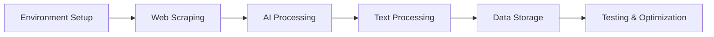

import Tabs from '@theme/Tabs';
import TabItem from '@theme/TabItem';
import ReactPlayer from 'react-player';

# Coze Workflow Development

## 🚀 Platform Introduction

Coze is a powerful AI workflow development platform. Through this tutorial, you will learn how to build a complete AI-driven workflow.

### Tutorial Videos

<div className="video-grid">
  <div className="video-card">
    <h4>🎥 Environment Setup Tutorial 1</h4>
    <div className="video-wrapper">
      <ReactPlayer
        url="https://www.youtube.com/embed/ANmv1dMY7fY"
        controls={true}
        width="100%"
        height="100%"
        style={{ aspectRatio: '16/9' }}
      />
    </div>
  </div>

  <div className="video-card">
    <h4>🎥 Environment Setup Tutorial 2</h4>
    <div className="video-wrapper">
      <ReactPlayer
        url="https://www.youtube.com/embed/85Z324xsD-w"
        controls={true}
        width="100%"
        height="100%"
        style={{ aspectRatio: '16/9' }}
      />
    </div>
  </div>

  <div className="video-card">
    <h4>🎥 Environment Setup Tutorial 3</h4>
    <div className="video-wrapper">
      <ReactPlayer
        url="https://www.youtube.com/embed/4VVJv9SfJqc"
        controls={true}
        width="100%"
        height="100%"
        style={{ aspectRatio: '16/9' }}
      />
    </div>
  </div>
</div>

## 🎯 Learning Objectives

Through this tutorial, you will master:
- ✅ Creating complete Coze workflows
- ✅ Implementing automatic webpage content retrieval
- ✅ Using AI to generate high-quality summaries
- ✅ Saving data to Notion

## 🛠️ Environment Preparation

### Notion Configuration

#### 1. Create Integration

<Tabs>
  <TabItem value="integration" label="Create Integration" default>
    1. Visit [Notion Developers](https://developers.notion.com/)
    2. Click "Create new integration"
    3. Fill in integration information:
       - Name: Article Summary
       - Associated workspace: Select your workspace
    4. Save the generated Integration Token
  </TabItem>
  <TabItem value="auth" label="Page Authorization">
    1. Create a new Notion page
    2. Click Share button in top right
    3. Select and add your integration
  </TabItem>
</Tabs>

#### 2. Get Page ID
```typescript
// Notion page URL format
https://notion.so/workspace/page-title-32-character-string

// Extract 32-character string as page_id
const pageId = url.match(/[a-f\d]{32}/)[0];
```

### Coze Configuration

#### 1. Create Project
- Visit Coze website and login
- Create new workflow project
- Configure basic project information

#### 2. Required Nodes
- 🌐 Browse Node - Web scraping
- 🤖 LLM Node - Generate summaries
- 📝 Text Processing Node - Text processing
- 💾 Write Page Node - Notion integration

## 🔧 Workflow Construction

### 1. Browse Node Configuration

#### Node Function
- Visit specified URL
- Extract webpage content
- Handle different types of webpages

#### Parameter Settings
```typescript
// url parameter configuration
{
  "url": "{{input}}",
  "enforce_crawl": true
}
```

#### Output Structure
```json
{
  "code": 200,
  "message": "success",
  "plugin_observation": {
    "observation": "Actual webpage content",
    "natural_language_desc": "Content description information"
  }
}
```

### 2. LLM Node Configuration

#### System Prompt
```text
You are a professional article summarizer. Your task is to read the provided article and create a CONCISE summary that:
- Captures only the most essential points (max 2-3 key points)
- Uses very concise language
- Keeps the total output under 1500 characters
- Maintains clarity while being brief
- Includes a short title

Format your response as:
Title: [Short Article Title]
Summary: [Your concise summary in 1-2 paragraphs]
Key Points:
- [Point 1]
- [Point 2]
- [Point 3]
```

#### User Prompt
```text
Please provide a summary of the following article:
{{browse.plugin_observation.observation}}
```

### 3. Text Processing Node Configuration

#### Input Parameters
```typescript
{
  "String1": "{{llm.output.output}}"
}
```

#### Text Template
```text
=========================================
                Article Summary
=========================================

{{String1}}
=========================================
```

### 4. Write Page Node Configuration

#### Notion Parameters
```typescript
{
  "page_id": "Your Notion page ID",
  "text": "{{Text Processing.output}}"
}
```

## 🎨 Optimization Strategies

### Prompt Optimization

<Tabs>
  <TabItem value="prompts" label="Prompt Tips" default>
    - Use clear role definitions
    - Set specific output requirements
    - Maintain prompt consistency
    - Regularly update and optimize prompts
  </TabItem>
  <TabItem value="quality" label="Quality Assurance">
    - Establish quality evaluation criteria
    - Conduct A/B testing comparisons
    - Collect user feedback
    - Continuous optimization improvement
  </TabItem>
</Tabs>

### Performance Monitoring

#### Response Time Monitoring
```typescript
const metrics = {
  browse_time: 'Scraping time',
  llm_time: 'AI processing time',
  storage_time: 'Storage time',
  total_time: 'Total time'
};
```

#### Optimization Goals
- Web scraping < 3 seconds
- AI processing < 5 seconds
- Data storage < 2 seconds

## 🚫 Common Issues

### Network Issues
- **URL Inaccessible**: Check URL format and network connection
- **Incomplete Content Retrieval**: Adjust enforce_crawl settings
- **Authorization Verification Failed**: Check Token validity

### Processing Issues
- **Format Parsing Error**: Optimize prompt settings
- **Character Encoding Issue**: Adjust text processing parameters
- **Content Truncation Error**: Increase text length limit

## 🎯 Testing and Optimization

### Functional Testing

#### Input Validation
- Test different URL formats
- Verify special character handling
- Check error handling mechanisms
- Test boundary conditions

#### Process Validation
- Node connection correctness
- Data transfer completeness
- Exception handling effectiveness
- Output format standardization

### Performance Testing

#### Concurrency Testing
- Multiple URL simultaneous processing
- Batch task execution
- High-frequency request handling

#### Resource Monitoring
- Memory usage
- CPU utilization
- API call frequency

## 🌟 Best Practices

### Daily Maintenance
1. Regularly check functional completeness
2. Monitor error logs
3. Update and optimize prompts
4. Adjust processing strategies

### Continuous Optimization
1. Collect user feedback
2. Analyze usage data
3. Optimize processing flow
4. Expand feature capabilities

## 🔄 Development Process



:::info Workflow Features
- Automated article summary generation
- Structured data storage solution
- Scalable system architecture
- Efficient processing flow
:::

Through this Coze workflow project, you will master how to build a complete AI-driven workflow, from web scraping to intelligent summary generation, to data storage - the full development process.

export const styles = `
.video-grid {
  display: grid;
  grid-template-columns: repeat(auto-fit, minmax(300px, 1fr));
  gap: 2rem;
  margin: 2rem 0;
}

.video-card {
  background: #ffffff;
  border-radius: 12px;
  padding: 1.5rem;
  box-shadow: 0 4px 6px rgba(0, 0, 0, 0.1);
  transition: transform 0.2s ease;
}

.video-card:hover {
  transform: translateY(-5px);
}

.video-card h4 {
  margin: 0 0 1rem 0;
  color: #2e8555;
  font-size: 1.1rem;
}

.video-wrapper {
  position: relative;
  border-radius: 8px;
  overflow: hidden;
  box-shadow: 0 2px 4px rgba(0, 0, 0, 0.1);
}

@media (max-width: 768px) {
  .video-grid {
    grid-template-columns: 1fr;
  }
}
`;
