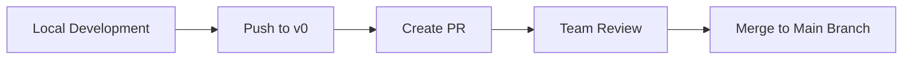

import Tabs from '@theme/Tabs';
import TabItem from '@theme/TabItem';

# Workflow Integration Guide

## Workflow Overview

<div className="workflow-overview">

### 🔄 Complete Development Cycle

1. **Local Development** (Cursor)
   - AI-assisted coding
   - Real-time error checking
   - Code optimization

2. **Team Collaboration** (v0)
   - Code review
   - Real-time collaboration
   - Version control

3. **Deployment Release** (Vercel)
   - Automatic deployment
   - Performance monitoring
   - Domain management

</div>

## Environment Configuration

### Toolchain Setup

<div className="setup-steps">

#### 1. Cursor Configuration

```json
// .cursor/settings.json
{
  "editor.formatOnSave": true,
  "editor.defaultFormatter": "cursor",
  "ai.completions.enabled": true,
  "git.enableSmartCommit": true
}
```

#### 2. v0 Integration

```yaml
# v0.config.yaml
project:
  name: my-blog
  type: next-app

integrations:
  - name: github
    repo: username/repo
  - name: vercel
    projectId: your-project-id
```

#### 3. Vercel Configuration

```json
// vercel.json
{
  "version": 2,
  "builds": [
    {
      "src": "package.json",
      "use": "@vercel/next"
    }
  ],
  "routes": [
    { "src": "/(.*)", "dest": "/" }
  ]
}
```

</div>

## Development Workflow

### From Cursor to v0

<div className="workflow-steps">

#### 1. Local Development Process

<Tabs>
  <TabItem value="create" label="Create Feature" default>
    ```bash
    # 1. Create new branch
    git checkout -b feature/new-blog-post

    # 2. Develop with Cursor
    # Utilize AI completion and suggestions

    # 3. Commit changes
    git add .
    git commit -m "Add new blog post feature"
    ```
  </TabItem>
  <TabItem value="push" label="Push to v0">
    ```bash
    # 1. Push to remote repository
    git push origin feature/new-blog-post

    # 2. Create PR on v0 platform
    # 3. Wait for team review
    ```
  </TabItem>
</Tabs>

#### 2. Code Review Process



</div>

### From v0 to Vercel

<div className="deployment-flow">

#### 1. Automatic Deployment Configuration

```yaml
# .github/workflows/deploy.yml
name: Deploy to Vercel
on:
  push:
    branches: [main]
jobs:
  deploy:
    runs-on: ubuntu-latest
    steps:
      - uses: actions/checkout@v2
      - name: Deploy to Vercel
        uses: amondnet/vercel-action@v20
        with:
          vercel-token: ${{ secrets.VERCEL_TOKEN }}
          vercel-org-id: ${{ secrets.ORG_ID }}
          vercel-project-id: ${{ secrets.PROJECT_ID }}
```

#### 2. Deployment Preview

:::tip Preview Environment
Each PR generates an independent preview environment, making it easy for team members to view changes.
:::

</div>

## Collaboration Best Practices

### Branch Management Strategy

<div className="branch-strategy">

#### Branch Structure
```
main
├── develop
│   ├── feature/blog-post
│   ├── feature/comment-system
│   └── feature/user-profile
└── hotfix/security-patch
```

#### Workflow Guidelines

1. Create feature branches from `develop` branch
2. Create PR to `develop` after development
3. Merge after code review passes
4. Periodically merge `develop` to `main`

</div>

### Commit Message Convention

<div className="commit-convention">

#### Commit Format
```
<type>(<scope>): <subject>

<body>

<footer>
```

#### Type Descriptions
- `feat`: New feature
- `fix`: Bug fix
- `docs`: Documentation update
- `style`: Code formatting
- `refactor`: Code refactoring
- `test`: Test-related
- `chore`: Build process or tool changes

</div>

### Automated Testing Integration

<div className="testing-integration">

#### Test Configuration

```javascript
// jest.config.js
module.exports = {
  testEnvironment: 'jsdom',
  setupFilesAfterEnv: ['<rootDir>/jest.setup.js'],
  testPathIgnorePatterns: ['/node_modules/', '/.next/'],
  transform: {
    '^.+\\.(js|jsx|ts|tsx)$': ['babel-jest', { presets: ['next/babel'] }],
  },
}
```

#### CI Process
```yaml
# .github/workflows/test.yml
name: Run Tests
on: [push, pull_request]
jobs:
  test:
    runs-on: ubuntu-latest
    steps:
      - uses: actions/checkout@v2
      - name: Install dependencies
        run: npm ci
      - name: Run tests
        run: npm test
```

</div>

## Monitoring and Maintenance

### Performance Monitoring

<div className="monitoring-setup">

#### Performance Metrics Tracking
```javascript
// pages/_app.js
export function reportWebVitals(metric) {
  if (metric.label === 'web-vital') {
    // Send to analytics service
    analytics.send({
      metric: metric.name,
      value: metric.value,
      path: window.location.pathname
    });
  }
}
```

#### Alert Settings
```javascript
// monitoring-config.js
export const alerts = {
  performance: {
    FCP: 2000, // First Contentful Paint threshold
    LCP: 2500, // Largest Contentful Paint threshold
    TTI: 3500  // Time to Interactive threshold
  }
};
```

</div>

### Error Tracking

<div className="error-tracking">

#### Sentry Integration
```javascript
// sentry.config.js
import * as Sentry from '@sentry/nextjs';

Sentry.init({
  dsn: process.env.SENTRY_DSN,
  tracesSampleRate: 1.0,
  environment: process.env.NODE_ENV
});
```

#### Error Boundary Component
```jsx
class ErrorBoundary extends React.Component {
  state = { hasError: false }

  static getDerivedStateFromError(error) {
    return { hasError: true };
  }

  componentDidCatch(error, errorInfo) {
    Sentry.captureException(error, { extra: errorInfo });
  }

  render() {
    if (this.state.hasError) {
      return <h1>Something went wrong.</h1>;
    }
    return this.props.children;
  }
}
```

</div>

export const styles = {
  workflowOverview: {
    backgroundColor: '#f6f8fa',
    padding: '1rem',
    borderRadius: '8px',
    marginBottom: '2rem'
  },
  setupSteps: {
    borderLeft: '3px solid #1a73e8',
    paddingLeft: '1rem'
  },
  branchStrategy: {
    backgroundColor: '#f0f7ff',
    padding: '1rem',
    borderRadius: '8px'
  },
  errorTracking: {
    marginTop: '1rem',
    padding: '1rem',
    border: '1px solid #e1e4e8',
    borderRadius: '8px'
  }
};
