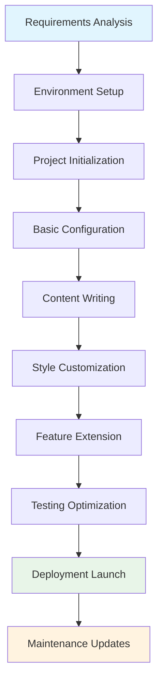
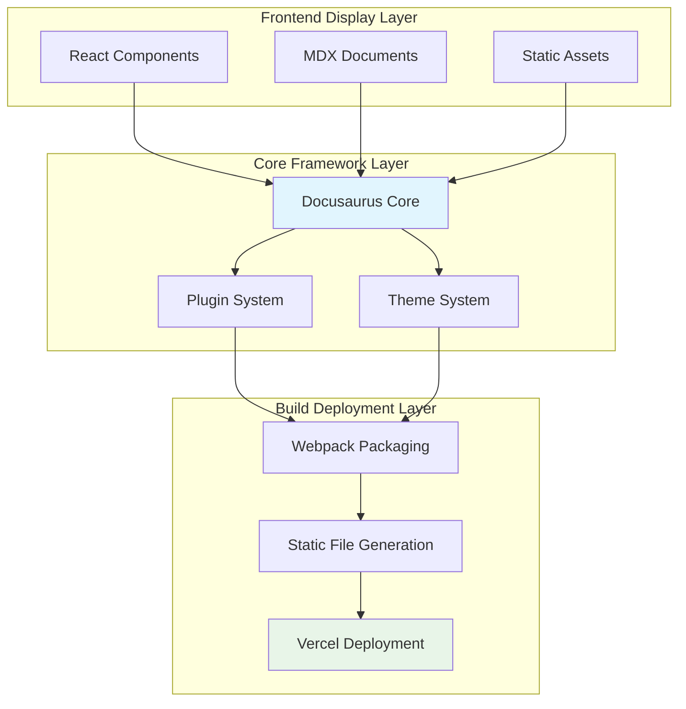
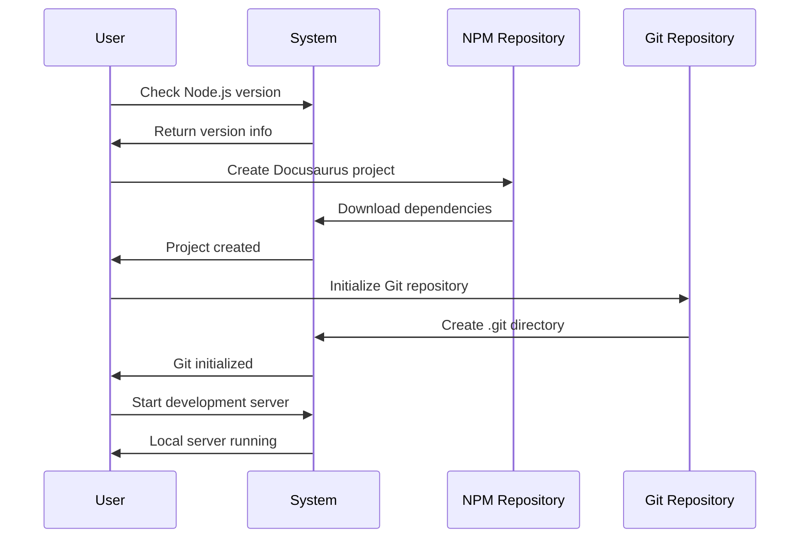
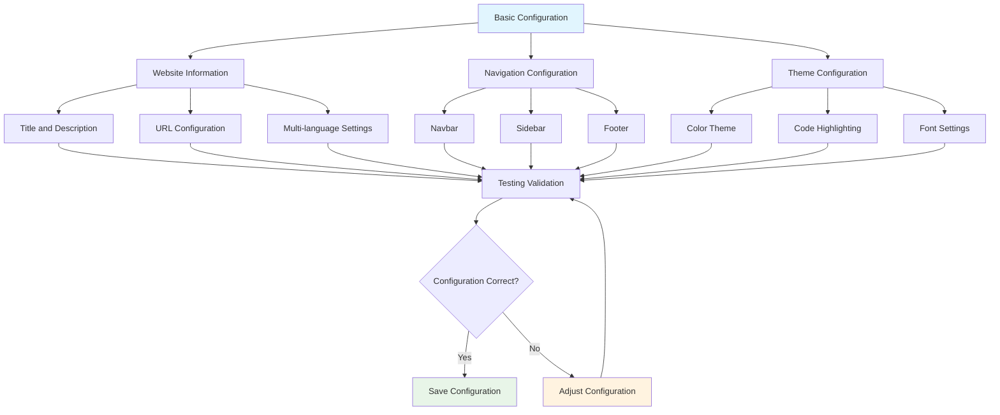
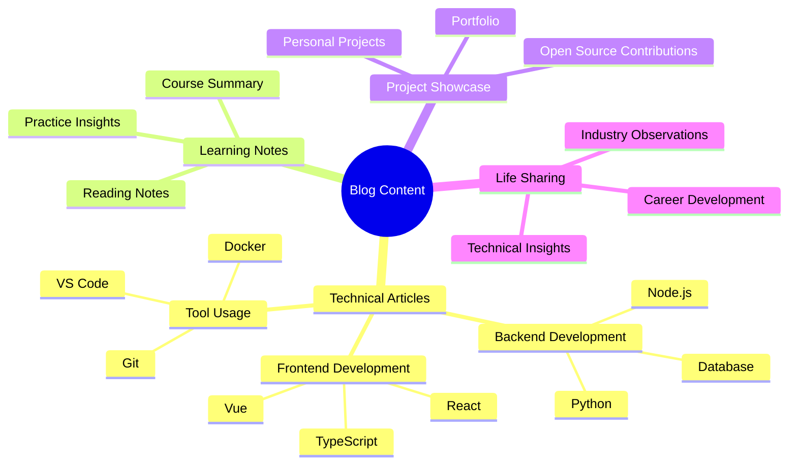
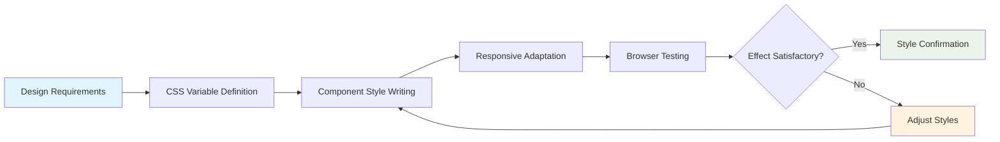
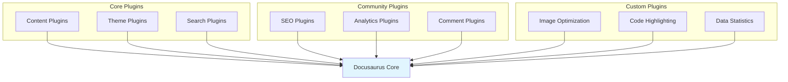
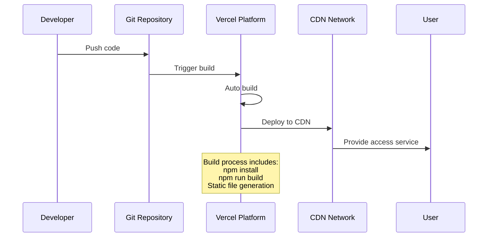
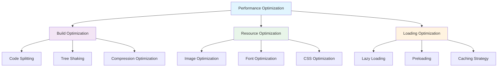
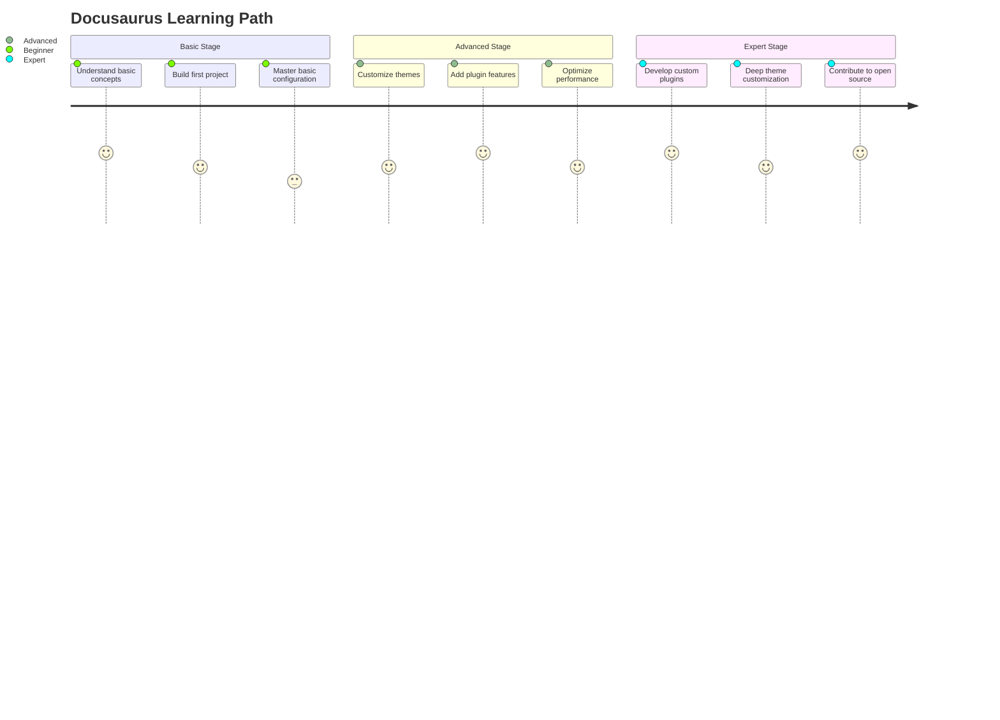

import Tabs from '@theme/Tabs';
import TabItem from '@theme/TabItem';
import TOCInline from '@theme/TOCInline';

# Complete Docusaurus Blog Building Tutorial

## Tutorial Overview

:::tip[🎯 Tutorial Objectives]

Through this tutorial, you will learn:
- Build a modern technical blog
- Configure multi-language and version control
- Implement automated deployment and continuous integration
- Optimize SEO and performance

:::

### Table of Contents

<TOCInline toc={toc} minHeadingLevel={2} maxHeadingLevel={3} />

### Project Development Workflow



### Technical Architecture Diagram



## Environment Preparation

### System Requirements

- Node.js 18.0 or higher
- npm or yarn package manager
- Git version control
- Modern browser (Chrome, Firefox, Safari, Edge)

### Installation Process



## Project Setup

### Create Project

```bash title="Create Docusaurus Project"
npx create-docusaurus@latest my-blog classic --typescript
cd my-blog
```

### Project Structure

```
my-blog/
├── blog/                  # Blog posts
├── docs/                  # Documentation content
├── src/
│   ├── components/        # Custom components
│   ├── css/              # Style files
│   └── pages/            # Custom pages
├── static/               # Static assets
├── docusaurus.config.js  # Configuration file
├── sidebars.js           # Sidebar configuration
└── package.json          # Project dependencies
```

### Start Project

```bash title="Start Development Server"
npm start
```

## Basic Configuration

### Website Information Configuration

```javascript title="docusaurus.config.js" showLineNumbers {6-10,15-20}
import {themes as prismThemes} from 'prism-react-renderer';

/** @type {import('@docusaurus/types').Config} */
const config = {
  title: 'My Tech Blog',
  tagline: 'Sharing frontend development experience and technical insights',
  favicon: 'img/favicon.ico',
  url: 'https://my-blog.vercel.app',
  baseUrl: '/',
  organizationName: 'username',
  projectName: 'my-blog',

  onBrokenLinks: 'throw',
  onBrokenMarkdownLinks: 'warn',

  i18n: {
    defaultLocale: 'en',
    locales: ['en', 'zh-Hans'],
  },

  presets: [
    [
      'classic',
      /** @type {import('@docusaurus/preset-classic').Options} */
      ({
        docs: {
          sidebarPath: './sidebars.js',
          editUrl: 'https://github.com/username/my-blog/tree/main/',
        },
        blog: {
          showReadingTime: true,
          editUrl: 'https://github.com/username/my-blog/tree/main/',
        },
        theme: {
          customCss: './src/css/custom.css',
        },
      }),
    ],
  ],

  themeConfig:
    /** @type {import('@docusaurus/preset-classic').ThemeConfig} */
    ({
      // Global table of contents configuration
      tableOfContents: {
        minHeadingLevel: 2,
        maxHeadingLevel: 4,
      },
      image: 'img/docusaurus-social-card.jpg',
      navbar: {
        title: 'My Blog',
        logo: {
          alt: 'My Blog Logo',
          src: 'img/logo.svg',
        },
        items: [
          {
            type: 'docSidebar',
            sidebarId: 'tutorialSidebar',
            position: 'left',
            label: 'Tutorial',
          },
          {to: '/blog', label: 'Blog', position: 'left'},
          {
            href: 'https://github.com/username/my-blog',
            label: 'GitHub',
            position: 'right',
          },
        ],
      },
      footer: {
        style: 'dark',
        links: [
          {
            title: 'Docs',
            items: [
              {
                label: 'Tutorial',
                to: '/docs/intro',
              },
            ],
          },
          {
            title: 'Community',
            items: [
              {
                label: 'Stack Overflow',
                href: 'https://stackoverflow.com/questions/tagged/docusaurus',
              },
              {
                label: 'Discord',
                href: 'https://discordapp.com/invite/docusaurus',
              },
              {
                label: 'Twitter',
                href: 'https://twitter.com/docusaurus',
              },
            ],
          },
        ],
      },
      prism: {
        theme: prismThemes.github,
        darkTheme: prismThemes.dracula,
      },
    }),
};

export default config;
```

### Configuration Optimization Process



## Content Creation

### Documentation Structure Planning



### Creating Blog Posts

```markdown title="blog/2024-01-01-welcome.md" showLineNumbers
---
slug: welcome
title: Welcome to My Tech Blog
authors: [your-name]
tags: [welcome, blog, introduction]
---

# Welcome to My Tech Blog

This is my first blog post. Here I will share:

- Frontend development experience
- Technical learning insights
- Project practice summaries
- Industry observations and thoughts

Hope this content is helpful to everyone!

{/* truncate */}

## Blog Content Plan

### Technical Article Series

I plan to write the following series:

1. **React Deep Dive Series**
   - React Hooks Explained
   - State Management Best Practices
   - Performance Optimization Tips

2. **Frontend Engineering Series**
   - Build Tool Configuration
   - Code Quality Assurance
   - Automated Deployment

3. **Project Practice Series**
   - Building Blog System from Scratch
   - E-commerce Website Development
   - Mobile App Development

### Learning Method Sharing

I will also share some learning methods and insights:

- How to efficiently learn new technologies
- Technical documentation reading skills
- Ways to participate in open source projects
- Technical interview preparation methods

Welcome everyone to follow my blog and grow together!
```

### Creating Documentation Pages

```markdown title="docs/intro.md" showLineNumbers
---
sidebar_position: 1
toc_min_heading_level: 2
toc_max_heading_level: 3
---

# Tutorial Introduction

Let's discover **Docusaurus in less than 5 minutes**.

## Getting Started

Get started by **creating a new site**.

Or **try Docusaurus immediately**:

```bash
npx create-docusaurus@latest my-website classic
```

### What you'll need

- [Node.js](https://nodejs.org/en/download/) version 18.0 or above:
  - When installing Node.js, it's recommended to check all checkboxes related to dependencies.

## Generate a new site

Generate a new Docusaurus site using the **classic template**.

The classic template will automatically be added to your project after you run the command:

```bash
npx create-docusaurus@latest my-website classic
```

You can type this command into Command Prompt, Powershell, Terminal, or any other integrated terminal of your code editor.

The command also installs all necessary dependencies you need to run Docusaurus.

## Start your site

Run the development server:

```bash
cd my-website
npm run start
```

The `cd` command changes the directory you're working with. In order to work with your newly created Docusaurus site, you'll need to navigate the terminal there.

The `npm run start` command builds your website locally and serves it through a development server, ready for you to view at http://localhost:3000.

Open `docs/intro.md` (this page) and edit some lines: the site **reloads automatically** and displays your changes.
```

## Style Customization

### Custom CSS

```css title="src/css/custom.css" showLineNumbers {5-10,15-20,25-30}
/**
 * Custom CSS variables
 */

/* Light theme */
:root {
  --ifm-color-primary: #2e8555;
  --ifm-color-primary-dark: #29784c;
  --ifm-color-primary-darker: #277148;
  --ifm-color-primary-darkest: #205d3b;
  --ifm-color-primary-light: #33925d;
  --ifm-color-primary-lighter: #359962;
  --ifm-color-primary-lightest: #3cad6e;
  --ifm-code-font-size: 95%;
  --docusaurus-highlighted-code-line-bg: rgba(0, 0, 0, 0.1);
}

/* Dark theme */
[data-theme='dark'] {
  --ifm-color-primary: #25c2a0;
  --ifm-color-primary-dark: #21af90;
  --ifm-color-primary-darker: #1fa588;
  --ifm-color-primary-darkest: #1a8870;
  --ifm-color-primary-light: #29d5b0;
  --ifm-color-primary-lighter: #32d8b4;
  --ifm-color-primary-lightest: #4fddbf;
  --docusaurus-highlighted-code-line-bg: rgba(0, 0, 0, 0.3);
}

/* Custom styles */
.hero {
  background: linear-gradient(135deg, #667eea 0%, #764ba2 100%);
  color: white;
}

.hero__title {
  font-size: 3rem;
  font-weight: 700;
}

.hero__subtitle {
  font-size: 1.5rem;
  margin-top: 1rem;
}

/* Card styles */
.card {
  border-radius: 12px;
  box-shadow: 0 4px 6px rgba(0, 0, 0, 0.1);
  transition: transform 0.3s ease, box-shadow 0.3s ease;
}

.card:hover {
  transform: translateY(-4px);
  box-shadow: 0 8px 25px rgba(0, 0, 0, 0.15);
}

/* Responsive design */
@media (max-width: 768px) {
  .hero__title {
    font-size: 2rem;
  }

  .hero__subtitle {
    font-size: 1.2rem;
  }
}
```

### Style Customization Process



## Feature Extension

### Plugin System



### Adding Search Functionality

```javascript title="docusaurus.config.js" showLineNumbers {5-10}
const config = {
  // ... other configuration

  themes: [
    [
      require.resolve("@easyops-cn/docusaurus-search-local"),
      {
        hashed: true,
        language: ["en", "zh"],
        highlightSearchTermsOnTargetPage: true,
      },
    ],
  ],

  // ... other configuration
};
```

## Deployment Configuration

### Deployment Process



### Vercel Deployment Configuration

```json title="vercel.json" showLineNumbers
{
  "version": 2,
  "builds": [
    {
      "src": "package.json",
      "use": "@vercel/static-build",
      "config": {
        "distDir": "build"
      }
    }
  ],
  "routes": [
    {
      "src": "/(.*)",
      "dest": "/$1"
    }
  ]
}
```

### GitHub Actions Automated Deployment

```yaml title=".github/workflows/deploy.yml" showLineNumbers
name: Deploy to Vercel

on:
  push:
    branches: [ main ]
  pull_request:
    branches: [ main ]

jobs:
  deploy:
    runs-on: ubuntu-latest

    steps:
    - uses: actions/checkout@v3

    - name: Setup Node.js
      uses: actions/setup-node@v3
      with:
        node-version: '18'
        cache: 'npm'

    - name: Install dependencies
      run: npm ci

    - name: Build
      run: npm run build

    - name: Deploy to Vercel
      uses: amondnet/vercel-action@v20
      with:
        vercel-token: ${{ secrets.VERCEL_TOKEN }}
        vercel-org-id: ${{ secrets.ORG_ID }}
        vercel-project-id: ${{ secrets.PROJECT_ID }}
        working-directory: ./
```

:::info[💡 Tips]

Before deployment, please ensure:
- All dependencies are properly installed
- Build process has no errors
- Static asset paths are correct

:::

## Performance Optimization

### Optimization Strategies



### Image Optimization Configuration

```javascript title="docusaurus.config.js" showLineNumbers {10-15}
const config = {
  // ... other configuration

  plugins: [
    [
      '@docusaurus/plugin-ideal-image',
      {
        quality: 70,
        max: 1030,
        min: 640,
        steps: 2,
        disableInDev: false,
      },
    ],
  ],

  // ... other configuration
};
```

:::success[🎉 Deployment Successful]

Congratulations! You have successfully built a fully functional Docusaurus blog.

Next you can:
- Add more content
- Customize personal styles
- Integrate third-party services
- Optimize SEO settings

:::

## Advanced Features

### Internationalization Configuration

```javascript title="docusaurus.config.js" showLineNumbers {5-10}
const config = {
  // ... other configuration

  i18n: {
    defaultLocale: 'en',
    locales: ['en', 'zh-Hans'],
    localeConfigs: {
      en: {
        label: 'English',
        direction: 'ltr',
      },
      'zh-Hans': {
        label: '中文',
        direction: 'ltr',
      },
    },
  },

  // ... other configuration
};
```

### Version Control

```javascript title="docusaurus.config.js" showLineNumbers {8-12}
const config = {
  // ... other configuration

  presets: [
    [
      'classic',
      {
        docs: {
          sidebarPath: './sidebars.js',
          versions: {
            current: {
              label: 'Current Version',
              path: 'current',
            },
          },
        },
      },
    ],
  ],

  // ... other configuration
};
```

### Learning Path Planning



:::warning[⚠️ Important Notes]

During development, please note:
- Regularly backup important data
- Test multiple browser compatibility
- Optimize mobile display
- Follow security best practices

:::

## Summary

Through this tutorial, you have mastered the complete process of building a Docusaurus blog. From project initialization to deployment launch, each step is accompanied by detailed explanations and code examples.

Continue exploring more possibilities with Docusaurus and create your unique blog platform!

export const styles = {
  card: {
    borderRadius: '12px',
    boxShadow: '0 4px 6px rgba(0, 0, 0, 0.1)',
    transition: 'transform 0.3s ease, box-shadow 0.3s ease',
    padding: '20px',
    margin: '16px 0'
  }
};
