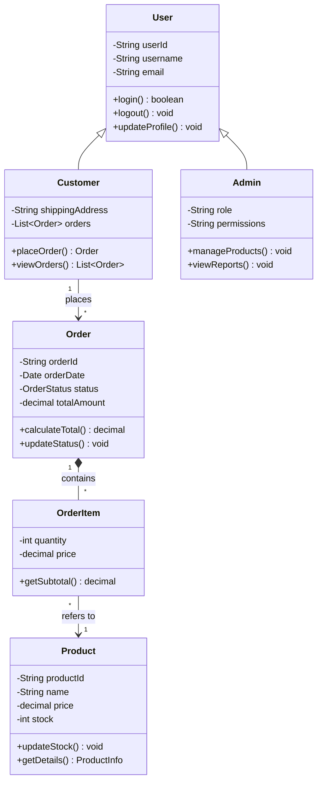
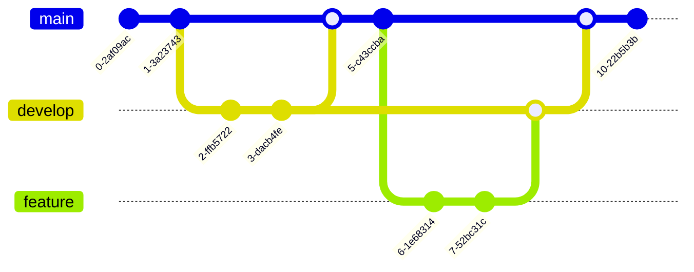

import CodeBlock from '@theme/CodeBlock';
import Admonition from '@theme/Admonition';

# Mermaid Advanced Applications

## 📅 Gantt Chart

Gantt charts are an important tool for project management, used to display project progress and timelines.

### Basic Syntax

<CodeBlock language="mermaid">
{`gantt
    title 项目开发计划
    dateFormat YYYY-MM-DD

    section 需求分析
    需求调研           :done,    des1, 2024-01-01, 7d
    需求文档编写       :done,    des2, after des1, 5d

    section 开发阶段
    前端开发           :active,  dev1, 2024-01-13, 15d
    后端开发           :         dev2, after des2, 20d

    section 测试部署
    集成测试           :         test1, after dev2, 7d
    上线部署           :         deploy, after test1, 3d`}

```mermaid
gantt
    title 项目开发计划
    dateFormat YYYY-MM-DD

    section 需求分析
    需求调研           :done,    des1, 2024-01-01, 7d
    需求文档编写       :done,    des2, after des1, 5d

    section 开发阶段
    前端开发           :active,  dev1, 2024-01-13, 15d
    后端开发           :         dev2, after des2, 20d

    section 测试部署
    集成测试           :         test1, after dev2, 7d
    上线部署           :         deploy, after test1, 3d
```

</CodeBlock>

### Advanced Configuration

<CodeBlock language="mermaid">
{`gantt
    title 季度产品路线图
    dateFormat YYYY-MM-DD
    axisFormat %m月

    section 产品规划
    市场调研            :crit, done, 2024-01-01, 30d
    竞品分析            :done, after a1, 20d
    产品设计            :active, 2024-02-20, 30d

    section 功能开发
    核心功能开发        :crit, 2024-03-20, 45d
    扩展功能开发        :2024-05-04, 30d
    性能优化            :2024-06-03, 20d

    section 市场推广
    营销方案制定        :2024-05-01, 15d
    预热活动            :2024-05-16, 20d
    正式发布            :milestone, 2024-06-05, 0d`}

```mermaid
gantt
    title 季度产品路线图
    dateFormat YYYY-MM-DD
    axisFormat %m月

    section 产品规划
    市场调研            :crit, done, 2024-01-01, 30d
    竞品分析            :done, after a1, 20d
    产品设计            :active, 2024-02-20, 30d

    section 功能开发
    核心功能开发        :crit, 2024-03-20, 45d
    扩展功能开发        :2024-05-04, 30d
    性能优化            :2024-06-03, 20d

    section 市场推广
    营销方案制定        :2024-05-01, 15d
    预热活动            :2024-05-16, 20d
    正式发布            :milestone, 2024-06-05, 0d
```

</CodeBlock>

## 🏗️ Class Diagram

Class diagrams are used to show the static structure of a system, including classes, attributes, methods, and relationships between classes.

### Basic Syntax

<CodeBlock language="mermaid">
{`classDiagram
    class Animal {
        +String name
        +int age
        +makeSound() void
        +move() void
    }

    class Dog {
        +String breed
        +bark() void
        +wagTail() void
    }

    class Cat {
        +String color
        +meow() void
        +scratch() void
    }

    Animal <|-- Dog : 继承
    Animal <|-- Cat : 继承

    class Person {
        +String name
        +Pet pet
        +feedPet() void
    }

    Person --> Animal : 拥有`}

```mermaid
classDiagram
    class Animal {
        +String name
        +int age
        +makeSound() void
        +move() void
    }

    class Dog {
        +String breed
        +bark() void
        +wagTail() void
    }

    class Cat {
        +String color
        +meow() void
        +scratch() void
    }

    Animal <|-- Dog : 继承
    Animal <|-- Cat : 继承

    class Person {
        +String name
        +Pet pet
        +feedPet() void
    }

    Person --> Animal : 拥有
```

</CodeBlock>

### Relationship Types

<CodeBlock language="mermaid">
{`classDiagram
    classA <|-- classB : 继承
    classC *-- classD : 组合
    classE o-- classF : 聚合
    classG <-- classH : 关联
    classI -- classJ : 链接
    classK <.. classL : 依赖
    classM <|.. classN : 实现
    classO .. classP : 虚线链接`}
</CodeBlock>

### Practical Example: E-commerce System Class Diagram

<CodeBlock language="mermaid">
{`classDiagram
    class User {
        -String userId
        -String username
        -String email
        +login() boolean
        +logout() void
        +updateProfile() void
    }

    class Customer {
        -String shippingAddress
        -List~Order~ orders
        +placeOrder() Order
        +viewOrders() List~Order~
    }

    class Admin {
        -String role
        -String permissions
        +manageProducts() void
        +viewReports() void
    }

    class Product {
        -String productId
        -String name
        -decimal price
        -int stock
        +updateStock() void
        +getDetails() ProductInfo
    }

    class Order {
        -String orderId
        -Date orderDate
        -OrderStatus status
        -decimal totalAmount
        +calculateTotal() decimal
        +updateStatus() void
    }

    class OrderItem {
        -int quantity
        -decimal price
        +getSubtotal() decimal
    }

    User <|-- Customer
    User <|-- Admin
    Customer "1" --> "*" Order : places
    Order "1" *-- "*" OrderItem : contains
    OrderItem "*" --> "1" Product : refers to`}
</CodeBlock>

## 🔄 State Diagram

State diagrams show the various states of an object throughout its lifecycle and transitions between states.

### Basic Syntax

<CodeBlock language="mermaid">
{`stateDiagram-v2
    [*] --> 待支付 : 创建订单
    待支付 --> 已支付 : 支付成功
    待支付 --> 已取消 : 超时/用户取消
    已支付 --> 配送中 : 商家发货
    配送中 --> 已完成 : 确认收货
    已完成 --> [*]
    已取消 --> [*]

    已完成 --> 售后中 : 申请售后
    售后中 --> 已完成 : 售后完成
    售后中 --> 已退款 : 退款成功
    已退款 --> [*]`}

```mermaid
stateDiagram-v2
    [*] --> 待支付 : 创建订单
    待支付 --> 已支付 : 支付成功
    待支付 --> 已取消 : 超时/用户取消
    已支付 --> 配送中 : 商家发货
    配送中 --> 已完成 : 确认收货
    已完成 --> [*]
    已取消 --> [*]

    已完成 --> 售后中 : 申请售后
    售后中 --> 已完成 : 售后完成
    售后中 --> 已退款 : 退款成功
    已退款 --> [*]
```

</CodeBlock>

### Composite States

<CodeBlock language="mermaid">
{`stateDiagram-v2
    [*] --> 用户认证

    state 用户认证 {
        [*] --> 未登录
        未登录 --> 登录中 : 输入凭证
        登录中 --> 已登录 : 验证成功
        登录中 --> 未登录 : 验证失败
        已登录 --> [*]
    }

    用户认证 --> 用户操作

    state 用户操作 {
        [*] --> 浏览
        浏览 --> 编辑 : 选择编辑
        编辑 --> 保存中 : 点击保存
        保存中 --> 浏览 : 保存成功
        保存中 --> 编辑 : 保存失败
    }

    用户操作 --> [*] : 退出登录`}

```mermaid
stateDiagram-v2
    [*] --> 用户认证

    state 用户认证 {
        [*] --> 未登录
        未登录 --> 登录中 : 输入凭证
        登录中 --> 已登录 : 验证成功
        登录中 --> 未登录 : 验证失败
        已登录 --> [*]
    }

    用户认证 --> 用户操作

    state 用户操作 {
        [*] --> 浏览
        浏览 --> 编辑 : 选择编辑
        编辑 --> 保存中 : 点击保存
        保存中 --> 浏览 : 保存成功
        保存中 --> 编辑 : 保存失败
    }

    用户操作 --> [*] : 退出登录
```

</CodeBlock>

## 📊 Pie Chart

Pie charts are used to show the composition and proportion of data.

<CodeBlock language="mermaid">
{`pie title 技术栈使用比例
    "JavaScript" : 35
    "Python" : 25
    "Java" : 20
    "Go" : 10
    "其他" : 10`}

```mermaid
pie title 技术栈使用比例
    "JavaScript" : 35
    "Python" : 25
    "Java" : 20
    "Go" : 10
    "其他" : 10
```

</CodeBlock>

## 🚶 User Journey

User journey diagrams show the user's experience throughout the process of using a product or service.

<CodeBlock language="mermaid">
{`journey
    title 用户购物旅程
    section 发现阶段
      看到广告: 5: 用户
      搜索产品: 4: 用户
      浏览官网: 3: 用户
    section 考虑阶段
      查看评价: 3: 用户
      比较价格: 2: 用户
      加入购物车: 4: 用户
    section 购买阶段
      填写信息: 2: 用户
      选择支付: 3: 用户
      完成支付: 5: 用户
    section 售后阶段
      收到商品: 5: 用户
      使用产品: 4: 用户
      分享体验: 5: 用户`}

```mermaid
journey
    title 用户购物旅程
    section 发现阶段
      看到广告: 5: 用户
      搜索产品: 4: 用户
      浏览官网: 3: 用户
    section 考虑阶段
      查看评价: 3: 用户
      比较价格: 2: 用户
      加入购物车: 4: 用户
    section 购买阶段
      填写信息: 2: 用户
      选择支付: 3: 用户
      完成支付: 5: 用户
    section 售后阶段
      收到商品: 5: 用户
      使用产品: 4: 用户
      分享体验: 5: 用户
```

</CodeBlock>

## 🌳 Git Graph

Git graphs are used to show version control branch and merge history.

<CodeBlock language="mermaid">
{`gitGraph
    commit
    commit
    branch develop
    checkout develop
    commit
    commit
    checkout main
    merge develop
    commit
    branch feature
    checkout feature
    commit
    commit
    checkout develop
    merge feature
    checkout main
    merge develop
    commit`}
</CodeBlock>

## 🎨 Advanced Style Customization

### Custom Themes

<CodeBlock language="mermaid">
{`%%{init: {
  'theme': 'base',
  'themeVariables': {
    'primaryColor': '#ff6b6b',
    'primaryTextColor': '#fff',
    'primaryBorderColor': '#ff4757',
    'lineColor': '#5f27cd',
    'secondaryColor': '#4834d4',
    'tertiaryColor': '#dfe6e9'
  }
}}%%
graph TD
    A[自定义主题] --> B[个性化配色]
    B --> C[品牌一致性]
    C --> D[视觉优化]`}
</CodeBlock>

<Admonition type="tip" title="AI-Assisted Complex Diagram Generation">
For complex diagrams, you can use Gemini CLI for assistance:

<CodeBlock language="text">
{`You: Help me create a microservices architecture class diagram, including gateway, authentication service, and business services

Gemini: I'll create a microservices architecture class diagram for you:

\`\`\`mermaid
classDiagram
    class APIGateway {
        -String gatewayId
        -Map~String,Route~ routes
        -RateLimiter rateLimiter
        +routeRequest(Request) Response
        +authenticate(Token) boolean
        +applyRateLimit() void
    }

    class AuthService {
        -TokenManager tokenManager
        -UserRepository userRepo
        +login(credentials) Token
        +validateToken(token) boolean
        +refreshToken(token) Token
        +logout(token) void
    }

    class UserService {
        -UserRepository repository
        +createUser(userData) User
        +getUser(userId) User
        +updateUser(userId, data) User
        +deleteUser(userId) boolean
    }

    class OrderService {
        -OrderRepository repository
        -PaymentClient paymentClient
        +createOrder(orderData) Order
        +getOrder(orderId) Order
        +processPayment(orderId) PaymentResult
        +updateOrderStatus(orderId, status) void
    }

    class NotificationService {
        -EmailSender emailSender
        -SMSSender smsSender
        +sendEmail(recipient, content) void
        +sendSMS(phone, message) void
        +sendBatchNotifications() void
    }

    APIGateway --> AuthService : validates with
    APIGateway --> UserService : routes to
    APIGateway --> OrderService : routes to
    APIGateway --> NotificationService : routes to
    OrderService --> NotificationService : triggers
    UserService --> NotificationService : uses
\`\`\``}
</CodeBlock>
</Admonition>

## 🚀 Next Steps

After mastering Mermaid's advanced features, you can:

  <a href="./drawio" className="next-button">
    Learn Draw.io Design →
  </a>
  <a href="./use-cases" className="next-button secondary">
    View Scenario Applications →
  </a>

