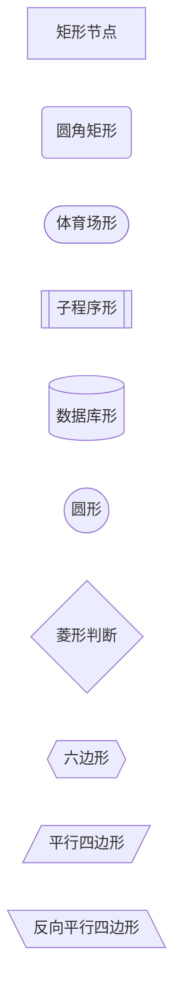
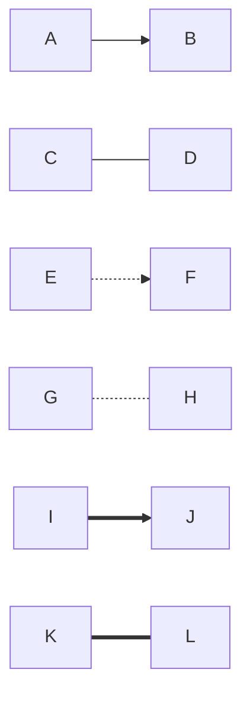
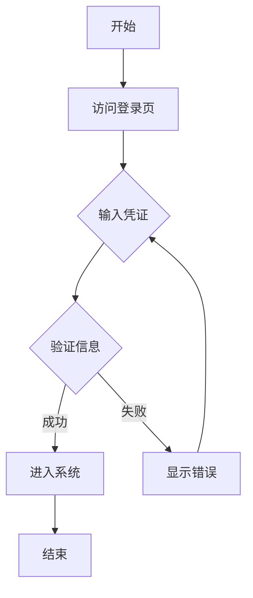
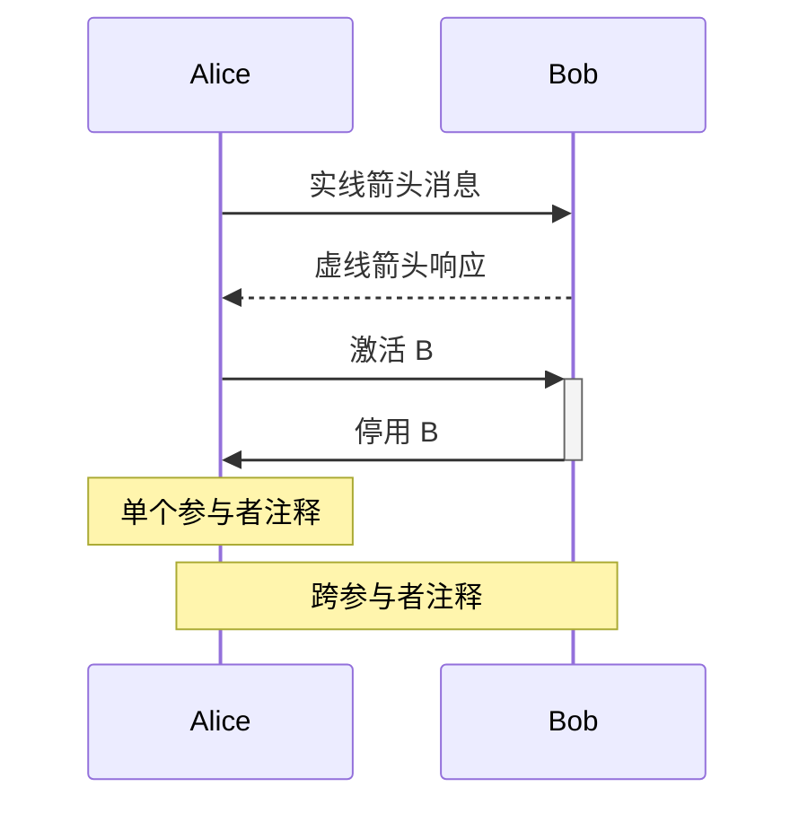
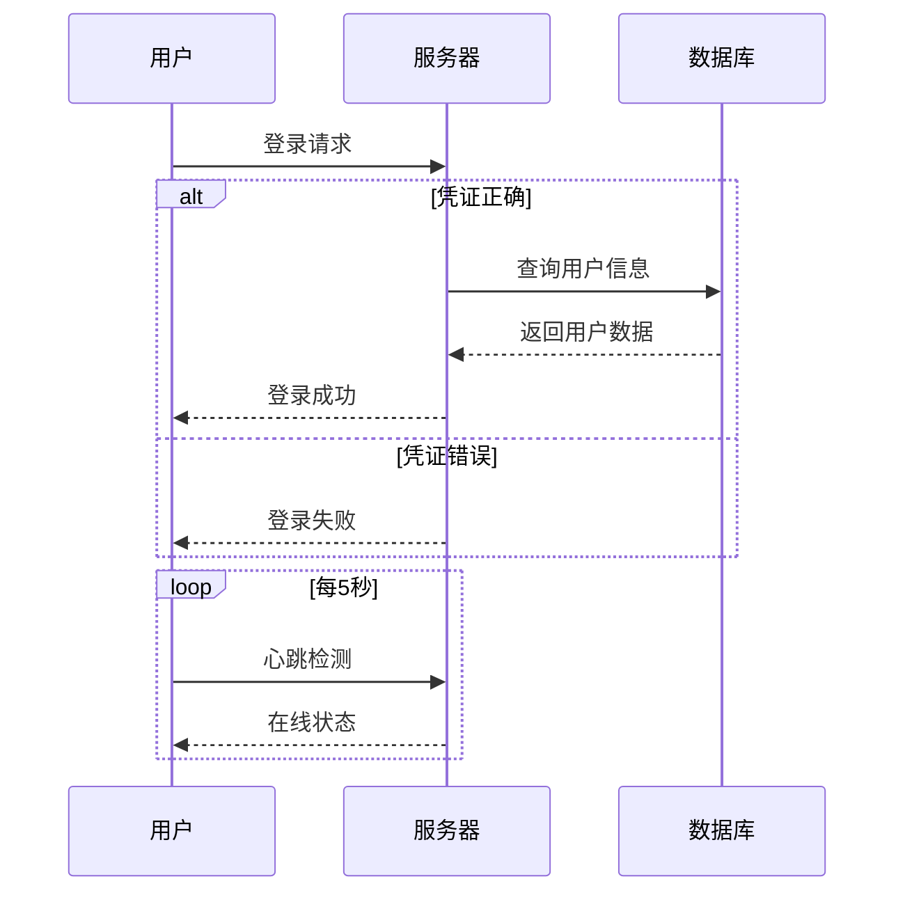
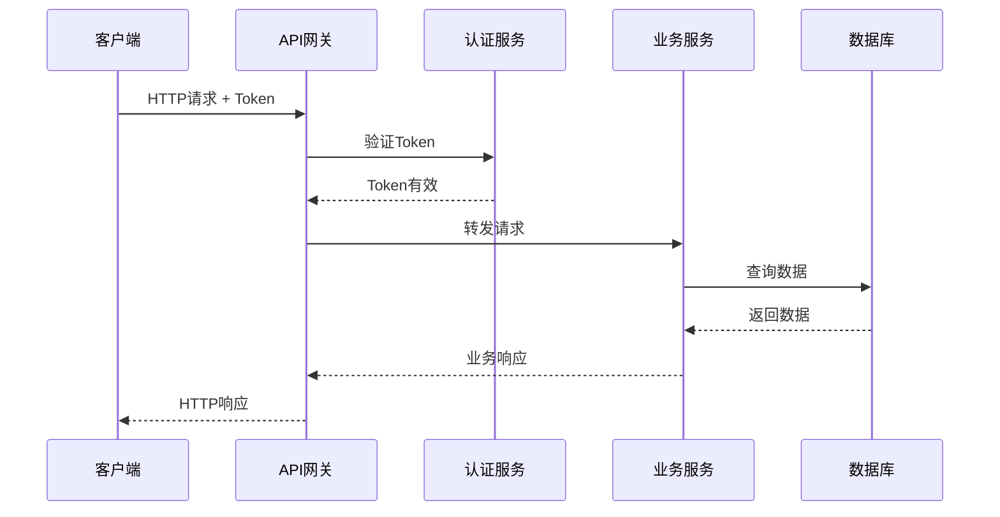
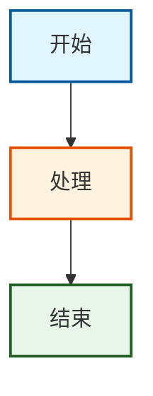

import Tabs from '@theme/Tabs';
import TabItem from '@theme/TabItem';
import CodeBlock from '@theme/CodeBlock';
import Admonition from '@theme/Admonition';

# Mermaid Basics Tutorial

## 📚 What is Mermaid?

Mermaid is a text-based diagram generation tool that creates various professional diagrams through simple text descriptions. Its core concept is "code as diagram," making diagram creation and maintenance as simple as writing code.

### Core Advantages

- **Version Control Friendly**: Plain text format, manageable with Git
- **Easy to Maintain**: Modifying diagrams only requires editing text
- **Platform Universal**: Supports GitHub, GitLab, Notion, Obsidian, and many other platforms
- **Real-time Preview**: Write and see immediately, what you see is what you get
- **No Design Skills Required**: Focus on content, styles are handled automatically

## 🛠️ Environment Setup

<Tabs>
  <TabItem value="vscode" label="VS Code" default>

#### Install Mermaid Plugin

<CodeBlock language="text">
{`You: Please help me set up the Mermaid environment in VS Code

Gemini: I'll help you configure the Mermaid development environment in VS Code.

📦 Extensions to install:

1. Mermaid Preview
   - Extension ID: bierner.markdown-mermaid
   - Function: Preview Mermaid diagrams in Markdown

2. Mermaid Editor
   - Extension ID: tomoyukim.vscode-mermaid-editor
   - Function: Dedicated Mermaid editor

Installation commands:
code --install-extension bierner.markdown-mermaid
code --install-extension tomoyukim.vscode-mermaid-editor

✅ Configuration complete! Now you can:
- Use \`\`\`mermaid code blocks in .md files
- Use Ctrl+Shift+V to preview diagrams
- Right-click and select "Preview Mermaid" to view diagrams`}
</CodeBlock>

  </TabItem>
  <TabItem value="online" label="Online Editor">

#### Mermaid Live Editor

Visit [Mermaid Live Editor](https://mermaid.live) to start using immediately, no configuration needed.

Features:
- Real-time preview
- Export SVG/PNG
- Share links
- Theme switching

  </TabItem>
  <TabItem value="github" label="GitHub">

#### GitHub Native Support

GitHub automatically renders Mermaid code blocks, just use in Markdown:

<CodeBlock language="markdown">
{`\`\`\`mermaid
graph TD
    A[开始] --> B[处理]
    B --> C[结束]
\`\`\``}
</CodeBlock>

  </TabItem>
</Tabs>

## 📊 Flowchart

Flowcharts are the most commonly used diagram type, used to display processes, algorithms, or workflows.

### Basic Syntax

#### Chart Direction

<CodeBlock language="mermaid">
{`graph TD  %% Top Down - from top to bottom
graph LR  %% Left to Right - from left to right
graph BT  %% Bottom to Top - from bottom to top
graph RL  %% Right to Left - from right to left`}
</CodeBlock>

#### Node Shapes

<CodeBlock language="mermaid">
{`graph LR
    A[矩形节点]
    B(圆角矩形)
    C([体育场形])
    D[[子程序形]]
    E[(数据库形)]
    F((圆形))
    G{菱形判断}
    H{{六边形}}
    I[/平行四边形/]
    J[\\反向平行四边形\\]`}
</CodeBlock>

#### Connection Line Styles

<CodeBlock language="mermaid">
{`graph LR
    A --> B     %% Solid arrow
    C --- D     %% Solid line
    E -.-> F    %% Dashed arrow
    G -.- H     %% Dashed line
    I ==> J     %% Thick arrow
    K === L     %% Thick line`}
</CodeBlock>

### Practical Examples

#### User Login Flow

<CodeBlock language="mermaid">
{`graph TD
    A[开始] --> B[访问登录页]
    B --> C{输入凭证}
    C --> D{验证信息}
    D -->|成功| E[进入系统]
    D -->|失败| F[显示错误]
    F --> C
    E --> G[结束]`}
</CodeBlock>

<Admonition type="tip" title="AI-Assisted Creation">
Use Gemini CLI to quickly generate flowcharts through natural language:

<CodeBlock language="text">
{`You: Help me generate an order processing flowchart, including ordering, payment, shipping, and delivery

Gemini: I'll generate an order processing flowchart for you:

\`\`\`mermaid
graph TD
    Start[客户访问商城] --> Browse[浏览商品]
    Browse --> AddCart[加入购物车]
    AddCart --> Checkout{结算}
    Checkout --> Payment[选择支付方式]
    Payment --> Pay{支付}
    Pay -->|成功| OrderConfirm[订单确认]
    Pay -->|失败| PayError[支付失败]
    PayError --> Payment
    OrderConfirm --> Warehouse[仓库处理]
    Warehouse --> Ship[发货]
    Ship --> Transit[运输中]
    Transit --> Deliver{签收}
    Deliver -->|成功| Complete[订单完成]
    Deliver -->|失败| Return[退货流程]
    Complete --> End[结束]
\`\`\``}
</CodeBlock>
</Admonition>

## 🔄 Sequence Diagram

Sequence diagrams are used to show the interaction order between objects, particularly suitable for describing communication processes between system components.

### Basic Syntax

<CodeBlock language="mermaid">
{`sequenceDiagram
    participant A as Alice
    participant B as Bob

    A->>B: 实线箭头消息
    B-->>A: 虚线箭头响应
    A->>+B: 激活 B
    B->>-A: 停用 B

    Note over A: 单个参与者注释
    Note over A,B: 跨参与者注释`}
</CodeBlock>

### Advanced Features

#### Loops and Conditions

<CodeBlock language="mermaid">
{`sequenceDiagram
    participant U as 用户
    participant S as 服务器
    participant D as 数据库

    U->>S: 登录请求

    alt 凭证正确
        S->>D: 查询用户信息
        D-->>S: 返回用户数据
        S-->>U: 登录成功
    else 凭证错误
        S-->>U: 登录失败
    end

    loop 每5秒
        U->>S: 心跳检测
        S-->>U: 在线状态
    end`}
</CodeBlock>

### Practical Example: API Call Flow

<CodeBlock language="mermaid">
{`sequenceDiagram
    participant C as 客户端
    participant G as API网关
    participant A as 认证服务
    participant B as 业务服务
    participant D as 数据库

    C->>G: HTTP请求 + Token
    G->>A: 验证Token
    A-->>G: Token有效
    G->>B: 转发请求
    B->>D: 查询数据
    D-->>B: 返回数据
    B-->>G: 业务响应
    G-->>C: HTTP响应`}
</CodeBlock>

## 🎨 Styles and Themes

### Custom Node Styles

<CodeBlock language="mermaid">
{`graph TD
    A[开始]:::startClass
    B[处理]:::processClass
    C[结束]:::endClass

    A --> B --> C

    classDef startClass fill:#e1f5fe,stroke:#01579b,stroke-width:2px
    classDef processClass fill:#fff3e0,stroke:#e65100,stroke-width:2px
    classDef endClass fill:#e8f5e9,stroke:#1b5e20,stroke-width:2px`}
</CodeBlock>

### Theme Configuration

<Tabs>
  <TabItem value="default" label="Default Theme" default>

<CodeBlock language="mermaid">
{`%%{init: {'theme':'default'}}%%
graph TD
    A[默认主题] --> B[清晰简洁]
    B --> C[适合大多数场景]`}
</CodeBlock>

  </TabItem>
  <TabItem value="dark" label="Dark Theme">

<CodeBlock language="mermaid">
{`%%{init: {'theme':'dark'}}%%
graph TD
    A[暗色主题] --> B[适合深色背景]
    B --> C[减少眼部疲劳]`}
</CodeBlock>

  </TabItem>
  <TabItem value="forest" label="Forest Theme">

<CodeBlock language="mermaid">
{`%%{init: {'theme':'forest'}}%%
graph TD
    A[森林主题] --> B[绿色调]
    B --> C[自然清新]`}
</CodeBlock>

  </TabItem>
</Tabs>

## 💡 Best Practices

  

    <h4>📝 Naming Conventions</h4>
    <ul>
      <li>Use meaningful node IDs</li>
      <li>Keep labels concise and clear</li>
      <li>Avoid overly long text</li>
    </ul>
  

  

    <h4>🎯 Layout Optimization</h4>
    <ul>
      <li>Choose appropriate chart direction</li>
      <li>Control diagram complexity</li>
      <li>Use subgraph grouping appropriately</li>
    </ul>
  

  

    <h4>🎨 Visual Design</h4>
    <ul>
      <li>Maintain style consistency</li>
      <li>Use colors to distinguish categories</li>
      <li>Avoid over-decoration</li>
    </ul>
  

## 🚀 Next Steps

Congratulations on mastering the basics of Mermaid! Next you can:

  <a href="../mermaid-advanced" className="next-button">
    Learn Mermaid Advanced Features →
  </a>
  <a href="../ai-assistance" className="next-button secondary">
    Explore AI-Assisted Creation →
  </a>

