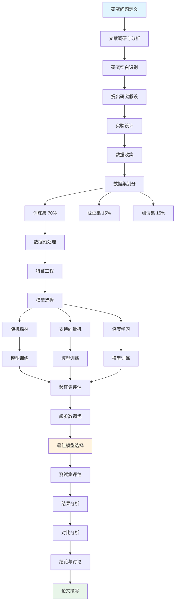

import CodeBlock from '@theme/CodeBlock';
import Admonition from '@theme/Admonition';

# Practical Projects

## 📝 Project 1: Academic Paper Diagram Suite

### Project Objective
Create a complete diagram suite for an academic paper on machine learning, including research methodology flowcharts, experimental design diagrams, data analysis workflows, and result comparison charts.

### 1.1 Research Methodology Flowchart

<CodeBlock language="mermaid">
{`graph TB
    Start[研究问题定义] --> Literature[文献调研与分析]
    Literature --> Gap[研究空白识别]
    Gap --> Hypothesis[提出研究假设]
    
    Hypothesis --> Design[实验设计]
    Design --> Data[数据收集]
    
    Data --> Split[数据集划分]
    Split --> Train[训练集 70%]
    Split --> Valid[验证集 15%]
    Split --> Test[测试集 15%]
    
    Train --> Preprocess[数据预处理]
    Preprocess --> Feature[特征工程]
    
    Feature --> Models[模型选择]
    Models --> RF[随机森林]
    Models --> SVM[支持向量机]
    Models --> DL[深度学习]
    
    RF --> Training1[模型训练]
    SVM --> Training2[模型训练]
    DL --> Training3[模型训练]
    
    Training1 --> Validation[验证集评估]
    Training2 --> Validation
    Training3 --> Validation
    
    Validation --> Tuning[超参数调优]
    Tuning --> Best[最佳模型选择]
    Best --> Testing[测试集评估]
    
    Testing --> Analysis[结果分析]
    Analysis --> Comparison[对比分析]
    Comparison --> Conclusion[结论与讨论]
    Conclusion --> Paper[论文撰写]
    
    style Start fill:#e1f5fe
    style Paper fill:#e8f5e9
    style Best fill:#fff3e0`}
</CodeBlock>

### 1.2 Experimental Design Diagram

### 1.3 Data Processing Pipeline

<CodeBlock language="mermaid">
{`sequenceDiagram
    participant Raw as 原始数据
    participant Clean as 数据清洗
    participant Transform as 数据转换
    participant Feature as 特征提取
    participant Scale as 特征缩放
    participant Select as 特征选择
    participant Model as 模型输入
    
    Raw->>Clean: 缺失值处理
    Clean->>Clean: 异常值检测
    Clean->>Transform: 数据类型转换
    Transform->>Feature: 特征工程
    Feature->>Scale: 标准化/归一化
    Scale->>Select: 特征重要性分析
    Select->>Model: 最终特征集
    
    Note over Clean: 删除重复数据 填充缺失值 异常值处理
    Note over Feature: 多项式特征 交互特征 领域特征
    Note over Select: PCA 互信息 递归特征消除`}
</CodeBlock>

### 1.4 Results Visualization

<CodeBlock language="mermaid">
{`pie title 模型性能对比（准确率）
    "随机森林" : 92.5
    "支持向量机" : 89.3
    "深度学习" : 94.7
    "集成模型" : 96.2`}
</CodeBlock>

<Admonition type="info" title="Project Deliverables">
1. **Flowchart Collection**: PDF format, 300 DPI
2. **LaTeX Source Code**: Ready for direct embedding in papers
3. **SVG Vector Graphics**: Support lossless scaling
4. **Documentation**: Diagram usage guide
</Admonition>

## 🏗️ Project 2: System Architecture Documentation

### Project Objective
Create complete architecture documentation diagrams for a microservices e-commerce system, including system architecture diagrams, data flow diagrams, API sequence diagrams, and deployment architecture diagrams.

### 2.1 Overall System Architecture

<CodeBlock language="text">
{`You: Generate an overall architecture diagram for the e-commerce system

Gemini: I'll create a complete e-commerce system architecture diagram:

\`\`\`mermaid
graph TB
    subgraph "前端应用"
        Web[Web商城]
        Mobile[移动APP]
        Admin[管理后台]
        Merchant[商家平台]
    end
    
    subgraph "接入层"
        CDN[CDN加速]
        WAF[Web防火墙]
        LB[负载均衡]
        Gateway[API网关]
    end
    
    subgraph "微服务层"
        subgraph "核心服务"
            User[用户服务]
            Product[商品服务]
            Order[订单服务]
            Payment[支付服务]
        end
        
        subgraph "业务服务"
            Cart[购物车]
            Search[搜索服务]
            Recommend[推荐服务]
            Inventory[库存服务]
        end
        
        subgraph "支撑服务"
            Notification[通知服务]
            File[文件服务]
            Report[报表服务]
            Workflow[工作流服务]
        end
    end
    
    subgraph "中间件"
        MQ[消息队列]
        Cache[分布式缓存]
        Config[配置中心]
        Registry[服务注册]
    end
    
    subgraph "数据存储"
        MySQL[(MySQL集群)]
        MongoDB[(MongoDB)]
        Redis[(Redis集群)]
        ES[(ElasticSearch)]
    end
    
    Web --> CDN
    Mobile --> CDN
    Admin --> WAF
    Merchant --> WAF
    CDN --> LB
    WAF --> LB
    LB --> Gateway
    
    Gateway --> User
    Gateway --> Product
    Gateway --> Order
    Gateway --> Payment
    
    Order --> MQ
    Payment --> MQ
    MQ --> Inventory
    MQ --> Notification
    
    User --> MySQL
    Product --> MongoDB
    Search --> ES
    Cart --> Redis
\`\`\``}
</CodeBlock>

### 2.2 Data Flow Diagram

<CodeBlock language="mermaid">
{`graph LR
    subgraph "数据采集"
        App[应用日志]
        User[用户行为]
        Trans[交易数据]
    end

    subgraph "数据处理"
        Kafka[Kafka队列]
        Flink[实时处理]
        Spark[批处理]
    end

    subgraph "数据存储"
        HDFS[HDFS存储]
        Hive[数据仓库]
        HBase[NoSQL存储]
    end

    subgraph "数据服务"
        OLAP[OLAP分析]
        API[数据API]
        Report[报表系统]
    end

    App --> Kafka
    User --> Kafka
    Trans --> Kafka

    Kafka --> Flink
    Kafka --> Spark

    Flink --> HBase
    Spark --> HDFS
    HDFS --> Hive

    HBase --> API
    Hive --> OLAP
    OLAP --> Report`}
</CodeBlock>

### 2.3 Core API Sequence Diagram

<CodeBlock language="mermaid">
{`sequenceDiagram
    participant U as 用户
    participant G as API网关
    participant A as 认证服务
    participant O as 订单服务
    participant I as 库存服务
    participant P as 支付服务
    participant N as 通知服务
    
    U->>G: 提交订单请求
    G->>A: 验证Token
    A-->>G: Token有效
    
    G->>O: 创建订单
    O->>I: 检查库存
    I-->>O: 库存充足
    O->>I: 锁定库存
    I-->>O: 锁定成功
    
    O->>P: 创建支付单
    P-->>O: 支付单创建成功
    O-->>G: 订单创建成功
    G-->>U: 返回订单信息
    
    U->>G: 支付请求
    G->>P: 执行支付
    P->>P: 调用第三方支付
    P-->>G: 支付成功
    G-->>U: 支付完成
    
    P->>O: 更新订单状态
    O->>I: 扣减库存
    O->>N: 发送通知
    N-->>U: 订单确认邮件`}
</CodeBlock>

## 💼 Project 3: Business Plan Diagrams

### Project Objective
Create professional diagrams for a startup business plan, including business model canvas, market analysis charts, product roadmap, and organizational structure diagrams.

### 3.1 Business Model Canvas

<CodeBlock language="mermaid">
{`graph TB
    subgraph "商业模式画布"
        subgraph "基础设施"
            KP[关键合作伙伴 ・技术供应商 ・物流合作 ・支付平台]
            KA[关键活动 ・平台运营 ・技术开发 ・市场推广]
            KR[关键资源 ・技术团队 ・平台系统 ・用户数据]
        end
        
        subgraph "产品价值"
            VP[价值主张 ・一站式解决方案 ・优质用户体验 ・性价比高]
        end
        
        subgraph "客户界面"
            CR[客户关系 ・自助服务 ・社区支持 ・专属客服]
            CH[渠道通路 ・线上平台 ・移动应用 ・合作渠道]
            CS[客户细分 ・个人用户 ・中小企业 ・大型企业]
        end
        
        subgraph "财务状况"
            C$[成本结构 ・技术开发 ・运营成本 ・营销费用]
            R$[收入来源 ・订阅费用 ・交易佣金 ・增值服务]
        end
    end
    
    KP --> KA
    KA --> VP
    KR --> VP
    VP --> CR
    VP --> CH
    CR --> CS
    CH --> CS
    KA --> C$
    KR --> C$
    CS --> R$`}
</CodeBlock>

### 3.2 Market Growth Forecast

<CodeBlock language="mermaid">
{`gantt
    title 产品发展路线图
    dateFormat YYYY-MM-DD
    axisFormat %Y-Q%q

    section 产品开发
    MVP版本           :done, mvp, 2024-01-01, 90d
    功能完善           :done, feature, after mvp, 120d
    2.0版本开发        :active, v2, 2024-07-01, 150d
    3.0版本规划        :v3, 2025-01-01, 180d

    section 市场拓展
    种子用户获取       :done, seed, 2024-02-01, 60d
    市场推广           :done, market, 2024-04-01, 90d
    规模化增长         :active, scale, 2024-07-01, 180d
    国际化             :intl, 2025-01-01, 365d

    section 融资计划
    天使轮             :done, angel, 2024-01-15, 30d
    Pre-A轮            :done, prea, 2024-06-01, 45d
    A轮                :active, arounda, 2024-11-01, 60d
    B轮                :roundb, 2025-06-01, 60d`}
</CodeBlock>

### 3.3 Organizational Structure

<CodeBlock language="mermaid">
{`graph TB
    CEO[CEO 首席执行官]
    
    CEO --> CTO[CTO 首席技术官]
    CEO --> COO[COO 首席运营官]
    CEO --> CFO[CFO 首席财务官]
    CEO --> CMO[CMO 首席营销官]
    
    CTO --> Dev[开发团队 15人]
    CTO --> QA[测试团队 5人]
    CTO --> DevOps[运维团队 3人]
    
    COO --> Product[产品团队 8人]
    COO --> Support[客服团队 10人]
    COO --> Operations[运营团队 6人]
    
    CFO --> Finance[财务部 4人]
    CFO --> Legal[法务部 2人]
    
    CMO --> Marketing[市场部 7人]
    CMO --> Sales[销售部 12人]
    CMO --> BD[商务拓展 5人]
    
    style CEO fill:#e1f5fe
    style CTO fill:#fff3e0
    style COO fill:#f3e5f5
    style CFO fill:#e8f5e9
    style CMO fill:#fce4ec`}
</CodeBlock>

## 🎯 Comprehensive Exercises

### Exercise Tasks

  

    <h4>📚 Exercise 1: Technical Documentation</h4>
    
Create for your open source project:

    <ul>
      <li>System architecture diagram</li>
      <li>API flow diagram</li>
      <li>Deployment architecture diagram</li>
      <li>Data model diagram</li>
    </ul>
  

  

    <h4>🎓 Exercise 2: Academic Diagrams</h4>
    
Prepare for research paper:

    <ul>
      <li>Experimental workflow diagram</li>
      <li>Algorithm flowchart</li>
      <li>Data analysis diagram</li>
      <li>Results comparison chart</li>
    </ul>
  

  

    <h4>💼 Exercise 3: Business Presentation</h4>
    
Create for project reporting:

    <ul>
      <li>Project timeline</li>
      <li>Team structure diagram</li>
      <li>Business process diagram</li>
      <li>Financial analysis chart</li>
    </ul>
  

### Evaluation Criteria

<Admonition type="success" title="Excellent Work Standards">
- **Accuracy**: Information is accurate, logic is clear
- **Aesthetics**: Coordinated colors, reasonable layout
- **Standards Compliance**: Meets industry standards
- **Innovation**: Has unique presentation format
- **Practicality**: Effectively communicates information
</Admonition>

## 📦 Project Template Downloads

  <h3>Downloadable Resources</h3>
  <ul>
    <li>📄 Mermaid diagram template collection</li>
    <li>🎨 Draw.io style library</li>
    <li>📊 Academic paper diagram examples</li>
    <li>🏗️ System architecture diagram templates</li>
    <li>💼 Business diagram templates</li>
  </ul>

  
Visit <a href="https://github.com/your-repo/diagram-templates" target="_blank">GitHub Repository</a> to get all templates

## 🎉 Course Completion

Congratulations on completing the diagram creation course! You have now mastered:

  

    ✅
    Mermaid code-based diagram creation
  

  

    ✅
    Draw.io professional diagram design
  

  

    ✅
    AI-assisted diagram creation techniques
  

  

    ✅
    Diagram applications in different scenarios
  

  

    ✅
    Practical project experience
  

### Continue Learning

  
Recommended learning paths:

  <ul>
    <li>Deep dive into data visualization (D3.js, ECharts)</li>
    <li>Explore UML modeling tools (PlantUML, StarUML)</li>
    <li>Learn infographic design</li>
    <li>Master interactive charts (Plotly, Bokeh)</li>
  </ul>

