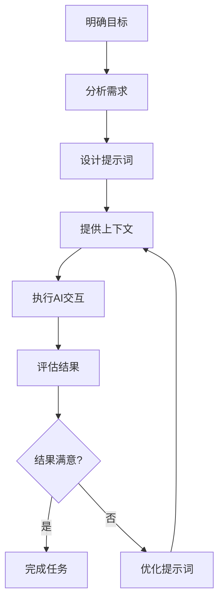
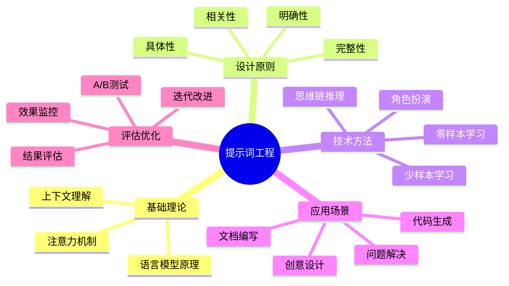
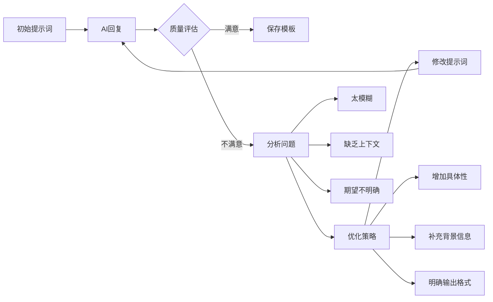
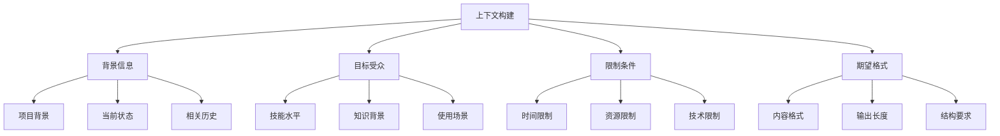
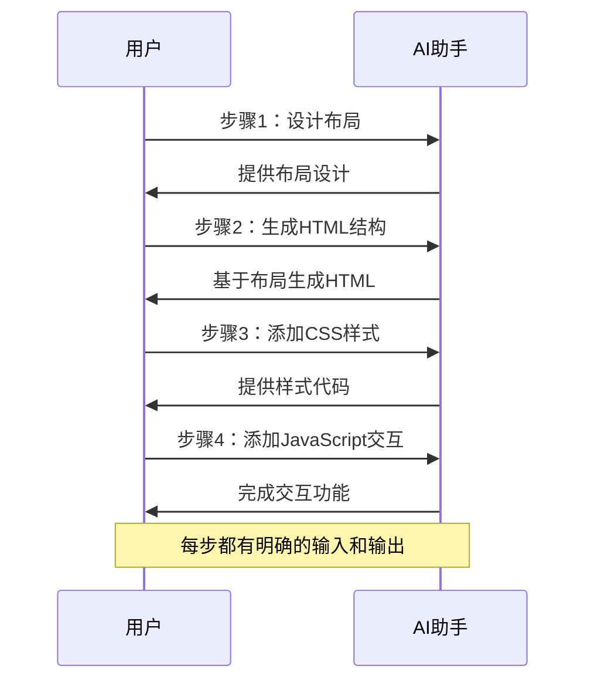
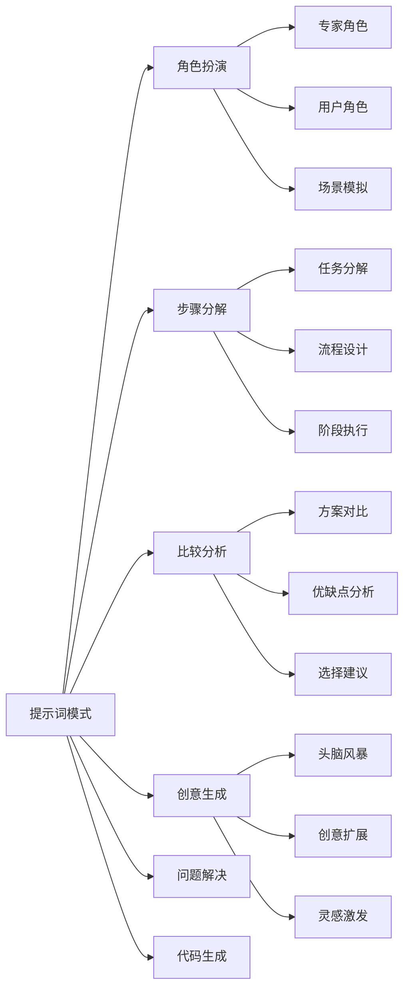
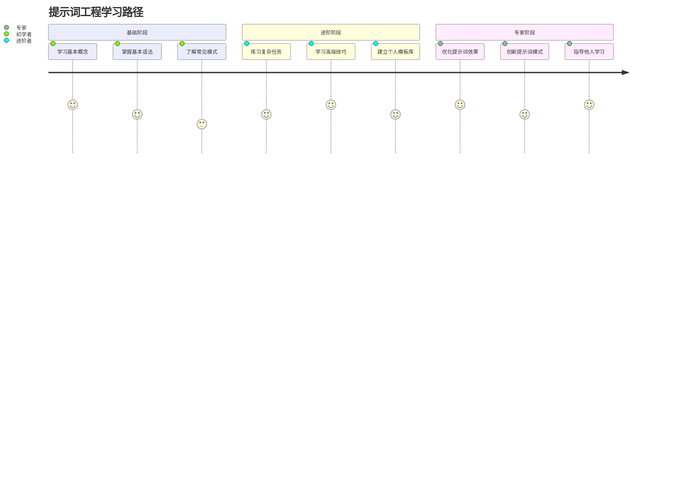

import Tabs from '@theme/Tabs';
import TabItem from '@theme/TabItem';

# 提示词工程基础

## 什么是提示词工程

提示词工程是一种优化与AI系统交互的技术，旨在通过精心设计的输入（即"提示词"）来获得更准确、相关和有用的输出。在AI辅助开发中，掌握提示词工程技巧可以显著提高工作效率和输出质量。

### 提示词工程核心流程



:::tip 提示词工程的重要性

掌握提示词工程可以带来以下好处：

- **提高准确性**：AI更准确理解您的需求
- **增强相关性**：获得更相关和有用的输出
- **减少沟通成本**：减少来回沟通的次数
- **提升效率**：显著提高开发效率

:::

:::info 适用场景

提示词工程特别适用于：

- 代码生成和调试
- 文档编写和翻译
- 创意设计和头脑风暴
- 问题解决和方案分析

:::

## 提示词工程知识体系



## 编写有效提示词的技巧

### 明确性和具体性

有效的提示词应该遵循"具体、明确、完整"的原则。

<Tabs>
<TabItem value="good" label="好的示例" default>
    ```
    给我5个关于人工智能在日常生活中应用的博客文章主题，每个主题包含一个简短的描述
    ```
</TabItem>
<TabItem value="bad" label="不好的示例">
    ```
    给我一些博客想法
    ```
</TabItem>
</Tabs>

### 提示词优化流程



:::warning 常见错误

避免以下常见错误：

模糊表述：

- 使用"一些"、"几个"等模糊量词
- 缺乏具体的上下文信息
- 没有明确的期望输出格式

歧义问题：

- 使用可能有多种理解的词汇
- 缺少必要的限制条件
- 没有提供示例或参考

:::

**最佳实践：**

- 使用清晰、简洁的语言
- 明确说明你的需求和期望
- 避免模糊或歧义的表述

### 提供上下文

良好的上下文可以帮助AI更准确地理解您的需求和目标。

```
我正在为一个面向初学者的编程博客写文章。请为我提供一个解释'变量'概念的文章大纲，内容应该简单易懂，适合完全没有编程经验的读者。
```

#### 上下文构建框架



:::note 上下文要素

有效的上下文应包含：

1. **背景信息**：解释当前的情况或项目
2. **目标受众**：说明内容的目标读者
3. **限制条件**：描述相关的约束或要求
4. **期望格式**：明确输出的格式要求

:::

### 逐步引导

将复杂任务分解为多个简单步骤，可以显著提高AI的理解和执行效果。

#### 分步执行流程



1. **第一步**："请为我的个人技术博客设计一个简单的首页布局"
2. **第二步**："基于你提供的布局，请给出HTML结构代码"
3. **第三步**："现在，请为这个HTML结构添加基本的CSS样式"

:::success 分步优势

- 每个步骤都有明确的目标
- 可以根据AI的回应调整后续步骤
- 降低了单次任务的复杂度
- 提高了最终结果的质量

:::

### 使用示例和模板

使用模板可以帮助AI更好地理解您期望的输出格式。

:::note 示例模板

请按照以下格式为我的博客文章生成3个标题：

1. **[吸引人的形容词]** + **[主题]** + **[有价值的承诺]**
2. **[数字]** + **[方法/技巧]** + **[实现目标]**
3. **[如何/怎样]** + **[实现目标]** + **[不做某事/使用某方法]**

**示例：**

1. 惊人的时间管理技巧：提高生产力的秘密武器
2. 7个简单方法让你的博客访问量翻倍
3. 如何学会编程而不失去理智

:::

## 常见提示词模式

### 提示词模式分类



### 角色扮演提示

让AI扮演特定角色可以获得更专业和针对性的回答。

```
请你扮演一位经验丰富的前端开发工程师。我是一名刚开始学习HTML和CSS的新手。请用通俗易懂的语言解释什么是响应式设计，为什么它很重要，以及如何开始实现响应式网页。
```

### 步骤分解提示

将复杂任务分解为清晰的步骤，可以获得更系统的解决方案。

```
我想创建一个个人博客网站。请列出实现这个目标的主要步骤，包括:
1. 规划内容和功能
2. 选择技术栈
3. 设计用户界面
4. 开发前端
5. 实现后端功能
6. 测试和调试
7. 部署网站

对于每个步骤，请提供简要说明和可能需要的工具或资源。
```

### 比较分析提示

要求AI进行比较分析时，提供明确的比较维度和标准。

```
请比较WordPress、Ghost和Hugo这三个博客平台，分析它们在以下方面的优缺点：
1. 易用性
2. 定制灵活性
3. 性能
4. SEO友好度
5. 社区支持

为每个平台提供一个总结段落，并给出适合不同类型博主的建议。
```

### 创意生成提示

在要求AI生成创意时，提供具体的约束条件可以获得更实用的建议。

```
我想为我的技术博客创建一个独特的互动元素，以增加读者参与度。请提供5个创新的想法，每个想法都应该：
1. 与技术主题相关
2. 易于实现（不需要复杂的后端）
3. 能够吸引读者互动
4. 有助于增加页面停留时间

对于每个想法，简要解释其工作原理和潜在好处。
```

## 提示词工程实践路径



:::success 学习成果

完成本节学习后，您将能够：

- 编写清晰、具体的提示词
- 使用多种提示词模式
- 通过上下文提供提高AI理解
- 将复杂任务分解为简单步骤

:::
