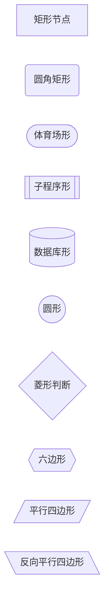
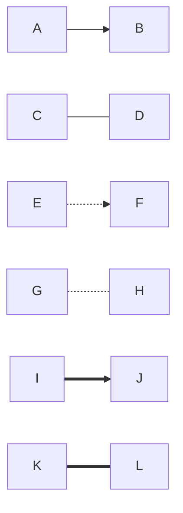
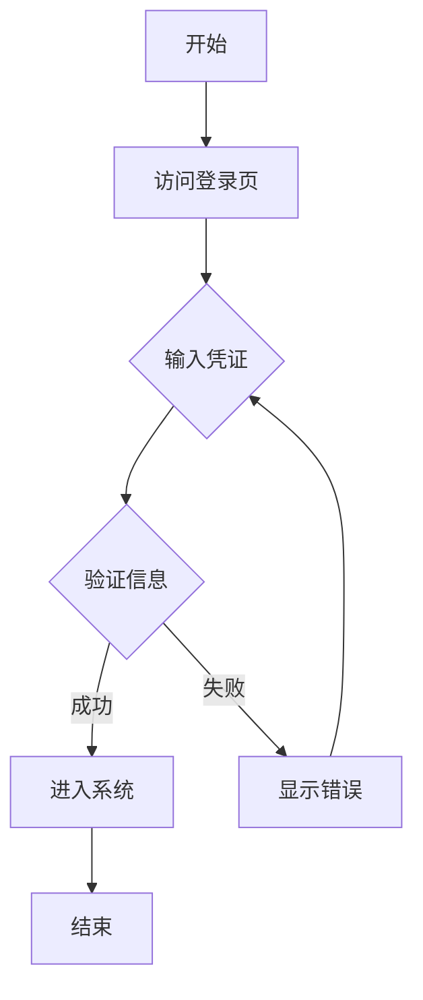
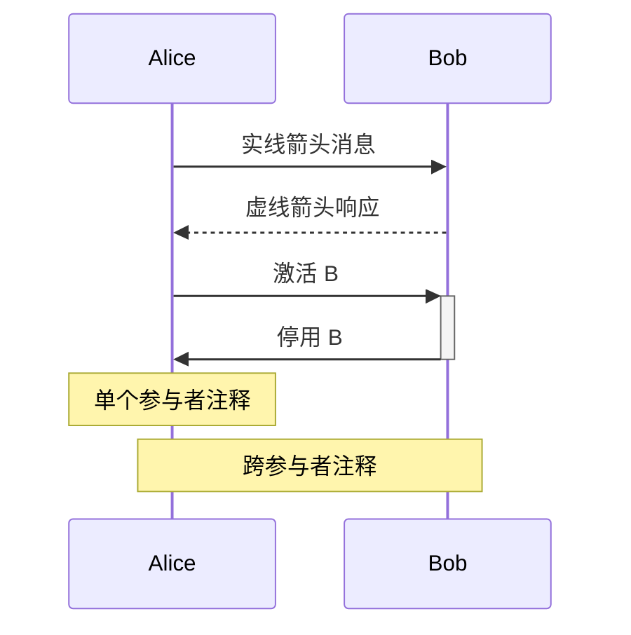
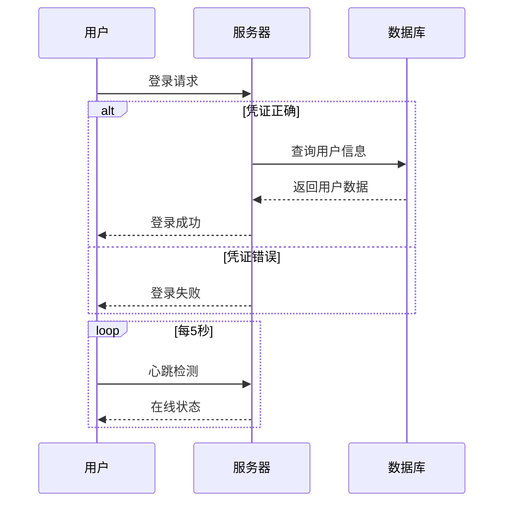
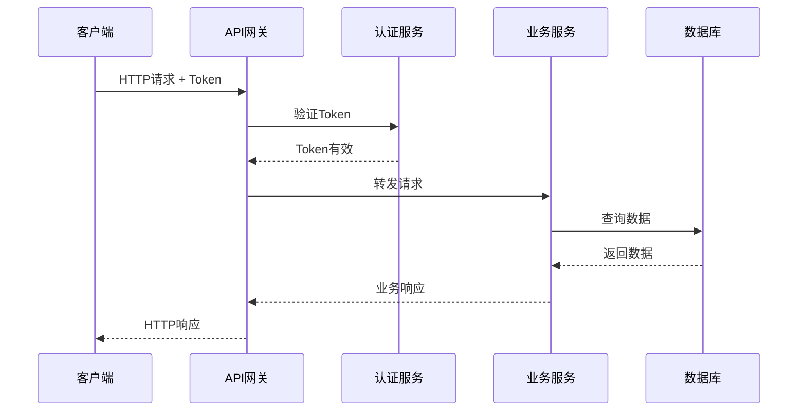
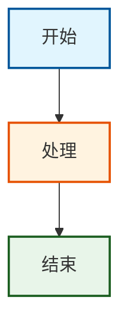

import Tabs from '@theme/Tabs';
import TabItem from '@theme/TabItem';
import CodeBlock from '@theme/CodeBlock';
import Admonition from '@theme/Admonition';

# Mermaid 基础教程

## 什么是 Mermaid

Mermaid 是一个基于文本的图表生成工具，通过简单的文本描述就能生成各种专业图表。它的核心理念是"代码即图表"，让图表的创建和维护变得像编写代码一样简单。

### 核心优势

- **版本控制友好**：纯文本格式，可以使用 Git 管理
- **易于维护**：修改图表只需编辑文本
- **平台通用**：支持 GitHub、GitLab、Notion、Obsidian 等多个平台
- **实时预览**：编写即可见，所见即所得
- **无需设计技能**：专注于内容，样式自动处理

## 环境配置

<Tabs>
<TabItem value="vscode" label="VS Code" default>

#### 安装 Mermaid 插件

<CodeBlock language="text">
{`您：请帮我在 VS Code 中配置 Mermaid 环境

Gemini：我来帮您配置 VS Code 的 Mermaid 开发环境。

需要安装的扩展：

1. Mermaid Preview
   - 扩展 ID: bierner.markdown-mermaid
   - 功能：在 Markdown 中预览 Mermaid 图表

2. Mermaid Editor
   - 扩展 ID: tomoyukim.vscode-mermaid-editor
   - 功能：专门的 Mermaid 编辑器

安装命令：
code --install-extension bierner.markdown-mermaid
code --install-extension tomoyukim.vscode-mermaid-editor

配置完成！现在您可以：
- 在 .md 文件中使用 \`\`\`mermaid 代码块
- 使用 Ctrl+Shift+V 预览图表
- 右键选择 "Preview Mermaid" 查看图表`}
</CodeBlock>

</TabItem>
<TabItem value="online" label="在线编辑器">

#### Mermaid Live Editor

访问 [Mermaid Live Editor](https://mermaid.live) 即可开始使用，无需任何配置。

特点：

- 实时预览
- 导出 SVG/PNG
- 分享链接
- 主题切换

</TabItem>
<TabItem value="github" label="GitHub">

#### GitHub 原生支持

GitHub 自动渲染 Mermaid 代码块，只需在 Markdown 中使用：

<CodeBlock language="markdown">
{`\`\`\`mermaid
graph TD
    A[开始] --> B[处理]
    B --> C[结束]
\`\`\``}
</CodeBlock>

</TabItem>
</Tabs>

## 流程图（Flowchart）

流程图是最常用的图表类型，用于展示过程、算法或工作流程。

### 基础语法

#### 图表方向

<CodeBlock language="mermaid">
{`graph TD  %% Top Down - 从上到下
graph LR  %% Left to Right - 从左到右
graph BT  %% Bottom to Top - 从下到上
graph RL  %% Right to Left - 从右到左`}
</CodeBlock>

#### 节点形状

<CodeBlock language="mermaid">
{`graph LR
    A[矩形节点]
    B(圆角矩形)
    C([体育场形])
    D[[子程序形]]
    E[(数据库形)]
    F((圆形))
    G{菱形判断}
    H{{六边形}}
    I[/平行四边形/]
    J[\\反向平行四边形\\]`}
</CodeBlock>

#### 连接线样式

<CodeBlock language="mermaid">
{`graph LR
    A --> B     %% 实线箭头
    C --- D     %% 实线
    E -.-> F    %% 虚线箭头
    G -.- H     %% 虚线
    I ==> J     %% 粗线箭头
    K === L     %% 粗线`}
</CodeBlock>

### 实战示例

#### 用户登录流程

<CodeBlock language="mermaid">
{`graph TD
    A[开始] --> B[访问登录页]
    B --> C{输入凭证}
    C --> D{验证信息}
    D -->|成功| E[进入系统]
    D -->|失败| F[显示错误]
    F --> C
    E --> G[结束]`}
</CodeBlock>

<Admonition type="tip" title="AI 辅助创建">
使用 Gemini CLI 可以通过自然语言快速生成流程图：

<CodeBlock language="text">
{`您：帮我生成一个订单处理流程图，包括下单、支付、发货、收货

Gemini：我来为您生成订单处理流程图：

\`\`\`mermaid
graph TD
    Start[客户访问商城] --> Browse[浏览商品]
    Browse --> AddCart[加入购物车]
    AddCart --> Checkout{结算}
    Checkout --> Payment[选择支付方式]
    Payment --> Pay{支付}
    Pay -->|成功| OrderConfirm[订单确认]
    Pay -->|失败| PayError[支付失败]
    PayError --> Payment
    OrderConfirm --> Warehouse[仓库处理]
    Warehouse --> Ship[发货]
    Ship --> Transit[运输中]
    Transit --> Deliver{签收}
    Deliver -->|成功| Complete[订单完成]
    Deliver -->|失败| Return[退货流程]
    Complete --> End[结束]
\`\`\``}
</CodeBlock>
</Admonition>

## 时序图（Sequence Diagram）

时序图用于展示对象之间的交互顺序，特别适合描述系统组件间的通信过程。

### 基础语法

<CodeBlock language="mermaid">
{`sequenceDiagram
    participant A as Alice
    participant B as Bob

    A->>B: 实线箭头消息
    B-->>A: 虚线箭头响应
    A->>+B: 激活 B
    B->>-A: 停用 B

    Note over A: 单个参与者注释
    Note over A,B: 跨参与者注释`}
</CodeBlock>

### 高级特性

#### 循环和条件

<CodeBlock language="mermaid">
{`sequenceDiagram
    participant U as 用户
    participant S as 服务器
    participant D as 数据库

    U->>S: 登录请求

    alt 凭证正确
        S->>D: 查询用户信息
        D-->>S: 返回用户数据
        S-->>U: 登录成功
    else 凭证错误
        S-->>U: 登录失败
    end

    loop 每5秒
        U->>S: 心跳检测
        S-->>U: 在线状态
    end`}
</CodeBlock>

### 实战示例：API 调用流程

<CodeBlock language="mermaid">
{`sequenceDiagram
    participant C as 客户端
    participant G as API网关
    participant A as 认证服务
    participant B as 业务服务
    participant D as 数据库

    C->>G: HTTP请求 + Token
    G->>A: 验证Token
    A-->>G: Token有效
    G->>B: 转发请求
    B->>D: 查询数据
    D-->>B: 返回数据
    B-->>G: 业务响应
    G-->>C: HTTP响应`}
</CodeBlock>

## 样式和主题

### 自定义节点样式

<CodeBlock language="mermaid">
{`graph TD
    A[开始]:::startClass
    B[处理]:::processClass
    C[结束]:::endClass

    A --> B --> C

    classDef startClass fill:#e1f5fe,stroke:#01579b,stroke-width:2px
    classDef processClass fill:#fff3e0,stroke:#e65100,stroke-width:2px
    classDef endClass fill:#e8f5e9,stroke:#1b5e20,stroke-width:2px`}
</CodeBlock>

### 主题配置

<Tabs>
<TabItem value="default" label="默认主题" default>

<CodeBlock language="mermaid">
{`%%{init: {'theme':'default'}}%%
graph TD
    A[默认主题] --> B[清晰简洁]
    B --> C[适合大多数场景]`}
</CodeBlock>

</TabItem>
<TabItem value="dark" label="暗色主题">

<CodeBlock language="mermaid">
{`%%{init: {'theme':'dark'}}%%
graph TD
    A[暗色主题] --> B[适合深色背景]
    B --> C[减少眼部疲劳]`}
</CodeBlock>

</TabItem>
<TabItem value="forest" label="森林主题">

<CodeBlock language="mermaid">
{`%%{init: {'theme':'forest'}}%%
graph TD
    A[森林主题] --> B[绿色调]
    B --> C[自然清新]`}
</CodeBlock>

</TabItem>
</Tabs>

## 最佳实践

**命名规范**：

- 使用有意义的节点ID
- 保持标签简洁明了
- 避免过长的文本

**布局优化**：

- 选择合适的图表方向
- 控制图表复杂度
- 合理使用子图分组

**视觉设计**：

- 保持样式一致性
- 使用颜色区分类别
- 避免过度装饰

## 下一步

恭喜您掌握了 Mermaid 的基础知识。接下来可以：

- [学习 Mermaid 高级特性](../mermaid-advanced)
- [探索 AI 辅助创作](../ai-assistance)
