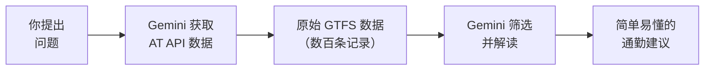

你的工具已就绪。现在让它们开始工作 —— 让 Gemini CLI 查询实时 Auckland Transport 数据，给你关于通勤的建议。

<Info>
**随时保留你的 API 密钥。** 本节中的每条提示词都包含带 `YOUR_API_KEY` 的 URL —— 每次都需要替换为你的实际订阅密钥。如果你使用 Wispr Flow，自然地说出描述部分，然后将带有密钥的 API URL 粘贴到提示词中。
</Info>

## 启动 Gemini CLI

打开终端并启动 Gemini CLI。这是你需要输入的唯一"命令"：

```bash title="复制此命令"
gemini
```

从这里开始，一切都是自然语言 —— 说出来或打出来。

## 检查你的路线是否有延误

这是你的第一次真实通勤查询。说出或输入这条提示词：

```text title="说出或复制此提示词"
I want to check if my bus is running late in Auckland.
Fetch the real-time trip updates from this Auckland Transport API:
https://api.at.govt.nz/realtime/legacy/tripupdates?subscription-key=YOUR_API_KEY

Look for any trips on route 70 and tell me in plain English if there are delays, how long they are, and whether I should leave early.
```

<Tip>
**替换 `YOUR_API_KEY`** 为你的实际订阅密钥，并把 `route 70` 改为你实际的路线号。如果你使用 Wispr Flow 说出提示词，自然地说出描述部分，然后粘贴 URL 行。
</Tip>

你应该会看到类似这样的内容：

> **70 路 —— 状态：轻微延误**
> - 2 班车比预定时间晚 3–5 分钟
> - 没有取消班次
> - 总体：预计通勤基本正常，但多留 5 分钟余裕

<Tip>
**你的结果会不同。** 数据是实时的，所以你看到的是奥克兰交通网络当前发生的情况。如果没有延误，那是好消息 —— Gemini 会告诉你路线准点运行。
</Tip>

## 检查服务提醒

服务提醒涵盖所有情况 —— 计划施工、紧急中断、路线变更、站点关闭和特殊活动。

```text title="说出或复制此提示词"
Check for service alerts on Auckland public transport.
Fetch the alerts from: https://api.at.govt.nz/realtime/legacy/servicealerts?subscription-key=YOUR_API_KEY

Summarise all current service alerts in plain English. Group them by severity — start with the most disruptive ones.
```

<Info>
**这对日常通勤者来说是最有用的查询**，因为它能发现"延误"数据可能遗漏的情况 —— 比如下周计划的绕道，或者你不知道的站点关闭。
</Info>

## 早晨通勤简报

这是"惊艳时刻" —— 将三个 API 端点组合成一份个性化简报。**根据你的实际通勤情况定制这些细节。**

```text title="说出或复制此提示词"
I need a morning commute briefing for Auckland. I usually take the train from Britomart to Newmarket, or the bus route 70 from Queen Street. Check these three data sources:

1. Trip updates: https://api.at.govt.nz/realtime/legacy/tripupdates?subscription-key=YOUR_API_KEY
2. Service alerts: https://api.at.govt.nz/realtime/legacy/servicealerts?subscription-key=YOUR_API_KEY
3. Vehicle positions: https://api.at.govt.nz/realtime/legacy/vehiclepositions?subscription-key=YOUR_API_KEY

Give me a briefing in plain English: are my routes running on time, any alerts I should know about, and your recommendation for which route to take this morning.
```

<Tip>
**根据你的实际通勤情况定制这条提示词。** 替换为你自己的路线和站点。你描述得越具体，简报就越有用。如果你使用 Wispr Flow，自然地说出描述和你的通勤细节，然后粘贴三个 API URL。
</Tip>

你应该会看到类似这样的内容：

> **你的早晨通勤简报**
>
> **70 路巴士：正常运行** —— 未检测到延误或取消。你在 Queen Street 的出发应该准点。
>
> **Britomart 到 Newmarket 的火车：轻微中断** —— 有一则服务提醒，关于今晚 Newmarket 到 Remuera 之间的轨道维护（不影响你的早晨通勤）。
>
> **影响你的服务提醒：目前没有。**
>
> **建议：** 乘坐你常规的巴士。今天早上一切正常。祝通勤顺利！

## 比较你的通勤选择

在巴士和火车之间难以抉择？直接让 AI 帮你比较。

```text title="说出或复制此提示词"
I have two ways to get to work in Auckland:
Option A: Bus route 70 from Queen Street
Option B: Train from Britomart to Newmarket

Check the real-time data for both routes:
- Trip updates: https://api.at.govt.nz/realtime/legacy/tripupdates?subscription-key=YOUR_API_KEY
- Vehicle positions: https://api.at.govt.nz/realtime/legacy/vehiclepositions?subscription-key=YOUR_API_KEY

Compare both options right now and tell me which one will get me to work faster today.
```

## 我的巴士现在在哪里？

使用车辆位置数据的有趣查询：

```text title="说出或复制此提示词"
Fetch the Auckland Transport vehicle positions from:
https://api.at.govt.nz/realtime/legacy/vehiclepositions?subscription-key=YOUR_API_KEY

Find any vehicles currently operating on route 70.
Tell me where each bus is right now, what direction it is heading, and how many buses are currently running on this route.
```

## 刚才发生了什么？



1. **提问** —— 你说出或打出了一个关于通勤的自然语言问题
2. **获取** —— Gemini CLI 使用其内置的网络获取工具调用了 AT API
3. **解读** —— API 返回了原始 GTFS Realtime 数据（包含数百条记录的 JSON）；Gemini 为你的特定路线进行了筛选
4. **总结** —— Gemini 将技术数据转换为简单易懂的建议

核心洞见：AT API 返回的是为应用程序设计的数据。AI 弥合了原始数据与人类理解之间的鸿沟。你不需要编写任何代码、解析任何 JSON 或了解 GTFS 格式 —— 你只需提问。

## 进一步探索 —— 尝试你自己的问题

上面的提示词只是起点。这里有一些创意问题，展示自然语言有多灵活：

```text title="说出或复制此提示词"
Based on the trip update data, what's the average delay across all Auckland bus routes right now?
Fetch the data from: https://api.at.govt.nz/realtime/legacy/tripupdates?subscription-key=YOUR_API_KEY
```

```text title="说出或复制此提示词"
Are there any trains running early today? Check the trip updates and find any positive schedule deviations:
https://api.at.govt.nz/realtime/legacy/tripupdates?subscription-key=YOUR_API_KEY
```

```text title="说出或复制此提示词"
Give me a confidence rating from 1 to 10 on whether my bus route 70 will be on time today. Base it on the current trip updates and service alerts:
- Trip updates: https://api.at.govt.nz/realtime/legacy/tripupdates?subscription-key=YOUR_API_KEY
- Service alerts: https://api.at.govt.nz/realtime/legacy/servicealerts?subscription-key=YOUR_API_KEY
```

<Tip>
**这就是自然语言的魔力。** 你不需要记忆 API 端点或数据格式 —— 只需描述你想知道什么，Gemini 负责处理剩下的事情。如果 Gemini 不确定你的意思，它会请你澄清。
</Tip>

## 故障排除

<AccordionGroup>
  <Accordion title="Gemini 说无法获取 URL">
    确保 URL 在一行上，没有换行符。检查 `subscription-key=YOUR_API_KEY` 使用的是你的实际密钥，`=` 号两侧没有空格。
  </Accordion>
  <Accordion title="数据看起来是空的，没有行程记录">
    Auckland Transport 根据活跃服务更新实时数据。如果你在深夜或非常早的早晨查询，活跃的行程可能很少（甚至没有）。在通勤高峰时段（早上 7–9 点或下午 4–6 点）再试试。
  </Accordion>
  <Accordion title="Gemini 给出了非常长的技术性输出">
    在你的提示词末尾加上这句话："Explain everything in plain English. Keep it concise — no more than 10 bullet points. I am not a developer." 这会引导 Gemini 简化它的回复。
  </Accordion>
  <Accordion title="Gemini 找不到我的路线">
    AT API 中的 Auckland Transport 路线 ID 有时包含版本后缀（例如"70-201"而不是"70"）。问 Gemini："List all route IDs in the data that contain the number 70" 来找到确切的 ID。
  </Accordion>
  <Accordion title="结果看起来过时或有误">
    实时数据更新频繁，但反映的是当前的运营状态。如果服务完全准点运行，行程更新数据可能记录很少 —— 它主要报告偏离计划的情况。这是正常的 —— 没有消息就是好消息。
  </Accordion>
  <Accordion title="我的语音输入有错误">
    Wispr Flow 偶尔可能误听技术术语或专有名词。你可以在 Gemini CLI 中按 Enter 之前检查并修正文字。如果语音输入错误过多，改为打字或粘贴提示词即可。
  </Accordion>
</AccordionGroup>

<Note>
做得很好 —— 你构建了一个真实的通勤智能工作流。前往[继续探索](/docs/2026-her-waka/tutorial/auckland-commute/keep-going)，了解如何将它变成每日习惯和更进阶的查询。
</Note>
