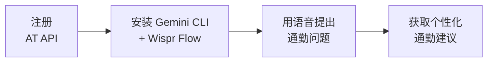

你构建了一个真实的工作流，用 AI 获取个性化通勤智能。让我们看看你完成了什么，以及下一步去哪里。

## 你构建了什么



- 注册了免费的公共 API，了解了什么是 API 密钥
- 使用 AI 获取和解读实时交通数据
- 通过说话，从多个数据源构建了早晨通勤简报
- 使用自然语言比较了通勤选项
- 追踪了奥克兰的实时车辆位置
- 全部免费，不超过 45 分钟

## 你学到了什么

<Tip>
**这里最重要的技能是知道如何将 AI 连接到真实世界的数据源。** 数以千计的免费 API 存在 —— 天气、交通、新闻、体育、金融。你今天使用的技术（给 AI 一个 URL + API 密钥 + 一个问题）几乎适用于所有这些 API。而有了语音输入，你可以不需要碰键盘就做到这一切。
</Tip>

- 如何注册和使用公共 API —— 适用于任何数据源的可迁移技能
- AI 如何弥合原始数据与人类理解之间的鸿沟
- 如何写出能将多个数据源组合成一个答案的提示词
- 如何用自然语言 —— 通过语音或文字 —— 提出复杂的多部分问题
- 实时交通数据如何工作（GTFS Realtime）
- 使用 Wispr Flow 语音输入如何让体验解放双手

## 养成早晨习惯

这个工作流真正的力量在于它成为你日常生活的一部分。以下是让每天早晨通勤检查只需 10 秒的方法：

```text title="说出或复制此提示词"
Morning commute check. I take bus route 70 from Queen Street or the train from Britomart to Newmarket. Check these and tell me which is better today:
- Trip updates: https://api.at.govt.nz/realtime/legacy/tripupdates?subscription-key=YOUR_API_KEY
- Service alerts: https://api.at.govt.nz/realtime/legacy/servicealerts?subscription-key=YOUR_API_KEY
```

<Tip>
**把这个保存为你的每日提示词。** 把它保存在一个文本文件或手机上的备忘录里。每天早晨，打开终端，启动 `gemini`，说出或粘贴你的早晨检查提示词。随着时间推移，你的通勤简报会变成一个 10 秒的习惯。
</Tip>

## 可以尝试的想法

<CardGroup cols={2}>
  <Card title="多模式通勤" icon="route">
    在一次查询中组合巴士、火车和轮渡数据。只需说："What's the fastest way from Devonport to the CBD right now — ferry then walk, or bus to Britomart?"
  </Card>
  <Card title="天气 + 通勤组合" icon="cloud-sun">
    在早晨简报中加入天气数据。说："Check the AT API and also tell me the weather in Auckland — is it raining? Should I take the bus instead of walking to the train station?"
  </Card>
  <Card title="与团队分享" icon="users">
    为你的整个团队创建通勤简报。收集每个人的路线并构建一个检查所有路线的提示词。在 Slack 或 Teams 中分享摘要。
  </Card>
  <Card title="活动日规划" icon="calendar">
    在 Eden Park 或 Mt Smart 的大型活动前，问："Are there extra services running for the event tonight? What's the best public transport option?"
  </Card>
</CardGroup>

## 进阶提示词

<AccordionGroup>
  <Accordion title="提示词：每周通勤分析">
    ```text title="说出或复制此提示词"
    Analyse the Auckland Transport service alerts and tell me which routes have the most disruptions right now.
    Fetch the alerts from: https://api.at.govt.nz/realtime/legacy/servicealerts?subscription-key=YOUR_API_KEY

    What are the most common causes — road works, mechanical issues, events?
    Based on the data, which routes seem most reliable today?
    I commute on route 70 and the train from Britomart. How are they looking?
    ```
  </Accordion>
  <Accordion title="提示词：活动日规划">
    ```text title="说出或复制此提示词"
    There is a big event at Eden Park tonight. Check the Auckland Transport data for any special services or route changes:
    - Service alerts: https://api.at.govt.nz/realtime/legacy/servicealerts?subscription-key=YOUR_API_KEY
    - Trip updates: https://api.at.govt.nz/realtime/legacy/tripupdates?subscription-key=YOUR_API_KEY

    What is the best way to get to Eden Park from the CBD using public transport?
    What should I expect for the journey home after the event?
    ```
  </Accordion>
  <Accordion title="提示词：无障碍检查">
    ```text title="说出或复制此提示词"
    Check the Auckland Transport service alerts for any accessibility issues:
    https://api.at.govt.nz/realtime/legacy/servicealerts?subscription-key=YOUR_API_KEY

    Are there any alerts about lift outages at train stations, temporary stop relocations, or services that are not wheelchair accessible?
    Summarise any accessibility-related alerts in plain English.
    ```
  </Accordion>
</AccordionGroup>

## 其他可以尝试的 API

同样的技术 —— 给 AI 一个 URL + API 密钥 + 一个问题 —— 适用于数以千计的免费 API。这里有一些与新西兰相关的：

<CardGroup cols={2}>
  <Card title="OpenWeatherMap" icon="cloud">
    免费天气 API。与 AT 数据结合，获取考虑天气因素的通勤建议。在 [openweathermap.org](https://openweathermap.org/) 注册。
  </Card>
  <Card title="data.govt.nz" icon="database">
    新西兰政府开放数据门户。涵盖从人口普查数据到环境监测的数百个免费数据集。
  </Card>
</CardGroup>

## 反思

<AccordionGroup>
  <Accordion title="将语音 + AI 与实时数据结合使用，哪里让你觉得意外？">
  很多人会惊讶于你可以说出一个问题，AI 就能在不需要任何编程的情况下获取和解读实时数据。API 返回的是为软件设计的原始 JSON —— 但 AI 可以读懂它并用简单语言解释。加入语音输入让体验感觉像是在和一个恰好能访问奥克兰整个交通网络的知识渊博的助手交谈。
  </Accordion>
  <Accordion title="这与现有应用相比如何？">
  Google Maps 和 AT 应用经过精心设计，对于简单查询来说非常方便。AI 方式在你想要组合数据、提出复杂问题或定制输出时大放异彩。就像计算器和电子表格的区别 —— 两者都能做数学运算，但一个更灵活。而有了语音输入，你甚至可以在不看屏幕的情况下得到答案。
  </Accordion>
  <Accordion title="你还能连接哪些其他数据源？">
  同样的技术适用于任何 API —— 天气、新闻、股票价格、体育比分、政府数据。新西兰在 data.govt.nz 上有许多免费数据源。一旦你知道如何给 AI 一个 URL 并提问，可能性就是无限的。
  </Accordion>
</AccordionGroup>

## 资源

| 资源 | 介绍 | 链接 |
|------|------|------|
| Auckland Transport 开发者门户 | 注册和管理你的 API 密钥 | [dev-portal.at.govt.nz](https://dev-portal.at.govt.nz/) |
| AT GTFS Realtime 文档 | API 文档和端点 | [dev-portal.at.govt.nz/realtime-api](https://dev-portal.at.govt.nz/realtime-api) |
| Gemini CLI | 谷歌的终端 AI 助手 | [github.com/google-gemini/gemini-cli](https://github.com/google-gemini/gemini-cli) |
| Wispr Flow | 任意应用的语音输入 | [wisprflow.ai](https://wisprflow.ai/r?CHAN115) |
| GTFS Realtime 参考 | 官方 GTFS Realtime 规范 | [gtfs.org/realtime](https://gtfs.org/realtime/) |
| data.govt.nz | 新西兰政府开放数据 | [data.govt.nz](https://data.govt.nz) |

<Note>
感谢你完成本教程！你从零开始，通过语音用 AI 查询了实时交通数据。将 AI 连接到任何数据源并用自然语言提问的能力每天都在变得更有价值 —— 把它带走吧。
</Note>
