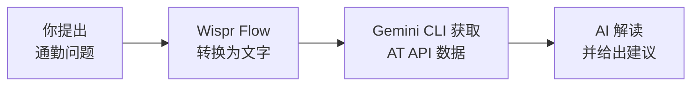

<Tip>
**难度：★★☆☆☆ 简单** · 预计时间：约 30–45 分钟
</Tip>

早上 7:30，你在奥克兰赶去上班。Northern Express 准点吗？Western Line 有中断吗？你可以打开三个不同的应用，翻阅提醒，拼凑出一个答案 —— 或者你只需说：

> "我的巴士会晚点吗？帮我查一下 Auckland Transport 的数据。"

AI 就会检查所有信息，用简单易懂的语言告诉你最重要的事情。

**这就是我们要做的事。** 一个以语音为主的工作流 —— 你说出一个关于通勤的问题，AI 获取实时的 Auckland Transport 数据，即时给你个性化建议。

<Info>
**教程由 [Chan Meng](https://chanmeng.org/) 设计** —— 高级 AI/ML 工程师、开源贡献者、前字节跳动开发者。Chan 搭建了 30+ 个真实应用，专注于 AI 驱动的解决方案，也是本次活动的圆桌嘉宾和本网站的开发者。
</Info>

## 但先思考 —— 你真的需要这个吗？

已经有一些很好的工具适合奥克兰通勤者了。让我们诚实地说一说。

<CardGroup cols={3}>
  <Card title="Google Maps" icon="map-location-dot">
    **对大多数人来说已经很好用**

    "出发时间"提醒、实时路况、众包延误报告和替代路线建议。免费，无需设置。
  </Card>
  <Card title="AT 手机应用" icon="mobile">
    **官方选项**

    实时出发时间、上车提醒、服务中断提醒和路线订阅。由 Auckland Transport 提供，免费。
  </Card>
  <Card title="Transit 应用" icon="route">
    **多模式规划工具**

    实时到达、服务提醒、跨巴士、火车和轮渡的行程规划。免费，界面简洁。
  </Card>
</CardGroup>

<Tip>
**这些应用都很出色。** 如果你只需要"我的下一班巴士什么时候来"，Google Maps 或 AT 手机应用完全够用。本教程面向想要更进一步的人 —— 组合多个数据源、用自然语言提出复杂问题，以及构建任何单一应用都无法提供的个性化通勤智能。
</Tip>

## 那么为什么要用 AI + AT API？

| 功能 | Google Maps / AT 应用 | AI + AT API（本教程） |
|---|---|---|
| 下一班巴士出发时间 | 是 | 是 |
| 服务提醒 | 是 | 是，带简单易懂的解释 |
| "62 路今天比火车快吗？" | 否 | 是 —— 直接问就好 |
| "我的 3 条通勤路线有任何延误吗？" | 需要逐一查看 | 一个问题，一个答案 |
| "给我一份早晨通勤简报" | 否 | 是 —— 说出来就会发生 |
| 自定义逻辑（如"只在延误超过 5 分钟时告诉我"）| 否 | 是 |

## 你将构建什么

<CardGroup cols={3}>
  <Card title="连接" icon="key">
    注册免费的 Auckland Transport API 并获取你的访问密钥
  </Card>
  <Card title="提问" icon="microphone">
    说出或打出通勤问题 —— Gemini CLI 为你获取实时数据
  </Card>
  <Card title="理解" icon="sparkles">
    AI 分析原始数据，用简单易懂的语言给你通勤建议
  </Card>
</CardGroup>

## 工作原理

你说出一个关于通勤的问题（或者打出来也可以）。Wispr Flow 将语音转换为文字。Gemini CLI 从 Auckland Transport 的 API 获取实时数据，分析后用简单易懂的语言给你清晰、可行动的答案。

<Tip>
**你可以用 Wispr Flow 说出提示词，也可以打字或粘贴到 Gemini CLI 中。两种方式效果完全一样。** Wispr Flow 是可选项 —— 它只是让体验更加解放双手。本教程中的每条提示词，无论你说出来还是打出来都同样有效。
</Tip>

## 你将学到

- 如何注册免费的公共 API 并使用 API 密钥
- AI 如何从网络获取和解读实时数据
- 如何写出能组合多个数据源的提示词
- 如何用自然语言 —— 通过语音或文字 —— 提出复杂的通勤问题
- 如何处理真实的交通数据（GTFS Realtime 格式）
- 如何使用 Wispr Flow 语音输入实现解放双手的工作流

<Note>
**无需任何编程基础。** 你只需向 Gemini CLI 说出或粘贴提示词。AI 负责所有技术工作 —— 你只需提出关于通勤的正确问题。
</Note>

## 工具

<CardGroup cols={3}>
  <Card title="Gemini CLI" icon="terminal">
    谷歌的免费 AI 助手，在终端中运行。它可以获取网络数据并解读结果。
  </Card>
  <Card title="Wispr Flow" icon="microphone">
    可选语音输入工具 —— 说话代替打字。在任何应用中均可使用，包括终端。
  </Card>
  <Card title="Auckland Transport API" icon="bus">
    奥克兰所有巴士、火车和轮渡的免费实时数据。每 30 秒更新一次。
  </Card>
  <Card title="Node.js" icon="node-js">
    安装 Gemini CLI 所需。快速一次性安装。
  </Card>
  <Card title="终端" icon="square-terminal">
    内置在你电脑里的命令行应用。在 macOS 上叫 Terminal；在 Windows 上叫 PowerShell 或命令提示符。
  </Card>
</CardGroup>

## 费用

| 工具 | 费用 |
|------|------|
| Gemini CLI | 免费（每日 1,000 次请求） |
| Wispr Flow | 免费试用（[邀请链接可获一个月 Pro 版免费试用](https://wisprflow.ai/r?CHAN115)） |
| Auckland Transport API | 免费（每分钟 600 次调用，每周 35,000 次） |
| Node.js | 免费 |
| **合计** | **$0** |

## 前置要求

<CardGroup cols={3}>
  <Card title="一台能上网的电脑" icon="laptop">
    Windows 或 macOS 均可。无需特殊硬件。
  </Card>
  <Card title="约 30–45 分钟" icon="clock">
    慢慢来，不用着急。你可以随时暂停，之后再继续。
  </Card>
  <Card title="在奥克兰通勤（或好奇心）" icon="bus">
    你不一定住在奥克兰，但数据是奥克兰专属的。非常适合使用 AT 巴士或火车的人。
  </Card>
</CardGroup>

<Note>
准备好了吗？前往[设置你的工具](/docs/2026-her-waka/tutorial/auckland-commute/setup)，注册 API 密钥并安装 Gemini CLI。
</Note>
