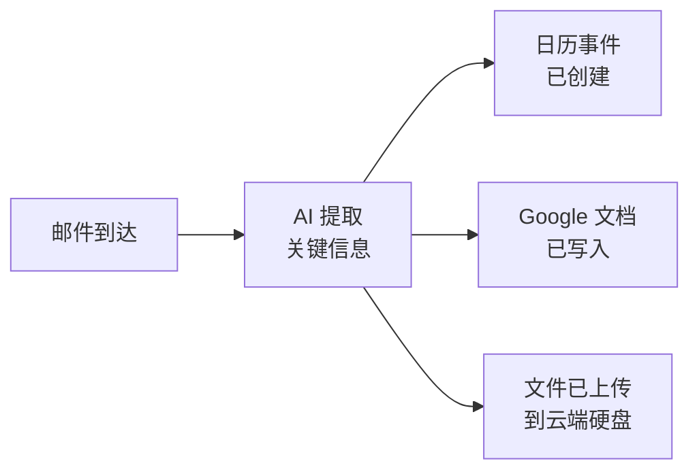

你构建了一个真正的跨应用工作流 —— AI 读取你的邮件、创建日历事件，并为你写入文档。让我们看看你取得了什么成就，以及接下来可以做什么。

## 你构建了什么



- 将 AI 连接到三个 Google 应用 —— Gmail、日历和文档
- 读取真实邮件并提取待办事项、截止日期和关键细节
- 直接从邮件内容创建日历事件
- 无需打开浏览器即可将邮件摘要写入 Google 文档
- 从命令行上传文件到 Google 云端硬盘
- 将多个动作整合到一条自然语言提示词中
- 完全免费，在 30 分钟内完成

## 把它变成日常习惯

跨应用工作流真正的力量不在于一次性任务 —— 而在于定期使用来掌控你的工作。尝试这些日常习惯：

<CardGroup cols={2}>
  <Card title="收件箱转行动" icon="inbox">
    每天下班前说："查看我的未读邮件，为本周所有需要跟进的事项创建日历事件。"在下班前将邮件转化为已安排的任务。
  </Card>
  <Card title="会议跟进" icon="handshake">
    每次会议结束后说："就今天关于[主题]的会议创建一个 Google 文档，记录笔记，并添加下次跟进的日历事件。"趁记忆新鲜，记录一切。
  </Card>
  <Card title="每周规划" icon="calendar-week">
    每周一说："读取上周的邮件，为本周需要处理的任何截止日期或跟进事项创建日历事件。"30 秒规划你的一周。
  </Card>
  <Card title="记录一切" icon="folder-open">
    当重要邮件到达时说："将这封邮件保存为 Google 文档备存。"建立一个可搜索的关键通信档案。
  </Card>
</CardGroup>

## 尝试更多提示词

现在你已经熟悉了跨应用工作流，试试这些更复杂的提示词。用 Wispr Flow 说出来、打字或粘贴 —— 效果都一样。

```text title="说出或复制此提示词"
Find all emails this week with deadlines and create calendar events for each one.
```

```text title="说出或复制此提示词"
Read the latest email from [person's name] and draft a reply, then save it as a Google Doc.
```

```text title="说出或复制此提示词"
Search my emails for receipts from the last month and create a Google Doc listing each one with the date, vendor, and amount.
```

```text title="说出或复制此提示词"
Check my Gmail for meeting invites I haven't responded to. Create a summary doc listing each one with the date, time, and who organised it.
```

```text title="说出或复制此提示词"
Read all emails about [project name] from the past two weeks. Write a project status update in a new Google Doc and create a calendar event for the next milestone.
```

## 进阶：从 Gemini CLI 到 Claude Code

你一直在终端里使用 Gemini CLI —— 说出提示词、批准工具调用、跨多个应用获取结构化结果。这些技能与专业开发者使用 **Claude Code** 时所需的技能完全相同 —— Claude Code 是 Anthropic 出品的一款功能更强大的 CLI 工具。

| | Gemini CLI | Claude Code |
|---|---|---|
| **相同之处** | 在终端中说话或打字。AI 读取数据、处理、采取行动。你批准操作。 | 相同的工作流，相同的技能。 |
| **不同之处** | 免费，适合日常任务 | 更智能，可以编写和编辑代码，处理复杂的多步骤项目 |

继续使用 Gemini CLI 构建 —— 它是免费的，而且你进步很快。当你准备好更上一层楼时，[Vibe Coding 教程](/docs/2026-her-waka/tutorial/vibe-coding/overview)将介绍 Claude Code —— 你目前学到的一切都可以直接迁移。

## 尝试另一个教程

准备好体验下一个 AI 驱动的工作流了吗？试试以下这些：

<CardGroup cols={2}>
  <Card title="AI 早晨简报" icon="sun" href="/docs/2026-her-waka/tutorial/morning-briefing/overview">
    用 AI 生成的简报开始新的一天 —— 今天的会议、紧急邮件和站会摘要，一条命令搞定。
  </Card>
  <Card title="AI 辅助会议准备" icon="users" href="/docs/2026-her-waka/tutorial/meeting-prep/overview">
    用 AI 准备会议 —— 自动从邮件、文档和日历中收集上下文信息。
  </Card>
  <Card title="用 AI 摘要 Gmail" icon="envelope" href="/docs/2026-her-waka/tutorial/gmail-summary/overview">
    几秒钟内驯服你的收件箱 —— AI 读取并摘要你的未读邮件。
  </Card>
  <Card title="创建专业 PDF" icon="file-pdf" href="/docs/2026-her-waka/tutorial/professional-pdf/overview">
    用 AI 和 Typst 生成精美的简历、报告和文档。
  </Card>
</CardGroup>

## 反思

<AccordionGroup>
  <Accordion title="通过 AI 连接多个 Google 应用，什么让你感到惊讶？">
  很多人惊讶于这种体验是多么流畅。不用在 Gmail、日历和文档之间切换 —— 三个各自独立的应用、三种各自不同的界面 —— 你发出一条指令，AI 处理了一切。当 AI 充当桥梁时，应用之间的壁垒就消失了。
  </Accordion>
  <Accordion title="跨应用工作流如何改变你的工作方式？">
  想想你在应用间复制信息花了多少时间 —— 读一封邮件，然后手动创建日历事件，然后在另一个文档里写笔记。跨应用工作流消除了这种重复。每封邮件都变成了潜在的行动，AI 处理了繁琐的事务。
  </Accordion>
  <Accordion title="你还想连接哪些其他应用或服务？">
  同样的方法适用于 Slack、Notion、Trello、电子表格等更多工具。一旦你知道如何用自然语言描述一个工作流，你就可以将这种技能应用到任何工具组合上。模式始终是一样的：从一个地方读取数据，在另一个地方采取行动。
  </Accordion>
  <Accordion title="你会如何向从未用过 AI 工具的同事解释这个？">
  试试这样说："不用读一封邮件、然后打开日历设置提醒、然后打开文档写笔记 —— 我只是让 AI 同时做这三件事。它读取我的邮件、创建事件、写好文档。一句话，三个动作。"这就是宣传词。
  </Accordion>
</AccordionGroup>

## 资源

| 资源 | 介绍 | 链接 |
|------|------|------|
| Gemini CLI | 谷歌的终端 AI 助手 | [github.com/google-gemini/gemini-cli](https://github.com/google-gemini/gemini-cli) |
| gws（Google Workspace CLI） | Google 应用的命令行工具 | [github.com/googleworkspace/cli](https://github.com/googleworkspace/cli) |
| Claude Code | 专业 AI CLI 工具（你的下一步） | [docs.anthropic.com](https://docs.anthropic.com/en/docs/claude-code) |
| Wispr Flow | 任意应用的语音输入工具 | [wisprflow.ai](https://wisprflow.ai/r?CHAN115) |
| 管理 Google 权限 | 撤销应用对 Google 账号的访问权限 | [myaccount.google.com/permissions](https://myaccount.google.com/permissions) |
| Google Calendar API | 日历集成文档 | [developers.google.com/calendar](https://developers.google.com/calendar) |
| Google Docs API | 文档集成文档 | [developers.google.com/docs](https://developers.google.com/docs) |

<Note>
感谢你完成本教程！你从手动读取邮件，发展到构建了能将邮件转化为真实行动的跨应用工作流。连接工具、提取信息并在多个应用间采取行动的能力，在任何职位上都能让你更高效 —— 把这项技能带走吧。
</Note>
