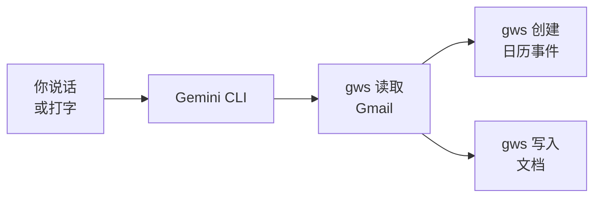

<Tip>
**难度：★★★☆☆ 中级** · 预计时间：约 30 分钟
</Tip>

你的经理发邮件说一张发票需要在周五前跟进。平时你要先读邮件，然后打开 Google 日历创建提醒，再打开 Google 文档写笔记。三个应用，三次切换，五分钟就没了。

而现在，你只需告诉 AI 同时做这三件事 —— 读邮件、创建日历事件、写摘要文档。一条指令，三个动作，十秒钟。

**这就是我们要构建的工作流。** 让 AI 读取你的 Gmail，提取重要信息，并在 Google 应用间采取行动 —— 包括日历、文档和云端硬盘。

<Info>
**教程由 [Chan Meng](https://chanmeng.org/) 主导** —— 高级 AI/ML 工程师、开源贡献者、前字节跳动开发者。Chan 搭建了 30+ 个真实应用，专注于 AI 驱动的解决方案，也是本次活动的圆桌嘉宾和本网站的开发者。
</Info>

## 你将构建什么

<CardGroup cols={3}>
  <Card title="读取与提取" icon="magnifying-glass">
    AI 读取你的邮件并提取关键信息 —— 发件人、邮件主题以及需要采取的行动
  </Card>
  <Card title="安排日程" icon="calendar">
    直接从邮件内容创建 Google 日历事件 —— 跟进事项、截止日期和提醒
  </Card>
  <Card title="记录文档" icon="file-lines">
    将摘要和笔记写入 Google 文档 —— 无需打开浏览器即可记录重要细节
  </Card>
</CardGroup>

## 工作原理

你用自然语言发出一条指令。Gemini CLI 理解你的需求，使用 Google Workspace CLI（`gws`）读取你的 Gmail，然后采取行动 —— 创建日历事件、写入文档或上传文件。一切都在终端里完成，几秒钟搞定。

## 你将学到

- 构建跨应用工作流，连接 Gmail、日历和 Google 文档
- 用 AI 从邮件中提取待办事项、截止日期和关键细节
- 用自然语言从邮件内容创建 Google 日历事件
- 无需打开浏览器即可将邮件摘要写入 Google 文档
- 从命令行上传文件到 Google 云端硬盘
- 将多个动作串联成一条 AI 指令

<Note>
**无需任何编程经验。** AI 处理一切 —— 你的工作就是描述你想做什么。只要你能向同事解释清楚，你就能做到这一点。
</Note>

## 工具

<CardGroup cols={2}>
  <Card title="Gemini CLI" icon="terminal">
    谷歌免费的终端 AI 助手，支持 Google Workspace 扩展 —— Gmail、日历、文档和云端硬盘。
  </Card>
  <Card title="gws（Google Workspace CLI）" icon="google">
    一个从终端控制 Google 应用的命令行工具 —— Gmail、日历、云端硬盘、文档、电子表格。
  </Card>
  <Card title="Wispr Flow" icon="microphone">
    可选的语音输入工具 —— 说话代替打字。在任何应用中均可使用，包括终端。
  </Card>
  <Card title="Node.js" icon="node-js">
    安装 Gemini CLI 和 gws 所需的工具。一次性设置。
  </Card>
</CardGroup>

## 费用

| 工具 | 费用 |
|------|------|
| Gemini CLI | 免费（每日 1,000 次请求） |
| gws | 免费开源 |
| Wispr Flow | 免费试用（[邀请链接可获一个月 Pro 版免费试用](https://wisprflow.ai/r?CHAN115)） |
| Node.js | 免费 |
| Gmail + 日历 + 文档 | 免费 |
| **合计** | **$0** |

## 前置要求

<CardGroup cols={3}>
  <Card title="一台能联网的电脑" icon="laptop">
    Windows 或 macOS 均可。无需特殊硬件。
  </Card>
  <Card title="约 30 分钟" icon="clock">
    慢慢来 —— 不用着急。可以随时暂停，之后再继续。
  </Card>
  <Card title="一个 Google 账号" icon="envelope">
    任何已启用 Gmail、日历和文档的个人或工作 Google 账号。
  </Card>
</CardGroup>

<Note>
准备好了吗？前往[设置你的工具](/docs/2026-her-waka/tutorial/email-to-action/setup)，连接好一切。
</Note>
