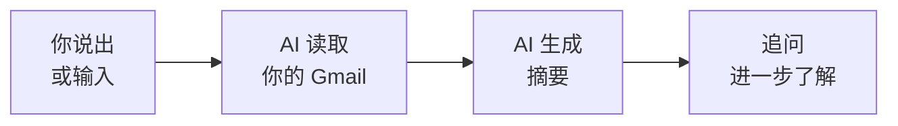

你已经建立了一个真实的效率工作流 —— AI 替你读邮件，你不必再亲力亲为。让我们看看你完成了什么，以及下一步去哪里。

## 你构建了什么



- 将 AI 助手连接到真实服务（Gmail）—— 使用真实凭证
- 从真实收件箱中获取真实邮件
- 以多种格式生成结构化摘要
- 用自然语言按发件人、主题和日期进行筛选
- 追问以查找特定信息
- 全部免费，不超过 20 分钟

## 养成每日习惯

这个工具真正的力量不在于一次性总结 —— 而在于定期使用，让你的收件箱始终处于掌控之中。试试这些日常使用方式：

<CardGroup cols={2}>
  <Card title="早晨追赶" icon="sun">
    每天开始工作时说"Summarise my overnight emails."用 30 秒追上进度，而不是花 20 分钟。
  </Card>
  <Card title="下班前复盘" icon="moon">
    下班前说："Are there any emails I received today that still need a reply?" 永远不会错过重要回复。
  </Card>
  <Card title="每周摘要" icon="calendar-week">
    每周一说："Give me a summary of the past week's emails." 非常适合发现你遗漏的规律或邮件线程。
  </Card>
  <Card title="会议准备" icon="users">
    开会前说："Summarise all emails about [project name] from the last 2 weeks." 做好充分准备走进会议室。
  </Card>
</CardGroup>

## 尝试更进阶的提示词

现在你已经熟悉基础摘要，试试这些更复杂的提示词。用 Wispr Flow 说出来、打字输入或粘贴 —— 效果完全一样。

```text title="说出或复制此提示词"
Look through my emails from the past week and list every action item
or request directed at me. Group them by urgency: urgent, this week,
and when you have time.
```

```text title="说出或复制此提示词"
Find the email thread with [person's name] about [topic].
Summarise the full conversation — who said what, what was agreed,
and what's still unresolved.
```

```text title="说出或复制此提示词"
Based on my sent emails from the past week, draft a brief status update
of what I've been working on. Group by project or topic.
```

```text title="说出或复制此提示词"
Check my unread emails and identify any that are asking me a question
or requesting a response. List them with the sender, subject, and
what they're asking for.
```

```text title="说出或复制此提示词"
Compare the emails I received this week to last week. Are there any new topics, new senders, or trends I should be aware of?
```

## 探索 Gmail 内置 AI 功能

Gmail 本身现在也有 Gemini 驱动的 AI 功能，无需任何设置即可使用：

<CardGroup cols={2}>
  <Card title="AI 概述" icon="sparkles">
    Gmail 会在长邮件线程顶部自动显示摘要。下次打开有很多回复的线程时留意一下。
  </Card>
  <Card title="总结此邮件" icon="compress">
    在桌面端或移动端打开任意邮件时，点击顶部的"总结此邮件"按钮。所有 Gmail 用户均可免费使用。
  </Card>
  <Card title="帮我写邮件" icon="pen">
    在撰写邮件时，点击"帮我写"根据你的指示获得 AI 生成的草稿。
  </Card>
  <Card title="智能回复" icon="reply">
    Gmail 会在邮件底部建议简短回复。点击一个即可立即回复 —— 非常适合快速确认。
  </Card>
</CardGroup>

<Tip>
**两者结合效果最佳：** 使用本教程的 AI 工具进行宏观收件箱管理（每日摘要、发件人报告、待办事项提取），使用 Gmail 内置功能处理即时任务（总结单个线程、起草回复）。
</Tip>

## 进阶：从 Gemini CLI 到 Claude Code

你一直在终端中使用 Gemini CLI —— 说出提示词、批准工具调用、获取结构化结果。这些技能与专业开发者使用 **Claude Code** 时完全相同，Claude Code 是 Anthropic 推出的功能更强大的 CLI 工具。

| | Gemini CLI | Claude Code |
|---|---|---|
| **相同的地方** | 在终端中说话或输入。AI 读取数据、处理后给你结果。你批准操作。| 同样的工作流，同样的技能。 |
| **不同的地方** | 免费，适合日常任务 | 更智能，可以编写和编辑代码，处理复杂多步骤项目 |

继续用 Gemini CLI 构建 —— 它是免费的，你学得很快。当你准备好进阶时，[Vibe Coding 教程](/docs/2026-her-waka/tutorial/vibe-coding/overview)会介绍 Claude Code —— 你迄今为止学到的一切都可以直接迁移。

## 尝试下一个教程

准备好你的下一个 AI 工作流了吗？试试这些：

<CardGroup cols={2}>
  <Card title="总结 Slack 频道" icon="slack" href="/docs/2026-her-waka/tutorial/slack-summary/overview">
    相同的概念，不同的工具 —— 用 AI 在几秒内追赶任意 Slack 频道的动态。
  </Card>
  <Card title="搭建你的个人网站" icon="globe" href="/docs/2026-her-waka/tutorial/personal-website/overview">
    用 AI 创建并部署你自己的网站 —— 无需任何编程经验。
  </Card>
  <Card title="制作专业 PDF" icon="file-pdf" href="/docs/2026-her-waka/tutorial/professional-pdf/overview">
    用 AI 和 Typst 生成精美简历、报告和文档。
  </Card>
  <Card title="Vibe Coding：Daily Report Bot" icon="robot" href="/docs/2026-her-waka/tutorial/vibe-coding/overview">
    构建一个自动向 Slack 发送每日报告的 bot。更高阶的挑战。
  </Card>
</CardGroup>

## 反思

<AccordionGroup>
  <Accordion title="将 AI 连接到 Gmail，哪里让你觉得意外？">
  很多人会惊讶于这有多快、多简单。不管你是用 Gemini App（路径 A）还是安装了带语音控制的 Gemini CLI（路径 B），将 AI 连接到日常工具的门槛比大多数人预想的低得多。
  </Accordion>
  <Accordion title="语音优先的 AI 如何改变你的工作方式？">
  想想打字搜索和直接说出需求之间的差距。语音消除了摩擦 —— 你可以在泡咖啡、准备开会或走到桌子前的途中追赶收件箱。能够用自然语言与工具对话，开启了原本被浪费的时间碎片。
  </Accordion>
  <Accordion title="这个工作流如何帮助你的工作或求职？">
  想想：请假回来后的快速追赶、开会前回顾来自某人的所有邮件、在数十封邮件中追踪待办事项，或在求职期间跟踪招聘方邮件。快速从收件箱中提取信息在任何职位上都很有价值。
  </Accordion>
  <Accordion title="还有什么信息你希望 AI 来帮你总结？">
  同样的方式适用于 Slack 频道、会议记录、文档、新闻文章等等。一旦你学会写出有效的提示词，就可以把这个技能应用于任何文字密集的任务。
  </Accordion>
</AccordionGroup>

## 资源

| 资源 | 介绍 | 链接 |
|------|------|------|
| Gemini CLI | 谷歌的终端 AI 助手 | [github.com/google-gemini/gemini-cli](https://github.com/google-gemini/gemini-cli) |
| Claude Code | 专业 AI CLI 工具（你的下一步） | [docs.anthropic.com](https://docs.anthropic.com/en/docs/claude-code) |
| Gemini App | 谷歌浏览器版 AI 助手 | [gemini.google.com](https://gemini.google.com) |
| Wispr Flow | 任意应用的语音输入 | [wisprflow.ai](https://wisprflow.ai/r?CHAN115) |
| Gemini CLI Workspace 扩展 | 用于 Gmail 的 Gemini CLI 扩展 | [github.com/gemini-cli-extensions/workspace](https://github.com/gemini-cli-extensions/workspace) |
| 管理 Google 权限 | 撤销应用对 Gmail 的访问 | [myaccount.google.com/permissions](https://myaccount.google.com/permissions) |

<Note>
感谢你完成本教程！你从零开始，用 AI 总结了真实的邮件。将工具连接起来、获取数据并从中提取意义的能力在任何岗位上都很宝贵 —— 带走这项技能吧。
</Note>
