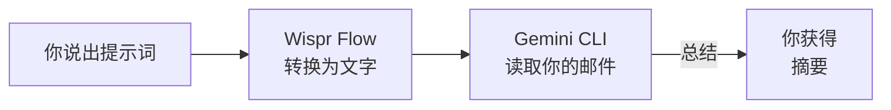
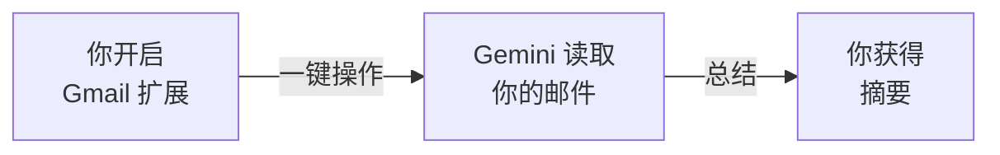

<Tip>
**难度：★☆☆☆☆ 入门** · 预计时间：约 5 到 20 分钟（取决于你选择的路径）
</Tip>

你请了一周假刚回来。收件箱里有 340 封未读邮件。里面有 12 封来自你的经理，几封你一直没取消订阅的通讯，三封会议邀请夹在中间某处，还有一个主题是"紧急"的邮件线程 —— 结果是午餐点单。

你可以花一小时滚动、略读、整理 —— 或者让 AI 在 30 秒内替你全部总结完。

**这就是我们要做的事。** 一个能读取你的 Gmail 并即时给出清晰实用摘要的工作流。

<Info>
**教程由 [Chan Meng](https://chanmeng.org/) 设计** —— 高级 AI/ML 工程师、开源贡献者、前字节跳动开发者。Chan 搭建了 30+ 个真实应用，专注于 AI 驱动的解决方案，也是本次活动的圆桌嘉宾和本网站的开发者。
</Info>

## 你将构建什么

<CardGroup cols={3}>
  <Card title="连接" icon="plug">
    将 AI 工具与你的 Gmail 账户关联，让它可以读取你的邮件
  </Card>
  <Card title="获取" icon="download">
    拉取邮件 —— 所有未读、来自特定发件人，或符合搜索条件的邮件
  </Card>
  <Card title="总结" icon="sparkles">
    AI 读取邮件并给你一份清晰、可行动的摘要
  </Card>
</CardGroup>

## 两条路径，任你选择

本教程提供两种方式达成同一目标。根据你的情况选择最适合的。

<CardGroup cols={2}>
  <Card title="完整教程（CLI + 语音）" icon="terminal">
    **约 20 分钟** · 推荐

    安装 Gemini CLI，添加 Google Workspace 扩展，并用 Wispr Flow 语音输入提示词。这是一个以语音为主的体验，同时培养 CLI 技能 —— 这些技能在后续每一个教程中都会用到。
  </Card>
  <Card title="快速体验（浏览器）" icon="browser">
    **约 5 分钟** · 最快上手

    在浏览器打开 Gemini，开启 Gmail 扩展，立即开始请求摘要。无需安装 —— 但你不会学到其他教程所需的 CLI 技能。
  </Card>
</CardGroup>

<Tip>
**该选哪条路径？** 我们推荐**完整教程** —— 它教会你后续每个教程都会用到的 CLI 技能，也为 Claude Code 等专业工具做好准备。如果你只有 5 分钟，想在正式安装前先看看 AI 能做什么，可以选择快速体验。
</Tip>

<Tip>
**语音或打字，两种方式都行。** 路径 B 设计为语音优先，使用 Wispr Flow，但每条提示词用打字或粘贴方式也完全一样有效。Wispr Flow 是可选项 —— 它只是让体验更加解放双手。
</Tip>

## 工作原理

**完整教程：Gemini CLI + 语音**

**快速体验：Gemini App（网页版）**

两种路径都是将 AI 助手与你的 Gmail 账户连接。AI 读取你的邮件，分析内容，几秒内生成结构化摘要。完整教程额外增加了语音输入和 CLI 技能，这些都会在未来每个教程中复用。

## 你将学到

- 将 AI 工具连接到真实服务（Gmail）以访问实时数据
- 写出能产出实用、结构化邮件摘要的清晰提示词
- 用自然语言筛选和搜索邮件（按发件人、日期、主题）
- 为不同需求定制摘要格式（快速概览、执行简报、待办事项）
- 对未读邮件提出追问
- 使用 Wispr Flow 语音输入实现解放双手的工作流（路径 B）
- 将 AI 作为日常效率工具管理收件箱

<Note>
**无需任何编程基础。** AI 负责处理一切 —— 你只需描述你想要什么样的摘要。如果你能向同事解释你的需求，你就能完成这个教程。
</Note>

## 工具

<CardGroup cols={2}>
  <Card title="Gemini CLI" icon="terminal">
    谷歌的免费 AI 助手，在终端中运行。支持 Google Workspace 扩展。用于完整教程。
  </Card>
  <Card title="Wispr Flow" icon="microphone">
    可选语音输入工具 —— 说话代替打字。在任何应用中均可使用，包括终端。用于完整教程。
  </Card>
  <Card title="Gemini App" icon="browser">
    谷歌浏览器版免费 AI 助手。连接 Gmail 并与你的收件箱对话。仅用于快速体验。
  </Card>
  <Card title="Node.js" icon="node-js">
    安装 Gemini CLI 所需。仅路径 B 需要。
  </Card>
</CardGroup>

## 费用

| 工具 | 费用 |
|------|------|
| Gemini App | 免费 |
| Gemini CLI | 免费（每日 1,000 次请求） |
| Wispr Flow | 免费试用（[邀请链接可获一个月 Pro 版免费试用](https://wisprflow.ai/r?CHAN115)） |
| Node.js | 免费 |
| Gmail | 免费 |
| **合计** | **$0** |

## 前置要求

<CardGroup cols={3}>
  <Card title="一台能上网的电脑" icon="laptop">
    Windows 或 macOS 均可。无需特殊硬件。
  </Card>
  <Card title="5 到 20 分钟" icon="clock">
    取决于你选择的路径。慢慢来，不用着急。
  </Card>
  <Card title="一个 Gmail 账号" icon="envelope">
    个人或工作 Gmail 账号均可。你将给 AI 只读权限访问你的邮件。
  </Card>
</CardGroup>

<Note>
准备好了吗？前往[设置你的工具](/docs/2026-her-waka/tutorial/gmail-summary/setup)开始连接。
</Note>
