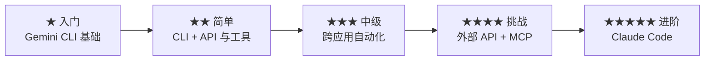

在实际动手做项目中学习。这些自学教程会教你如何跟 AI 工具协作 —— 用自然语言说话，或打字输入提示。不需要任何编程经验。

<Tip>
**所有教程都支持语音输入。** 用 [Wispr Flow](https://wisprflow.ai/r?CHAN115) 可以把你的提示说出来，而不是打出来。语音是可选项 —— 每一条提示都既能说也能打。
</Tip>

## 为什么选 CLI 工具？

这些教程把 **Gemini CLI** 作为主要 AI 工具，因为它完全免费，而且能教会你在终端里跟 AI 协作 —— 这个技能可以直接迁移到 **Claude Code** 这类专业工具上。

CLI（命令行）工具更适合 **委派** —— 你描述想要什么，AI 自主完成。GUI（点击操作）工具更适合 **建议** —— 在你亲自做事时给你提示。本教程希望让 AI 挑大梁，所以 CLI 是正确选择。

<Info>
**你的学习路径：** 先用 Gemini CLI（免费）掌握基本功，再进阶到 Claude Code（专业、同样的工作流）。当你走到 Vibe Coding 教程时，你已经会在终端里跟 AI 对话、批准工具调用、使用扩展 —— 因为这些你都已经在 Gemini CLI 里练过了。
</Info>

## ★ 入门

最快上手的教程 —— 配置最少，立刻见效。

<CardGroup cols={2}>
  <Card title="用 AI 总结 Gmail" icon="envelope" href="/docs/2026-her-waka/tutorial/gmail-summary/overview" color="#c846ab">
    **★☆☆☆☆ · 约 5–20 分钟**

    说一句 "summarise my unread emails"，AI 就会读你的 Gmail 收件箱，几秒钟内告诉你什么值得关注。
  </Card>
  <Card title="用语音控制你的笔记" icon="microphone" href="/docs/2026-her-waka/tutorial/obsidian-daily/overview" color="#c846ab">
    **★☆☆☆☆ · 约 30 分钟**

    用自然语言记下想法、跟踪任务、回顾一天 —— Gemini CLI + Wispr Flow 替你操作 Obsidian。
  </Card>
</CardGroup>

## ★★ 简单

配置稍多一些，但依然直接、对新手友好。

<CardGroup cols={2}>
  <Card title="搭建你的个人网站" icon="globe" href="/docs/2026-her-waka/tutorial/personal-website/overview" color="#9b2e83">
    **★★☆☆☆ · 约 1 小时**

    描述你想要什么样的网站 —— 说出来或打出来 —— Gemini CLI 就帮你搭起来并部署好。
  </Card>
  <Card title="奥克兰通勤智能助手" icon="bus" href="/docs/2026-her-waka/tutorial/auckland-commute/overview" color="#9b2e83">
    **★★☆☆☆ · 约 30–45 分钟**

    问一句 "我的巴士会不会晚点？" AI 就帮你查实时的 Auckland Transport 数据，用日常语言给你建议。
  </Card>
  <Card title="和 AI 对话整理笔记" icon="comments" href="/docs/2026-her-waka/tutorial/obsidian-organise/overview" color="#9b2e83">
    **★★☆☆☆ · 约 30–45 分钟**

    说一句 "找出我的孤儿笔记" 或 "把这条笔记放进 Archive" —— AI 帮你搜索、审阅、整理你的 Obsidian 仓库。
  </Card>
  <Card title="AI 会议准备助手" icon="users" href="/docs/2026-her-waka/tutorial/meeting-prep/overview" color="#9b2e83">
    **★★☆☆☆ · 约 25–30 分钟**

    AI 会自动整合你日历里的议程、相关邮件和共享文档，汇总成一份简报 —— 让你再也不会"裸裸地"走进会议。
  </Card>
  <Card title="AI 每日晨报" icon="sun" href="/docs/2026-her-waka/tutorial/morning-briefing/overview" color="#9b2e83">
    **★★☆☆☆ · 约 15–20 分钟**

    一条命令，告诉你今天的会议、紧急邮件，还有一份可以直接拿去 standup 用的总结 —— 由 Gemini CLI + Google Workspace CLI 驱动。
  </Card>
</CardGroup>

## ★★★ 中级

需要装和配置更多工具，但重活还是 AI 来干。

<CardGroup cols={2}>
  <Card title="用 AI 制作专业 PDF" icon="file-pdf" href="/docs/2026-her-waka/tutorial/professional-pdf/overview" color="#9b2e83">
    **★★★☆☆ · 约 1.5 小时**

    描述你理想中的求职信、发票或报告 —— Gemini CLI + Typst 把你的描述变成一份精致的 PDF。
  </Card>
  <Card title="邮件转行动：跨应用自动化" icon="arrows-rotate" href="/docs/2026-her-waka/tutorial/email-to-action/overview" color="#9b2e83">
    **★★★☆☆ · 约 30 分钟**

    一条命令搞定：让 AI 读一封邮件、创建日历事件、把笔记写到 Google Docs —— 由 Google Workspace CLI 驱动。
  </Card>
</CardGroup>

## ★★★★ 挑战

涉及外部 API token、MCP 配置和更复杂的环境搭建 —— 为更高阶的项目打基础。

<CardGroup cols={2}>
  <Card title="总结 Slack 频道" icon="slack" href="/docs/2026-her-waka/tutorial/slack-summary/overview" color="#9b2e83">
    **★★★★☆ · 约 45 分钟**

    说一句 "总结 #general 这周的消息"，AI 就帮你读完 Slack 并给出一份清晰、能用的概要。
  </Card>
  <Card title="AI 宣传视频制作" icon="video" href="/docs/2026-her-waka/tutorial/promo-video/overview" color="#9b2e83">
    **★★★★☆ · 约 1.5–2 小时**

    描述你想要的视频 —— AI 就替你生成：动画文字、专业配音、音效。导出 MP4，发 LinkedIn、Instagram 或任何地方。
  </Card>
</CardGroup>

## ★★★★★ 进阶

多工具、多 API、完整部署 —— 一个在 AI 引导下完成的真实工程项目。

<CardGroup cols={2}>
  <Card title="Vibe Coding：Daily Report Bot" icon="robot" href="/docs/2026-her-waka/tutorial/vibe-coding/overview">
    **★★★★★ · 约 2 小时**

    描述你想做的 bot —— 说出来或打出来 —— Claude Code 就帮你写全部代码、测试，以及部署。
  </Card>
</CardGroup>

## 你的成长路径

每个教程都在累积你的 CLI 能力。等你走到 Vibe Coding，在终端里跟 AI 对话将是一件很自然的事 —— 因为从第一个教程起你就一直在这么做。

<Tip>
**第一次接触 AI 工具？** 先从「用 AI 总结 Gmail」或「用语音控制你的笔记」开始 —— 它们配置最快、见效最直接。所有教程都支持通过 Wispr Flow 的语音输入。
</Tip>
