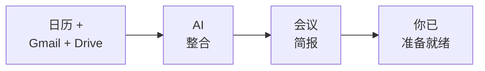

你已经构建了一个真实的生产力工作流 —— AI 读取你的日历、邮件和文档，让你走进每一个会议时都已充分准备。让我们回顾一下你的成果，以及下一步该去哪里。

## 你构建了什么



- 同时将 AI 连接到三个 Google 服务 —— 日历、Gmail 和 Drive
- 通过自然语言提取会议详情、相关邮件和共享文档
- 将多个数据源整合成一份结构化简报
- 读取电子表格数据，在会议前了解数字
- 将简报保存为文件或 Google 文档以便随时查阅
- 全部免费，不超过 30 分钟

## 养成每日习惯

会议准备的真正力量不在于一次性的简报 —— 而在于在每次会议前都使用它，让你始终成为会议室里准备最充分的人。

<CardGroup cols={2}>
  <Card title="早晨会议扫描" icon="sun">
    每个工作日开始时说"Prep me for all my meetings today"。一次性获取你日历上每个会议的简报。
  </Card>
  <Card title="会前仪式" icon="clock">
    任何会议前 15 分钟，快速运行一次会议准备。一条提示词，一份简报 —— 带着背景信息、人员情况和关键要点走进会议室。
  </Card>
  <Card title="会后记录" icon="pen">
    会议结束后，说"Save my meeting notes to a Google Doc"。趁记忆犹新，记录决策、行动事项和后续跟进。
  </Card>
  <Card title="每周回顾" icon="calendar-week">
    每周五说"Summarise all my meetings this week and list any follow-ups I still need to do"。掌控所有事项。
  </Card>
</CardGroup>

## 尝试更多提示词

现在你已经熟悉了会议准备，试试这些更有创意的提示词。用 Wispr Flow 说出来、打字或粘贴 —— 效果完全一样。

```text title="说出或复制此提示词"
Prep me for all my meetings today in one go. For each meeting, give me the attendees, key context from recent emails, and one talking point.
```

```text title="说出或复制此提示词"
Find the last 3 documents that Sarah Chen shared with me. Summarise what each one is about.
```

```text title="说出或复制此提示词"
What are the key decisions from my meetings this week? List the decision, who made it, and any follow-up actions.
```

```text title="说出或复制此提示词"
Draft an agenda for my meeting with Marcus Lee based on our recent email thread. Include discussion topics and time estimates.
```

```text title="说出或复制此提示词"
I have a meeting with a new client tomorrow. Search my email and Drive for anything related to their company and give me a background briefing.
```

<Tip>
**用得越多，速度越快。** 你会形成自己惯用的提示词 —— 那些最符合你工作方式和会议类型的提示词。把你最喜欢的提示词保存在笔记里，以便重复使用。
</Tip>

## 进阶：从 Gemini CLI 到 Claude Code

你一直在终端中使用 Gemini CLI —— 说出提示词、批准工具调用、获取结构化结果。这些正是专业开发者使用 **Claude Code**（Anthropic 推出的功能更强大的 CLI 工具）时的技能。

| | Gemini CLI | Claude Code |
|---|---|---|
| **相同之处** | 在终端中说话或打字，AI 读取数据、处理并给出结果，你批准操作。 | 工作流程相同，技能可直接迁移。 |
| **不同之处** | 免费，适合日常任务 | 更智能，能编写和编辑代码，处理复杂的多步骤项目 |

继续用 Gemini CLI 构建 —— 它是免费的，你学得很快。当你准备好进阶时，[Vibe Coding 教程](/docs/2026-her-waka/tutorial/vibe-coding/overview)会介绍 Claude Code —— 你目前学到的一切都可以直接迁移过去。

## 尝试另一个教程

准备好尝试下一个 AI 驱动的工作流了吗？试试这些：

<CardGroup cols={2}>
  <Card title="AI 早晨简报" icon="sun" href="/docs/2026-her-waka/tutorial/morning-briefing/overview">
    用一条命令开启新的一天 —— 今天的会议、紧急邮件和站会摘要，全部搞定。
  </Card>
  <Card title="邮件转行动事项" icon="list-check" href="/docs/2026-her-waka/tutorial/email-to-action/overview">
    将杂乱的收件箱变成清晰的待办事项列表 —— AI 从你的邮件中提取行动事项、截止日期和后续跟进。
  </Card>
  <Card title="用 AI 总结 Gmail" icon="envelope" href="/docs/2026-her-waka/tutorial/gmail-summary/overview">
    几秒钟内驯服你的收件箱 —— AI 读取并总结你的未读邮件，让你即刻追上进度。
  </Card>
  <Card title="总结 Slack 频道" icon="slack" href="/docs/2026-her-waka/tutorial/slack-summary/overview">
    同样的概念，不同的工具 —— 用 AI 几秒钟内追上任何 Slack 频道的内容。
  </Card>
</CardGroup>

## 反思

<AccordionGroup>
  <Accordion title="AI 从多个来源提取信息，哪里让你感到惊讶？">
    大多数人都惊讶于 AI 能如此无缝地将日历、Gmail 和 Drive 整合成一份简报。你不需要打开三个标签页并手动拼凑背景信息，一条提示词就能得到完整的全貌。能够交叉引用不同服务的数据，正是 AI 真正大放异彩的地方。
  </Accordion>
  <Accordion title="会议准备如何改变你在工作中的表现？">
    想想空手走进会议室和带着简报走进去的区别。你知道议程、最近的讨论、共享文档和关键要点。这种准备建立了自信，帮助你更有效地贡献力量 —— 无论你是在发言、聆听还是做决策。
  </Accordion>
  <Accordion title="你会如何将 AI 作为研究助手用于会议以外的场景？">
    同样的方法 —— 收集数据、整合、简报 —— 同样适用于客户调研、项目更新、周报等场景。一旦你知道如何提示 AI 从多个来源提取信息，你就可以将这项技能应用到任何需要快速了解情况的场合。
  </Accordion>
  <Accordion title="还有哪些 Google Workspace 数据值得纳入？">
    想想包含会议记录的 Google 文档、包含项目数据的电子表格、包含演示文稿的幻灯片，甚至 Google Chat 消息。`gws` 工具可以访问所有这些。你连接的数据源越多，你的简报就越完整。
  </Accordion>
</AccordionGroup>

## 资源

| 资源 | 介绍 | 链接 |
|------|------|------|
| Gemini CLI | 谷歌的终端 AI 助手 | [github.com/google-gemini/gemini-cli](https://github.com/google-gemini/gemini-cli) |
| gws（Google Workspace CLI） | Google Workspace 的命令行工具 | [github.com/googleworkspace/cli](https://github.com/googleworkspace/cli) |
| Claude Code | 专业 AI CLI 工具（你的下一步） | [docs.anthropic.com](https://docs.anthropic.com/en/docs/claude-code) |
| Wispr Flow | 任意应用的语音输入 | [wisprflow.ai](https://wisprflow.ai/r?CHAN115) |
| Google 日历 | 管理你的日程 | [calendar.google.com](https://calendar.google.com) |
| 管理 Google 权限 | 撤销应用对你 Google 数据的访问权限 | [myaccount.google.com/permissions](https://myaccount.google.com/permissions) |

<Note>
感谢你完成本教程！你从疯狂搜索会议背景信息，到 60 秒内获取完整简报。从多个来源收集信息并用 AI 整合的能力，将让你在每一次会议中都更加出色 —— 带着它走吧。
</Note>
