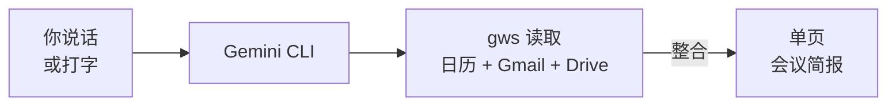

<Tip>
**难度：★★☆☆☆ 简单** · 预计时间：约 25 到 30 分钟
</Tip>

你的客户会议 30 分钟后开始。你依稀记得有关这个项目的邮件，但找不到了。某个地方有一个共享文档 —— 也许在 Drive 里，也许附在几周前归档的邮件里。你可以花 20 分钟疯狂搜索 Gmail 和 Drive，或者让 AI 在 60 秒内帮你备好一切。

**这就是我们要构建的东西。** 一个读取你的 Google 日历、从 Gmail 中提取相关邮件、在 Drive 中查找共享文档，并生成完整会议简报的工作流 —— 全部来自一条提示词。

<Info>
**教程由 [Chan Meng](https://chanmeng.org/) 主导** —— 高级 AI/ML 工程师、开源贡献者、前字节跳动开发者。Chan 搭建了 30+ 个真实应用，专注于 AI 驱动的解决方案，也是本次活动的圆桌嘉宾和本网站的开发者。
</Info>

## 你将构建什么

<CardGroup cols={3}>
  <Card title="收集" icon="magnifying-glass">
    AI 在日历、Gmail 和 Drive 中查找你的会议详情、相关邮件和共享文档
  </Card>
  <Card title="整合" icon="sparkles">
    将所有内容整合成一份单页简报 —— 不再需要在多个标签之间切换
  </Card>
  <Card title="准备" icon="clipboard-list">
    在你走进会议室之前，关键要点、与会者名单和发言建议已一应俱全
  </Card>
</CardGroup>

## 工作原理

你说出（或打出）一条提示词。Gemini CLI 使用 Google Workspace CLI（`gws`）提取你的日历事件、搜索邮件并查找共享文档。AI 将所有内容整合成一份清晰、结构化的简报，你可以在 60 秒内读完。

## 你将学到

- 使用 `gws` 将 AI 连接到你的 Google 日历、Gmail 和 Drive
- 通过自然语言提示词提取会议详情 —— 时间、与会者、议程
- 搜索 Gmail 中与特定会议或与会者相关的邮件
- 在 Google Drive 中按话题或文件名查找共享文档
- 将多个数据源整合成一份 AI 驱动的简报
- 将简报保存为文件或 Google 文档以便随时查阅

<Note>
**无需任何编程经验。** AI 处理所有事情 —— 你只需描述你需要为哪个会议做准备。如果你能向同事解释你需要什么，你就能做到这一切。
</Note>

## 工具

<CardGroup cols={2}>
  <Card title="Gemini CLI" icon="terminal">
    谷歌免费的终端 AI 助手，支持 Google Workspace 扩展 —— 可按需读取你的日历、邮件和 Drive。
  </Card>
  <Card title="gws（Google Workspace CLI）" icon="google">
    从终端控制 Gmail、日历、Drive 等服务的命令行工具。正是它让 AI 能够访问你的 Google 数据。
  </Card>
  <Card title="Wispr Flow（可选）" icon="microphone">
    可选的语音输入工具 —— 说话代替打字。在任何应用中均可使用，包括终端。解放双手准备会议。
  </Card>
  <Card title="Node.js" icon="node-js">
    安装 Gemini CLI 和 gws 所需，一次性设置步骤。
  </Card>
</CardGroup>

## 费用

| 工具 | 费用 |
|------|------|
| Gemini CLI | 免费（每日 1,000 次请求） |
| gws | 免费开源 |
| Wispr Flow | 免费试用（[邀请链接可获一个月 Pro 版免费试用](https://wisprflow.ai/r?CHAN115)） |
| Node.js | 免费 |
| **合计** | **$0** |

## 前置要求

<CardGroup cols={3}>
  <Card title="一台能联网的电脑" icon="laptop">
    Windows 或 macOS 均可。无需特殊硬件。
  </Card>
  <Card title="25 到 30 分钟" icon="clock">
    其中大部分是一次性设置。慢慢来，不用着急。
  </Card>
  <Card title="一个 Google 账号" icon="envelope">
    已启用日历、Gmail 和 Drive 的任何个人或工作 Google 账号。
  </Card>
</CardGroup>

<Note>
准备好了吗？前往[设置你的工具](/docs/2026-her-waka/tutorial/meeting-prep/setup)，完成所有连接。
</Note>
