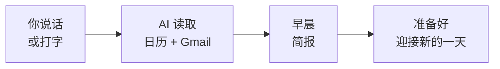

你已经构建了真实的早晨例程 —— AI 读取你的日历和收件箱，让你带着充分准备开始新的一天。让我们回顾一下你的成果，以及下一步该去哪里。

## 你构建了什么



- 将 AI 连接到你的 Google 日历和 Gmail —— 使用真实凭据
- 提取了今天的会议，包括时间和与会者
- 按紧急程度对收件箱进行了分类 —— 需要回复的、仅供参考的、可忽略的
- 根据真实数据生成了站会摘要
- 将所有内容整合成一份单一的早晨简报
- 全部免费，不超过 20 分钟

## 养成每日习惯

这个工具的真正力量不在于一次性的简报 —— 而在于每天使用它，让你的早晨始终有的放矢。试试这些例程：

<CardGroup cols={2}>
  <Card title="周一计划" icon="calendar-week">
    每周开始时说"Show me all my meetings for this week and flag any scheduling conflicts"。在周一早晨之前掌握全局。
  </Card>
  <Card title="会前检查" icon="users">
    会议开始 15 分钟前说："Summarise all emails about [topic] from the last week and show me who's attending the meeting at [time]"。充分准备后再走进去。
  </Card>
  <Card title="下班前回顾" icon="moon">
    下班前说："What's on my calendar tomorrow and are there any emails I still need to reply to?"。再也不会被一早的会议打个措手不及。
  </Card>
  <Card title="周五总结" icon="flag-checkered">
    每周五说："Give me a summary of this week's meetings and a preview of next week"。非常适合提前规划和轻松收尾。
  </Card>
</CardGroup>

## 尝试更多提示词

现在你已经熟悉了基础知识，试试这些更高级的提示词。用 Wispr Flow 说出来、打字或粘贴 —— 效果完全一样。

```text title="说出或复制此提示词"
Compare my schedule this week to last week. Am I spending more or less time in meetings?
```

```text title="说出或复制此提示词"
Look at my meetings for this week — which ones could probably be emails instead?
```

```text title="说出或复制此提示词"
Draft a message to [person's name] about rescheduling our meeting on [day] to [new time].
```

```text title="说出或复制此提示词"
Check my emails and calendar for the last 5 days and write a weekly status update I can send to my team.
```

```text title="说出或复制此提示词"
What are the 3 most important things I need to do today based on my calendar and emails?
```

```text title="说出或复制此提示词"
Find any meeting invitations I haven't responded to and list them with the date, time, and organiser.
```

## 进阶：从 Gemini CLI 到 Claude Code

你一直在终端中使用 Gemini CLI —— 说出提示词、批准工具调用、获取结构化结果。这些正是专业开发者使用 **Claude Code**（Anthropic 推出的功能更强大的 CLI 工具）时的技能。

| | Gemini CLI | Claude Code |
|---|---|---|
| **相同之处** | 在终端中说话或打字，AI 读取数据、处理并给出结果，你批准操作。 | 工作流程相同，技能可直接迁移。 |
| **不同之处** | 免费，适合日常任务 | 更智能，能编写和编辑代码，处理复杂的多步骤项目 |

继续用 Gemini CLI 构建 —— 它是免费的，你学得很快。当你准备好进阶时，[Vibe Coding 教程](/docs/2026-her-waka/tutorial/vibe-coding/overview)会介绍 Claude Code —— 你目前学到的一切都可以直接迁移过去。

## 尝试另一个教程

准备好尝试下一个 AI 驱动的工作流了吗？试试这些：

<CardGroup cols={2}>
  <Card title="将邮件转化为行动事项" icon="list-check" href="/docs/2026-her-waka/tutorial/email-to-action/overview">
    超越分类 —— 从你的收件箱中提取行动事项，自动转化为任务列表。
  </Card>
  <Card title="AI 会议准备" icon="users" href="/docs/2026-her-waka/tutorial/meeting-prep/overview">
    60 秒内为任何会议做好准备 —— 用一条提示词提取与会者邮件、历史记录和议程要点。
  </Card>
  <Card title="用 AI 总结 Gmail" icon="envelope" href="/docs/2026-her-waka/tutorial/gmail-summary/overview">
    驯服你的收件箱 —— 用 AI 读取并总结未读邮件，快速追上消息，找到重要的内容。
  </Card>
  <Card title="总结 Slack 频道" icon="slack" href="/docs/2026-her-waka/tutorial/slack-summary/overview">
    同样的概念，不同的工具 —— 用 AI 几秒钟内追上任何 Slack 频道的内容。
  </Card>
</CardGroup>

## 反思

<AccordionGroup>
  <Accordion title="从 AI 获取早晨简报，哪里让你感到惊讶？">
    很多人都惊讶于这种感觉有多自然。不用打开三个应用并逐一拼凑信息，你提出一个问题就得到完整的全貌。AI 帮你完成了上下文切换。
  </Accordion>
  <Accordion title="每日 AI 简报如何改变你的早晨？">
    想想从滚动浏览标签页开始一天，和从掌握重要事项的清晰摘要开始一天之间的区别。早晨简报消除了"我忘记什么了吗"的焦虑，让你专注于真正重要的工作。
  </Accordion>
  <Accordion title="你还会在早晨简报中加入哪些数据？">
    同样的方法也适用于 Slack 消息、项目管理工具、新闻摘要等。一旦你知道如何将 AI 连接到一个数据源，你就可以连接到很多数据源 —— 并将它们整合成一份针对你角色定制的简报。
  </Accordion>
  <Accordion title="这个工作流如何帮助你的团队？">
    想象一下如果团队里每个人都以一份简报开始新的一天。站会会更快，因为每个人都已经知道议程上有什么。你可以在团队频道中分享你的简报作为快速通报。人们花在收集上下文信息上的时间越少，做有意义工作的时间就越多。
  </Accordion>
</AccordionGroup>

## 资源

| 资源 | 介绍 | 链接 |
|------|------|------|
| Gemini CLI | 谷歌的终端 AI 助手 | [github.com/google-gemini/gemini-cli](https://github.com/google-gemini/gemini-cli) |
| gws（Google Workspace CLI） | Gmail、日历、Drive 等的 CLI 工具 | [github.com/googleworkspace/cli](https://github.com/googleworkspace/cli) |
| Claude Code | 专业 AI CLI 工具（你的下一步） | [docs.anthropic.com](https://docs.anthropic.com/en/docs/claude-code) |
| Wispr Flow | 任意应用的语音输入 | [wisprflow.ai](https://wisprflow.ai/r?CHAN115) |
| 管理 Google 权限 | 撤销应用对你 Google 账号的访问权限 | [myaccount.google.com/permissions](https://myaccount.google.com/permissions) |

<Note>
感谢你完成本教程！你从零开始构建了完整的 AI 驱动早晨简报。连接工具、提取实时数据并让 AI 为你整合的能力，在任何职位都很有价值 —— 带着它走吧。
</Note>
