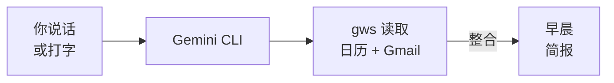

<Tip>
**难度：★★☆☆☆ 简单** · 预计时间：约 15 到 20 分钟
</Tip>

早上 8 点。你有会议、未读邮件、截止日期 —— 但不清楚什么是紧急的。你可以打开三个标签页，翻看日历，扫描收件箱，然后自己拼凑出全貌。或者，你可以让 AI 给你一份早晨简报，30 秒内掌握全局。

**这就是我们要构建的东西。** 一个读取你的 Google 日历和 Gmail，然后给你完整早晨简报的工作流 —— 今天的议程、紧急邮件和站会摘要 —— 全部来自一条命令。

<Info>
**教程由 [Chan Meng](https://chanmeng.org/) 主导** —— 高级 AI/ML 工程师、开源贡献者、前字节跳动开发者。Chan 搭建了 30+ 个真实应用，专注于 AI 驱动的解决方案，也是本次活动的圆桌嘉宾和本网站的开发者。
</Info>

## 你将构建什么

<CardGroup cols={3}>
  <Card title="今日议程" icon="calendar">
    提取当天的会议 —— 时间、标题和参会人员
  </Card>
  <Card title="邮件分类" icon="envelope">
    AI 读取你的收件箱，按紧急程度分组 —— 需要回复的、仅供参考的和可以忽略的
  </Card>
  <Card title="站会摘要" icon="clipboard-list">
    获取可直接粘贴的站会更新 —— 昨天做了什么、今天做什么，以及任何阻碍
  </Card>
</CardGroup>

## 工作原理

你说出（或打出）一条提示词。Gemini CLI 使用 Google Workspace CLI（`gws`）提取你的日历事件和邮件。AI 将所有内容整合成一份清晰、结构化的简报，你可以在 30 秒内读完，也可以粘贴到 Slack 中。

## 你将学到

- 使用 `gws` 将 AI 连接到你的 Google 日历和 Gmail
- 用自然语言提示词提取今天的会议和紧急邮件
- 让 AI 按紧急程度对你的收件箱进行分类 —— 无需手动整理
- 根据你的真实日历和邮件数据生成站会摘要
- 将多个数据源整合成一份 AI 驱动的简报
- 建立每天为你节省 15+ 分钟的日常习惯

<Note>
**无需任何编程经验。** AI 处理所有事情 —— 你只需描述你想要什么样的简报。如果你能向同事解释你需要什么，你就能做到这一切。
</Note>

## 工具

<CardGroup cols={2}>
  <Card title="Gemini CLI" icon="terminal">
    谷歌免费的终端 AI 助手，支持 Google Workspace 扩展 —— 可按需读取你的日历和邮件。
  </Card>
  <Card title="gws（Google Workspace CLI）" icon="google">
    从终端控制 Gmail、日历、Drive 等服务的命令行工具。正是它让 AI 能够访问你的 Google 数据。
  </Card>
  <Card title="Wispr Flow（可选）" icon="microphone">
    可选的语音输入工具 —— 说话代替打字。在任何应用中均可使用，包括终端。解放双手获取早晨简报。
  </Card>
  <Card title="Node.js" icon="node-js">
    安装 Gemini CLI 和 gws 所需，一次性设置步骤。
  </Card>
</CardGroup>

## 费用

| 工具 | 费用 |
|------|------|
| Gemini CLI | 免费（每日 1,000 次请求） |
| gws | 免费开源 |
| Wispr Flow | 免费试用（[邀请链接可获一个月 Pro 版免费试用](https://wisprflow.ai/r?CHAN115)） |
| Node.js | 免费 |
| **合计** | **$0** |

## 前置要求

<CardGroup cols={3}>
  <Card title="一台能联网的电脑" icon="laptop">
    Windows 或 macOS 均可。无需特殊硬件。
  </Card>
  <Card title="15 到 20 分钟" icon="clock">
    其中大部分是一次性设置。慢慢来，不用着急。
  </Card>
  <Card title="一个 Google 账号" icon="envelope">
    已启用 Gmail 和 Google 日历的任何个人或工作 Google 账号。
  </Card>
</CardGroup>

<Note>
准备好了吗？前往[设置你的工具](/docs/2026-her-waka/tutorial/morning-briefing/setup)，完成所有连接。
</Note>
