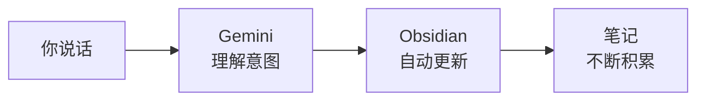

你构建了一个以语音为主的工作流，用于记录、追踪和回顾每一天 —— 由自然语言和 AI 驱动。让我们看看你完成了什么，以及下一步去哪里。

## 你构建了什么



- 通过自然说话或打字记录想法、创意和笔记
- 用普通语言添加带复选框的任务并标记完成
- 回顾每日笔记并在整个笔记库中搜索
- 不记忆任何命令就控制了 Obsidian
- 全部免费，不超过 30 分钟

## 你学到了什么

<Tip>
**最重要的技能是学会与你的工具对话。** 你发现 AI 可以弥合你想要什么和软件如何工作之间的鸿沟。不必学习命令语法，你只需描述你需要什么。这是一种可迁移的技能，你可以在任何 AI 工具中使用。
</Tip>

- 如何将 Gemini CLI 用作 Obsidian 的自然语言界面
- 如何通过说话或输入请求即时记录想法
- 如何不知道任何命令语法就管理任务
- 如何只需提问就能跨所有笔记进行搜索
- 如何使用 Wispr Flow 语音输入实现解放双手的工作流
- AI 如何将自然语言转换为精确的工具命令

## 养成每日习惯

每日笔记的真正力量来自于持续使用。这里有三个以语音为主的日常习惯可以尝试：

**早晨：** 用简短的回顾开始你的一天。

```text title="说出或复制此提示词"
Open my daily note and show me yesterday's unfinished tasks
```

查看哪些事项从昨天延续下来了。通过请求 Gemini 帮你处理，将任何未完成的任务移到今天的笔记中。

**白天：** 随时随地记录想法 —— 不必中断你正在做的事情。

```text title="说出或复制此提示词"
Add to my daily note: [whatever you're thinking right now]
```

将冒号后面的文字替换为你想记住的任何内容。只需几秒钟 —— 用语音更是如此。

**傍晚：** 回顾和收尾你的一天。

```text title="说出或复制此提示词"
Show me today's tasks and mark anything about groceries as done
```

查看你完成了什么。标记任务为完成。如果你喜欢，添加一个简短的反思。

## 试试这些提示词

<CardGroup cols={2}>
  <Card title="早晨规划" icon="sun">
    用目标和结构开始你的一天：

    ```text title="说出或复制此提示词"
    Add a heading called 'Today's Priorities' to my daily note with three empty checkboxes for my top tasks
    ```
  </Card>
  <Card title="会议记录" icon="users">
    不切换应用地记录会议笔记：

    ```text title="说出或复制此提示词"
    Create a new note in Obsidian called 'Standup Notes' and add today's date as a heading, then add bullet points for what I did yesterday, what I'm doing today, and blockers
    ```
  </Card>
  <Card title="每日收尾" icon="moon">
    获取你今天记录的所有内容的摘要：

    ```text title="说出或复制此提示词"
    Read my daily note and summarise what I did today in 3 bullet points
    ```
  </Card>
  <Card title="每周回顾" icon="calendar-week">
    回顾整整一周的内容：

    ```text title="说出或复制此提示词"
    Search my Obsidian vault for all notes from this week and tell me what topics came up most often
    ```
  </Card>
</CardGroup>

<AccordionGroup>
  <Accordion title="从模板创建笔记">
    ```text title="说出或复制此提示词"
    Create a note called Weekly Review from my Review template in Obsidian
    ```
  </Accordion>
  <Accordion title="统计笔记字数">
    ```text title="说出或复制此提示词"
    Count the words in my current Obsidian daily note
    ```
  </Accordion>
  <Accordion title="显示你的书签">
    ```text title="说出或复制此提示词"
    Show me all my bookmarks in Obsidian
    ```
  </Accordion>
</AccordionGroup>

## 尝试下一个教程

<CardGroup cols={2}>
  <Card title="和 AI 对话整理笔记" icon="comments" href="/docs/2026-her-waka/tutorial/obsidian-organise/overview">
    通过描述你想要什么来搜索、审查和整理你的 Obsidian 笔记库 —— AI 发现问题并为你修复。
  </Card>
  <Card title="用 AI 总结 Gmail" icon="envelope" href="/docs/2026-her-waka/tutorial/gmail-summary/overview">
    使用 AI 读取并总结你的未读邮件 —— 几秒内追赶你的收件箱。
  </Card>
  <Card title="总结 Slack 频道" icon="hashtag" href="/docs/2026-her-waka/tutorial/slack-summary/overview">
    将 AI 连接到你的 Slack 工作区，即时获取频道摘要。
  </Card>
  <Card title="搭建你的个人网站" icon="globe" href="/docs/2026-her-waka/tutorial/personal-website/overview">
    创建并部署你自己的个人网站，展示你的技能和项目。
  </Card>
</CardGroup>

## 反思

<AccordionGroup>
  <Accordion title="通过说话控制软件，感觉如何？">
  很多人都会惊讶于这有多自然。不必学习菜单、按钮和命令语法，你只需说出你想要什么。这就是 AI 正在改变我们与工具互动方式的地方 —— 消除了学习每个工具特定界面的需要。
  </Accordion>
  <Accordion title="语音驱动的笔记如何帮助你的工作或学习？">
  想想：通勤途中记录想法、不用打字记录会议笔记、双手忙碌时追踪任务、一天结束时录下反思，或者随时间积累一个可搜索的个人知识库。门槛越低，你记录的越多。
  </Accordion>
  <Accordion title="你还希望用自然语言控制哪些工具？">
  同样的方式适用于邮件、日历、文件管理、网络搜索等等。一旦你习惯了向 AI 助手描述你的需求，就可以将这个技能应用于任何有命令行界面或 API 的工具。
  </Accordion>
</AccordionGroup>

## 资源

| 资源 | 介绍 | 链接 |
|------|------|------|
| Gemini CLI | 谷歌的终端免费 AI 助手 | [github.com/google-gemini/gemini-cli](https://github.com/google-gemini/gemini-cli) |
| Wispr Flow | 解放双手输入的语音转文字工具 | [wisprflow.ai](https://wisprflow.ai/r?CHAN115) |
| Obsidian | 免费的本地存储笔记应用 | [obsidian.md](https://obsidian.md) |
| Obsidian CLI 文档 | Obsidian 命令行界面的官方文档 | [obsidian.md/cli](https://obsidian.md/cli) |
| Obsidian 社区 | 问题解答、技巧分享和社区支持论坛 | [forum.obsidian.md](https://forum.obsidian.md) |

<Note>
感谢你完成本教程！你从零开始，搭建了一个完整运作的语音优先每日笔记工作流 —— 记录想法、追踪任务、搜索笔记，全部通过自然说话实现。带走这个习惯，看看它如何改变你的工作效率。
</Note>
