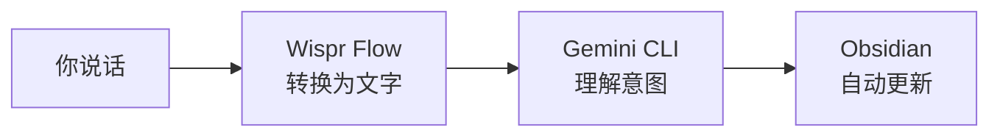

<Tip>
**难度：★☆☆☆☆ 入门** · 预计时间：约 30 分钟
</Tip>

你正在开会，突然有个想法。不用打开应用、切换窗口、找到那个笔记、再把内容打出来……你只需说：

> "把这个加到我的每日笔记里：Sarah 提到 Xero 有一个职位空缺"

然后它就出现在 Obsidian 里了。不用打字，不用点击，不用切换应用。

**这就是我们要做的事。** 一个以语音为主的每日笔记工作流 —— 你自然地说出想法，AI 负责处理剩下的事情：记录思绪、追踪任务、搜索你的笔记库。

<Info>
**教程由 [Chan Meng](https://chanmeng.org/) 设计** —— 高级 AI/ML 工程师、开源贡献者、前字节跳动开发者。Chan 搭建了 30+ 个真实应用，专注于 AI 驱动的解决方案，也是本次活动的圆桌嘉宾和本网站的开发者。
</Info>

## 你将构建什么

<CardGroup cols={3}>
  <Card title="说出" icon="microphone">
    用语音记录想法 —— 说出你想记住的内容，它就出现在你的每日笔记里
  </Card>
  <Card title="指令" icon="message">
    用自然语言管理任务 —— 添加任务、标记完成、查看剩余事项
  </Card>
  <Card title="搜索" icon="magnifying-glass">
    通过提问搜索笔记 —— 无需记忆文件名或文件夹结构
  </Card>
</CardGroup>

## 工作原理

你自然地说话（或打字，随你喜欢）。Wispr Flow 将你的语音转换为文字。Gemini CLI 理解你想做什么，并在后台运行正确的 Obsidian 命令。你的笔记即时更新 —— 你永远不需要学习或输入任何命令。

<Tip>
**你可以用 Wispr Flow 说出提示词，也可以打字或粘贴到 Gemini CLI 中。两种方式效果完全一样。** Wispr Flow 是可选项 —— 它只是让体验更加解放双手。本教程中的每条提示词，无论你说出来还是打出来都同样有效。
</Tip>

## 你将学到

- 如何通过 Gemini CLI 使用自然语言控制 Obsidian
- 如何通过说话或输入请求即时记录想法
- 如何不记忆任何命令就能添加和管理任务
- 如何只需提问就能跨所有笔记进行搜索
- 如何使用 Wispr Flow 语音输入实现解放双手的工作流
- 如何用 AI 建立简单的每日效率习惯

<Note>
**无需任何编程基础。** 每个步骤都使用你可以说出来或复制粘贴的自然语言。如果你能描述你想要什么，你就能完成这个教程。
</Note>

## 工具

<CardGroup cols={3}>
  <Card title="Gemini CLI" icon="terminal">
    谷歌的免费 AI 助手，在终端中运行。它理解你的自然语言请求并将其转换为操作。
  </Card>
  <Card title="Wispr Flow" icon="microphone">
    可选语音输入工具 —— 说话代替打字。在任何应用中均可使用，包括终端。
  </Card>
  <Card title="Obsidian" icon="notebook">
    免费的笔记应用，将你的笔记以纯文本文件形式存储在电脑上。你的数据由你掌控 —— 无需云账号。
  </Card>
  <Card title="Node.js" icon="node-js">
    安装 Gemini CLI 所需的免费工具。一次性安装。
  </Card>
  <Card title="终端" icon="square-terminal">
    内置在你电脑里的命令行应用。在 macOS 上叫 Terminal；在 Windows 上叫 PowerShell 或命令提示符。
  </Card>
</CardGroup>

## 费用

| 工具 | 费用 |
|------|------|
| Gemini CLI | 免费（每日 1,000 次请求） |
| Wispr Flow | 免费试用（[邀请链接可获一个月 Pro 版免费试用](https://wisprflow.ai/r?CHAN115)） |
| Obsidian | 免费 |
| Node.js | 免费 |
| 终端 | 免费（内置在你的电脑里） |
| **合计** | **$0** |

## 前置要求

<CardGroup cols={3}>
  <Card title="一台电脑" icon="laptop">
    Windows 或 macOS 均可。无需特殊硬件。
  </Card>
  <Card title="30 分钟" icon="clock">
    慢慢来，不用着急。
  </Card>
  <Card title="好奇心" icon="lightbulb">
    无需任何前置经验。只需愿意尝试新事物。
  </Card>
</CardGroup>

<Note>
准备好了吗？前往[设置你的工具](/docs/2026-her-waka/tutorial/obsidian-daily/setup)安装所需的一切。
</Note>
