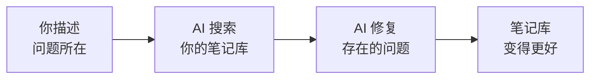

你通过与 Gemini CLI 对话，完成了对 Obsidian 笔记库的搜索、审查和整理。让我们回顾一下你的成果，以及下一步该去哪里。

## 你构建了什么



- 通过用普通语言提问，即时搜索了整个笔记库
- 审查了标签，发现了不一致之处，全程无需记忆任何命令
- 通过描述想要查找的内容，找出了孤儿笔记、断开的链接和死胡同
- 通过告诉 AI 要做什么，完成了文件的重命名和移动
- 构建了一个更整洁、更有连通性的笔记库 —— 完全免费

## 你学到了什么

<Tip>
**核心洞见：笔记库维护不是一次性的事情 —— 它是一种习惯。** 就像整理桌面或清理收件箱一样，每月快速回顾一次，能让你的笔记库始终保持有用且易于查找。有了 Gemini CLI，这种回顾就像聊天一样简单。
</Tip>

- 如何通过描述你在找什么来搜索笔记库
- 如何用普通语言审查标签、孤儿笔记和断开的链接
- 如何通过告诉 AI 要做什么来移动和重命名文件
- 如何检查反向链接，了解笔记库的连接关系
- 如何使用 Wispr Flow 语音输入实现解放双手的体验
- 如何将 Gemini CLI 作为笔记库维护工具

## 每月笔记库回顾

养成每月回顾笔记库一次的习惯。打开 Gemini CLI，依次使用以下提示词：

1. **找出孤儿笔记** —— 连接或归档被遗忘的笔记
   ```text title="说出或复制此提示词"
   Show me all orphan notes in my vault
   ```

2. **修复断开的链接** —— 修复指向不再存在的笔记的链接
   ```text title="说出或复制此提示词"
   Are there any broken links in my vault?
   ```

3. **整理标签** —— 发现并修复标签不一致的问题
   ```text title="说出或复制此提示词"
   List all my tags with counts — are there any that look like duplicates?
   ```

4. **追踪笔记库增长** —— 了解笔记库的演变情况
   ```text title="说出或复制此提示词"
   How many files are in my vault now?
   ```

5. **归档旧笔记** —— 将不再需要的笔记移入归档文件夹
   ```text title="说出或复制此提示词"
   Move the note called Old Meeting Notes to my Archive folder
   ```

这大约需要 10 分钟，让你的笔记库保持整洁和实用。

## 试试这些提示词

<CardGroup cols={2}>
  <Card title="查找未标记的笔记" icon="tag">
    发现可能需要更好整理的笔记。

    ```text title="说出或复制此提示词"
    Find all notes in my vault that have no tags
    ```
  </Card>
  <Card title="字数比较" icon="chart-bar">
    查看哪些笔记最长、哪些最短。

    ```text title="说出或复制此提示词"
    Show me a word count comparison of all my notes
    ```
  </Card>
  <Card title="总结某个话题" icon="sparkles">
    获取你所写某个主题内容的概览。

    ```text title="说出或复制此提示词"
    Search my vault for anything about productivity and summarise it
    ```
  </Card>
  <Card title="查找最近的笔记" icon="calendar">
    查看你最近在做什么。

    ```text title="说出或复制此提示词"
    Show me all notes I created or modified this month
    ```
  </Card>
</CardGroup>

<AccordionGroup>
  <Accordion title="找出连接最多的笔记">
    发现笔记库的枢纽 —— 反向链接最多的笔记：

    ```text title="说出或复制此提示词"
    Which notes in my vault have the most backlinks? Show me the top 10
    ```

    拥有大量反向链接的笔记通常是你最重要或被引用最多的笔记。考虑给它们起清晰的名字，并保持结构完整。
  </Accordion>
  <Accordion title="按话题批量整理">
    让 Gemini CLI 帮你一次性整理某一类笔记：

    ```text title="说出或复制此提示词"
    Find all notes in my vault related to recipes and move them into a folder called Recipes
    ```

    Gemini CLI 会逐一识别相关笔记并移动，同时更新链接。
  </Accordion>
  <Accordion title="创建带元数据的笔记">
    让 Gemini CLI 创建一篇已附有属性的结构化笔记：

    ```text title="说出或复制此提示词"
    Create a new note called Weekly Review with headings for What Went Well, What Could Improve, and Next Week's Goals. Add tags for review and reflection.
    ```

    属性和标签有助于之后筛选和整理笔记。
  </Accordion>
</AccordionGroup>

## 尝试另一个教程

<CardGroup cols={2}>
  <Card title="用语音控制你的笔记" icon="microphone" href="/docs/2026-her-waka/tutorial/obsidian-daily/overview">
    使用 Gemini CLI 和 Obsidian 构建语音优先的每日工作流 —— 通过自然说话记录想法、追踪任务并搜索笔记库。
  </Card>
  <Card title="用 AI 总结 Gmail" icon="envelope" href="/docs/2026-her-waka/tutorial/gmail-summary/overview">
    用 AI 读取并总结未读邮件。几秒钟内追上收件箱进度。
  </Card>
  <Card title="创建专业 PDF" icon="file-pdf" href="/docs/2026-her-waka/tutorial/professional-pdf/overview">
    使用终端将你的想法转化为格式精美的 PDF 文档。
  </Card>
  <Card title="搭建你的个人网站" icon="globe" href="/docs/2026-her-waka/tutorial/personal-website/overview">
    创建并部署你自己的个人网站 —— 无需任何网页开发经验。
  </Card>
</CardGroup>

## 反思

<AccordionGroup>
  <Accordion title="你发现了哪些让你感到惊讶的笔记库内容？">
    很多人都惊讶于自己有那么多孤儿笔记，或者从未注意到的标签不一致问题。让 AI 审查你的笔记库，能给你一个仅靠在应用里浏览文件夹很难获得的全局视角。
  </Accordion>
  <Accordion title="使用自然语言如何改变了这段体验？">
    你不需要记忆命令和参数，而是描述你想要什么，AI 自行解决如何做到。这是一种与工具交互的不同方式 —— 门槛只是能够解释你需要什么。
  </Accordion>
  <Accordion title="还有哪些工具或工作流能从这种方式中获益？">
    想想你的电子邮件收件箱、文件系统、书签、项目管理工具。同样的原则都适用 —— 定期回顾、统一命名、清理不再需要的内容。你在这里练习的自然语言方式，可以迁移到任何信息会积累的系统中。
  </Accordion>
</AccordionGroup>

## 资源

| 资源 | 介绍 | 链接 |
|------|------|------|
| Gemini CLI | 谷歌免费的终端 AI 助手 | [github.com/google-gemini/gemini-cli](https://github.com/google-gemini/gemini-cli) |
| Wispr Flow | 解放双手的语音输入工具 | [wisprflow.ai](https://wisprflow.ai/r?CHAN115) |
| Obsidian | 本地存储的免费笔记应用 | [obsidian.md](https://obsidian.md) |
| Obsidian CLI 文档 | Obsidian CLI 插件文档 | [obsidian.md/cli](https://obsidian.md/cli) |
| Obsidian 论坛 | 提问和获取技巧的社区论坛 | [forum.obsidian.md](https://forum.obsidian.md) |

<Note>
感谢你完成本教程！你从一个混乱的笔记库出发，通过与 AI 对话，将它打造成了更整洁、更有连通性的知识库。带走这项技能，享受一个真正为你所用的笔记库。
</Note>
