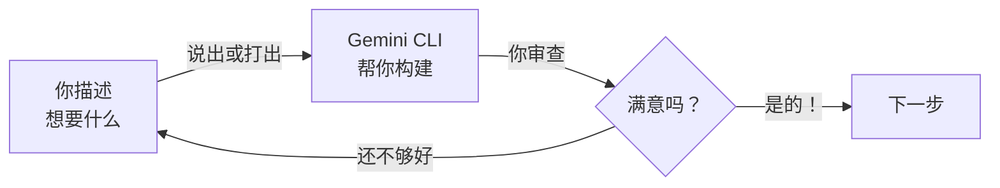

这是最有趣的部分。你描述你想要什么，Gemini CLI 帮你构建。无需编程 —— 只需清晰的描述，说出来或打出来就好。

<Tabs>
  <Tab title="语音（Wispr Flow）">
    Wispr Flow 运行后，直接开口说话。你的话语会自动以文字形式出现在 Gemini CLI 中。自然地说出你需要什么 —— Gemini 会理解并为你编写代码。
  </Tab>
  <Tab title="打字或粘贴">
    从本页复制任意提示词并粘贴到 Gemini CLI 中，或者用自然语言输入你自己的请求。无需特殊语法 —— 只需描述你想要什么。
  </Tab>
</Tabs>

## Vibe Coding 循环

每个步骤都遵循同样的模式：



你描述。Gemini CLI 构建。你审查。重复直到满意，然后继续。

---

<Steps>
  <Step title="创建项目文件夹">
    <Tabs>
      <Tab title="Windows">
        1. 打开**文件资源管理器**
        2. 进入你的**文档**文件夹
        3. 在空白处右键 → **新建** → **文件夹**
        4. 命名为 `my-website`
      </Tab>
      <Tab title="macOS">
        1. 打开 **Finder**
        2. 进入你的**文稿**文件夹
        3. 在空白处右键 → **新建文件夹**
        4. 命名为 `my-website`
      </Tab>
    </Tabs>

    <Tip>
    用像 `my-website` 这样简单的名字。使用小写字母，不带空格 —— 这之后会成为你网站 URL 的一部分。
    </Tip>
  </Step>

  <Step title="在项目文件夹中打开终端">
    <Tabs>
      <Tab title="Windows">
        在文件资源管理器中打开你的 `my-website` 文件夹。点击顶部的**地址栏**，输入 `powershell`，然后按 **Enter**。
      </Tab>
      <Tab title="macOS">
        在 Finder 中右键点击 `my-website` 文件夹，选择**"在文件夹中打开终端"**。如果没有这个选项，打开 Terminal 并输入：
        ```bash
        cd ~/Documents/my-website
        ```
      </Tab>
    </Tabs>
  </Step>

  <Step title="启动 Gemini CLI">
    在终端中输入：

    ```bash
    gemini
    ```

    按 Enter。你应该会看到 Gemini CLI 启动并出现一个等待输入的提示符。

    <Tip>
    **如果你已运行 Wispr Flow**，现在可以直接对着 Gemini CLI 说话了。开口说话 —— 你的话语会以文字形式出现在终端里。
    </Tip>
  </Step>

  <Step title="描述你的网站">
    选择一个你喜欢的风格，将完整提示词说出来或复制到 Gemini CLI 中。记得把 `[Your Name]`（你的名字）和 `[your field]`（你的领域）替换为真实信息！

    <Tabs>
      <Tab title="简洁风">
        ```text title="说出或复制此提示词"
        Create a simple personal website for me. My name is [Your Name].
        I want a clean, modern design with:
        - A hero section with my name and a short tagline
        - An "About Me" section where I can introduce myself
        - A "Contact" section with links to my email and LinkedIn
        Use a single index.html file with inline CSS. Make it responsive
        so it looks good on both desktop and mobile phones.
        Use a professional color scheme. Make it look polished and modern.
        ```
      </Tab>
      <Tab title="创意风">
        ```text title="说出或复制此提示词"
        Create a personal portfolio website for me. My name is [Your Name].
        I want a modern, eye-catching design with:
        - A bold hero section with a gradient background and my name
        - An "About Me" section with a circular photo placeholder
        - A "Skills" section showing my top skills with visual indicators
        - A "Projects" section with 3 placeholder project cards
        - A footer with social media icon links
        Use HTML and CSS. Make it fully responsive for mobile devices.
        Add smooth scroll behavior and subtle hover animations on buttons
        and cards. Use a vibrant but professional color palette.
        ```
      </Tab>
      <Tab title="专业简历风">
        ```text title="说出或复制此提示词"
        Create a professional resume-style website. My name is [Your Name].
        I am looking for work in [your field]. Include these sections:
        - Professional header with my name, job title, and a brief summary
        - Work Experience section (use placeholder content for 2-3 roles)
        - Education section (use placeholder content)
        - Skills section organized by category
        - Contact section with email, LinkedIn, and phone placeholder
        Use HTML and CSS. Make it clean, minimal, and employer-friendly.
        Use a neutral, professional color scheme (navy blue or dark gray).
        Make it responsive and print-friendly so it can be saved as a PDF.
        ```
      </Tab>
    </Tabs>

    <Tip>
    **记得替换 `[Your Name]` 和 `[your field]`**，替换为你的真实信息，然后再粘贴提示词！如果你用 Wispr Flow 说出提示词，直接说出你的真实姓名和领域就好。
    </Tip>

    <Info>
    不喜欢结果？直接告诉 Gemini 要改什么 —— 参见第 6 步中现成的追问提示词。
    </Info>
  </Step>

  <Step title="预览你的网站">
    说出或输入这条提示词：

    ```text title="说出或复制此提示词"
    Can you help me open this website in my browser so I can preview it?
    Please start a local server or just open the index.html file directly.
    ```

    **或者自己动手：** 在你的 `my-website` 文件夹中找到 `index.html`，双击打开。它会在你的浏览器中打开。

    <Tip>
    你的网站现在只在你的电脑上 —— 还没有上线到互联网。我们将在下一节发布它。
    </Tip>
  </Step>

  <Step title="迭代和改进">
    对结果不满意？这很正常 —— 这正是 Vibe Coding 的全部意义！将以下任意追问提示词说出来或复制到 Gemini CLI 中：

    ```text title="说出或复制此提示词"
    Change the color scheme to blue and white. Keep the overall layout the same.
    ```

    ```text title="说出或复制此提示词"
    Add a profile photo section with a round border at the top of the page.
    Use a placeholder image for now.
    ```

    ```text title="说出或复制此提示词"
    Add a sticky navigation bar at the top with links to each section
    of the page. It should stay visible when I scroll down.
    ```

    ```text title="说出或复制此提示词"
    Add a dark mode toggle button in the top-right corner. When clicked,
    it should switch the entire website between light and dark themes.
    Save the user's preference so it persists when they refresh the page.
    ```

    <Tip>
    **Vibe Coding 循环：** 描述 → 审查 → 优化。持续迭代，直到你满意为止！你可以向 Gemini CLI 发送任意多条提示词 —— 没有迭代次数限制。说出你的请求往往比打字更快、更自然。
    </Tip>
  </Step>
</Steps>

## 进一步探索 —— 尝试你自己的请求

上面的提示词只是起点。这里有一些创意请求，展示自然语言有多灵活：

```text title="说出或复制此提示词"
Add a testimonials section with 3 placeholder quotes from colleagues.
Use a card layout with a subtle shadow on each card.
```

```text title="说出或复制此提示词"
Add a timeline section showing my career journey. Use placeholder
dates and roles. Make it visually interesting with a vertical line
connecting each milestone.
```

```text title="说出或复制此提示词"
Make the hero section more dramatic — add a background image with a
dark overlay and large white text. Use a placeholder image for now.
```

<Tip>
**这就是自然语言的魔力。** 你不需要了解 HTML 或 CSS —— 只需描述你想要什么。如果 Gemini 不确定你的意思，它会请你澄清。
</Tip>

## 故障排除

<AccordionGroup>
  <Accordion title="打开网站时页面是空白的">
    确保你打开的是 `index.html` 文件，而不是文件夹。如果文件是空的，问 Gemini CLI："The index.html file appears to be empty. Can you check and regenerate it?"
  </Accordion>
  <Accordion title="布局看起来乱了">
    让 Gemini CLI 修复它：
    ```text
    The layout looks broken — things are overlapping or not aligned properly.
    Can you fix the CSS so everything displays correctly?
    ```
  </Accordion>
  <Accordion title="我想完全重新开始">
    告诉 Gemini CLI：
    ```text
    I want to start completely fresh. Delete the current files and create
    a new website from scratch. [Then describe what you want]
    ```
  </Accordion>
  <Accordion title="我的语音输入有错误">
    Wispr Flow 偶尔可能误听技术术语或专有名词。你可以在 Gemini CLI 中按 Enter 之前检查并修正文字。如果语音输入错误过多，改为打字或粘贴提示词即可。
  </Accordion>
</AccordionGroup>

<Note>
对你的网站满意了吗？前往[部署你的网站](/docs/2026-her-waka/tutorial/personal-website/deploy)，免费将它发布到互联网！
</Note>
