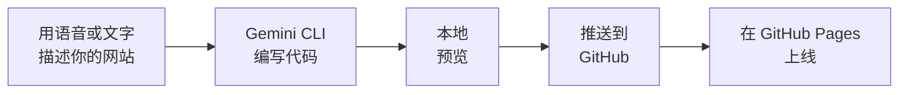
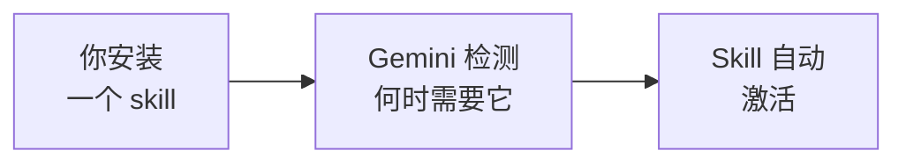

恭喜你 —— 你在没有写一行代码的情况下搭建并部署了自己的网站！让我们看看你完成了什么、如何持续改进，以及下一步去哪里。

## 你构建了什么



一个个人网站：
- 由你设计、由 AI 构建 —— 通过你的语音或键盘
- 在互联网上上线，任何人都可以访问
- 随时可以通过一条说出或打出的提示词更新
- 完全免费

## 你学到了什么

<Tip>
**最重要的技能不是编程 —— 而是沟通。** 你学会了清晰地描述你想要什么、审查结果，以及迭代直到满意。无论你是说出提示词还是打出来，核心技能都是相同的 —— 适用于任何 AI 工具，任何领域。
</Tip>

以下是你练习过的内容：
- **使用终端** —— 运行命令和在文件夹间导航
- **与 AI 对话** —— 说出或写出能得到你想要结果的清晰提示词
- **迭代** —— 一步一步地优化你的网站
- **使用 git 和 GitHub** —— 存储代码并部署网站
- **解决问题** —— 描述问题并让 AI 帮助修复

---

## 如何更新你的网站

每当你想对网站做修改时：

<Steps>
  <Step title="在项目文件夹中打开终端">
    导航到你的 `my-website` 文件夹，并在那里打开终端（就像之前做的一样）。
  </Step>
  <Step title="启动 Gemini CLI">
    ```bash
    gemini
    ```
  </Step>
  <Step title="描述你想改什么">
    像构建网站时一样，说出或输入你想更新的内容。
  </Step>
  <Step title="推送你的改动">
    ```text title="说出或复制此提示词"
    I've made changes to my website. Please:
    1. Add all changed files to git
    2. Create a commit with a descriptive message
    3. Push the changes to GitHub
    My website should automatically update on GitHub Pages in 1-2 minutes.
    ```
  </Step>
</Steps>

---

## 可以尝试的想法

<CardGroup cols={2}>
  <Card title="添加博客" icon="pen-to-square">
    创建一个博客板块，可以随时间更新文章。
  </Card>
  <Card title="自定义域名" icon="globe">
    使用你自己的域名（如 `yourname.com`）代替 `github.io`。
  </Card>
  <Card title="添加动画" icon="wand-magic-sparkles">
    增加滚动动画和过渡效果，让网站更有活力。
  </Card>
  <Card title="深色模式" icon="moon">
    让访客在浅色和深色主题之间切换。
  </Card>
</CardGroup>

以下是每个想法的现成提示词 —— 说出来或复制到 Gemini CLI：

<AccordionGroup>
  <Accordion title="添加博客板块">
    ```text title="说出或复制此提示词"
    Add a blog section to my website. I want:
    - A "Blog" page linked from the navigation
    - A list of blog posts with titles, dates, and short previews
    - Create 2 sample blog posts with placeholder content
    - Each blog post should have its own page with full content
    - Add a "Back to blog" link on each post page
    Make it match the existing design of my website.
    ```
  </Accordion>
  <Accordion title="设置自定义域名">
    ```text title="说出或复制此提示词"
    I want to use a custom domain for my GitHub Pages website.
    My domain is [your-domain.com]. Please:
    1. Create a CNAME file in my repository with my domain
    2. Tell me what DNS records I need to set up with my domain provider
    3. Explain how to verify it's working
    ```
  </Accordion>
  <Accordion title="添加滚动动画">
    ```text title="说出或复制此提示词"
    Add smooth scroll animations to my website. I want sections to
    fade in and slide up as the user scrolls down the page. Use CSS
    animations with a JavaScript Intersection Observer — no external
    libraries. Keep it subtle and professional.
    ```
  </Accordion>
  <Accordion title="添加深色模式切换">
    ```text title="说出或复制此提示词"
    Add a dark mode toggle button in the top-right corner of my website.
    When clicked, it should switch the entire website between light and
    dark themes. Save the user's preference in localStorage so it
    persists when they refresh the page. Make sure all text remains
    readable in both modes.
    ```
  </Accordion>
</AccordionGroup>

---

## 为你的 AI 升级超能力：Agent Skills

Skills 就像可以安装的超能力，让 Gemini CLI 在特定任务上更加智能。

<Info>
Skills 基于开放的 [Agent Skills](https://agentskills.io) 标准。Gemini 会自动检测 skill 何时相关并激活它。
</Info>

### Skills 如何工作



### 安装 Skills

<Steps>
  <Step title="浏览可用的 skills">
    ```text title="说出或复制此提示词"
    Show me how to list and manage Agent Skills in Gemini CLI.
    Run the command to list all currently installed skills.
    ```
  </Step>
  <Step title="从 Git 仓库安装 skill">
    ```text title="说出或复制此提示词"
    I want to install an Agent Skill for Gemini CLI. Please help me
    install a skill from this repository: [paste skill repo URL here]

    Use the "gemini skills install" command.
    ```
  </Step>
  <Step title="从本地目录安装 skill">
    ```text title="说出或复制此提示词"
    I have a skill directory on my computer at [path]. Please help me
    install it as a Gemini CLI Agent Skill using "gemini skills install".
    ```
  </Step>
</Steps>

### 实际体验：安装前端设计 Skill

现在让我们安装一个真正能带来明显改变的 skill。**frontend-design** skill 指导 Gemini CLI 创建与众不同、精致的 Web 界面，而不是千篇一律的输出。它来自 Anthropic 的开源 [skills 库](https://github.com/anthropics/skills)。

<Steps>
  <Step title="安装 frontend-design skill">
    在终端中运行以下命令：
    ```bash
    gemini skills install https://github.com/anthropics/skills.git --path skills/frontend-design
    ```
  </Step>
  <Step title="用新技能重新设计你的网站">
    现在让 Gemini 用它的新 skill 重新设计你的个人网站：
    ```text title="说出或复制此提示词"
    Redesign my personal website with a more polished, distinctive look.
    Use thoughtful typography, a cohesive color palette, subtle animations,
    and creative spatial composition. Avoid generic or cookie-cutter AI aesthetics.
    ```
  </Step>
</Steps>

<Tip>
frontend-design skill 专注于**字体排版**选择、**色彩**主题、**动效与动画**、**空间构图**和**背景** —— 指导 Gemini 产出感觉有意图、有设计感的作品，而不是模板化的设计。
</Tip>

<Accordion title="这个 skill 教了 Gemini 什么？">
  在幕后，这个 skill 为 Gemini 提供了设计指南，包括：

  - **字体排版** —— 使用独特的字体组合而不是默认字体；通过字重、字号和间距变化创造视觉层次
  - **色彩** —— 构建具有目的性对比和强调色的协调色彩主题，而不是通用配色
  - **动效与动画** —— 添加自然流畅的微交互，提升可用性
  - **空间构图** —— 使用非对称布局、有意为之的留白和层次感，而不是刻板的网格
  - **背景与纹理** —— 融入渐变、图案或微妙纹理，增添丰富感和深度

  这些指南在 Gemini 检测到前端任务时会自动激活。
</Accordion>

<Info>
这个 skill 来自 Anthropic 的开源 [Agent Skills 仓库](https://github.com/anthropics/skills)，遵循 [Agent Skills 开放标准](https://agentskills.io)。你可以浏览仓库获取更多 skill，甚至创建自己的！
</Info>

### 管理 Skills

<AccordionGroup>
  <Accordion title="列出所有 skill">
    ```bash
    gemini skills list
    ```
  </Accordion>
  <Accordion title="从 Git 安装">
    ```bash
    gemini skills install https://github.com/user/repo.git
    ```
  </Accordion>
  <Accordion title="从子目录安装">
    ```bash
    gemini skills install https://github.com/org/repo.git --path skills/frontend-design
    ```
  </Accordion>
  <Accordion title="安装 .skill 文件">
    ```bash
    gemini skills install /path/to/my-expertise.skill
    ```
  </Accordion>
  <Accordion title="启用或禁用 skill">
    ```bash
    gemini skills enable my-skill
    ```
    ```bash
    gemini skills disable my-skill
    ```
  </Accordion>
  <Accordion title="卸载 skill">
    ```bash
    gemini skills uninstall my-skill
    ```
  </Accordion>
</AccordionGroup>

<Tip>
**会话内命令：** 在与 Gemini CLI 对话时，你可以输入 `/skills list` 查看所有可用 skill，输入 `/skills enable <name>` 启用某个 skill，或输入 `/skills disable <name>` 关闭某个 skill。
</Tip>

### 核心概念

<CardGroup cols={3}>
  <Card title="Workspace Skills" icon="folder">
    `.gemini/skills/` —— 通过 git 与团队共享
  </Card>
  <Card title="User Skills" icon="user">
    `~/.gemini/skills/` —— 在所有项目中的个人 skill
  </Card>
  <Card title="Extension Skills" icon="puzzle-piece">
    随已安装扩展一起提供
  </Card>
</CardGroup>

<Note>
Skills 就像你的 AI 的应用。你安装的相关 skill 越多，Gemini CLI 在你特定需求上就越智能。前往 [agentskills.io](https://agentskills.io) 探索社区分享的 skill。
</Note>

---

## 反思

花几分钟思考你的体验：

<AccordionGroup>
  <Accordion title="与 AI 协作时，哪里让你觉得意外？">
    很多人会惊讶于只需清晰描述你想要什么 —— 无论是说出来还是打出来 —— 能完成多少事情。有没有哪个时刻 Gemini CLI 的输出超出了你的预期？有没有需要你改进提示词的时刻？
  </Accordion>
  <Accordion title="语音输入改变了你的工作方式吗？">
    如果你尝试了 Wispr Flow，说出提示词和打出来感觉有什么不同？很多人发现说话能产生更自然、更详细的描述 —— 这通常会带来 AI 更好的结果。想想在哪些其他地方，语音输入可以加速你的工作流程。
  </Accordion>
  <Accordion title="AI 工具如何帮助你的职业发展？">
    想想你的工作或求职。你能用个人网站作为在线作品集吗？你能用 AI 工具自动化部分工作流程吗？你还能构建哪些其他项目？
  </Accordion>
  <Accordion title="下一步你会构建什么？">
    现在你已经掌握了这个工作流 —— 描述、构建、审查、迭代 —— 你还能创造什么？你的作品集？小型企业的网站？帮助你日常任务的工具？
  </Accordion>
</AccordionGroup>

---

## 资源

| 资源 | 介绍 | 链接 |
|------|------|------|
| Gemini CLI 文档 | Gemini CLI 的官方文档 | [github.com/google-gemini/gemini-cli](https://github.com/google-gemini/gemini-cli) |
| Wispr Flow | 任意应用的语音输入 | [wisprflow.ai](https://wisprflow.ai) |
| GitHub Pages 文档 | 了解更多关于在 GitHub 上托管网站的信息 | [docs.github.com/pages](https://docs.github.com/en/pages) |
| Agent Skills | AI Agent Skills 开放标准 | [agentskills.io](https://agentskills.io) |
| Unsplash | 网站用的免费高质量图片 | [unsplash.com](https://unsplash.com) |
| Google Fonts | 自定义网站字体排版的免费字体 | [fonts.google.com](https://fonts.google.com) |
| Coolors | 生成精美配色方案 | [coolors.co](https://coolors.co) |

<Note>
感谢你完成本教程！你从零开始，搭建了一个真实上线的个人网站 —— 更重要的是，你学会了如何用 AI 构建真实的东西，用你的语音或键盘。把这些技能带到你的下一个项目中吧。
</Note>
