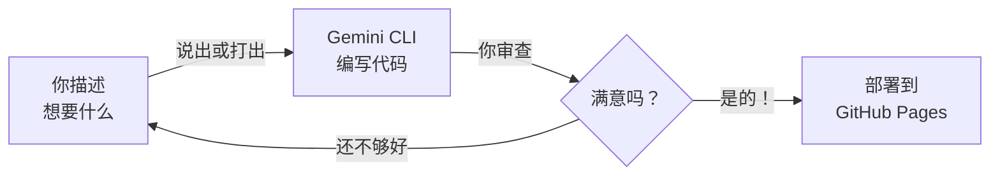

<Tip>
**难度：★★☆☆☆ 简单** · 预计时间：约 1 小时
</Tip>

想象一下，你自己搭建了一个真实上线的网站 —— 不用学编程。只需描述你想要什么样的网站 —— 说出来或打出来 —— AI 替你构建。

<Info>
**教程由 [Chan Meng](https://chanmeng.org/) 设计** —— 高级 AI/ML 工程师、开源贡献者、前字节跳动开发者。Chan 搭建了 30+ 个真实应用，专注于 AI 驱动的解决方案，也是本次活动的圆桌嘉宾和本网站的开发者。
</Info>

## 你将构建什么

<CardGroup cols={3}>
  <Card title="描述" icon="microphone">
    用普通语言说出或打出你理想中的网站样子
  </Card>
  <Card title="构建" icon="terminal">
    Gemini CLI 为你编写所有 HTML 和 CSS
  </Card>
  <Card title="部署" icon="rocket">
    在 GitHub Pages 上免费发布
  </Card>
</CardGroup>

## 工作原理

你用普通语言描述你想要什么 —— 用 Wispr Flow 说出来或在终端打出来。Gemini CLI 编写代码。你查看结果并反复调整，直到满意为止。然后你免费将它部署到互联网上。

<Tip>
**你可以用 Wispr Flow 说出提示词，也可以打字或粘贴到 Gemini CLI 中。两种方式效果完全一样。** Wispr Flow 是可选项 —— 它只是让体验更加解放双手。本教程中的每条提示词，无论你说出来还是打出来都同样有效。
</Tip>

## 你将学到

本教程专注于**与 AI 的沟通技巧**，而非编程知识。你将学到如何：

- 清晰描述你的需求，让 AI 能够构建它 —— 通过语音或文字
- 使用终端运行命令（比你想象的要简单）
- 在发布前在你的电脑上预览网站
- 使用 GitHub 存储代码并托管网站
- 迭代和优化 —— 与 AI 协作的核心技能

<Note>
**无需任何编程基础。** Gemini CLI 负责编写代码 —— 你只需描述你想要什么。如果你能向朋友解释一个想法，你就能搭建一个网站。
</Note>

## 工具

<CardGroup cols={3}>
  <Card title="Gemini CLI" icon="terminal">
    谷歌的免费 AI 助手，在终端中运行。它理解你的自然语言请求并将其转换为代码。
  </Card>
  <Card title="Wispr Flow" icon="microphone">
    可选语音输入工具 —— 说话代替打字。在任何应用中均可使用，包括终端。
  </Card>
  <Card title="Node.js" icon="node-js">
    安装 Gemini CLI 所需的免费工具。一次性安装。
  </Card>
</CardGroup>

## 费用

| 工具 | 费用 |
|------|------|
| Gemini CLI | 免费（每日 1,000 次请求） |
| Node.js | 免费 |
| GitHub Pages | 免费（公开仓库） |
| Wispr Flow（可选） | 免费试用（[邀请链接可获一个月 Pro 版免费试用](https://wisprflow.ai/r?CHAN115)） |
| **合计** | **$0** |

## 前置要求

<CardGroup cols={2}>
  <Card title="一台能上网的电脑" icon="laptop">
    Windows 或 macOS 均可。无需特殊硬件。
  </Card>
  <Card title="约 1 小时" icon="clock">
    慢慢来，不用着急。你可以随时暂停，之后再继续。
  </Card>
</CardGroup>

<Note>
准备好了吗？前往[设置你的工具](/docs/2026-her-waka/tutorial/personal-website/setup-tools)安装所需的一切。
</Note>
