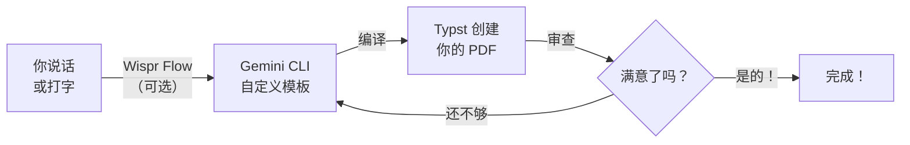

这是最有趣的部分。你将从一个专业设计的模板开始，使用 Gemini CLI 进行自定义，并将其编译成精美的 PDF。无需任何编程经验 —— 只需清晰的描述，说出来或打出来都行。

<Tip>
**你可以用 Wispr Flow 说出提示词，也可以打字或粘贴到 Gemini CLI 中。两种方式效果完全一样。** Wispr Flow 是可选项 —— 它只是让体验更加解放双手。本教程中的每条提示词，无论你说出来还是打出来都同样有效。
</Tip>

## Vibe Coding 循环

每个步骤都遵循同样的模式：



描述你想要什么。Gemini CLI 自定义模板。Typst 将其编译成 PDF。审查并重复，直到完美。

---

<Steps>
  <Step title="创建项目文件夹">
    <Tabs>
      <Tab title="Windows">
        1. 打开**文件资源管理器**
        2. 前往**文档**文件夹
        3. 在空白处右键单击 → **新建** → **文件夹**
        4. 命名为 `my-pdfs`
      </Tab>
      <Tab title="macOS">
        1. 打开 **Finder**
        2. 前往**文稿**文件夹
        3. 在空白处右键单击 → **新建文件夹**
        4. 命名为 `my-pdfs`
      </Tab>
    </Tabs>

    <Tip>
    起一个简单的名字，比如 `my-pdfs`。使用小写字母，不要有空格。
    </Tip>
  </Step>

  <Step title="在项目文件夹中打开终端">
    <Tabs>
      <Tab title="Windows">
        在文件资源管理器中打开你的 `my-pdfs` 文件夹。点击顶部的**地址栏**，输入 `powershell`，然后按 **Enter**。
      </Tab>
      <Tab title="macOS">
        在 Finder 中右键单击 `my-pdfs` 文件夹，选择**"在文件夹中打开终端"**。如果没有这个选项，打开 Terminal 并输入：
        ```bash
        cd ~/Documents/my-pdfs
        ```
      </Tab>
    </Tabs>
  </Step>

  <Step title="初始化求职信模板">
    Typst 有一个由社区制作的免费模板库，叫做 [Typst Universe](https://typst.app/universe)。我们从 **fireside** 开始 —— 一个简洁、现代的求职信模板。

    在终端中运行：

    ```bash title="复制此命令"
    typst init @preview/fireside:1.0.0
    ```

    这会下载模板并创建一个即用的项目文件夹，其中包含一个 `.typ` 文件。

    <Info>
    **刚才发生了什么？** `typst init` 命令从 Typst Universe 下载了一个专业设计的模板，并为你设置了一个项目文件夹。模板已经有了精美的布局 —— 你只需填入你的详情。
    </Info>

    <Accordion title="'typst init' 不起作用？">
    如果看到错误，尝试以下解决方法：

    - **"typst: command not found"** —— 返回[设置页面](/docs/2026-her-waka/tutorial/professional-pdf/setup)并安装 Typst CLI
    - **网络错误** —— 检查网络连接；`typst init` 从网上下载模板
    - **权限错误** —— 在 Windows 上，尝试以管理员身份运行 PowerShell；在 macOS 上，尝试在命令前加 `sudo`
    </Accordion>
  </Step>

  <Step title="启动 Gemini CLI">
    进入模板文件夹并启动 Gemini CLI：

    ```bash title="复制此命令"
    gemini
    ```

    按 Enter。你应该会看到 Gemini CLI 启动，显示一个等待输入的提示符。如果 Wispr Flow 正在运行，你可以直接说出提示词 —— 否则，打字或粘贴即可。
  </Step>

  <Step title="使用 Gemini CLI 进行自定义">
    现在告诉 Gemini CLI 你想要什么。选择一种你喜欢的风格 —— 说出来或复制粘贴：

    <Tabs>
      <Tab title="简洁风格">
        ```text title="说出或复制此提示词"
        I have a Typst cover letter template (fireside) in this folder.
        Please customise it with:
        - Placeholder name and contact details at the top
        - Today's date in NZ format (e.g. 19 March 2026)
        - A greeting, 3 short paragraphs of placeholder content, and a sign-off
        - Clean, professional sans-serif font
        Use NZ English spelling throughout. Keep the template's existing layout
        but update the content and styling.
        Then compile it to PDF using typst compile.
        ```
      </Tab>
      <Tab title="创意风格">
        ```text title="说出或复制此提示词"
        I have a Typst cover letter template (fireside) in this folder.
        Please customise it with:
        - Placeholder name and contact details
        - Today's date in NZ format (e.g. 19 March 2026)
        - A greeting, 3 short paragraphs of placeholder content, and a sign-off
        - Bold colour accents — suitable for creative industries
        - Modern typography with contrasting font weights
        Use NZ English spelling throughout. Make it eye-catching while keeping
        the template's professional structure.
        Then compile it to PDF using typst compile.
        ```
      </Tab>
      <Tab title="正式风格">
        ```text title="说出或复制此提示词"
        I have a Typst cover letter template (fireside) in this folder.
        Please customise it with:
        - Placeholder name and contact details, right-aligned at the top
        - Recipient's details left-aligned below
        - Today's date in NZ format (e.g. 19 March 2026)
        - "Dear Hiring Manager" greeting
        - 3 formal paragraphs of placeholder content and "Yours sincerely" sign-off
        - Traditional serif font and conservative styling
        Use NZ English spelling throughout. This is for a corporate or government role.
        Then compile it to PDF using typst compile.
        ```
      </Tab>
    </Tabs>

    <Tip>
    **不用担心第一次能不能做到完美。** 你会在接下来的步骤中不断改进设计 —— 这正是 Vibe Coding 的意义所在！
    </Tip>
  </Step>

  <Step title="审查你的 PDF">
    在文件资源管理器中双击编译好的 PDF 打开它，它会在你的默认 PDF 查看器中打开。

    <Info>
    **从模板开始意味着你的第一个结果就已经很专业了。** 模板处理布局、排版和间距 —— Gemini CLI 只是根据你的喜好自定义内容和样式。
    </Info>
  </Step>

  <Step title="迭代和改进">
    对结果不满意？这很正常 —— 这正是关键所在！在 Gemini CLI 中说出或复制以下任何跟进提示词：

    ```text title="说出或复制此提示词"
    Change the font to a modern sans-serif font. Keep everything else the same.
    Then recompile to PDF.
    ```

    ```text title="说出或复制此提示词"
    Add a subtle colour accent — use a dark teal or navy blue for headings
    and a thin coloured line under my name. Keep the overall design professional.
    Then recompile to PDF.
    ```

    ```text title="说出或复制此提示词"
    The margins feel too wide. Reduce the margins to 2cm on all sides
    and tighten the line spacing slightly so the letter feels more compact.
    Then recompile to PDF.
    ```

    ```text title="说出或复制此提示词"
    Add a small footer at the bottom of the page with "Page 1 of 1" centred
    and my email address on the right side.
    Then recompile to PDF.
    ```

    <Tip>
    **Vibe Coding 循环：** 描述 → 编译 → 审查 → 改进。一直迭代，直到你满意为止！你可以向 Gemini CLI 发送任意数量的提示词 —— 说出来或打出来都行。
    </Tip>
  </Step>

  <Step title="为真实职位申请个性化内容">
    准备好创建一封真实的求职信了吗？说出或复制此模板提示词，并填入你的详情：

    ```text title="说出或复制此提示词"
    Update my cover letter for a real application:
    - My name: [Your Name]
    - My email: [your.email@example.com]
    - My phone: [your phone number]
    - I'm applying for: [Job Title] at [Company Name]
    - My key skills: [skill 1, skill 2, skill 3]
    - Why I'm interested: [one sentence about why you want this role]
    - My relevant experience: [brief description of relevant experience]

    Write the cover letter content in a professional but warm tone.
    Keep it to one page. Use NZ English spelling.
    Then compile it to PDF.
    ```

    <Tip>
    **保存你的提示词！** 把个人详情保存在一个文本文件里，这样你就可以快速为不同工作生成求职信。每次更换公司名称、职位和关键技能即可。
    </Tip>
  </Step>
</Steps>

## 刚才发生了什么？

以下是你每一步所做的事情：

1. **初始化**了一个来自 Typst Universe 的专业模板（通过 `typst init`）
2. **描述**了你想要什么 —— 通过说话或打字 —— Gemini CLI 自定义了模板
3. **Typst 编译**代码成为像素级精准的 PDF
4. **迭代**了 —— 请求设计更改、重新编译、审查，直到效果满意

核心洞见：你从专业设计的模板开始，而不是空白页面。模板给了你坚实的基础，AI 处理了自定义工作。你从来不需要学习 Typst 语法 —— 你描述你想要什么，Gemini CLI 让它实现。

## 故障排除

<AccordionGroup>
  <Accordion title="PDF 是空白的">
    `.typ` 文件可能是空的或有错误。在 Gemini CLI 中说出或输入：
    ```text title="说出或复制此提示词"
    The PDF is blank. Can you check the .typ file for errors and fix them?
    Then recompile it to PDF.
    ```
  </Accordion>
  <Accordion title="Typst 编译错误">
    如果编译时看到错误，将错误信息粘贴到 Gemini CLI 中：
    ```text title="说出或复制此提示词"
    I got this error when compiling: [paste the error message here]
    Can you fix the Typst code and recompile?
    ```
    Typst 的错误信息清晰具体 —— 它们会告诉你确切是哪一行有问题。
  </Accordion>
  <Accordion title="布局看起来不对">
    在 Gemini CLI 中说出或输入：
    ```text title="说出或复制此提示词"
    The layout doesn't look right — [describe what's wrong, e.g. "the text
    is too close to the edges" or "the spacing between paragraphs is too large"].
    Can you fix it and recompile?
    ```
  </Accordion>
  <Accordion title="我想从头开始">
    你可以重新初始化模板：
    ```bash title="复制此命令"
    typst init @preview/fireside:1.0.0
    ```
    或者告诉 Gemini CLI 从头开始：
    ```text title="说出或复制此提示词"
    I want to start fresh. Create a new cover letter from scratch as a .typ
    file — don't use the template. [Then describe what you want]
    ```
  </Accordion>
  <Accordion title="语音输入有错误">
    Wispr Flow 有时可能误听技术术语或专有名词。你可以在按 Enter 键之前查看并更正 Gemini CLI 中的文字。如果语音输入错误太多，改为打字或粘贴提示词。
  </Accordion>
</AccordionGroup>

<Note>
对你的求职信满意了吗？前往[探索模板](/docs/2026-her-waka/tutorial/professional-pdf/explore-templates)，发现更多可以创建的文档类型 —— 发票、报告、清单等等。
</Note>
