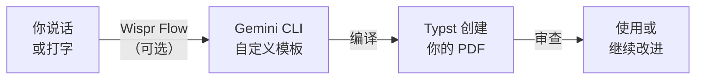

现在你已经掌握了工作流 —— 初始化模板、描述你想要什么、编译、审查 —— 让我们来探索你还能创建什么。以下每个模板都来自 [Typst Universe](https://typst.app/universe)，Typst 的免费社区模板库。



选择下面的任何模板。运行 `typst init` 命令下载它，然后使用提示词进行自定义 —— 用 Wispr Flow 说出来或复制粘贴。

---

<AccordionGroup>
  <Accordion title="1. 高级求职信（最简单）">
    **适用场景：** 用多页或有样式的变体进一步提升求职信效果。

    你已经自定义了 fireside 模板 —— 这是如何让它更上一层楼。

    运行以下命令下载 fireside 模板：

    ```bash title="复制此命令"
    typst init @preview/fireside:1.0.0
    ```

    在模板文件夹中启动 Gemini CLI，然后说出或复制此提示词：

    ```text title="说出或复制此提示词"
    I have a fireside cover letter template in this folder.
    Please customise it into a visually distinctive cover letter:
    - Add a professional header with my name, email, phone, and LinkedIn URL
    - Add a sidebar or accent column with a personal brand colour
    - Today's date in NZ format (e.g. 19 March 2026)
    - A well-structured body with clear paragraphs
    - A professional sign-off
    Use placeholder content. Use NZ English spelling.
    Make it stand out from a standard letter.
    Then compile it to PDF.
    ```

    **跟进自定义：**

    ```text title="说出或复制此提示词"
    Add a matching header and footer with a thin coloured line. Put my name
    in the header and page number in the footer. Then recompile.
    ```

    ```text title="说出或复制此提示词"
    Extend this into a two-page version with an additional section for
    "Key Achievements" with 3-4 bullet points. Keep the same design style.
    Then recompile.
    ```

    <Tip>
    **新西兰求职市场提示：** 很多新西兰雇主仍然欣赏格式精良的求职信。独特的视觉设计可以让你的申请脱颖而出 —— 尤其是市场营销、设计或传播类职位。
    </Tip>
  </Accordion>

  <Accordion title="2. 面试准备清单">
    **适用场景：** 用结构化的可打印清单为求职面试做准备。

    运行以下命令下载 aero-check 模板：

    ```bash title="复制此命令"
    typst init @preview/aero-check:0.3.0
    ```

    在模板文件夹中启动 Gemini CLI，然后说出或复制此提示词：

    ```text title="说出或复制此提示词"
    I have an aero-check checklist template in this folder.
    Please customise it into an interview preparation checklist with three sections:
    - "Before the Interview" (research company, prepare questions, plan outfit,
      print CV, plan route — 5-6 items with checkboxes)
    - "During the Interview" (body language tips, STAR method reminder,
      questions to ask the interviewer — 5-6 items with checkboxes)
    - "After the Interview" (send thank-you email, reflect on answers,
      follow up timeline — 5-6 items with checkboxes)
    Use a clean, professional layout with clear section headings.
    Use NZ English spelling. Make it one page that's easy to print.
    Then compile it to PDF.
    ```

    **跟进自定义：**

    ```text title="说出或复制此提示词"
    Add a "Notes" section at the bottom with lined space for handwritten notes.
    Then recompile.
    ```

    ```text title="说出或复制此提示词"
    Customise this checklist for a [job title] interview at [company name].
    Add role-specific preparation items. Then recompile.
    ```

    <Tip>
    **打印出来！** 这份清单是为手动打印使用而设计的。在面试前一晚复习它，逐项打勾。
    </Tip>
  </Accordion>

  <Accordion title="3. 自由职业发票">
    **适用场景：** 为客户开具符合新西兰规范的专业发票。

    运行以下命令下载 classy-german-invoice 模板：

    ```bash title="复制此命令"
    typst init @preview/classy-german-invoice:0.3.0
    ```

    在模板文件夹中启动 Gemini CLI，然后说出或复制此提示词：

    ```text title="说出或复制此提示词"
    I have a classy-german-invoice template in this folder.
    Please customise it into a New Zealand freelance invoice:
    - Change all text to English and use NZ English spelling
    - My business name, address, and contact details at the top
    - Invoice number, date (NZ format e.g. 19 March 2026), and due date
    - Client's name and address
    - A table of services with columns: Description, Hours, Rate, Amount
    - 3 placeholder line items
    - Subtotal, GST (15%), and Total in NZD
    - Payment details section with NZ bank account format (XX-XXXX-XXXXXXX-XXX)
    - Payment terms: "Due within 14 days"
    Use placeholder content. Then compile it to PDF.
    ```

    **跟进自定义：**

    ```text title="说出或复制此提示词"
    Add my GST number (placeholder: 123-456-789) below my business name.
    Add a note: "GST inclusive" next to the total. Then recompile.
    ```

    ```text title="说出或复制此提示词"
    Add a small "Terms & Conditions" section at the bottom with standard
    freelance payment terms. Then recompile.
    ```

    <Tip>
    **GST 提示：** 如果你作为自由职业者在新西兰年收入超过 $60,000，必须注册 GST。该发票模板默认包含 15% GST —— 如果你未注册 GST，请相应调整。
    </Tip>
  </Accordion>

  <Accordion title="4. 团队通讯">
    **适用场景：** 创建个人动态更新、客户通讯或团队报告。

    运行以下命令下载 dashing-dept-news 模板：

    ```bash title="复制此命令"
    typst init @preview/dashing-dept-news:0.2.0
    ```

    在模板文件夹中启动 Gemini CLI，然后说出或复制此提示词：

    ```text title="说出或复制此提示词"
    I have a dashing-dept-news newsletter template in this folder.
    Please customise it into a one-page professional newsletter:
    - A bold header with the newsletter title and date (NZ format)
    - A main article with a heading and 2-3 paragraphs
    - A sidebar with "Quick Updates" — 3-4 short bullet points
    - A "Coming Up" section with 2-3 upcoming dates/events
    - A footer with contact information
    Use placeholder content. Use NZ English spelling.
    Make it visually engaging with colour accents and clear hierarchy.
    Then compile it to PDF.
    ```

    **跟进自定义：**

    ```text title="说出或复制此提示词"
    Add a placeholder image area in the main article section. Use a grey
    rectangle with the text "Photo" centred inside it. Then recompile.
    ```

    ```text title="说出或复制此提示词"
    Update this newsletter with my personal brand. Use [your colour] as the
    accent colour and add my name and tagline in the header. Then recompile.
    ```

    <Tip>
    **在求职中脱颖而出：** 每月向你的人脉发送一份"个人通讯"，总结你正在学习的内容、参与的项目以及你在寻找什么职位。这能让你保持存在感。
    </Tip>
  </Accordion>

  <Accordion title="5. 服务目录">
    **适用场景：** 展示自由职业服务或创建活动节目单。

    运行以下命令下载 caidan 模板：

    ```bash title="复制此命令"
    typst init @preview/caidan:0.1.0
    ```

    在模板文件夹中启动 Gemini CLI，然后说出或复制此提示词：

    ```text title="说出或复制此提示词"
    I have a caidan menu/catalogue template in this folder.
    Please customise it into a freelance service catalogue:
    - A professional header with a business name and tagline
    - 4-5 service categories, each with:
      - Service name and brief description (1-2 lines)
      - Price or "From $X" pricing in NZD
    - A "Get in Touch" section at the bottom with contact details
    Use placeholder content for a freelance [web design / photography / consulting] business.
    Use NZ English spelling and NZD currency.
    Make it look polished — like a menu at a nice restaurant.
    Then compile it to PDF.
    ```

    **跟进自定义：**

    ```text title="说出或复制此提示词"
    Add a "Packages" section with 3 bundled offerings (Basic, Standard, Premium)
    presented in a comparison format with what's included in each. Then recompile.
    ```

    ```text title="说出或复制此提示词"
    Convert this into an event programme for [event name]. Replace services
    with a schedule of sessions, speakers, and times. Then recompile.
    ```

    <Tip>
    **自由职业者：** 在邮件中附上精美的服务目录 PDF，看起来比用纯文本描述服务专业得多。这表明你认真对待自己的业务。
    </Tip>
  </Accordion>

  <Accordion title="6. 专业报告">
    **适用场景：** 创建带有目录、图表和参考文献的结构化报告。

    运行以下命令下载 graceful-genetics 模板：

    ```bash title="复制此命令"
    typst init @preview/graceful-genetics:0.2.0
    ```

    在模板文件夹中启动 Gemini CLI，然后说出或复制此提示词：

    ```text title="说出或复制此提示词"
    I have a graceful-genetics report template in this folder.
    Please customise it into a professional business report:
    - A title page with report title, author, date (NZ format), and organisation
    - An auto-generated table of contents
    - 3 chapters with headings and subheadings:
      1. Introduction (background and objectives)
      2. Findings (with a placeholder table and a placeholder figure)
      3. Recommendations (numbered list of 4-5 recommendations)
    - Page numbers in the footer
    - A references section at the end with 3 placeholder references
    Use placeholder content throughout. Use NZ English spelling.
    Use a professional serif font and clean layout.
    Then compile it to PDF.
    ```

    **跟进自定义：**

    ```text title="说出或复制此提示词"
    Add an executive summary after the title page and before the table of
    contents. It should be a half-page overview of the key findings and
    recommendations. Then recompile.
    ```

    ```text title="说出或复制此提示词"
    Add a simple bar chart or graph in the Findings chapter using Typst's
    built-in drawing capabilities. Use placeholder data. Then recompile.
    ```

    <Tip>
    **适用于：** 项目提案、研究摘要、商业案例，或任何需要专业呈现结构化信息的场合。
    </Tip>
  </Accordion>

  <Accordion title="7. 学术论文（进阶挑战 —— 最复杂）">
    **适用场景：** 创建多章节论文或毕业论文。

    运行以下命令下载 humble-dtu-thesis 模板：

    ```bash title="复制此命令"
    typst init @preview/humble-dtu-thesis:0.1.0
    ```

    在模板文件夹中启动 Gemini CLI，然后说出或复制此提示词：

    ```text title="说出或复制此提示词"
    I have a humble-dtu-thesis template in this folder.
    Please customise it into a thesis template:
    - A title page with thesis title, author name, degree, university, and date
    - An abstract page
    - An auto-generated table of contents
    - 4 chapters:
      1. Introduction
      2. Literature Review
      3. Methodology
      4. Results and Discussion
    - Each chapter should have 2-3 subsections with placeholder text
    - A bibliography/references section with 5 placeholder references
    - Page numbers, chapter headers in the running head
    - Use academic formatting conventions (numbered headings, 12pt font, 1.5 line spacing)
    Use placeholder content. Use NZ English spelling.
    Then compile it to PDF.
    ```

    **跟进自定义：**

    ```text title="说出或复制此提示词"
    Add an appendix section after the references with 2 placeholder appendices
    (Appendix A: Survey Questions, Appendix B: Raw Data Table). Then recompile.
    ```

    ```text title="说出或复制此提示词"
    Add a "List of Figures" and "List of Tables" after the table of contents.
    Add 2 placeholder figures and 1 placeholder table in the Results chapter.
    Then recompile.
    ```

    <Tip>
    **这是一个进阶挑战** —— 学术格式可能很复杂。如果第一次效果不完美，用跟进提示词逐节改进布局。
    </Tip>
  </Accordion>
</AccordionGroup>

---

## 从头设计

一旦你熟悉了模板，你可以完全跳过 `typst init`，让 Gemini CLI 从空白页面创建文档：

```text title="说出或复制此提示词"
Create a [document type] as a Typst file called [filename].typ.
Don't use any template — design it from scratch with:
- [describe your layout and content requirements]
Use NZ English spelling. Then compile it to PDF.
```

这给了你完全的创作自由 —— 但模板通常是更快的起点。

## 查找更多模板

[Typst Universe](https://typst.app/universe) 有数百个免费模板。浏览获取灵感，然后使用 `typst init @preview/template-name:version` 开始。

<Tip>
**混搭！** 你可以将不同模板的元素组合起来。例如，说："Take the header style from my cover letter and use it on my invoice" —— Gemini CLI 可以处理这个，因为你所有的 `.typ` 文件都在同一个文件夹里。
</Tip>

<Note>
准备好收尾了吗？前往[继续探索](/docs/2026-her-waka/tutorial/professional-pdf/keep-going)，了解后续步骤、反思问题和资源。
</Note>
