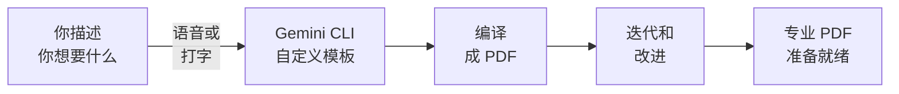

恭喜 —— 你只需描述你想要什么，就创建了专业的 PDF！无论你是说出提示词还是打出来，结果都是一样的：由 AI 构建的精美专业文档。

## 你构建了什么



你创建的专业文档：
- 从社区模板开始，由 AI 自定义
- 是可以发送、打印或分享的像素级精准 PDF
- 随时可以用一条提示词更新 —— 说出来或打出来
- 完全免费

## 你学到了什么

<Tip>
**最重要的技能不是编程 —— 而是沟通。** 你学会了清晰地描述你想要什么 —— 通过说话或打字 —— 审查结果，并迭代直到满意。这些技能适用于任何 AI 工具，在任何领域都有价值。
</Tip>

以下是你练习的内容：
- **使用终端** —— 运行命令和浏览文件夹
- **与 AI 沟通** —— 用自然语言描述你想要什么，通过语音或文字
- **迭代** —— 逐步改进你的文档
- **编译文档** —— 将文本文件转化为精美的 PDF
- **适配模板** —— 为不同用途自定义设计
- **语音输入** —— 使用 Wispr Flow 解放双手说出提示词（可选）

---

## 可以尝试的想法

<CardGroup cols={2}>
  <Card title="构建你的简历" icon="file-user">
    将完整的简历/履历创建为 PDF —— 针对每份申请的职位定制。
  </Card>
  <Card title="创建作品集小册子" icon="book">
    将你最好的作品整合成多页作品集 PDF，与雇主分享。
  </Card>
  <Card title="用脚本自动化" icon="code">
    让 Gemini 创建一个脚本，从模板生成个性化求职信。
  </Card>
  <Card title="贡献一个模板" icon="heart">
    设计一个 Typst 模板，分享到 Typst Universe 供他人使用。
  </Card>
</CardGroup>

以下是每个想法的即用提示词 —— 说出来或复制粘贴：

<AccordionGroup>
  <Accordion title="构建你的简历">
    ```text title="说出或复制此提示词"
    Create a professional CV/resume as a Typst file called cv.typ.
    Include:
    - My name and contact details (email, phone, LinkedIn) in a clean header
    - A brief professional summary (2-3 sentences)
    - Work Experience section with 2-3 roles (use placeholder content)
    - Education section
    - Skills section organised by category
    - Keep it to 1-2 pages maximum
    Use a modern, clean layout. Use NZ English spelling.
    Then compile it to PDF.
    ```
  </Accordion>
  <Accordion title="创建作品集小册子">
    ```text title="说出或复制此提示词"
    Create a portfolio booklet as a Typst file called portfolio.typ.
    Include:
    - A cover page with my name and "Portfolio" as the title
    - A brief introduction page about me
    - 4 project showcase pages, each with:
      - Project title and date
      - A brief description (2-3 sentences)
      - A placeholder image area
      - Key skills or tools used
    - A contact page at the end
    Use placeholder content. Use NZ English spelling.
    Make it visually polished with consistent branding throughout.
    Then compile it to PDF.
    ```
  </Accordion>
  <Accordion title="自动化求职信生成">
    ```text title="说出或复制此提示词"
    I want to automate cover letter generation. Please:
    1. Create a Typst template file called cover-template.typ with variables
       for: name, email, phone, company, role, and key skills
    2. Create a simple script that takes these variables and compiles the
       template into a PDF
    3. Show me how to run it to generate a cover letter for a specific job

    Use NZ English spelling and NZ date format.
    ```
  </Accordion>
  <Accordion title="在 Typst Universe 上分享模板">
    ```text title="说出或复制此提示词"
    Help me prepare my [cover letter / invoice / report] Typst template
    for sharing on Typst Universe. Please:
    1. Clean up the code and add comments explaining each section
    2. Replace all personal information with clear placeholder variables
    3. Create a README.md describing the template and how to use it
    4. Show me how to submit it to typst.app/universe
    ```
  </Accordion>
</AccordionGroup>

---

## 反思

花几分钟思考你的体验：

<AccordionGroup>
  <Accordion title="用 AI 创建文档，哪里让你感到惊讶？">
    很多人惊讶于能如此快速地生成专业文档 —— 尤其是当他们可以直接说出请求时。有没有哪个时刻输出超出了你的预期？有没有哪个时刻你不得不改进你的描述？
  </Accordion>
  <Accordion title="语音输入如何改变了这段体验？">
    如果你使用了 Wispr Flow，说出提示词是否感觉比打字更自然？说话和写作时，你是否以不同的方式描述事物？语音输入往往能帮助人们更具对话性和描述性 —— 这可能带来更好的 AI 结果。
  </Accordion>
  <Accordion title="PDF 创建如何帮助你的职业发展？">
    想想你的求职或工作。你能为每份申请创建量身定制的求职信吗？你能为自由职业工作生成专业发票吗？还有哪些文档可以为你节省时间？
  </Accordion>
  <Accordion title="接下来你会创建什么？">
    现在你知道了这个工作流 —— 描述、构建、编译、迭代 —— 你还可以创建哪些其他文档？简历？商业提案？培训手册？个人品牌套件？
  </Accordion>
</AccordionGroup>

---

## 资源

| 资源 | 介绍 | 链接 |
|------|------|------|
| Typst 文档 | Typst 语言的官方文档 | [typst.app/docs](https://typst.app/docs) |
| Typst Universe | 社区模板和包 | [typst.app/universe](https://typst.app/universe) |
| Gemini CLI 文档 | Gemini CLI 官方文档 | [github.com/google-gemini/gemini-cli](https://github.com/google-gemini/gemini-cli) |
| Wispr Flow | 任意应用的语音输入工具 | [wisprflow.ai](https://wisprflow.ai/r?CHAN115) |
| Careers NZ | 职业规划和求职资源 | [careers.govt.nz](https://www.careers.govt.nz) |

<Note>
感谢你完成本教程！你从零开始，创建了专业的 PDF —— 更重要的是，你学会了如何与 AI 沟通来构建真实的东西。无论你是说出提示词还是打出来，这项技能都是一样的：清晰地描述你想要什么，让 AI 处理剩下的事情。把这些技能带到你的下一个项目中去。
</Note>
